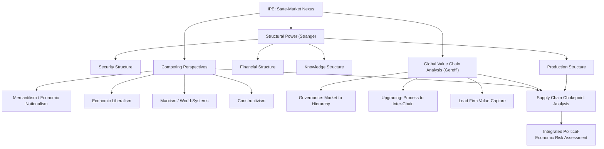

## International Political Economy as an Analytical Lens

### Overview

International Political Economy (IPE) is the interdisciplinary field studying the interaction between political power and economic processes across borders — how states, markets, firms, and international institutions jointly shape the production, exchange, and distribution of wealth in the global system. Rather than constituting a single unified theory, IPE functions as an analytical lens or meta-framework encompassing multiple competing (and sometimes complementary) traditions — realist, liberal, Marxist/structuralist, and constructivist — united by a shared methodological commitment: economics and politics cannot be analyzed in isolation from one another.

Applied to supply chain geopolitics, IPE provides the integrative vocabulary and set of analytical tools for asking questions that neither pure economics (efficiency, cost minimization, comparative advantage) nor pure political science (security, sovereignty, alliance formation) can answer alone: why do states subsidize "uneconomic" domestic production of strategic goods; why do firms relocate production in response to political risk rather than cost signals alone; how do currency regimes, capital controls, and trade rules simultaneously reflect and reshape the distribution of power among states.

### Core Premise: The State-Market Nexus

IPE's foundational insight, most closely associated with Susan Strange, is that states and markets are not separate, opposed domains (the state "intervening" in an otherwise autonomous market) but are mutually constitutive. Markets do not exist prior to or independent of political authority — property rights, currency, contract enforcement, and the physical and legal infrastructure of trade (ports, customs regimes, intellectual property law) are themselves products of political decisions. Conversely, political power is increasingly exercised *through* market structures (financial sanctions, export controls, investment screening) rather than solely through traditional military or diplomatic instruments.

Strange's concept of **structural power** — the power to shape and determine the frameworks within which states, institutions, and firms relate to one another — is central to IPE's analytical toolkit. She identified four interrelated structures through which structural power operates:

- **Security structure**: control over the provision (or denial) of protection.
- **Production structure**: control over what is produced, how, and where.
- **Financial structure**: control over the creation and allocation of credit and capital.
- **Knowledge structure**: control over the creation, transmission, and control of information and technology.

Contemporary supply chain geopolitics operates centrally at the intersection of the production, financial, and knowledge structures: control over semiconductor fabrication (production + knowledge), dollar-denominated trade finance and SWIFT access (financial), and technology transfer/export control regimes (knowledge + security) are all Strangean structural-power instruments now routinely deployed in trade and industrial policy.

### The Three (or Four) Classical IPE Perspectives

IPE textbooks (notably Robert Gilpin's *The Political Economy of International Relations* and subsequent syntheses) conventionally organize the field around competing "isms," each supplying a distinct causal story for the same empirical phenomena:

**Economic Nationalism / Mercantilism**

The state, not the market or the individual, is the primary unit whose welfare matters. Wealth is instrumental to power, and power is instrumental to wealth — the two are mutually reinforcing and a state should actively manage trade and production to maximize national capability, even at the cost of global efficiency. This perspective directly underlies contemporary industrial policy (CHIPS and Science Act, EU Chips Act, China's Made in China 2025) and is closely aligned with the realist IR tradition covered separately.

**Economic Liberalism**

Markets, left to operate with minimal political interference, are the most efficient mechanism for allocating resources and generating aggregate welfare gains; the state's proper role is to secure property rights, enforce contracts, and otherwise avoid distorting market signals. This perspective underlies classical trade theory, WTO liberalization norms, and corresponds to the liberal institutionalist IR tradition, though classical economic liberalism (individual/firm-level, Smith/Ricardo) is analytically distinct from the more institution-focused liberal institutionalism of Keohane and Nye.

**Marxism / Structuralism (World-Systems Theory)**

Global economic structures are best understood through the lens of class and structural exploitation: the international economy is organized into a hierarchical **core-periphery** structure (per Immanuel Wallerstein's world-systems theory, building on Raúl Prebisch and dependency theory) in which peripheral and semi-peripheral economies are structurally locked into supplying raw materials and low-value-added labor to core economies, reproducing global inequality regardless of individual state policy choices or "catch-up" development strategy. Applied to supply chains: global value chains (GVCs) are read as mechanisms of surplus-value extraction, where lead firms headquartered in core economies (the US, EU, Japan) capture disproportionate value (design, branding, finance) while peripheral suppliers capture low-margin manufacturing and extraction activities — a framework closely associated with Gary Gereffi's Global Value Chain (GVC) analysis and its concept of **governance** (how lead firms coordinate and control dispersed production networks).

**Constructivism (increasingly treated as a fourth IPE tradition)**

Economic structures and interests are not objectively given but are socially constructed through shared ideas, norms, and discourse. What counts as a "strategic" sector warranting protection, what counts as "fair" versus "unfair" trade, and what counts as legitimate economic coercion versus illegitimate weaponization are all products of evolving normative consensus, not fixed material facts — explaining, for example, why export controls once considered protectionist heresy under WTO-era liberal consensus have become normalized as "de-risking" within a single decade.

### Global Value Chain (GVC) Analysis as an IPE-Specific Tool

A distinctively IPE contribution (as opposed to pure IR theory) is Global Value Chain analysis, developed principally by Gary Gereffi, Timothy Sturgeon, and collaborators, which provides a meso-level analytical toolkit for examining how production is fragmented and governed across borders:

**Governance Typology**

GVC theory identifies five governance patterns based on the complexity of transactions, the ability to codify specifications, and the capability of suppliers:

- **Market**: arm's-length transactions with low complexity, low coordination.
- **Modular**: suppliers provide "turn-key" services based on customer specifications, using generic machinery (e.g., contract electronics manufacturing).
- **Relational**: complex, tacit-knowledge transactions requiring mutual dependence and trust between lead firms and highly capable suppliers.
- **Captive**: small suppliers highly dependent on and closely monitored/controlled by dominant lead firms.
- **Hierarchy**: vertical integration within a single firm.

**Upgrading**

GVC theory analyzes whether participating firms/economies can move up the value chain over time — from process upgrading (efficiency improvements) to product upgrading (higher-value goods) to functional upgrading (moving into design, branding, R&D) to inter-chain upgrading (diversifying into entirely new, higher-value chains). This provides the analytical vocabulary for debates about whether supply chain integration produces genuine economic development or locks in "low-value-added trap" dynamics — a direct empirical bridge between liberal (gains from integration) and structuralist (exploitation/extraction) readings of the same data.

**Lead Firm Power**

GVC analysis emphasizes that governance and value capture are determined less by which country a good is "made in" and more by which firm(s) control the chain's critical coordination points (design specifications, brand, distribution, finance) — explaining why Apple captures a disproportionate share of an iPhone's value while Foxconn's assembly operations in China capture a comparatively small margin, a finding with direct implications for interpreting bilateral trade balance statistics as poor proxies for actual value capture.

### The IPE Toolkit Applied to Supply Chain Chokepoints

IPE integrates insights across the classical perspectives to analyze specific supply chain vulnerabilities as simultaneously economic and political phenomena:

- **Semiconductor fabrication concentration** (Taiwan, ~90%+ of leading-edge logic capacity) is analyzed as a production-structure chokepoint (Strange), a case of extreme specialization under liberal efficiency logic (economic gains from concentrated comparative advantage), and a source of acute vulnerability under realist/mercantilist logic (the "silicon shield" thesis).
- **Rare earth element processing concentration** (China, dominant share of separation/refining capacity despite globally dispersed raw deposits) illustrates how *processing* capability, not raw resource endowment, is the actual chokepoint — a production-structure and knowledge-structure phenomenon requiring IPE's integrated lens rather than simple resource-scarcity economics.
- **Dollar-denominated trade finance and SWIFT** illustrate financial-structure power: the US's ability to exercise extraterritorial jurisdiction over global transactions routed through the dollar system, a form of structural power realist "hard power" frameworks alone do not fully capture.

### Distinguishing IPE from Pure IR Theory

| Dimension | International Relations (IR) Theory | International Political Economy (IPE) |
| --- | --- | --- |
| Primary Question | How do states manage security and power under anarchy? | How do political and economic power co-produce global outcomes? |
| Typical Unit of Analysis | State (unitary actor in classical variants) | States, firms, markets, institutions, class structures simultaneously |
| Treatment of Economics | Instrumental to security/power (realism) or a domain institutions can pacify (liberal institutionalism) | Co-equal and mutually constitutive with politics; economics is itself a site of power |
| Core Analytical Tools | Balance of power, polarity, regime theory, interdependence | Structural power, GVC governance, core-periphery structure, embedded liberalism |
| Representative Scholars | Waltz, Mearsheimer, Keohane, Nye | Strange, Gilpin, Wallerstein, Gereffi |

IPE does not replace realism or liberal institutionalism; it functions as an umbrella lens that draws on both (and Marxist/constructivist traditions) while adding distinctly economic analytical tools — value chain governance, structural power typologies, core-periphery mapping — that pure IR theory does not natively provide.

### Analytical Framework Diagram

### Empirical Illustrations

**Case: Semiconductor Value Capture Along the GVC**

[Inference] Analyses of smartphone and computing-device value chains have found that a large majority of retail value is typically captured by firms controlling design, branding, and software (e.g., US-based lead firms), while final assembly in China or Southeast Asia captures a comparatively small margin — a finding frequently cited in IPE literature to argue that gross bilateral trade statistics (e.g., "US trade deficit with China") substantially misstate where economic value and, by extension, structural power actually reside, since GVC-adjusted (value-added) trade accounting produces materially different pictures than gross export/import figures.

**Case: Embedded Liberalism and the Post-War Trade Order**

John Ruggie's concept of "embedded liberalism" — the Bretton Woods-era compromise permitting domestic welfare-state intervention (social safety nets, capital controls) alongside international trade liberalization — is a canonical IPE synthesis showing how the post-1945 liberal trade order was never purely market-driven but was politically embedded from its founding, a historical baseline relevant to understanding contemporary industrial policy (CHIPS Act, EU strategic autonomy) as a *return to*, rather than a *departure from*, historically normal levels of state-market entanglement.

**Case: China's Dual Circulation Strategy**

China's post-2020 "dual circulation" economic strategy — emphasizing domestic demand and technological self-sufficiency alongside continued but more selective external engagement — is frequently analyzed through an integrated IPE lens combining mercantilist industrial policy logic, GVC "upgrading" ambitions (moving from assembly to design/IP capture), and structural-power considerations (reducing knowledge-structure and financial-structure dependency on the US-centered system).

### Critiques and Methodological Debates within IPE

**Fragmentation Across "American" and "British" Schools**

IPE scholarship is often characterized as split between a more positivist, quantitative "American School" (closer to economics methodology, focused on testable hypotheses about state behavior) and a more historically and sociologically oriented "British School" (associated with Strange, more comfortable with structural power and normative critique) — a methodological divide that can complicate cross-comparison of findings and requires analysts to be explicit about which tradition's assumptions and methods they are employing.

**Risk of Theoretical Eclecticism Without Rigor**

[Inference] Because IPE explicitly draws on competing and sometimes contradictory theoretical traditions, critics argue it risks becoming an eclectic grab-bag that explains any outcome post hoc by selectively invoking whichever perspective (mercantilist, liberal, structuralist) fits the observed case, rather than generating falsifiable predictions — a discipline-wide tension IPE scholars address unevenly, with more rigorous work explicitly specifying scope conditions for when each perspective's logic is expected to dominate.

**GVC Analysis's Firm-Centric Bias**

Structuralist critics argue that GVC governance typologies, despite originating partly from a critical (Gereffi's early work drew on world-systems theory), have increasingly been adopted in a firm-centric, managerial way by international organizations (World Bank, OECD) that de-emphasizes the original framework's attention to labor exploitation and power asymmetry in favor of a more neutral "supply chain management" framing.

### Practical Application: How Analysts Use This Framework

**Key Points**

- Map a given supply chain simultaneously along Strange's four structures (who controls security guarantees, production capability, financing, and proprietary knowledge) rather than analyzing economic and security dimensions separately.
- Apply GVC governance typology to determine whether a supplier relationship is market-based (easily substitutable), captive (high lead-firm control, high switching cost for supplier), or relational (mutual dependence, harder to coerce unilaterally) — governance type predicts how amenable a chain segment is to political pressure or reshoring.
- Use value-added (not gross) trade data when assessing dependency and leverage, since gross trade statistics can substantially misrepresent where structural power actually resides in a given value chain.
- Explicitly identify which classical IPE perspective(s) — mercantilist, liberal, structuralist, constructivist — best explains a given state or firm's observed behavior, and be alert to cases where behavior reflects a blend (e.g., "liberal" free-trade rhetoric accompanying "mercantilist" industrial policy in practice).

**Example**

An analyst assessing whether a country's push to attract semiconductor "back-end" packaging investment constitutes genuine value-chain upgrading (IPE/GVC question) or merely low-margin assembly relocation (structuralist critique) would examine: Is the investment accompanied by technology transfer and local R&D capacity building (functional upgrading), or purely low-skill assembly work with IP and high-margin design retained elsewhere (captive governance, limited upgrading)? Does the host country's bargaining position (Strange's structural power lens) improve as a result, or does dependency merely shift from one input (raw materials) to another (capital equipment, design licenses)?

**Next Steps**

- **Related Topics**: Realism and the primacy of state power in trade relations; liberal institutionalism and the theory of complex interdependence; Susan Strange's structural power framework in depth; Gereffi's Global Value Chain governance typology and empirical applications; world-systems theory and core-periphery dependency analysis; embedded liberalism and the political foundations of the post-war trade order; value-added trade accounting methodology (OECD-WTO TiVA database); China's dual circulation strategy as an applied IPE case study; the "American School" versus "British School" methodological divide in IPE; constructivist approaches to defining "strategic" sectors and economic security.