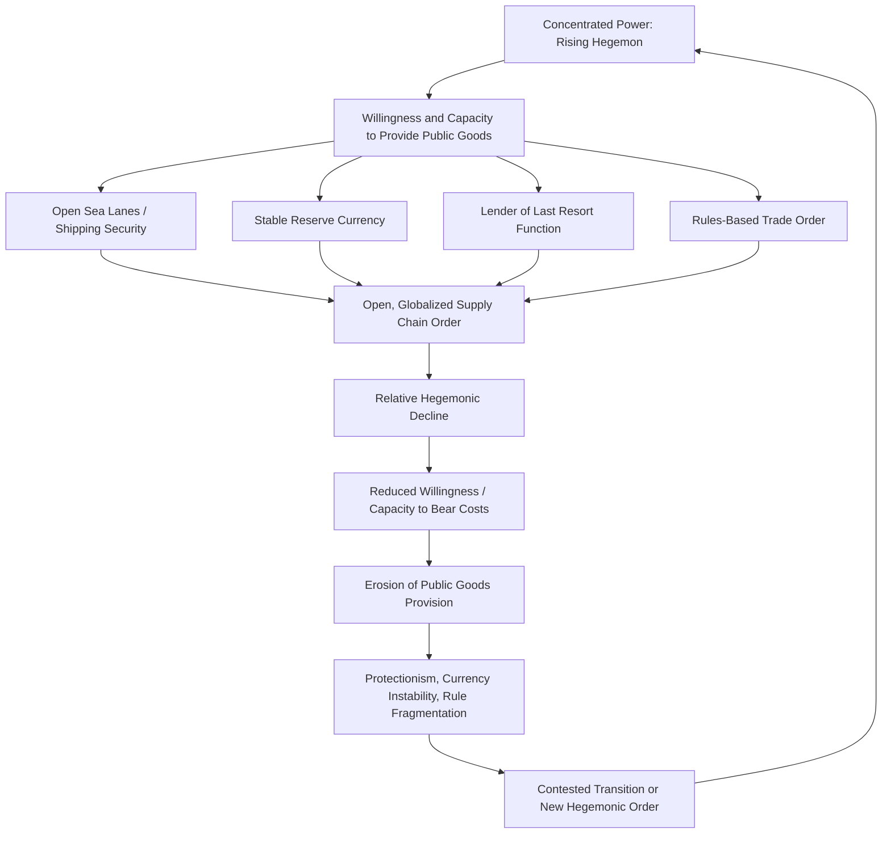

## Hegemonic Stability Theory and the Role of a Dominant Power

### Overview

Hegemonic Stability Theory (HST) is the theoretical proposition, originating in international political economy, that an open and stable international economic order requires the presence of a single dominant power — a hegemon — both willing and able to provide and maintain the public goods necessary for that order to function. HST occupies a distinctive position at the intersection of realism and liberal institutionalism: it shares realism's premise that the distribution of material capabilities determines systemic outcomes, while sharing liberal institutionalism's concern with explaining the emergence and persistence of open, rules-based economic cooperation. Applied to supply chain geopolitics, HST supplies the principal explanatory framework for why globally integrated, efficiency-optimized production networks emerged and flourished under specific historical conditions of concentrated power (British hegemony in the 19th century, American hegemony after 1945), and why their stability may be threatened by hegemonic decline or contested transition.

### Origins and Core Proponents

**Charles Kindleberger**

HST's foundational articulation came from economic historian Charles Kindleberger's analysis of the interwar period in *The World in Depression, 1929–1939* (1973). Kindleberger argued the Great Depression's severity and duration resulted from the absence of a state willing to perform stabilizing functions for the global economy: Britain, the 19th-century hegemon, no longer had the capacity, while the United States, emerging as the new dominant power, was not yet willing to assume the role. This "leaderless" interregnum produced systemic economic collapse — a cautionary case study directly informing later analyses of what happens to global economic order during hegemonic transitions.

**Robert Gilpin**

Gilpin's *War and Change in World Politics* (1981) and *The Political Economy of International Relations* (1987) formalized HST within a broader realist-inflected IPE framework, arguing that the international economic order at any given time reflects the interests and relative power of the dominant state(s), and that shifts in the underlying distribution of power inevitably generate pressure toward a restructuring of the economic order — often, historically, through hegemonic war.

**Stephen Krasner and Robert Keohane**

Krasner contributed formal testing of HST's predictions regarding trade openness and power concentration. Keohane, notably in *After Hegemony* (1984), both engaged with and critiqued HST, arguing that cooperation and institutional order, once established under hegemonic leadership, could persist even after the hegemon's relative decline — a claim central to ongoing debates about whether the US-led liberal trade order can survive perceived American relative decline.

### Core Theoretical Mechanism

**Public Goods Provision**

HST's central causal claim is that an open international economic order constitutes a public good: non-excludable (all states can benefit from open sea lanes, stable reserve currency, and predictable trade rules, regardless of whether they contributed to creating them) and non-rivalrous (one state's use does not diminish another's access). Because public goods are systematically undersupplied in a decentralized system of self-interested actors (the classic free-rider problem), HST argues that provision requires a single actor large enough that its own individual benefit from the public good outweighs the cost of providing it — the hegemon effectively subsidizes global order because doing so serves its own long-run interest, even though other states free-ride on the arrangement.

**Functions Performed by the Hegemon**

Kindleberger specifically identified several stabilizing functions a hegemon must perform to sustain an open economic order:

- Maintaining a relatively open market for distress goods (absorbing exports during downturns).
- Providing countercyclical long-term lending.
- Policing a relatively stable system of exchange rates.
- Ensuring coordination of macroeconomic policy among major economies.
- Acting as lender of last resort during financial crises.

To this list, IPE scholars have added functions of direct relevance to supply chains: providing and securing global sea lanes and shipping infrastructure (a security-structure function, per Susan Strange), underwriting a widely trusted reserve/invoicing currency reducing transaction costs in global trade, and setting and enforcing (or at least credibly backstopping) rules-based dispute mechanisms.

**Hegemonic Decline and Systemic Instability**

HST predicts that as a hegemon's relative power declines — whether through the natural diffusion of growth to rising powers, overextension (the "imperial overstretch" thesis associated with Paul Kennedy), or the hegemon's own diminishing willingness to bear disproportionate costs — its capacity and willingness to supply these public goods erodes. This produces predictable systemic symptoms: rising protectionism, currency instability, fragmentation of previously unified trade rules, and increased reliance on coercive rather than institutionalized economic statecraft, precisely the pattern many analysts identify in the post-2016 shift away from WTO-centered multilateralism toward unilateral tariffs, export controls, and competing regional blocs.

### The Hegemonic Cycle: Applying HST Across History

**British Hegemony (c. 1815–1914)**

Following the Napoleonic Wars, Britain's naval supremacy secured global sea lanes, the gold standard anchored on sterling provided a stable international monetary framework, and Britain's own commitment to free trade (repeal of the Corn Laws, 1846) established a model other states partially emulated. This period is frequently cited as the first historical instance of a genuinely globalized supply chain system — bulk commodity trade, transoceanic shipping, and early multinational enterprise — underwritten by concentrated British structural power.

**Interwar Interregnum (1914–1945)**

Britain's relative decline (exacerbated by WWI's costs) combined with US reluctance to assume hegemonic responsibilities (Congressional rejection of League of Nations membership, Smoot-Hawley tariff protectionism, failure to act as lender of last resort during the 1931 banking crises) produced the leaderless vacuum Kindleberger identified as central to the Depression's severity — a historical case frequently invoked as a cautionary analogy for contemporary hegemonic transition risk.

**American Hegemony (1945–present, contested)**

The Bretton Woods institutions (IMF, World Bank, and the GATT/WTO trading system) were explicitly architected under US leadership to prevent a recurrence of interwar fragmentation. The US dollar's role as global reserve and invoicing currency, the US Navy's role in securing global shipping lanes (including chokepoints such as the Strait of Malacca and Strait of Hormuz), and US-anchored alliance structures collectively underwrote the dramatic post-1945 expansion of globalized supply chains and, subsequently, the post-Cold War acceleration of offshoring and just-in-time global production networks.

### Analytical Framework Diagram

### The Contested Contemporary Application: US Relative Decline

**Evidence Cited for Hegemonic Decline**

Proponents of applying HST to the present moment point to China's rise as the world's largest manufacturing economy and largest trading partner for a majority of countries globally, the relative decline of the US share of global GDP since its post-WWII peak, the erosion of WTO Appellate Body functioning since 2019, and the proliferation of unilateral and minilateral (rather than multilateral) trade and technology arrangements as symptomatic of classic HST-predicted hegemonic transition dynamics.

**Counterarguments: Persistent US Structural Power**

[Inference] Critics of the "US decline" narrative point to continued dollar dominance in global trade invoicing and reserve holdings (a financial-structure advantage not easily displaced despite predictions of dollar decline extending back decades), continued unmatched US military capacity to secure global commons, and the continued disproportionate US role in setting technology standards and controlling chokepoint technologies (advanced semiconductor design software, EUV-adjacent intellectual property) — suggesting US hegemonic capacity in select "knowledge structure" domains (Strange's framework) may be more durable than aggregate GDP-share metrics alone suggest, even as its capacity in traditional manufacturing has clearly eroded.

**China as a Potential Rising Hegemon**

[Speculation] Whether China constitutes a genuine hegemonic challenger, a regional hegemon without global public-goods-provision capacity or willingness, or a state pursuing a fundamentally different (multipolar, non-hegemonic) vision of global economic order remains actively contested among IPE scholars, with significant disagreement over whether China's Belt and Road Initiative, RMB internationalization efforts, and alternative institution-building (Asian Infrastructure Investment Bank, BRICS New Development Bank) represent nascent hegemonic public-goods provision or a fundamentally different, more transactional model of international economic leadership.

### Distinguishing HST from Related Frameworks

| Framework | Core Claim | Relationship to HST |
| --- | --- | --- |
| Hegemonic Stability Theory | Open economic order requires a dominant power both willing and able to provide public goods | — |
| Realism | States pursue relative power/security under anarchy | Shares power-distribution logic; HST specifies power concentration's *economic-order* consequence |
| Liberal Institutionalism (Keohane, *After Hegemony*) | Cooperation can persist without a hegemon once institutions are established | Direct critique/extension of HST — questions whether order requires *continuous* hegemonic provision |
| Power Transition Theory (Organski) | War is most likely when a rising challenger approaches parity with a declining hegemon | Complementary — HST explains economic order stability; power transition theory explains conflict risk during the transition itself |
| World-Systems Theory (Wallerstein) | Core-periphery hierarchy is structurally reproduced across hegemonic cycles | Shares historical-cyclical framing but emphasizes exploitation over public-goods provision |

### Empirical Illustrations

**Case: Interwar Supply Chain Collapse**

The collapse of global trade volumes during 1929–1933 — commonly cited estimates suggest global trade contracted by roughly two-thirds during this period — is the canonical HST case study, attributed substantially to the absence of hegemonic lender-of-last-resort and open-market functions, compounded by competitive protectionism (Smoot-Hawley Tariff Act of 1930 and retaliatory measures by trading partners).

**Case: 2008 Global Financial Crisis and US Hegemonic Function**

The US Federal Reserve's role in providing emergency dollar liquidity swap lines to foreign central banks during the 2008 crisis is frequently cited by HST-sympathetic scholars as an example of continued American willingness and capacity to perform a classic Kindlebergian lender-of-last-resort function — evidence cited against premature declarations of US hegemonic collapse, even amid simultaneous predictions of decline.

**Case: Belt and Road Initiative as Contested Hegemonic Infrastructure**

[Inference] China's Belt and Road Initiative, involving infrastructure financing across dozens of countries, is analyzed by some IPE scholars as an attempt to construct alternative supply chain and financial infrastructure less dependent on US-centered structures (ports, rail corridors, alternative payment systems), though whether this constitutes genuine hegemonic public-goods provision (open to all, non-rivalrous) versus a more mercantilist, bilaterally transactional model remains a live scholarly and policy debate.

### Critiques of Hegemonic Stability Theory

**Empirical Inconsistency**

Critics, including some quantitative IPE scholars, have found mixed empirical support for HST's core prediction that trade openness correlates with hegemonic power concentration — periods of declining British hegemony in the late 19th century did not produce the protectionist collapse HST would predict, complicating a simple deterministic reading of the theory.

**Keohane's Institutionalist Challenge**

Keohane's *After Hegemony* directly challenges HST's assumption that continuous hegemonic leadership is *necessary* for cooperation, arguing institutions, once established, generate their own momentum (reduced transaction costs, established reputational mechanisms, sunk investments in compliance infrastructure) that can sustain cooperation even as the founding hegemon's relative power declines — a claim with direct relevance to whether WTO-era trade rules can persist despite American ambivalence toward the institution it created.

**Benevolent vs. Coercive Hegemony Ambiguity**

Critics note HST is often ambiguous about whether hegemonic provision of public goods is genuinely altruistic/system-serving ("benevolent hegemony") or primarily self-interested and potentially exploitative of weaker states ("coercive hegemony") — a distinction with significant normative implications that the theory's public-goods framing can obscure, and one Marxist/world-systems critics argue systematically favors a reading too generous to the hegemon's actual historical conduct toward peripheral economies.

**Determinism and Underspecified Causal Mechanisms**

[Inference] Some critics argue HST's causal mechanism linking material power distribution to specific policy outcomes (openness versus protectionism) is underspecified, since it does not fully account for domestic political variation among hegemons or challengers that might equally well explain observed shifts toward or away from openness, independent of the pure power-distribution variable HST emphasizes.

### Practical Application: How Analysts Use This Framework

**Key Points**

- Assess whether a claimed instance of "hegemonic decline" reflects genuine erosion of capacity (material decline) or erosion of willingness to bear costs (a political choice), since HST's predictions differ depending on which is driving observed behavior.
- Track hegemonic public-goods functions directly relevant to supply chains: is the leading power still securing shipping lanes, still supplying liquidity during crises, still absorbing trade deficits that provide export markets for others, still setting/enforcing dispute-resolution rules.
- Distinguish between contested hegemonic transition (multiple powers competing to supply/withhold public goods) and genuine multipolar equilibrium (no single power attempting hegemonic provision, a qualitatively different and historically rarer systemic condition).
- Use historical hegemonic transition cases (British-to-American, and the interwar interregnum specifically) as comparative benchmarks, while remaining alert to structural differences (nuclear deterrence, economic interdependence levels, institutional density) that may make historical analogies imperfect predictors.

**Example**

An analyst assessing whether the current period represents a Kindlebergian "leaderless" interregnum would examine: Is any single state (or coalition) currently willing and able to perform lender-of-last-resort functions during global financial stress? Is there a credible, widely trusted reserve currency and invoicing system, or growing fragmentation into competing currency/payment blocs? Are shipping lanes and chokepoints still effectively secured by a dominant naval power, or increasingly contested? The answers inform whether contemporary supply chain fragmentation reflects deliberate strategic "de-risking" within a still-functioning hegemonic order, or early symptoms of genuine interregnum-style systemic instability.

**Next Steps**

- **Related Topics**: Realism and the primacy of state power in trade relations; liberal institutionalism and the theory of complex interdependence (Keohane's direct critique of HST); Susan Strange's structural power framework and its four structures; power transition theory and great-power conflict risk; the "Thucydides Trap" thesis (Graham Allison) as applied to US-China relations; dollar dominance and reserve currency structural power; the Bretton Woods system's design and post-1971 evolution; China's Belt and Road Initiative as contested alternative infrastructure; the WTO Appellate Body crisis as a symptom of eroding hegemonic institution-maintenance; comparative historical case study — British hegemonic decline versus American hegemonic trajectory.