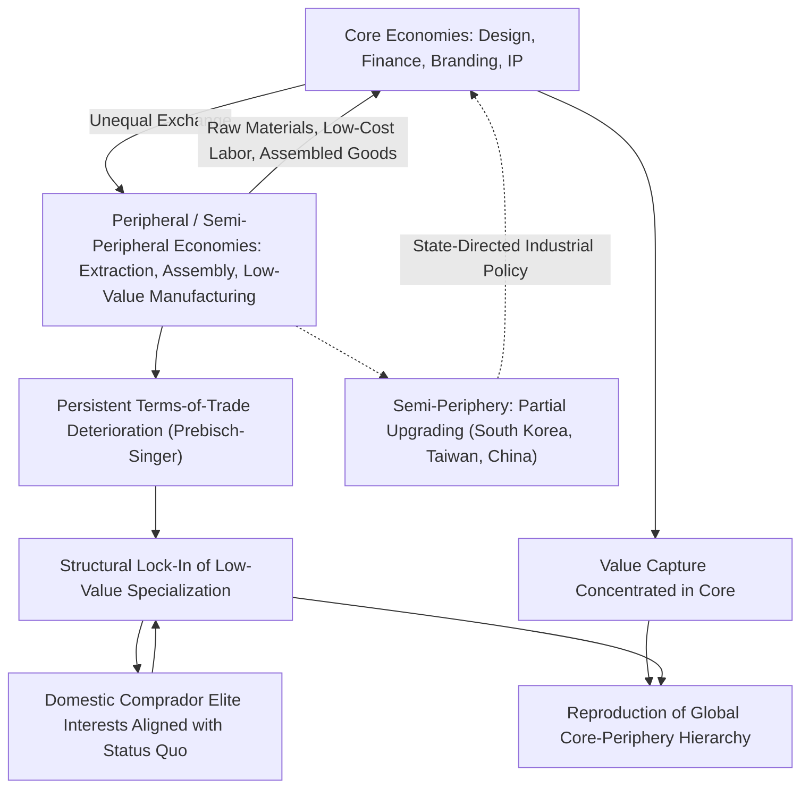

## Dependency Theory and Core-Periphery Supply Relationships

### Overview

Dependency theory is the structuralist tradition in international political economy holding that the underdevelopment of peripheral economies is not a transitional stage on a universal path toward development (as modernization theory assumed) but is itself *produced* by the structural position those economies occupy within the global capitalist system — a position characterized by persistent, systematically reproduced subordination to core industrialized economies. Applied to supply chain geopolitics, dependency theory reframes globalized production networks not as neutral, efficiency-driven arrangements that benefit all participants proportionally, but as mechanisms through which value, technological capability, and structural power are continuously transferred from peripheral producers to core-economy firms and states — a transfer that persists, and in some readings intensifies, even as trade volumes and formal economic integration expand.

### Intellectual Origins

**Raúl Prebisch and the Prebisch-Singer Thesis**

Dependency theory's empirical foundation traces to Argentine economist Raúl Prebisch, working at the UN Economic Commission for Latin America (ECLA/CEPAL) in the late 1940s and 1950s, alongside German-born economist Hans Singer's parallel work. The **Prebisch-Singer thesis** held that the terms of trade between primary-commodity-exporting peripheral economies and manufactured-goods-exporting core economies exhibit a long-run tendency to deteriorate against the periphery: commodity prices fall relative to manufactured goods prices over time, meaning peripheral economies must export increasing volumes of raw materials merely to afford a constant volume of imported manufactured goods. This directly challenged classical Ricardian comparative advantage theory's prediction that specialization according to existing endowments (periphery specializing in commodities, core in manufactures) would generate mutually beneficial, converging outcomes.

**Import Substitution Industrialization (ISI)**

The direct policy implication Prebisch and CEPAL drew from this thesis was import substitution industrialization: peripheral states should deliberately protect and subsidize domestic manufacturing (via tariffs, quotas, and state investment) rather than accepting a primary-commodity-export specialization dictated by existing comparative advantage, since that specialization was itself understood as a structurally disadvantageous trap rather than a neutral efficiency outcome. ISI was the dominant development strategy across much of Latin America from the 1950s through the 1970s/80s debt crisis.

**André Gunder Frank and "The Development of Underdevelopment"**

Frank's more radical formulation, articulated in his 1966 essay "The Development of Underdevelopment," argued that peripheral underdevelopment was not merely a lag behind core development but an *active product* of the same historical process that produced core development — the core's wealth was generated substantially through extraction from, and is causally linked to, the periphery's impoverishment. This framed core and periphery not as two economies at different stages of a shared developmental trajectory, but as two structurally interlinked poles of a single, unequal global system.

**Immanuel Wallerstein and World-Systems Theory**

Wallerstein's *The Modern World-System* (1974 onward) generalized dependency theory into a comprehensive historical-structural theory of global capitalism since roughly the "long 16th century," introducing the tripartite **core-semi-periphery-periphery** structure (adding an intermediate category to account for states like Brazil or South Korea occupying an ambiguous, partially industrialized structural position) and framing the entire capitalist world-economy as a single integrated unit of analysis, rather than a collection of discrete national economies.

### Core Theoretical Mechanisms

**Unequal Exchange**

Drawing partly on Marxist value theory, dependency and world-systems theorists argue that trade between core and periphery, even when formally voluntary and mutually agreed, systematically transfers value from periphery to core because labor in peripheral economies is paid below its full value-contribution (due to weaker labor bargaining power, surplus labor pools, and authoritarian labor suppression in many peripheral states), while core-economy labor and capital capture disproportionate returns — meaning apparently "equal" market exchanges mask underlying unequal value transfers.

**Structural Lock-In of Specialization**

Because peripheral economies typically lack the capital, technological base, and often the political autonomy (given core-economy and core-institution — IMF, World Bank — leverage over peripheral state policy) to move into higher-value-added production, dependency theory predicts persistent lock-in to raw material extraction and low-value-added manufacturing, even across generations, absent deliberate and often costly state intervention to break the pattern.

**Comprador Elites and Domestic Political Economy**

Dependency theorists (particularly in more Marxist-inflected variants) emphasize the role of domestic "comprador" elites in peripheral states — political and commercial classes whose interests are aligned with, and often financially dependent on, continued integration into core-dominated trade structures on existing terms, creating a domestic political constituency actively resistant to structural transformation even when it would benefit the broader peripheral economy.

**External Financial Dependency**

Peripheral economies' reliance on core-economy and core-institution capital (foreign direct investment, IMF/World Bank lending, core-currency-denominated debt) is theorized as a further dependency mechanism: debt service obligations and structural adjustment conditionalities (IMF-mandated austerity, trade liberalization, privatization as loan conditions) constrain peripheral state policy autonomy in ways that reproduce, rather than resolve, structural subordination — a dynamic extensively documented in the Latin American debt crisis of the 1980s and subsequent IMF structural adjustment programs across Africa and Latin America.

### Application to Contemporary Global Value Chains

**Value Capture Asymmetry**

Contemporary Global Value Chain (GVC) research, even from scholars not explicitly working in the dependency tradition (notably Gary Gereffi's empirical GVC analysis), has documented patterns consistent with dependency theory's core prediction: lead firms headquartered in core economies (US, EU, Japan, increasingly China for certain sectors) capture disproportionate value through control of design, branding, intellectual property, and distribution, while peripheral and semi-peripheral manufacturing locations capture comparatively thin margins from assembly and low-skill production — the often-cited finding that a smartphone's final assembly in China or Vietnam captures only a small fraction of the device's retail value, while design (core, typically US) and specialized component manufacturing (semi-periphery, e.g., South Korea, Taiwan) capture substantially more.

**"Race to the Bottom" Dynamics**

Dependency-informed analysis of supply chain geography emphasizes that peripheral and semi-peripheral states, competing for footloose manufacturing investment from core-economy lead firms, face structural pressure to suppress labor costs, weaken environmental and labor regulation, and offer tax and regulatory concessions — a dynamic some scholars term a "race to the bottom" that reproduces low-value-added specialization even as formal trade and investment volumes expand.

**Resource Extraction and the "Resource Curse" Intersection**

Dependency theory's core-periphery framework intersects closely with "resource curse" literature regarding peripheral economies rich in raw materials critical to global supply chains (cobalt in the Democratic Republic of Congo, lithium in parts of South America's "lithium triangle," rare earth ore in various African and Asian contexts): raw material extraction for export to core-economy processing and manufacturing centers can coexist with, and some analyses argue actively contributes to, weak peripheral-state institutional development, elite capture of resource rents, and persistent underdevelopment in extraction-dependent regions — a pattern dependency theory frames as structurally predictable rather than a set of unrelated local governance failures.

### Semi-Periphery: The Analytically Crucial Intermediate Category

Wallerstein's semi-periphery concept is particularly important for contemporary supply chain analysis because it explains cases of partial, uneven upgrading that pure core-periphery dichotomies cannot easily accommodate:

- **South Korea and Taiwan**: Both moved from peripheral, low-value-added export platforms in the 1960s–70s to semi-peripheral and arguably core-adjacent status through sustained, state-directed industrial policy (a trajectory dependency theorists debate as either confirming that upgrading is *possible* under specific conditions, or as exceptional cases that do not undermine the broader structural pattern for most peripheral economies).
- **China**: Occupies a genuinely ambiguous and actively debated structural position — simultaneously the "world's factory" (historically peripheral/semi-peripheral manufacturing role) and an increasingly core-like economy in high-value sectors (5G infrastructure, EV batteries, certain semiconductor segments, space technology), illustrating that core-periphery status is not fixed but can shift, contested, and sector-specific rather than uniform across an entire economy.
- **Mexico and Vietnam under Nearshoring/Friend-shoring**: Both are frequently analyzed as semi-peripheral beneficiaries of supply chain diversification away from China, raising an open dependency-theory question of whether this represents genuine structural upgrading or merely a geographic relocation of the same low-value-added captive manufacturing role to a new peripheral/semi-peripheral location.

### Distinguishing Dependency Theory from Related Frameworks

| Framework | Core Claim | Relationship to Dependency Theory |
| --- | --- | --- |
| Dependency Theory / World-Systems | Peripheral underdevelopment is structurally produced by core-periphery integration itself | — |
| Modernization Theory (Rostow) | All economies pass through similar developmental stages toward a shared industrialized endpoint | Directly opposed — dependency theory's original target of critique |
| Liberal Institutionalism | Trade and institutions generate mutual, if unequal, absolute gains | Contested by dependency theory's unequal exchange claim (gains may be negative-sum for periphery in relative structural terms) |
| Realism | State power/capability determines outcomes | Compatible in part (both are structural/materialist) but dependency theory emphasizes class and core-periphery structure over state-level power calculations |
| Gereffi's GVC Governance Analysis | Value capture depends on chain governance type and lead-firm coordination | Empirically overlapping — GVC analysis provides more granular, firm-level mechanisms for outcomes dependency theory predicts at a structural level |

### Analytical Framework Diagram

### Empirical Illustrations

**Case: Cobalt Supply Chains and the Democratic Republic of Congo**

The DRC supplies a large majority of global cobalt ore, a critical input for lithium-ion batteries, yet captures a comparatively small share of final battery and EV value, with refining, cell manufacturing, and vehicle assembly concentrated in China, South Korea, Japan, and increasingly Europe and North America — a frequently cited contemporary illustration of classic core-periphery extraction dynamics persisting within a nominally "green" and technologically advanced supply chain.

**Case: The Latin American Debt Crisis and Structural Adjustment**

The 1980s Latin American debt crisis, and subsequent IMF/World Bank structural adjustment programs requiring trade liberalization, privatization, and reduced state industrial intervention as conditions for continued lending, is a canonical dependency-theory case study of how financial dependency can reverse earlier import-substitution industrialization gains and reintegrate peripheral economies into commodity-export-oriented roles — directly illustrating the theory's claim that peripheral policy autonomy is structurally constrained by core-institution leverage.

**Case: East Asian Developmental State Upgrading**

[Inference] South Korea's and Taiwan's mid-to-late-20th-century transitions from low-value-added export platforms to advanced semiconductor and electronics manufacturing powers are analyzed within dependency-adjacent literature (developmental state theory, associated with Chalmers Johnson and Alice Amsden) as evidence that structural upgrading is achievable under specific conditions — strong state capacity, protected domestic industry during a formative period, strategic technology-transfer negotiation, and favorable Cold War-era geopolitical alignment with the US — though scholars debate whether these conditions are generalizable to contemporary peripheral economies operating under a substantially different (more constrained, WTO-rules-bound) global trade regime.

### Critiques of Dependency Theory

**Failure to Predict East Asian Upgrading**

The most significant empirical challenge to dependency theory is the sustained economic upgrading achieved by South Korea, Taiwan, Singapore, and (with important caveats about political system and state role) China — trajectories that classical dependency theory's more deterministic variants did not clearly anticipate and that critics argue demonstrate structural position is not as immutably fixed as the theory's strongest claims suggest.

**Neglect of Domestic Institutional Variation**

Critics, including scholars in the developmental state tradition, argue dependency theory's emphasis on external structural constraint underweights the significant variation in developmental outcomes among peripheral economies facing broadly similar external conditions, suggesting domestic institutional quality, state capacity, and policy choice matter more independently than strict structuralist accounts allow.

**Overgeneralization and Reduced Predictive Precision**

[Inference] Some IPE scholars argue that dependency theory's core-periphery framework, in its broadest formulations, risks becoming difficult to falsify — persistent underdevelopment is attributed to structural dependency, while successful upgrading is retrospectively explained as an exception or as merely reshuffling position within the same hierarchy (semi-periphery), potentially reducing the theory's value as a source of precise, testable predictions about which peripheral economies will or will not successfully upgrade under which specific conditions.

**Association with Discredited Policy (ISI)**

Import substitution industrialization, the direct policy descendant of early dependency theory, is widely regarded by mainstream economists as having produced significant inefficiencies, chronic trade deficits, and ultimately unsustainable debt accumulation across much of Latin America by the 1980s — a policy failure critics argue reflects genuine flaws in dependency theory's core prescriptive logic, though dependency-sympathetic scholars respond that ISI's failures reflected specific implementation choices (rent-seeking, insufficient export discipline) rather than a decisive refutation of the underlying structural diagnosis.

### Practical Application: How Analysts Use This Framework

**Key Points**

- Map value capture (not merely trade volume or production location) across a given supply chain to identify whether a peripheral or semi-peripheral location is achieving genuine upgrading or remains locked into low-value-added, easily substitutable roles.
- Examine terms-of-trade trends for commodity-dependent economies over multi-decade horizons to assess whether Prebisch-Singer-type deterioration dynamics remain empirically operative for a specific case.
- Assess the domestic political economy of resource-exporting or low-cost-manufacturing peripheral states: is rent capture broad-based and reinvested in productive capacity, or concentrated among comprador-elite interests resistant to structural transformation.
- Distinguish nearshoring/friend-shoring driven genuine technology transfer and local capacity-building from mere geographic relocation of the same low-value-added captive manufacturing role, when assessing whether contemporary supply chain diversification benefits recipient economies structurally or merely relocates existing dependency patterns.

**Example**

An analyst assessing whether Vietnam's growing role as an electronics assembly hub (partly displacing China amid US-China trade tension) represents genuine developmental upgrading, in dependency-theory terms, would examine: Is local value-added content in exported electronics rising over time (evidence of upgrading), or does Vietnam remain confined to low-skill final assembly with components, design, and profit largely retained by foreign (often Korean, Japanese, Taiwanese, or Chinese) lead firms (evidence of captive-governance dependency reproduction)? Is meaningful technology transfer and domestic supplier-base development occurring, or is Vietnam functioning primarily as a tariff-circumvention assembly platform with limited structural transformation?

**Next Steps**

- **Related Topics**: International political economy as an analytical lens (parent framework); realism and the primacy of state power in trade relations; the Prebisch-Singer thesis and long-run terms-of-trade data; import substitution industrialization — policy design and historical outcomes; Wallerstein's world-systems theory and the semi-periphery category in depth; the developmental state model (Chalmers Johnson, Alice Amsden) as a counter-case to strict dependency determinism; Gereffi's Global Value Chain governance and value-capture analysis; the "resource curse" literature and critical mineral extraction economies; IMF structural adjustment programs and peripheral policy autonomy; case study — cobalt supply chains and the Democratic Republic of Congo; case study — South Korea and Taiwan's semi-peripheral-to-core transition.