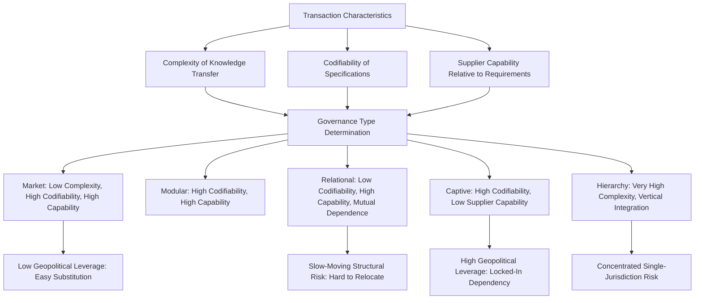

## Global Value Chain Governance Theory

### Overview

Global Value Chain (GVC) governance theory is the analytical framework, developed principally by Gary Gereffi, Timothy Sturgeon, John Humphrey, and Hubert Schmitz, for explaining how cross-border production networks are coordinated and controlled when manufacturing is fragmented across multiple firms and multiple countries. Where dependency theory and world-systems theory analyze core-periphery relationships at the level of entire national economies, GVC governance theory operates at the meso level of the firm and the transaction, asking a more granular and operationally precise question: for any given link in a global production chain, who decides what gets made, to what specification, at what price, and under what terms — and why does that authority take one organizational form rather than another. This makes GVC governance theory the primary analytical toolkit that IPE scholars, trade policy analysts, and supply chain risk managers use to move from broad structural claims about core-periphery exploitation or state power to specific, testable predictions about which firms and which locations hold leverage within a particular chain.

### Origins and Intellectual Lineage

**Gary Gereffi and Commodity Chain Analysis**

GVC theory's direct ancestor is "global commodity chain" (GCC) analysis, developed by Gereffi and collaborators in the early-to-mid 1990s, itself building on world-systems theorist Terence Hopkins and Immanuel Wallerstein's earlier concept of the "commodity chain" as a unit of analysis for tracing how a finished product moves from raw material to final consumption across a sequence of value-adding activities. Gereffi's key innovation was distinguishing between **producer-driven** chains (led by large, typically capital- and technology-intensive manufacturers who control production networks, e.g., automobiles, aircraft, semiconductors) and **buyer-driven** chains (led by large retailers, brand marketers, and trading companies who do not themselves own production facilities but control design, branding, and market access, e.g., apparel, footwear, consumer electronics assembly).

**The Transition from GCC to GVC**

Through the late 1990s and 2000s, the framework evolved from "global commodity chains" to "global value chains," partly to broaden applicability beyond primary commodities to encompass services, and partly to incorporate a more refined and empirically operationalized governance typology, formalized in Gereffi, Humphrey, and Sturgeon's influential 2005 article "The Governance of Global Value Chains" in the *Review of International Political Economy*.

### The Five-Fold Governance Typology

The 2005 Gereffi-Humphrey-Sturgeon (GHS) framework identifies five distinct governance patterns, determined by three underlying variables: the **complexity of information and knowledge transfer** required for a transaction (particularly regarding product and process specifications), the **extent to which this complexity can be codified** (reduced to explicit, transmittable specifications versus remaining tacit knowledge), and the **capabilities of actual and potential suppliers** relative to the requirements of the transaction.

**Market Governance**

Transactions are relatively simple, easily codified (specifications can be transmitted with minimal ambiguity), and supplier capabilities are high relative to requirements, meaning switching costs are low for both buyers and suppliers. Coordination is achieved through price alone, with minimal formal interaction — the closest real-world approximation to classical arm's-length market exchange. Example: many agricultural commodity and basic raw material transactions.

**Modular Governance**

Suppliers produce to a customer's specifications, but those specifications are highly codifiable and suppliers possess the capability to handle the full "turn-key" package (often using generic machinery and processes serviceable to multiple customers), reducing buyer-side monitoring costs while preserving some buyer control over final specifications. Example: contract electronics manufacturing (Foxconn, Flex, Jabil assembling products for Apple, HP, and multiple competing brands using largely standardized processes).

**Relational Governance**

Transactions involve complex, largely tacit (difficult-to-codify) knowledge exchange, requiring mutual dependence, frequent interaction, and trust-building between lead firms and highly capable suppliers, since specifications cannot simply be handed over in a codified document. Switching costs are high for both parties, producing durable, negotiated relationships rather than pure price-based coordination. Example: complex component sourcing in automotive and aerospace manufacturing, where design collaboration between assemblers and specialized suppliers is deeply iterative.

**Captive Governance**

Transactions are complex and codifiable, but supplier capabilities are low relative to what is required, producing a high degree of dependence by suppliers on lead firms, who exercise extensive monitoring, control, and often direct technical assistance to bring supplier capability up to the required standard. Suppliers in captive relationships face high switching costs (a single or very few dominant buyers) while the lead firm retains disproportionate bargaining leverage. Example: many apparel and footwear contract manufacturers in early stages of integration into a buyer-driven chain, highly dependent on a small number of major brand customers.

**Hierarchy**

The lead firm vertically integrates production within a single corporate entity (wholly owned subsidiaries) rather than outsourcing to independent suppliers at all, typically because product complexity is very high, and the intellectual property or process knowledge involved is sufficiently sensitive or proprietary that the firm judges external contracting too risky or impractical. Example: leading-edge semiconductor design and, in integrated device manufacturer (IDM) firms, fabrication kept in-house (historically Intel prior to its more recent foundry-services pivot).

### Governance as a Spectrum of Explicit Coordination and Power Asymmetry

The five governance types are conventionally arrayed along a spectrum of increasing explicit coordination and increasing power asymmetry between lead firms and suppliers, moving from market (low coordination, low asymmetry) through modular, relational, and captive, to hierarchy (high coordination, but asymmetry internalized within a single firm rather than expressed between separate firms). This ordering is the theory's central analytical payoff: it allows an analyst to predict, from the underlying characteristics of a transaction (complexity, codifiability, supplier capability), which governance form is likely to emerge, and — critically for supply chain geopolitics — which governance form is most vulnerable to political disruption, coercion, or rapid reconfiguration.

### Governance Type and Geopolitical Vulnerability

GVC governance theory's direct relevance to supply chain geopolitics lies in the proposition that different governance types exhibit systematically different vulnerabilities to political disruption:

- **Market governance** chains are generally the *most* resilient to geopolitical disruption of a specific supplier or location, precisely because low switching costs make substitution straightforward — a state seeking to weaponize a market-governed chokepoint will find leverage difficult to sustain, since buyers can readily shift to alternative suppliers.
- **Captive governance** chains are correspondingly the *most* vulnerable to lead-firm (and by extension, lead-firm home-state) coercive leverage, since captive suppliers by definition lack the capability or alternative-buyer options to easily exit the relationship — this is the governance structure most closely aligned with the kind of asymmetric dependency that realist and "weaponized interdependence" frameworks analyze as exploitable.
- **Relational governance** chains, while resilient to unilateral lead-firm coercion (given mutual dependence), are comparatively difficult and slow to reconfigure geographically, since the tacit, relationship-specific knowledge involved cannot be rapidly transferred to a new location or supplier — meaning relational-governance chains (much automotive and aerospace component sourcing) are less susceptible to coercive weaponization but more susceptible to slow-moving structural decoupling costs.
- **Hierarchy** (vertical integration) is, by construction, the governance form least susceptible to third-party coercive leverage over the supply relationship itself, since there is no external supplier relationship to coerce — but it concentrates strategic and financial risk (including geopolitical risk, e.g., exposure to a single jurisdiction's export control or expropriation risk) entirely within the lead firm's own corporate structure and physical footprint.

### Lead Firm Power and Value Capture

A central GVC governance insight is that geographic location of manufacturing (where a good is physically "made") is a poor predictor of where economic value, and by extension structural leverage, is actually captured — what matters is which firm(s) control the coordination points within the chain (design specifications, branding and consumer-facing intellectual property, distribution and retail access, and increasingly data and platform infrastructure). This is the direct empirical mechanism underlying the widely cited finding that Apple captures a substantially larger share of an iPhone's retail value than Foxconn's assembly operations, despite the device being formally "Made in China" for trade-statistics purposes — a finding with significant policy implications for interpreting bilateral trade balances, since gross trade statistics attribute the full export value to the assembly location even though value capture is concentrated elsewhere.

### Chain Upgrading Typology

GVC theory identifies a four-stage typology of how firms and economies can attempt to improve their position within a value chain over time:

- **Process upgrading**: improving production efficiency within existing product categories (faster, cheaper, higher-quality production of the same goods).
- **Product upgrading**: moving into more sophisticated, higher-value product lines within the same general category.
- **Functional upgrading**: acquiring new functions within the chain — moving from pure assembly into design, branding, logistics coordination, or direct market access, capturing a larger share of the value chain's coordination points.
- **Inter-chain upgrading**: applying capabilities and knowledge acquired in one value chain to enter an entirely different, typically higher-value chain (e.g., a firm that developed manufacturing capability in garment assembly leveraging that organizational capability to enter electronics assembly).

Functional upgrading is generally regarded as the most strategically significant and most difficult to achieve, since it requires lead firms to cede coordination authority — something captive and even modular governance structures are specifically designed to limit, creating a structural tension between supplier upgrading ambitions and lead-firm incentives to preserve the value-capture asymmetry that governance structure protects.

### Analytical Framework Diagram

### Empirical Illustrations

**Case: Apple's Governance Strategy Across Its Supply Chain**

Apple simultaneously operates multiple governance modes across different parts of its supply chain: modular governance with contract assemblers like Foxconn and Pegatron for final assembly (high codifiability, high supplier capability, relatively substitutable), relational governance with specialized component suppliers (advanced display and camera module manufacturers requiring deep design collaboration), and effective hierarchy over chip design (Apple Silicon designed entirely in-house, though fabricated externally by TSMC under what functions as a highly relational, near-captive foundry relationship given TSMC's leading-edge process capability concentration) — illustrating that a single firm's chain is rarely governed by one uniform type, and that geopolitical risk assessment must be conducted segment by segment rather than at the level of "Apple's supply chain" as an undifferentiated whole.

**Case: TSMC and Captive-Adjacent Foundry Dependency**

Taiwan Semiconductor Manufacturing Company's position as the dominant foundry for leading-edge logic chips creates a governance structure that, from the perspective of fabless design firms (Apple, Nvidia, AMD, Qualcomm), functions closer to captive-in-reverse or highly relational governance — these customers are, in leading-edge process nodes, highly dependent on TSMC's specific capability with few if any substitutable suppliers, inverting the typical buyer-driven power asymmetry and giving TSMC (and by extension, Taiwan and the governments regulating TSMC) substantial structural leverage, a dynamic frequently analyzed as Taiwan's "silicon shield."

**Case: Apparel Industry Captive Governance and Labor Conditions**

[Inference] Extensive GVC empirical research on apparel manufacturing in Bangladesh, Vietnam, and Cambodia has documented classic captive-governance dynamics — major Western and East Asian apparel brands exercising extensive specification control and compliance monitoring over garment factories with comparatively low bargaining power and high dependency on a small number of major buyers — a pattern researchers link to downward pressure on labor standards and wages, consistent with dependency theory's "race to the bottom" prediction operating at the firm-governance level.

### Distinguishing GVC Governance Theory from Related Frameworks

| Framework | Level of Analysis | Core Contribution |
| --- | --- | --- |
| GVC Governance Theory | Firm/transaction (meso-level) | Explains *why* specific coordination structures emerge and predicts governance-specific vulnerability to disruption |
| Dependency Theory / World-Systems | National economy/class (macro-level) | Explains persistent core-periphery value transfer at a structural, historical level |
| Realism | State (macro-level) | Explains state incentives to control or diversify away from chokepoints, largely agnostic to firm-level governance mechanics |
| Weaponized Interdependence (Farrell/Newman) | Network topology (systemic) | Explains how hub-and-spoke network structures enable state coercion; complements GVC governance by identifying which network positions are chokepoints |

GVC governance theory is best understood as providing the micro-to-meso mechanism that explains *how* the macro-level outcomes predicted by dependency theory and realism are actually produced and sustained at the level of individual buyer-supplier relationships — it is the operational bridge between structural IPE theory and firm-level supply chain risk management practice.

### Critiques of GVC Governance Theory

**Static Typology Applied to Dynamic Relationships**

Critics argue the five-fold typology, while analytically useful, can understate how governance relationships evolve over time within a single buyer-supplier pair (a modular relationship deepening into relational governance as trust and capability grow, or a captive supplier achieving functional upgrading that shifts the relationship toward relational governance) — the original GHS framework has been extended by subsequent scholarship specifically to address this dynamism, but simpler applications risk treating governance type as a fixed rather than evolving characteristic.

**Underweighting of State Actors**

The original 2005 GHS framework was explicitly firm-centric, largely treating states as background conditions (regulatory environment, infrastructure) rather than active governance participants — a limitation subsequent scholarship (including Gereffi's own later work on "global value chains and development") has sought to address by incorporating state industrial policy, export control regimes, and state-owned enterprises as direct governance actors, particularly relevant to contemporary supply chain geopolitics where state export controls and investment screening now directly reshape governance structures that firm-level bargaining alone would not produce.

**Firm-Centric Framing Can Obscure Labor and Exploitation Dynamics**

Echoing critiques leveled at GVC analysis more broadly (noted in the dependency theory discussion), some scholars argue the governance typology's relatively neutral, managerial vocabulary ("coordination," "capability," "codifiability") can obscure the labor exploitation and power asymmetry dynamics that the framework's own empirical findings (captive governance's association with weak labor standards) actually document — a tension between the framework's analytical neutrality and its substantive findings.

### Practical Application: How Analysts Use This Framework

**Key Points**

- Classify each significant segment of a target supply chain (not the chain as an undifferentiated whole) by governance type, since geopolitical vulnerability assessment requires segment-level, not firm-level, granularity.
- Prioritize risk mitigation resources toward captive and near-captive/relational segments with few substitutable suppliers, since these carry the highest exposure to coercive leverage or single-point-of-failure disruption.
- Assess whether observed "diversification" or "friend-shoring" efforts are shifting governance type (toward market or modular governance, genuinely reducing dependency) or merely relocating an unchanged captive governance structure to a new jurisdiction (preserving equivalent vulnerability under a different flag).
- Track functional upgrading attempts by key suppliers as a leading indicator of shifting bargaining power within a chain, since successful upgrading can convert a captive relationship into a relational one, fundamentally altering geopolitical risk exposure over a multi-year horizon.

**Example**

An analyst assessing supply chain risk for a company sourcing lithium-ion battery cells would map the chain's governance structure at each stage: raw lithium/cobalt extraction (often market or captive governance depending on the specific mine-buyer relationship), cell chemistry and manufacturing (increasingly relational or near-captive, given the concentration of advanced cell manufacturing capability in a small number of firms, predominantly in China, South Korea, and Japan), and final pack assembly (often modular, given more standardized integration processes). This segment-by-segment mapping reveals that the most acute geopolitical vulnerability likely lies in cell chemistry and manufacturing — not in raw material extraction, where governance is more market-like and substitution, while costly, is more structurally feasible.

**Next Steps**

- **Related Topics**: International political economy as an analytical lens (parent framework); dependency theory and core-periphery supply relationships (macro-level complement); realism and the primacy of state power in trade relations; weaponized interdependence and network chokepoint theory; the Gereffi-Humphrey-Sturgeon 2005 governance typology in full technical detail; buyer-driven versus producer-driven chain distinction and its contemporary applicability; chain upgrading strategies (process, product, functional, inter-chain) and state industrial policy support; TSMC and the semiconductor foundry governance model as an extreme case study; state actors as GVC governance participants — export controls and investment screening as governance-reshaping tools; labor standards and captive governance in apparel and electronics assembly.