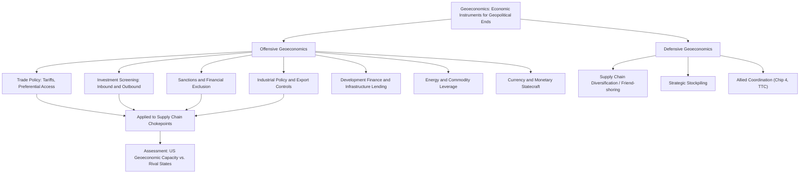

## Blackwill and Harris and the Modern Framework for Geoeconomics

### Overview

Robert Blackwill and Jennifer Harris's *War by Other Means: Geoeconomics and Statecraft* (2016) is the most influential contemporary articulation of geoeconomics as a distinct, operational framework for analyzing how states pursue geopolitical objectives through economic instruments. Building on but substantially systematizing an older intellectual lineage (the term "geoeconomics" itself was coined by Edward Luttwak in a 1990 essay), Blackwill and Harris's central contribution is a practitioner-oriented taxonomy of economic instruments of statecraft combined with a pointed argument — directed primarily at US policymakers — that the United States has systematically underinvested in geoeconomic tools relative to rival powers, particularly China, thereby ceding strategic ground despite retaining substantial underlying economic capability. Their framework has become a standard reference point in supply chain geopolitics precisely because it treats trade, investment, technology, energy, and finance not as separate policy domains but as an integrated toolkit for pursuing the same strategic objectives realists analyze through military and diplomatic instruments.

### Defining Geoeconomics

Blackwill and Harris define geoeconomics as the use of economic instruments to promote and defend national interests, and to produce beneficial geopolitical results — and, reciprocally, the effects of other states' economic actions on a given country's geopolitical goals. This definition deliberately encompasses two directions of analysis: **offensive geoeconomics** (a state actively using economic tools to achieve strategic objectives) and **defensive geoeconomics** (a state responding to, or protecting itself against, another state's economic statecraft). This bidirectionality is analytically important for supply chain geopolitics, since most contemporary chokepoint disputes (semiconductor export controls, rare earth licensing, critical mineral stockpiling) involve both offensive deployment by one state and defensive/reactive positioning by others simultaneously.

Their framework explicitly distinguishes geoeconomics from geopolitics (the broader field of interstate strategic competition, encompassing military and diplomatic instruments) — geoeconomics is positioned as a subset or instrument-class within the broader geopolitical competition, not a replacement for it. This positions their work as an extension and operationalization of realist logic (states as the central actors, power and relative position as the central concern) rather than a competing paradigm to realism, though it draws selectively on IPE's structural-power vocabulary as well.

### The Core Toolkit: Instruments of Geoeconomic Statecraft

Blackwill and Harris catalog a set of instruments states deploy in pursuit of geoeconomic objectives, providing the practical, policy-facing vocabulary now widely used across government, think tank, and corporate risk-analysis contexts:

**Trade Policy**

Tariffs, quotas, preferential trade agreements, and market-access conditions deployed not purely for economic-welfare reasons but as instruments of strategic leverage — rewarding aligned states with preferential access while restricting or conditioning access for strategic rivals or states whose behavior a state seeks to influence.

**Investment Policy**

Inbound investment screening (foreign direct investment review mechanisms such as the US Committee on Foreign Investment in the United States, CFIUS, and equivalent European and allied mechanisms), outbound investment restrictions (the more novel and rapidly developing US "reverse CFIUS" outbound investment screening regime targeting sensitive technology investment in countries of concern), and sovereign wealth fund deployment as instruments of strategic influence.

**Economic and Financial Sanctions**

Asset freezes, transaction prohibitions, and exclusion from financial messaging and clearing systems (notably SWIFT), deployed both bilaterally and, increasingly, through coordinated multilateral sanctions coalitions — a domain where Blackwill and Harris argue the US retains particularly durable structural advantage given dollar-system centrality, directly overlapping with Susan Strange's financial-structure concept.

**Cyber Tools**

Offensive and defensive cyber capabilities deployed for economic espionage, critical infrastructure protection, and, increasingly, direct disruption of adversary economic and industrial capacity — a domain Blackwill and Harris treat as increasingly inseparable from traditional economic statecraft given the digitization of financial and industrial systems.

**Aid and Development Finance**

Foreign assistance, development bank lending, and infrastructure financing deployed to build strategic alignment and influence recipient-state policy — directly relevant to analyzing China's Belt and Road Initiative as a geoeconomic instrument, and to Western-coalition responses (the G7's Partnership for Global Infrastructure and Investment, the EU's Global Gateway).

**Energy and Commodities Policy**

Control over energy supply, pricing, and critical raw material access deployed as strategic leverage — directly the domain of contemporary rare earth export licensing, OPEC+ production coordination, and post-2022 European energy diversification away from Russian gas.

**Monetary Policy and Currency Statecraft**

Exchange rate management, reserve currency status, and efforts to promote or resist currency internationalization (RMB internationalization efforts, de-dollarization initiatives among BRICS-aligned states) as instruments of long-term structural positioning.

**State-Directed Industrial Policy**

Subsidies, national champion promotion, and technology-sector targeting (explicitly including export controls and technology-transfer restrictions) as tools for building sustained relative capability advantage in strategically significant sectors — directly the domain of the CHIPS and Science Act, China's Made in China 2025, and the EU Chips Act.

### The Central Argument: American Geoeconomic Underinvestment

Blackwill and Harris's most consequential and widely cited claim is that, in the decades following the Cold War, the United States allowed its geoeconomic capacity to atrophy relative to its continued military dominance, driven by several interlocking factors they identify: a post-Cold War policy establishment shaped by economic-liberal assumptions (the belief that trade and market integration would inevitably produce political liberalization, reducing the perceived strategic necessity of geoeconomic tools), institutional fragmentation of US economic statecraft across multiple agencies (Treasury, Commerce, State, USTR) without unified strategic direction, and a general policy preference for treating economic and security policy as separate domains rather than as an integrated toolkit — precisely the state-market separation Susan Strange's IPE framework identifies as analytically mistaken.

They argue this underinvestment allowed China, by contrast, to develop and deploy a substantially more integrated and strategically directed geoeconomic toolkit — combining state-directed investment, Belt and Road infrastructure financing, deliberate technology-sector targeting, and market-access leverage — as a central instrument of its broader strategic competition with the United States, a gap Blackwill and Harris argue required urgent US policy correction.

### Relationship to Broader IR/IPE Theory

Blackwill and Harris's framework is best understood as an applied, policy-oriented synthesis rather than a novel general theory: it shares realism's state-centric, relative-power-focused ontology, but extends the analytical toolkit to cover the full range of economic instruments IPE scholarship has long studied, without adopting IPE's more structural or Marxist-inflected causal claims about class or core-periphery exploitation. Their contribution is less theoretical innovation than *systematic cataloging and policy translation* — converting academic IPE and realist insight into a practitioner-usable instrument taxonomy that has been widely adopted in US National Security Strategy documents, congressional testimony, and think-tank policy analysis since the book's 2016 publication.

| Framework | Primary Contribution | Relationship to Blackwill-Harris Geoeconomics |
| --- | --- | --- |
| Realism | State power/relative gains as central concern | Shares state-centric, relative-power ontology |
| IPE (Strange's structural power) | Four structures through which power operates | Directly informs the instrument taxonomy (financial, production, knowledge structures map onto sanctions, industrial policy, investment tools) |
| Hegemonic Stability Theory | Dominant power's role in economic order | Complementary — geoeconomic underinvestment thesis parallels HST's concern with hegemonic willingness/capacity erosion |
| Weaponized Interdependence (Farrell/Newman) | Network chokepoint coercion mechanisms | Provides the network-structural mechanism explaining *why* certain geoeconomic instruments (financial sanctions, export controls) are so effective |

### Analytical Framework Diagram

### Empirical Illustrations

**Case: US Semiconductor Export Controls as Integrated Geoeconomic Instrument**

The October 2022 and subsequent US export control expansions restricting advanced semiconductor and semiconductor-manufacturing-equipment sales to China combine multiple instruments from the Blackwill-Harris taxonomy simultaneously: export/trade policy, extraterritorial jurisdiction leveraging US technology dominance (the Foreign Direct Product Rule), coordinated allied policy alignment (pressuring the Netherlands and Japan to adopt parallel controls on lithography and equipment exports), and implicit industrial policy support (CHIPS Act subsidies for domestic capacity) — illustrating the kind of integrated, multi-instrument geoeconomic campaign Blackwill and Harris argue the US historically underutilized.

**Case: China's Belt and Road Initiative as Development-Finance Geoeconomics**

[Inference] China's Belt and Road Initiative, involving infrastructure lending across dozens of countries, is frequently analyzed within the Blackwill-Harris framework as a paradigm case of development-finance geoeconomics — using capital export and infrastructure construction to build durable strategic alignment, market access, and alternative supply chain routing (ports, rail corridors) less dependent on existing US-aligned infrastructure, though the degree to which BRI reflects centrally coordinated strategic design versus more decentralized, commercially driven lending by individual Chinese state-owned banks and enterprises remains debated among China-watchers.

**Case: European Response to Russian Energy Coercion**

The European Union's rapid 2022–2023 diversification away from Russian pipeline gas — accelerated LNG import infrastructure, renewable energy investment, and demand reduction measures — is a direct illustration of defensive geoeconomics as Blackwill and Harris frame it: a coordinated policy response to another state's (Russia's) weaponization of energy supply dependency, undertaken explicitly as a strategic rather than purely economic-efficiency-driven policy choice.

### Critiques of the Blackwill-Harris Framework

**Instrument Catalog Without Predictive Theory**

Academic critics, particularly from more theoretically oriented IPE and IR traditions, argue Blackwill and Harris's framework functions primarily as a descriptive taxonomy and policy advocacy document rather than a rigorous causal theory — it catalogs *what* instruments exist and argues the US should use them more systematically, but offers comparatively limited formal theoretical apparatus for predicting *when* geoeconomic coercion will succeed or fail, a gap more systematically addressed by weaponized interdependence theory's network-structural mechanism.

**US-Centric Policy Advocacy Framing**

Because the book is explicitly written to persuade US policymakers of underinvestment, critics note its analytical framing is shaped by this advocacy purpose — potentially overstating the coherence and strategic intentionality of rival (particularly Chinese) geoeconomic behavior to strengthen the case for US policy response, a framing bias analysts should account for when applying the framework to assess actual adversary capability and intent rather than treating the book's characterizations as neutral empirical description.

**Limited Attention to Firm-Level and Market Mechanisms**

[Inference] Because the framework centers state instruments, it engages comparatively less with the firm-level governance mechanics (captured more precisely by GVC governance theory) and market-structural dynamics that determine whether state-level geoeconomic instruments actually translate into effective leverage over specific supply chain segments — an analyst using Blackwill-Harris's instrument taxonomy benefits from combining it with GVC governance analysis to assess whether a given chokepoint is genuinely coercible or merely nominally state-controlled.

**Risk of Legitimizing Escalatory Economic Statecraft**

Some critics, more from a liberal-institutionalist or normative perspective, argue that mainstreaming an explicitly instrumentalized, competition-oriented view of economic policy (treating trade, investment, and finance as tools of geopolitical competition by default) risks accelerating the erosion of the rules-based multilateral trade order that liberal institutionalism identifies as itself a source of stability and mutual gain, a tension Blackwill and Harris's framework does not fully resolve.

### Practical Application: How Analysts Use This Framework

**Key Points**

- Catalog which specific geoeconomic instruments (trade, investment, sanctions, industrial policy, development finance, energy, currency, cyber) a state is deploying or could plausibly deploy in a given supply chain dispute, rather than treating "economic coercion" as an undifferentiated category.
- Assess both offensive and defensive dimensions simultaneously: a given supply chain disruption typically involves one state's offensive instrument deployment and one or more other states' defensive/reactive instrument deployment in response.
- Evaluate instrument coordination and integration — Blackwill and Harris's core argument is that integrated, multi-instrument campaigns (combining export controls with allied coordination and domestic industrial policy, as in the 2022 semiconductor controls) are more strategically effective than isolated single-instrument actions.
- Cross-reference instrument-level analysis with GVC governance theory (to assess whether the targeted chokepoint is genuinely coercible given underlying supplier substitutability) and weaponized interdependence theory (to assess network-topology-based coercive potential) for a fuller strategic assessment.

**Example**

An analyst assessing a hypothetical Chinese response to further US semiconductor export controls would apply the Blackwill-Harris taxonomy systematically: Which instruments are plausibly available (export/trade policy — rare earth or gallium/germanium licensing; investment policy — restricting US firm access to Chinese market or supply chains; currency policy — accelerating RMB settlement promotion; development finance — deepening Belt and Road alignment among affected supplier states)? Are these being deployed as an integrated campaign or as isolated, reactive measures? This structured instrument-by-instrument assessment produces a more precise strategic forecast than a general expectation of unspecified "Chinese retaliation."

**Next Steps**

- **Related Topics**: Realism and the primacy of state power in trade relations; hegemonic stability theory and the role of a dominant power; weaponized interdependence and network chokepoint coercion mechanisms; Susan Strange's structural power framework and its integration into geoeconomic instrument taxonomies; CFIUS and outbound investment screening regimes in detail; the US CHIPS and Science Act and China's Made in China 2025 as industrial-policy geoeconomics; China's Belt and Road Initiative as development-finance statecraft; SWIFT and financial-system exclusion as a sanctions instrument; the Chip 4 alliance and Trade and Technology Council as coordinated allied geoeconomic instruments; comparative case study — European energy diversification as defensive geoeconomics in practice.