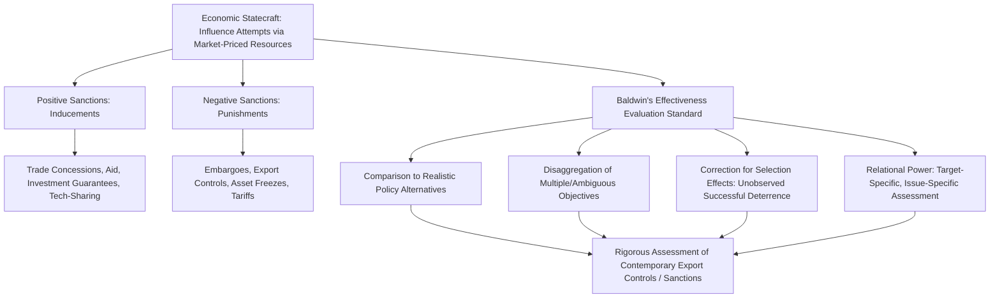

## David Baldwin and the Theory of Economic Statecraft

### Overview

David Baldwin's *Economic Statecraft* (1985, with a substantially revised and updated second edition in 2020) is the foundational scholarly work establishing economic statecraft as a rigorous analytical category within international relations, distinct from but related to the practitioner-oriented geoeconomics literature (Blackwill and Harris) that would follow three decades later. Where Blackwill and Harris primarily catalog instruments for policy application, Baldwin's contribution is more fundamentally theoretical and methodological: he provides the conceptual apparatus for defining what counts as economic statecraft, developing rigorous standards for evaluating whether such statecraft actually "works," and — most distinctively — mounting a sustained critique of what he identifies as pervasive analytical bias in how scholars and policymakers assess the effectiveness of economic versus military instruments of influence. Baldwin's framework remains the methodological benchmark against which contemporary analyses of sanctions, export controls, and supply chain coercion are evaluated for analytical rigor.

### Defining Economic Statecraft

Baldwin defines economic statecraft as governmental influence attempts relying primarily on resources that have a reasonable semblance of a market price in terms of money — deliberately distinguishing statecraft (instrumental use of resources to influence the behavior of other actors) from broader economic policy (which may pursue purely domestic welfare objectives without any influence-seeking intent toward other states). This definitional precision matters directly for supply chain geopolitics: not every instance of a state restricting trade or investment constitutes "economic statecraft" in Baldwin's technical sense — the defining criterion is the *intent to influence another actor's behavior*, not merely the domestic economic effect of the policy.

Baldwin's typology divides economic statecraft into two broad categories:

**Positive Sanctions (Inducements)**

Rewards or promised rewards intended to induce a target to comply with the sender's wishes — trade concessions, aid packages, investment guarantees, technology-sharing agreements, and market-access grants offered specifically to shape target-state behavior.

**Negative Sanctions (Punishments)**

Actual or threatened deprivations intended to compel or deter a target — trade embargoes, asset freezes, export controls, tariffs, and investment restrictions imposed or threatened to change target-state behavior.

Baldwin explicitly criticizes what he identifies as a pervasive scholarly and policy bias toward studying negative sanctions (particularly comprehensive trade embargoes) while neglecting positive inducements, arguing this skews the field's overall assessment of economic statecraft's effectiveness, since inducement-based strategies frequently succeed where punitive strategies fail, but receive disproportionately less scholarly attention.

### The Core Methodological Contribution: The "Sanctions Don't Work" Critique

Baldwin's most influential and enduring contribution is a sustained methodological critique of the then-dominant scholarly consensus (associated particularly with the influential Hufbauer-Schott-Elliott dataset and analysis of historical sanctions episodes) that economic sanctions "do not work" as instruments of coercion. Baldwin does not dispute the empirical record that many sanctions episodes fail to achieve their stated objectives; rather, he argues the standard methodology used to reach the "sanctions don't work" conclusion is analytically flawed in several specific ways directly relevant to how contemporary analysts should evaluate supply chain coercion attempts:

**The Comparison Problem**

Baldwin argues effectiveness cannot be assessed in isolation — the relevant question is not "did sanctions achieve 100% of their stated objective" but "how did sanctions perform *relative to available alternative policy instruments* (military action, diplomacy, doing nothing) given the same objective and constraints." A sanction that only partially achieves its goal may still be the most cost-effective instrument available, a comparison standard rarely applied consistently in effectiveness studies, but directly relevant to assessing whether export controls represent a reasonable policy choice relative to alternatives like military-technology denial regimes or outright conflict.

**The Multiple/Ambiguous Objectives Problem**

Baldwin observes that policymakers frequently pursue multiple, sometimes partially inconsistent objectives simultaneously through a single sanctions episode (signaling domestic political resolve, symbolically expressing disapproval, actually changing target behavior, deterring third parties from similar conduct), and that evaluating "success" against only the most visible stated objective while ignoring these secondary objectives systematically understates effectiveness — a methodological point directly applicable to evaluating whether contemporary semiconductor export controls should be judged solely by whether they halt Chinese technological advancement (a high, arguably unrealistic bar) or also by secondary objectives such as slowing the rate of advancement, signaling resolve to allies, or building coalition alignment.

**Selection Effects and the "Sanctions That Weren't Needed" Problem**

Baldwin notes that the most successful uses of economic statecraft may never appear in datasets of "sanctions episodes" at all, because the credible threat of sanctions alone induces target compliance without the sanction ever being formally imposed or publicly recorded — meaning any dataset built exclusively from *imposed* sanctions episodes is subject to a systematic selection bias toward failure, since successful deterrent threats are effectively invisible to standard sanctions-effectiveness research designs.

**Power and Influence as Relational, Not Absolute**

Drawing on Baldwin's broader (and highly influential, independent of the statecraft-specific work) contributions to power analysis in IR theory, he insists that "power" and "influence" are inherently relational concepts — a given economic instrument's effectiveness cannot be assessed as a fixed, context-independent property of the instrument itself, but only relative to a specific target, a specific issue-scope, and a specific set of target-state vulnerabilities and alternatives, a point with direct relevance to why the same export control instrument may prove highly effective against one target state's technology sector while proving largely ineffective against another with greater indigenous substitution capacity.

### Contemporary Application: Evaluating Export Controls and Sanctions

Baldwin's second edition (2020) and the broader scholarly tradition he founded directly inform how contemporary analysts should evaluate the effectiveness of supply-chain-relevant economic statecraft:

**Applying the Comparison Standard**

Rather than asking simply "did US semiconductor export controls stop China's chip industry," Baldwin's framework directs analysts to ask what the realistic policy alternatives were (unrestricted technology flow, military conflict, multilateral diplomatic pressure alone) and whether export controls, even if only partially effective at slowing rather than halting Chinese advancement, represent the most cost-effective available instrument relative to those alternatives.

**Applying the Multiple-Objectives Standard**

A Baldwin-informed assessment of contemporary chokepoint-based coercion (rare earth export licensing, semiconductor equipment controls) explicitly disaggregates stated objectives (halting a specific capability), signaling objectives (demonstrating resolve to allies and domestic audiences), and coalition-building objectives (inducing allied states to adopt parallel restrictions) as separate evaluative criteria rather than collapsing effectiveness into a single binary success/failure judgment.

**Applying the Selection-Effects Standard**

Baldwin's framework cautions against drawing conclusions about the *general* effectiveness of chokepoint leverage purely from publicly observable cases of imposed restrictions, since the credible threat of export control expansion or rare earth licensing restriction may already be inducing target-state behavioral adjustment (diversification, stockpiling, accelerated indigenous substitution investment) that does not appear as a discrete "sanctions episode" in standard datasets, but represents a genuine (if harder to measure) instance of successful economic statecraft.

### Positive Sanctions in Supply Chain Context: The Underexamined Half

Baldwin's emphasis on positive sanctions (inducements) as an underexamined category is particularly relevant to contemporary friend-shoring and allied-coalition supply chain strategy, which relies heavily on inducement-based instruments largely absent from the more punishment-focused geoeconomics literature:

- **CHIPS Act subsidies** offered to semiconductor manufacturers to relocate or expand fabrication capacity function as a positive-sanction inducement strategy, rewarding compliance (domestic or allied-territory investment) rather than punishing non-compliance.
- **Preferential trade and investment terms** offered to states willing to align export control policy (as with the Chip 4 alliance and Trade and Technology Council coordination) represent inducement-based coalition-building, a Baldwin-framework category distinct from, though often deployed alongside, negative-sanction threats.
- **Development finance competition** (the G7's Partnership for Global Infrastructure and Investment as an inducement-based counter to China's Belt and Road Initiative) is a direct contemporary instance of positive economic statecraft competing with a rival's own inducement strategy.

Baldwin's framework predicts, and contemporary practice appears to confirm, that inducement-based coalition-building may prove more durable and less prone to allied resentment or defection than purely coercive approaches, though this remains an empirically contested claim requiring case-by-case assessment rather than a general law.

### Distinguishing Baldwin's Framework from Related Approaches

| Framework | Primary Contribution | Relationship to Baldwin |
| --- | --- | --- |
| Baldwin's Economic Statecraft Theory | Rigorous methodology for defining and evaluating instrumental economic influence attempts | — |
| Blackwill and Harris's Geoeconomics | Practitioner-oriented instrument taxonomy and US policy advocacy | Applies Baldwin's underlying instrument categories in a more policy-prescriptive, less methodologically self-critical register |
| Hufbauer-Schott-Elliott Sanctions Dataset | Large-N empirical database of historical sanctions episodes and outcomes | The primary target of Baldwin's methodological critique regarding effectiveness measurement |
| Weaponized Interdependence (Farrell/Newman) | Network-structural explanation for *why* certain coercive instruments work | Complementary — explains the structural conditions Baldwin's relational-power framework says must be specified for any effectiveness assessment |

### Analytical Framework Diagram

### Empirical Illustrations

**Case: Reassessing Semiconductor Export Control Effectiveness**

[Inference] Applying Baldwin's multiple-objectives standard to the 2022–2025 US semiconductor export control regime suggests that even if the controls have not fully halted Chinese advanced-chip development (evidence of partial failure against the narrowest stated objective), they may still represent successful economic statecraft when evaluated against secondary objectives such as measurably slowing the pace of Chinese capability advancement, demonstrably strengthening allied coordination (Japan and the Netherlands adopting parallel controls), and signaling resolve to both domestic and international audiences — a more textured assessment than a simple binary "worked/didn't work" verdict would produce.

**Case: The Iran Sanctions Regime and the Comparison Standard**

[Inference] Extended multilateral sanctions on Iran's oil exports and financial-system access, while widely debated regarding their effectiveness in halting Iran's nuclear program, are frequently reassessed in Baldwin-informed scholarship by asking what the realistic alternative policy instruments were (military strikes, unconditional diplomatic engagement, or inaction), with some analysts arguing that even partially effective sanctions may have represented the most cost-effective instrument relative to those higher-cost or higher-risk alternatives, illustrating the comparison-standard methodology in practice.

**Case: EU Carbon Border Adjustment Mechanism as Positive/Negative Hybrid**

The EU's Carbon Border Adjustment Mechanism (CBAM), which imposes tariffs on carbon-intensive imports while implicitly offering exemption pathways for exporters who adopt comparable carbon pricing, illustrates Baldwin's positive/negative sanction hybrid structure operating simultaneously within a single instrument — a punitive default (tariff imposition) combined with an inducement pathway (adopt comparable policy to avoid the tariff), directly relevant to contemporary supply chain and trade-policy design.

### Critiques of Baldwin's Framework

**Difficulty of Operationalizing "Relative Effectiveness"**

Critics note that while Baldwin's comparison standard (effectiveness relative to realistic alternatives) is methodologically sound in principle, it is often difficult to operationalize empirically, since the counterfactual policy alternative (what would have happened absent the sanction, or under an alternative instrument) is inherently unobservable and requires substantial analytical judgment that can reintroduce the very subjectivity Baldwin's framework seeks to eliminate.

**Risk of Unfalsifiability**

[Inference] Some critics argue Baldwin's framework, by allowing analysts to credit apparently "failed" sanctions with success against secondary or symbolic objectives, risks becoming difficult to falsify — almost any sanctions episode can be retrospectively deemed at least partially successful by reference to some secondary objective, potentially undermining the framework's value for rigorous policy evaluation if not applied with careful discipline regarding which secondary objectives are genuinely verifiable versus post hoc rationalization.

**Limited Engagement with Structural/Network Mechanisms**

Baldwin's framework, developed substantially before the contemporary network-topology-based analysis of Farrell and Newman's weaponized interdependence theory, provides comparatively limited theoretical apparatus for explaining *why* certain chokepoints generate more coercive leverage than others based on underlying network structure — a gap contemporary analysts typically address by combining Baldwin's evaluative methodology with more structurally oriented frameworks.

### Practical Application: How Analysts Use This Framework

**Key Points**

- Before assessing whether a given trade restriction, export control, or investment screening measure constitutes genuine "economic statecraft," verify the presence of actual influence-seeking intent toward another actor's behavior, rather than treating any economically consequential policy as statecraft by default.
- When evaluating effectiveness, explicitly specify the realistic policy alternatives being implicitly compared against, rather than judging success or failure against an unstated and often unrealistic absolute standard.
- Disaggregate stated, signaling, and coalition-building objectives separately when assessing a sanctions or export control episode's outcomes, rather than collapsing multiple objectives into a single success/failure verdict.
- Account for potential selection effects: consider whether credible threat alone may be producing target-state behavioral adjustment that would not appear in datasets built only from formally imposed measures.

**Example**

An analyst evaluating whether rare earth export licensing restrictions constitute effective Chinese economic statecraft against a Western technology sector would apply Baldwin's framework by asking: What is the specific target and stated objective (slowing a specific defense-technology program, inducing broader policy concessions, signaling resolve amid a separate bilateral dispute)? What would the realistic alternative Chinese policy response have been absent this instrument? Are there secondary objectives (demonstrating chokepoint leverage to deter future Western restrictions, building domestic political support) that a narrow "did it stop Western production" standard would miss? Is there evidence of Western firms and governments adjusting behavior (accelerated substitution investment, stockpiling) in response to credible threat alone, independent of formally announced restrictions?

**Next Steps**

- **Related Topics**: Blackwill and Harris and the modern framework for geoeconomics (direct comparison and instrument-taxonomy complement); realism and the primacy of state power in trade relations; weaponized interdependence and network-structural coercion mechanisms; the Hufbauer-Schott-Elliott sanctions effectiveness dataset and its methodological critique; positive sanctions and inducement-based coalition-building (CHIPS Act, Partnership for Global Infrastructure and Investment); the Iran sanctions regime as an extended case study in comparison-standard evaluation; relational power theory in international relations more broadly; case study — reassessing US semiconductor export control effectiveness through Baldwin's multiple-objectives lens; case study — EU Carbon Border Adjustment Mechanism as a positive/negative sanction hybrid.