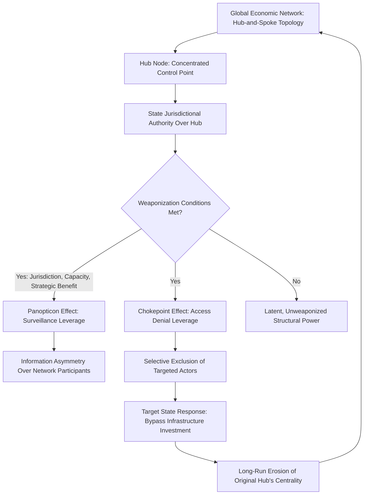

## Farrell and Newman's Theory of Weaponized Interdependence

### Overview

Henry Farrell and Abraham Newman's "Weaponized Interdependence: How Global Economic Networks Shape State Coercion," published in *International Security* in 2019, is the theoretical framework most directly responsible for reshaping contemporary understanding of how globalized economic networks — including supply chains — generate exploitable coercive leverage. Where classical liberal interdependence theory (Keohane and Nye) argued that mutual economic entanglement tends to raise the costs of conflict and thereby pacify interstate relations, and where realism argued more generally that asymmetric dependency creates leverage, Farrell and Newman's distinctive contribution is a precise, network-structural mechanism explaining *which* specific nodes within a globalized economic network generate coercive potential, and *why* — moving the analysis from broad theoretical claims about interdependence to a testable, topology-based model directly applicable to mapping real-world supply chain and infrastructure vulnerabilities.

### Core Theoretical Departure

Farrell and Newman's central argument is that global economic networks are not flat, symmetric, or evenly distributed — as much classical trade theory implicitly assumes — but instead typically exhibit **hub-and-spoke topologies**, in which a small number of nodes (hubs) handle disproportionate volumes of global transactions, information flows, or coordination functions, while the majority of peripheral nodes (spokes) connect to the broader network primarily *through* these concentrated hubs rather than through dense, direct peer-to-peer connections. This structural observation, drawn from network science and applied to the empirical architecture of global finance, technology infrastructure, and increasingly physical production networks, is the foundation for their entire coercive mechanism.

Critically, Farrell and Newman argue that states occupying jurisdictional authority over these network hubs gain structural power *independent of* their traditional material capabilities (military strength, GDP, population) — a state's coercive potential in this framework derives from its position within the network topology, not solely from its aggregate national power, a distinction with significant implications for understanding why comparatively smaller economies (the Netherlands, given ASML's lithography monopoly position, or Taiwan, given TSMC's foundry dominance) can wield outsized structural leverage disproportionate to their conventional geopolitical weight.

### The Two Core Mechanisms

Farrell and Newman identify two distinct but related mechanisms through which hub-controlling states can convert network position into coercive capability:

**The Panopticon Effect**

States with jurisdictional authority over information-dense network hubs can leverage this position for surveillance — gaining privileged access to information about transactions, relationships, and activities flowing through the hub that would otherwise be difficult or impossible to observe. The name deliberately invokes Jeremy Bentham's panopticon concept (via Foucault) to emphasize that the coercive value of this position lies partly in its informational asymmetry: the hub-controlling state can observe network activity that other network participants cannot observe about each other, or about the hub-controller's own monitoring. The US National Security Agency's historically documented access to SWIFT financial messaging data (revealed through the Terrorist Finance Tracking Program and subsequent disclosures) is the paradigmatic empirical example Farrell and Newman cite for this mechanism.

**The Chokepoint Effect**

States with jurisdictional authority over network hubs can leverage this position to selectively restrict, degrade, or completely deny network access to targeted actors — effectively weaponizing the hub's coordination function to exclude or punish specific participants while preserving network functionality for others. This mechanism is more directly and visibly relevant to supply chain geopolitics: the US's use of the Entity List and the Foreign Direct Product Rule (extending US jurisdiction to any product manufactured anywhere in the world using US-origin technology, software, or equipment above a specified threshold) to restrict specific Chinese firms' (notably Huawei and SMIC) access to advanced semiconductor technology is Farrell and Newman's central illustrative case for the chokepoint mechanism operating through legal/jurisdictional rather than purely technical control.

### Conditions for Weaponization

Farrell and Newman specify that weaponized interdependence does not automatically follow from network centralization alone — they identify specific conditions under which a state is likely to actually weaponize its hub position rather than merely possessing latent capability to do so:

- **Effective jurisdiction**: the state must possess actual legal or practical authority over the hub sufficient to compel compliance from private-sector network operators (financial institutions, technology firms, standards bodies) who physically control the infrastructure.
- **Domestic institutional capacity**: the state must have functioning regulatory, legal, and enforcement institutions capable of translating jurisdictional authority into actual operational control — a state with nominal but practically unenforceable jurisdiction cannot effectively weaponize a hub position.
- **Perceived necessity or strategic benefit**: consistent with realist logic, states are more likely to weaponize hub positions when facing acute security competition or when the expected strategic benefit is judged to outweigh the costs (including reputational costs and the risk of accelerating targeted states' efforts to build alternative, bypass infrastructure).

This conditional framing is analytically important: it predicts that hub weaponization will intensify during periods of heightened geopolitical competition (consistent with the observed acceleration of chokepoint-based coercion since approximately 2018) rather than being a constant, ever-present feature of networked interdependence.

### Application to Semiconductor Supply Chains

Weaponized interdependence theory has become the dominant analytical framework for understanding contemporary semiconductor supply chain geopolitics specifically, because the semiconductor manufacturing ecosystem exhibits an unusually extreme hub-and-spoke structure:

**Photolithography as a Hub**

ASML, headquartered in the Netherlands, holds an effective global monopoly on extreme ultraviolet (EUV) lithography systems required for leading-edge chip manufacturing — a single-firm, single-jurisdiction chokepoint of extraordinary concentration. US diplomatic pressure on the Dutch government to restrict ASML's EUV (and subsequently deep ultraviolet, DUV) equipment exports to China is a direct empirical instance of chokepoint-effect coercion operating through allied jurisdictional leverage rather than direct US legal authority, since ASML is not a US firm.

**Chip Design Software (EDA Tools) as a Hub**

Electronic design automation software, required to design any modern integrated circuit, is dominated by three firms — Synopsys, Cadence, and Siemens EDA (formerly Mentor Graphics) — with the first two being US-headquartered, giving the US direct jurisdictional leverage over this critical, difficult-to-substitute design-stage chokepoint independent of manufacturing-stage controls.

**Foundry Capacity as a Hub**

TSMC's dominant share of leading-edge logic chip fabrication capacity constitutes a chokepoint controlled by Taiwan's jurisdiction — a case Farrell and Newman's framework helps explain not merely as a "supply concentration" risk in the conventional business-continuity sense, but as a potential source of Taiwanese (and by extension, US-aligned) structural coercive leverage over any state seeking to acquire leading-edge chips, directly informing the "silicon shield" strategic concept.

### Application Beyond Semiconductors

**Financial Messaging (SWIFT)**

The Society for Worldwide Interbank Financial Telecommunication, based in Belgium but operating under significant US and EU regulatory influence given dollar and euro transaction centrality, has been used to exclude sanctioned Russian, Iranian, and North Korean financial institutions from the global financial messaging system — a direct, frequently cited chokepoint-effect case, though one that has simultaneously accelerated targeted states' and China's development of alternative payment infrastructure (Russia's SPFS, China's CIPS), illustrating Farrell and Newman's own acknowledgment that weaponization incentivizes bypass-infrastructure investment over time.

**Internet Backbone and Cloud Infrastructure**

US dominance in global cloud computing infrastructure (Amazon Web Services, Microsoft Azure, Google Cloud collectively holding substantial global market share) and internet backbone/root-server architecture constitutes a further hub structure with latent panopticon and chokepoint potential, increasingly relevant as supply chain coordination itself becomes more digitized and cloud-dependent.

**Global Positioning and Navigation**

[Inference] US control over GPS signal architecture, alongside the existence of alternative systems (Russia's GLONASS, the EU's Galileo, China's BeiDou), illustrates both the chokepoint logic (potential to degrade or deny signal access) and the bypass-infrastructure dynamic Farrell and Newman's framework predicts as a rational response by states seeking to reduce vulnerability to a rival-controlled hub.

### Distinguishing Weaponized Interdependence from Related Frameworks

| Framework | Core Mechanism | Relationship to Weaponized Interdependence |
| --- | --- | --- |
| Weaponized Interdependence (Farrell/Newman) | Network topology (hub-and-spoke) determines coercive leverage via panopticon/chokepoint effects | — |
| Realism | Aggregate state power/capability determines leverage | Shares coercive-leverage concern but WI provides more precise, structural (not purely capability-based) mechanism |
| Liberal Institutionalism (Keohane/Nye complex interdependence) | Interdependence raises costs of conflict, pacifying relations; sensitivity/vulnerability as power sources | WI directly builds on and extends the sensitivity/vulnerability distinction into a formal network-structural theory |
| Blackwill and Harris's Geoeconomics | Catalogs the instruments (sanctions, export controls) states use | WI explains the underlying structural *mechanism* that makes specific instruments (SWIFT exclusion, export controls) effective |
| GVC Governance Theory (Gereffi et al.) | Firm-level transaction governance predicts supplier dependency | WI operates at a more macro, infrastructure/network level; GVC governance provides complementary firm-level granularity |

### Analytical Framework Diagram

### Empirical Illustrations

**Case: ASML and the EUV Export Restriction Campaign**

The sustained US diplomatic effort, beginning around 2018–2019 and intensifying through 2023, to secure Dutch government agreement to restrict ASML's EUV and advanced DUV lithography equipment exports to China is among the clearest empirical illustrations of Farrell and Newman's chokepoint mechanism operating through allied jurisdictional coordination rather than unilateral US legal authority — demonstrating that weaponized interdependence can be exercised indirectly, through diplomatic pressure on the jurisdiction actually controlling the hub, when the coercing state lacks direct legal authority itself.

**Case: SWIFT Exclusion of Russian Banks (2022)**

The coordinated Western exclusion of major Russian financial institutions from SWIFT following the February 2022 invasion of Ukraine is Farrell and Newman's most frequently cited post-publication real-world validation of the chokepoint mechanism, while Russia's accelerated development of the SPFS domestic payment alternative and deepened integration with China's CIPS system simultaneously illustrates the theory's own prediction that weaponization accelerates target-state bypass-infrastructure investment, potentially eroding the hub's long-run centrality even as it achieves short-term coercive effect.

**Case: US Entity List and the Foreign Direct Product Rule**

The extraterritorial reach of the US Foreign Direct Product Rule — restricting not just US-origin exports but any product manufactured anywhere using US-origin technology, software, or equipment above specified thresholds — is a direct legal instantiation of chokepoint-effect logic, using US jurisdictional centrality over foundational technology inputs (design software, certain manufacturing equipment components) to project restrictive authority over transactions occurring entirely outside US territory.

### Critiques of Weaponized Interdependence Theory

**Underspecification of Target-State Adaptation Dynamics**

Critics, including some subsequent scholarship building on Farrell and Newman's original framework, argue the theory more thoroughly develops the *coercion* mechanism than the *adaptation and bypass* dynamics that determine coercion's long-run sustainability — the SWIFT/SPFS and semiconductor-substitution cases suggest bypass-infrastructure development may erode hub centrality faster or more thoroughly than the original framework's relatively static hub-and-spoke model implies, an active area of subsequent scholarly extension.

**Difficulty Distinguishing Latent from Actualized Power**

[Inference] Some critics argue the framework's conditions for weaponization (jurisdiction, capacity, strategic benefit) remain somewhat underspecified regarding precisely when latent structural power will actually convert to active coercion, making ex ante prediction of which hubs will be weaponized, and when, more difficult than the framework's retrospective explanatory power might suggest.

**Overextension to Non-Network Cases**

Some scholars caution against applying weaponized interdependence terminology to supply chain vulnerabilities that do not actually exhibit genuine hub-and-spoke network topology (for instance, simple bilateral trade dependency without a broader multi-actor network structure), arguing the framework's specific analytical value lies in its network-structural precision and risks conceptual dilution if applied loosely to any instance of asymmetric economic dependency, a category realism and Keohane-Nye interdependence theory already cover.

**Normative Silence on Escalation Risk**

Critics note the framework is primarily descriptive/analytical rather than normative, offering limited guidance on the systemic risks of widespread hub weaponization — specifically, the risk that repeated weaponization across multiple states and multiple hubs could produce a generalized erosion of trust in previously neutral global infrastructure, accelerating exactly the kind of bloc fragmentation that hegemonic stability theory identifies as historically associated with severe economic instability.

### Practical Application: How Analysts Use This Framework

**Key Points**

- Map the actual network topology of a given supply chain or infrastructure system (financial messaging, technology inputs, logistics infrastructure) to identify genuine hub concentration, rather than assuming coercive vulnerability from dependency alone without verifying hub-and-spoke structure specifically.
- For each identified hub, assess the three weaponization conditions independently: does the controlling state have effective (not merely nominal) jurisdiction, sufficient institutional capacity to enforce restrictions, and a plausible strategic rationale for weaponization given current geopolitical conditions.
- Distinguish panopticon-effect vulnerabilities (information/surveillance exposure) from chokepoint-effect vulnerabilities (access-denial exposure), since risk mitigation strategies differ substantially between the two.
- Monitor bypass-infrastructure investment by potentially targeted states as a leading indicator of both current vulnerability (investment reveals perceived exposure) and future hub-centrality erosion (successful bypass development reduces long-run coercive leverage).

**Example**

An analyst assessing a firm's exposure to potential future chokepoint coercion in its semiconductor supply chain would map the full hub structure across the value chain — EDA design software (US jurisdiction), EUV/DUV lithography (Dutch/Japanese jurisdiction, under significant US diplomatic influence), leading-edge fabrication (Taiwanese jurisdiction), and specialized chemicals/materials (concentrated in a small number of Japanese and South Korean suppliers) — then assess, hub by hub, which jurisdictions have both the practical capacity and plausible strategic motivation to weaponize that specific chokepoint against the firm's operations, producing a differentiated risk profile rather than a single undifferentiated "China risk" or "Taiwan risk" assessment.

**Next Steps**

- **Related Topics**: Blackwill and Harris and the modern framework for geoeconomics; David Baldwin and the theory of economic statecraft; liberal institutionalism and the theory of complex interdependence (direct theoretical ancestor via sensitivity/vulnerability); realism and the primacy of state power in trade relations; global value chain governance theory (complementary firm-level granularity); the semiconductor supply chain as an extreme case of hub-and-spoke concentration (ASML, TSMC, EDA software triopoly); SWIFT exclusion and the rise of alternative payment infrastructure (SPFS, CIPS); the US Entity List and Foreign Direct Product Rule as legal instruments of chokepoint coercion; bypass-infrastructure investment as a predictable response to weaponization; network science and topology analysis as applied to critical infrastructure risk assessment.