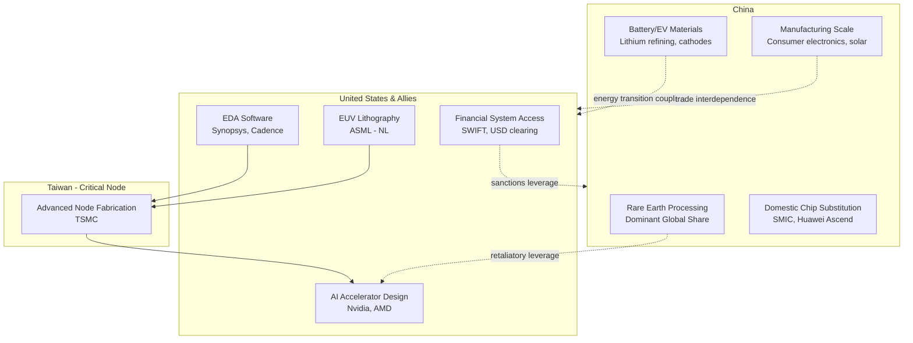

## The US-China Strategic Rivalry as the Central Axis of Supply Chain Geopolitics

<syllabot_broad_topic/>

### Definition and Conceptual Framework

The US-China strategic rivalry refers to the structural, multi-decade competition between the United States and the People's Republic of China (PRC) for economic, technological, and military primacy, expressed operationally through the deliberate reconfiguration of global supply chains. Unlike classical trade disputes, this rivalry treats supply chain position — who controls chokepoints in production, logistics, and standards-setting — as a proxy for national power itself.

**Key Points**

- Supply chains have shifted from being viewed as efficiency-optimizing logistics networks to being treated as instruments of statecraft and vectors of vulnerability.
- The rivalry is asymmetric: the US leverages financial system access, alliance networks, and chokepoint technologies (e.g., EDA software, lithography); China leverages manufacturing scale, rare earth processing, and market size.
- As of 2026, the dominant operating model is not full decoupling but "selective decoupling" or "managed rivalry" — intense contestation in strategic sectors (semiconductors, AI compute) coexisting with continued deep interdependence in commodity and consumer-goods trade. [Inference — characterization of the 2026 equilibrium synthesized from multiple analyst sources; the underlying trade and policy actions are documented, but "managed rivalry" as a stable long-term state is a contested interpretation, not a settled fact.]

### Historical Trajectory

**Phase 1 — Engagement Era (1979–2016)**

Following normalization of relations and later China's 2001 WTO accession, US policy assumed that economic integration would produce political liberalization and reduce strategic conflict risk. Supply chains globalized on pure cost-efficiency logic, with China becoming the "world's factory" through comparative advantage in labor costs and, later, agglomerated industrial ecosystems.

**Phase 2 — Strategic Competition Emerges (2017–2020)**

The 2017 US National Security Strategy formally designated China a "strategic competitor." The 2018–2019 tariff war (Section 301 tariffs) marked the first large-scale use of trade policy as a geopolitical lever rather than a market-correction tool. The Phase One trade deal (2020) attempted managed rebalancing but largely failed to achieve its purchase targets.

**Phase 3 — Securitization of Supply Chains (2020–2024)**

COVID-19 exposed acute dependency risks (medical supplies, semiconductors). The US enacted the CHIPS and Science Act (2022) and expanded export controls on advanced semiconductors and semiconductor manufacturing equipment (October 2022, tightened in 2023–2024). China responded with export restrictions on gallium, germanium, and graphite, and accelerated its own semiconductor self-sufficiency drive.

**Phase 4 — Two-Track Managed Rivalry (2025–2026)**

By 2026, both sides converged on a bifurcated approach: hard contestation in dual-use and frontier-technology domains (AI compute, advanced chips, space, defense-industrial inputs) alongside continued — even rebounding — trade in less strategically sensitive categories. Washington moved from targeted sanctions to system-level constraints on advanced technology, capital, and supply chains, while China pivoted from integration on Western terms toward resilience on Chinese terms, leaning harder on state direction and industrial policy. Analysts describe this as a two-track model: competing in domains generating military advantage and long-run productivity (AI compute, semiconductors, space, defense-industrial capacity) while containing the blast radius in areas where decoupling would impose immediate economic pain, such as agriculture and energy transit. [Editorialge](https://editorialge.com/us-china-relations-2026/)[Editorialge](https://editorialge.com/us-china-relations-2026/)

Bilateral trade data through mid-2026 illustrates this volatility-within-continuity pattern: first-quarter 2026 bilateral trade volume contracted sharply by 18.7%, a decline initially celebrated by decoupling proponents, before rebounding strongly in the second quarter with 13.7% growth, with China's June exports to the US rising 14% year-on-year and US exports to China surging 26%. As of mid-2026, the relationship is best described by many analysts as a "tactical truce" — a state of managed friction where both nations maintain aggressive competitive postures while avoiding total economic decoupling, with the US continuing Section 301 tariffs on roughly $300 billion of Chinese imports. [Substack](https://thinkbrics.substack.com/p/no-short-term-decoupling-between)[FreightAmigo](https://www.freightamigo.com/en/blog/logistics/us-china-trade-deal-2026-supply-chain/)

### The Central Battlegrounds

#### 1. Semiconductors and Advanced Computing

The semiconductor standoff refers to the strategic competition between the United States and China over control of advanced chip technology, which has become the central battleground in broader technological and geopolitical rivalry — beginning with October 2022 export controls restricting sales of advanced chips and manufacturing equipment to China, an effort that has since escalated into comprehensive decoupling in this domain. China is targeting roughly $29 billion of investment in 2026 and $50 billion by 2030 for semiconductor self-sufficiency. [Informed Clearly](https://informedclearly.com/en/trade-war/45241/us-china-semiconductor-decoupling-supply-chains-2025)[Informed Clearly](https://informedclearly.com/en/trade-war/45241/us-china-semiconductor-decoupling-supply-chains-2025)

Key chokepoints:

- **Upstream**: EUV/DUV lithography (ASML, Netherlands), EDA software (Synopsys, Cadence — both US-controlled), advanced fabrication (TSMC, Taiwan).
- **Downstream**: AI accelerator design (Nvidia, AMD) versus China's domestic substitution efforts (SMIC, Huawei Ascend).
- **Materials**: Rare earths, gallium, germanium — Chinese near-monopoly on processing (not necessarily raw extraction).

#### 2. Rare Earths and Critical Minerals

China controls a dominant share of global rare-earth *processing* capacity (distinct from mining), giving it a credible retaliatory lever against Western export controls. This has driven US/allied efforts toward "friend-shoring" of processing capacity (Australia, Canada, allied refining investment) and strategic stockpiling.

#### 3. Taiwan and the Silicon Chokepoint

Taiwan's TSMC produces the overwhelming majority of the world's most advanced logic chips. Taiwan's geopolitical status is therefore inseparable from supply chain security calculus — a cross-strait contingency is widely modeled as the single highest-impact supply chain shock scenario in contemporary risk analysis. [Inference — the severity ranking of a Taiwan contingency relative to other shocks reflects analyst consensus rather than a quantifiable, agreed-upon metric.]

#### 4. Trade Route and Logistics Realignment

Trade is thawing in specific categories like soybeans and metals following high-level diplomatic engagement, while the technology war over AI chips and export controls continues hardening in parallel — a bifurcation that is cooperative in commodities but adversarial in strategic technology. This is creating what some analysts describe as the most significant supply chain relocation opportunity of the decade, with countries from Vietnam to Mexico to India competing for capacity that multinationals are moving out of China. [The Economy](https://economy.com.pk/us-china-trade-competition-2026-supply-chain-relocation-guide/)[The Economy](https://economy.com.pk/us-china-trade-competition-2026-supply-chain-relocation-guide/)

#### 5. Energy Transition Supply Chains

Commodity rivalry is easier to miss than technology rivalry until prices move; the energy storage boom has been strengthening lithium demand, linking geopolitics directly to the energy transition supply chain (materials, storage, grid gear). This creates a structural paradox: decoupling in AI/chips can coexist with — or even be undercut by — continued tight coupling through battery and grid-technology supply chains, since China dominates lithium refining, battery-grade material processing, and solar-panel manufacturing. [Editorialge](https://editorialge.com/us-china-relations-2026/)

### Strategic Frameworks Used by Analysts

| Framework | Description |
| --- | --- |
| **De-risking** | EU/US terminology distinguishing targeted reduction of critical dependencies from wholesale decoupling |
| **Friend-shoring** | Relocating supply chains to politically aligned or allied countries rather than lowest-cost countries |
| **Nearshoring/Reshoring** | Relocating production closer to end markets (e.g., Mexico for US manufacturing) |
| **Small yard, high fence** | US doctrine of narrowly scoping export controls to a small set of critical technologies but enforcing them strictly |
| **Dual circulation** | China's strategy of strengthening domestic consumption/production while remaining selectively engaged with external markets |

### Illustrative Diagram: Chokepoint Map of the Rivalry

### SVG Illustration: Two-Track Rivalry Model (svg_diagram)

<svg viewBox="0 0 800 420" xmlns="http://www.w3.org/2000/svg">
<text x="400" y="30" text-anchor="middle" font-size="18" font-weight="bold" fill="#1a1a2e">Two-Track Rivalry Model (svg_diagram)</text>
<rect x="40" y="60" width="330" height="320" rx="10" fill="#fde2e1" stroke="#c0392b" stroke-width="2"/>
<text x="205" y="90" text-anchor="middle" font-size="15" font-weight="bold" fill="#c0392b">Track 1: Hard Contestation</text>
<text x="60" y="120" font-size="12" fill="#333">- Advanced semiconductors</text>
<text x="60" y="145" font-size="12" fill="#333">- AI compute / accelerators</text>
<text x="60" y="170" font-size="12" fill="#333">- Semiconductor manufacturing</text>
<text x="60" y="195" font-size="12" fill="#333"> equipment (lithography, EDA)</text>
<text x="60" y="220" font-size="12" fill="#333">- Space & defense-industrial</text>
<text x="60" y="245" font-size="12" fill="#333"> capacity</text>
<text x="60" y="280" font-size="12" font-style="italic" fill="#7a1f1f">Logic: military advantage +</text>
<text x="60" y="300" font-size="12" font-style="italic" fill="#7a1f1f">long-run productivity</text>
<text x="60" y="340" font-size="12" fill="#333">Tools: export controls,</text>
<text x="60" y="360" font-size="12" fill="#333">entity lists, investment screening</text>
<rect x="430" y="60" width="330" height="320" rx="10" fill="#e2f0d9" stroke="#4a7c2f" stroke-width="2"/>
<text x="595" y="90" text-anchor="middle" font-size="15" font-weight="bold" fill="#4a7c2f">Track 2: Contained Interdependence</text>
<text x="450" y="120" font-size="12" fill="#333">- Agriculture (soybeans, grain)</text>
<text x="450" y="145" font-size="12" fill="#333">- Energy transit &amp; commodities</text>
<text x="450" y="170" font-size="12" fill="#333">- Consumer goods manufacturing</text>
<text x="450" y="195" font-size="12" fill="#333">- Energy transition materials</text>
<text x="450" y="220" font-size="12" fill="#333"> (lithium, batteries, solar)</text>
<text x="450" y="245" font-size="12" fill="#333">- Metals &amp; industrial components</text>
<text x="450" y="280" font-size="12" font-style="italic" fill="#2f5720">Logic: avoid immediate</text>
<text x="450" y="300" font-size="12" font-style="italic" fill="#2f5720">economic pain / mutual harm</text>
<text x="450" y="340" font-size="12" fill="#333">Tools: tariffs (managed),</text>
<text x="450" y="360" font-size="12" fill="#333">diplomatic thaw, negotiated quotas</text>
<line x1="370" y1="220" x2="430" y2="220" stroke="#555" stroke-width="2" stroke-dasharray="5,5"/>
<text x="400" y="210" text-anchor="middle" font-size="11" fill="#555">tension</text>
</svg>

### Practical Example: Corporate Response Pattern

A multinational electronics manufacturer historically sourcing 80% of components from China might adopt a "China+1" strategy:

1. Retain low-risk, high-volume assembly in China (consumer goods track).
2. Relocate final assembly of products with any potential dual-use classification to Vietnam, Mexico, or India.
3. Dual-source critical semiconductors from both a US/allied fab (TSMC, Samsung) and, where legally permissible, maintain contingency relationships elsewhere.
4. Conduct entity-list and export-control compliance screening on every supplier tier, not just Tier 1, since indirect exposure through sub-suppliers is a common compliance failure point. [Inference — this is a standard risk-management practice recommended across supply chain literature, not a documented single-case study.]

**Example**

A firm producing industrial sensors that contain a US-origin controlled chip cannot re-export that finished product to a Chinese military-linked end-user without a license, even if final assembly occurs in a third country — illustrating how US export control jurisdiction extends extraterritorially via the *de minimis* and Foreign Direct Product Rule mechanisms.

### Risk Typology for Supply Chain Managers

- **Tariff risk**: Section 301-style tariffs remain a persistent cost variable rather than a one-time shock. The U.S. continues to maintain Section 301 tariffs on approximately $300 billion of Chinese imports as of mid-2026. [FreightAmigo](https://www.freightamigo.com/en/blog/logistics/us-china-trade-deal-2026-supply-chain/)
- **Export control risk**: Sudden entity-list additions or expanded controls on dual-use goods (chips, chip-making tools, certain chemicals).
- **Retaliatory chokepoint risk**: Chinese export restrictions on critical minerals (gallium, germanium, graphite, rare earths) used as leverage.
- **Contingency/kinetic risk**: A Taiwan Strait crisis remains the tail-risk scenario with the highest potential for global semiconductor supply disruption.
- **Regulatory fragmentation risk**: Divergent standards (data localization, AI governance, ESG) increasing compliance overhead for firms operating in both jurisdictions.

**Conclusion**

The US-China strategic rivalry functions as the organizing axis around which contemporary supply chain geopolitics revolves because it simultaneously determines (a) which technologies are treated as strategic assets subject to control, (b) which countries benefit from diversification flows, and (c) how firms must architect resilience against both economic and kinetic disruption scenarios. The empirical record through 2026 shows this rivalry does not resolve into clean decoupling but instead produces a persistently bifurcated system — hardening in frontier technology, resilient in commodity and consumer trade — that supply chain professionals must model as a durable structural condition rather than a transitional phase. [Inference — durability assessment; actual future trajectory remains dependent on unresolved variables including Taiwan-strait stability and domestic political shifts in both countries.]

**Related Topics**

- Export control regimes: Entity List, Foreign Direct Product Rule, and extraterritorial jurisdiction
- The CHIPS and Science Act and allied semiconductor industrial policy (EU Chips Act, Japan, South Korea)
- Rare earth and critical mineral supply chain diversification strategies
- Taiwan Strait contingency planning and semiconductor supply chain risk modeling
- Friend-shoring vs. nearshoring: comparative case studies (Vietnam, Mexico, India)
- China's Belt and Road Initiative as a counter-supply-chain strategy
- Sanctions and financial system chokepoints (SWIFT, dollar clearing) as geopolitical tools
- The role of multilateral institutions (WTO, G7) in mediating great-power supply chain competition