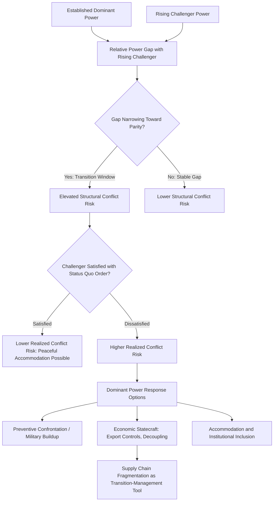

## The Thucydides Trap and Power Transition Theory

### Overview

Power transition theory and the "Thucydides Trap" thesis together constitute the dominant framework in contemporary international relations for analyzing the structural conflict risk generated when a rising challenger power approaches parity with, or threatens to surpass, an established dominant power. While frequently discussed together in contemporary policy and supply chain geopolitics discourse — particularly regarding US-China relations — the two frameworks have distinct intellectual origins and different levels of theoretical formality: power transition theory is a systematically developed, empirically tested body of academic IR scholarship dating to the 1950s, while the "Thucydides Trap" is a more recent, historically evocative framing popularized by Graham Allison that draws on power transition theory's core logic while packaging it for broader policy and public audiences. Both frameworks are directly relevant to supply chain geopolitics because they provide the conflict-risk backdrop against which contemporary decoupling, de-risking, and strategic technology competition are frequently justified and analyzed.

### Power Transition Theory: Origins and Core Claims

**A.F.K. Organski and the Foundational Formulation**

Power transition theory originates with political scientist A.F.K. Organski's 1958 work *World Politics*, later substantially elaborated with Jacek Kugler in *The War Ledger* (1980). Organski explicitly positioned the theory as a direct challenge to the then-dominant balance-of-power tradition within realism, which held that rough parity between great powers promotes peace (since neither side can be confident of victory) while power preponderance by a single state increases war risk (since the dominant power lacks restraint). Power transition theory inverts this logic.

**The Core Causal Claim: Transitions, Not Parity, Are Dangerous**

Organski's central proposition is that international conflict is most likely not when power is unevenly distributed in favor of a dominant state, and not simply when two states are at rough parity in the abstract, but specifically during the *transition period* when a rising, dissatisfied challenger approaches and potentially overtakes a declining or plateauing dominant power. The theory identifies this transition window as uniquely dangerous because it activates two distinct dynamics: the rising power, no longer content with its previously subordinate position in the existing international order, seeks to revise rules and institutions established under the dominant power's leadership to better reflect the rising power's own interests and status; and the dominant power, recognizing its relative decline, faces incentives to either accommodate the rising challenger's demands or resist through preventive confrontation before the power gap closes further.

**Satisfaction with the Status Quo as a Critical Variable**

A crucial refinement in power transition theory, distinguishing it from simpler structural determinism, is that transition danger depends significantly on whether the rising power is "satisfied" or "dissatisfied" with the existing international order and its own status within it. A rising power that is broadly satisfied with existing rules, institutions, and its own position (Organski and Kugler cite West Germany and Japan's post-WWII rise within the US-led order as examples) is theorized to pose substantially lower conflict risk than a rising power that perceives the existing order as fundamentally unfair, exclusionary, or contrary to its interests — making the *character* of the rising power's grievances, not merely the raw fact of its rising capability, a central analytical variable.

**Empirical Testing and the "Power Cycle" Refinement**

Subsequent scholarship, notably by Kugler and Douglas Lemke, and separately Charles Doran's "power cycle" theory, sought to empirically test and refine the original formulation using historical case comparisons and statistical analysis of great-power conflicts, generally finding support for the proposition that rapid, destabilizing shifts in relative power — particularly around the point of rough parity or crossover — correlate with elevated conflict risk, though the theory's precise predictive power and the specificity of the "danger zone" (how close to parity, over what time horizon) remain subjects of ongoing methodological debate.

### The Thucydides Trap: Graham Allison's Popularization

**Origin of the Term**

Graham Allison, a Harvard political scientist, popularized the term "Thucydides Trap" in a series of articles beginning around 2012 and most comprehensively in his 2017 book *Destined for War: Can America and China Escape Thucydides's Trap?* The term draws directly on the ancient Greek historian Thucydides's account of the Peloponnesian War, specifically his observation that the war's underlying cause was the growth of Athenian power and the fear this instilled in Sparta — Allison uses this as the archetypal historical case of the same dynamic power transition theory formalizes: a rising power (Athens) and the fear it generates in an established power (Sparta) creating structural pressure toward conflict, largely independent of the specific immediate disputes that trigger any given crisis.

**The Applied Historical Case Study**

Allison and his research team at Harvard's Belfer Center conducted a review of sixteen historical cases over roughly the past 500 years in which a rising power threatened to displace a ruling power, finding that twelve of these sixteen cases ended in war, while four did not — a finding Allison uses to argue that the underlying structural dynamic of power transition carries substantial, though not deterministic, war risk, while the four peaceful cases (including the US displacing Britain as the dominant global economic power in the late 19th/early 20th century, and the peaceful end of the Cold War) are presented as evidence that the trap, while dangerous, is not inescapable with sufficiently skillful statecraft.

**Direct Application to US-China Relations**

Allison's explicit and primary contemporary application is to US-China relations, arguing that China's rapid economic, military, and technological rise relative to an established US-led order creates precisely the structural conditions power transition theory identifies as historically most dangerous, and that avoiding war requires deliberate, sustained statecraft attentive to the historical pattern rather than assuming economic interdependence or nuclear deterrence alone will automatically prevent conflict — a direct challenge to more optimistic liberal-institutionalist readings of US-China economic entanglement as inherently stabilizing.

### Relevance to Supply Chain Geopolitics

**Technology Competition as a Transition-Era Battleground**

Both frameworks provide the strategic backdrop against which contemporary semiconductor, artificial intelligence, and advanced manufacturing competition between the US and China are frequently analyzed: technological capability is understood not merely as an economic variable but as a core component of the relative power calculation power transition theory identifies as the central driver of transition-era conflict risk, making supply chain chokepoints in these sectors simultaneously economic assets and strategic transition-management instruments.

**Preventive Economic Statecraft as Transition Management**

Contemporary US export controls, investment screening, and industrial policy directed at maintaining or widening the US-China technological capability gap can be analyzed through power transition theory's lens as a form of "preventive" strategic behavior — using economic rather than military instruments to slow a rising challenger's capability growth during the transition window, a less costly and less escalatory analog to the historical pattern of preventive war that power transition theory identifies as one (though not the only) historical response to transition dynamics.

**Decoupling and Reduced Interdependence as Both Symptom and Response**

[Inference] Supply chain decoupling and "de-risking" can be read simultaneously as a symptom of intensifying transition-era competition (as both sides seek to reduce mutual vulnerability in anticipation of potential future conflict) and as a strategic choice intended to reduce the mutual-vulnerability constraints that might otherwise deter more assertive transition-management behavior by either side — a genuinely contested interpretive question among analysts, since reduced interdependence could plausibly either increase conflict risk (by removing a restraining cost) or decrease it (by reducing opportunities for coercive leverage and crisis escalation through economic channels).

### Distinguishing the Two Frameworks and Related Theories

| Framework | Formality/Origin | Core Claim | Relationship |
| --- | --- | --- | --- |
| Power Transition Theory (Organski) | Formal academic IR theory, 1958 onward | Conflict risk peaks during rising-challenger transitions, moderated by challenger satisfaction with status quo | — |
| Thucydides Trap (Allison) | Popularized historical framing, 2012 onward | Historical pattern (12 of 16 cases ending in war) illustrates structural transition danger; used to warn against complacency in US-China relations | Draws directly on and popularizes power transition theory's core logic for policy audiences |
| Hegemonic Stability Theory (Kindleberger/Gilpin) | Formal IPE theory | Focuses on economic order stability requiring hegemonic public-goods provision, rather than primarily on war risk | Complementary — HST explains economic order consequences of the same hegemonic decline power transition theory analyzes for conflict risk |
| Classical Balance-of-Power Realism | Foundational realist tradition | Parity promotes peace; preponderance increases war risk | Directly inverted by power transition theory's claim that transitions, not static parity, are most dangerous |
| Offensive Realism (Mearsheimer) | Structural realist theory | Great powers inherently seek regional/global hegemony, generating persistent competition | Compatible and complementary — offensive realism explains rising-power motivation; power transition theory specifies the timing of peak danger |

### Analytical Framework Diagram

### Empirical Illustrations

**Case: Anglo-German Naval Rivalry Preceding World War I**

[Inference] The pre-WWI Anglo-German naval arms race, in which a rising Germany's naval buildup directly challenged British maritime dominance, is among the most frequently cited power-transition case studies, illustrating both the structural dynamic (rising challenger capability growth generating established-power anxiety) and the dissatisfaction variable (German perception that the existing British-dominated international order inadequately reflected Germany's growing industrial and military weight), though historians continue to debate the relative weight of this structural dynamic against other contributing causes of WWI's outbreak.

**Case: The Peaceful Anglo-American Transition**

The United States' displacement of Britain as the world's largest economy in the late 19th century, and subsequent assumption of global hegemonic leadership after 1945, is Allison's primary example of a transition managed without direct war between the rising and declining powers — attributed by various analysts to shared cultural and political affinity, deep economic integration, and Britain's own strategic choice to accommodate rather than resist American rise, offering a contested but influential model for how the contemporary US-China transition might potentially be managed.

**Case: Cold War Transition and Peaceful Resolution**

[Inference] The peaceful conclusion of the Cold War, without direct military conflict between the US and Soviet Union despite decades of intense strategic competition, is cited by Allison as a further "escaped trap" case, though critics note the Soviet collapse arguably represents a case of unilateral relative decline and internal collapse rather than a genuine bilateral power transition in the sense Organski's theory most directly addresses, raising questions about how directly this case actually validates trap-avoidance lessons applicable to a genuinely rising (not declining) contemporary China.

### Critiques of Power Transition Theory and the Thucydides Trap

**Methodological Critique of the Sixteen-Case Sample**

Critics of Allison's *Destined for War* argue the selection and coding of the sixteen historical cases used to generate the "12 of 16 ended in war" finding involves substantial interpretive judgment (what counts as a "transition," what counts as "war," how to date the transition window) that could produce different results under alternative reasonable coding choices, a methodological concern common to small-N historical case comparison studies more broadly and one Allison's critics argue understates the genuine uncertainty in the headline statistic.

**Determinism and Agency**

Critics across both academic power transition theory and the more popular Thucydides Trap framing caution against interpretations that treat conflict as structurally inevitable given a power transition, noting that Organski's own framework explicitly incorporates the satisfaction variable and other moderating factors specifically to avoid pure structural determinism — Allison's own stated purpose in *Destined for War* is explicitly to warn against fatalism and argue that skillful statecraft can avoid the trap, a nuance sometimes lost in more alarmist popular invocations of the concept.

**Applicability to the Nuclear Era**

Some scholars argue the historical base rate derived largely from pre-nuclear-era case studies may have limited applicability to a US-China transition occurring under conditions of mutual nuclear deterrence, which did not characterize most of the historical transitions in Allison's sample — nuclear deterrence is argued by some IR scholars to fundamentally alter the risk calculus in ways that could make the contemporary US-China case a poor structural analog to earlier, pre-nuclear transitions, though other scholars counter that nuclear deterrence primarily reduces the risk of direct great-power war specifically while leaving proxy conflict, economic coercion, and crisis-escalation risks largely intact.

**Underspecification of Economic Interdependence's Net Effect**

[Inference] Critics note that neither power transition theory nor the Thucydides Trap framing fully resolves the theoretically contested question of whether deep economic interdependence (as currently exists between the US and China, notwithstanding recent decoupling trends) net increases or net decreases transition-era conflict risk — liberal institutionalist theory would predict interdependence lowers risk by raising conflict costs, while weaponized interdependence theory suggests interdependence itself can become a coercive battleground rather than a purely pacifying force, leaving this a genuinely open and consequential theoretical question for assessing the contemporary US-China case specifically.

### Practical Application: How Analysts Use This Framework

**Key Points**

- Assess not only the raw pace of relative capability convergence between a rising and established power, but specifically the rising power's degree of satisfaction or dissatisfaction with existing international rules and institutions, since this variable substantially moderates realized conflict risk according to the theory's own internal logic.
- Distinguish preventive economic statecraft (export controls, technology denial) intended to slow transition dynamics from purely defensive risk-mitigation measures (supply chain diversification for resilience), since the two carry different escalatory implications even when the underlying policy tools overlap.
- Use the historical case comparison method cautiously, explicitly acknowledging the coding and selection judgment involved, rather than treating headline statistics (such as "12 of 16 cases") as precise, uncontested probability estimates.
- Track specific institutional inclusion or exclusion signals (is the rising power being offered meaningful voice and status within existing multilateral institutions, or systematically excluded) as an observable proxy for the satisfaction variable central to the theory's risk-moderation logic.

**Example**

An analyst applying this framework to assess supply chain decoupling's strategic implications would ask: Does accelerating technological and economic decoupling primarily function as a transition-management tool intended to preserve a wider capability gap and thereby reduce transition danger (consistent with power transition theory's preventive-action logic), or does it primarily remove interdependence-based cost constraints that might otherwise moderate crisis behavior, thereby increasing realized conflict risk during an already-dangerous transition window? Are there parallel efforts toward institutional inclusion or accommodation (continued Chinese participation in multilateral forums, WTO engagement) that might offset the risk-increasing effects of economic decoupling by addressing the satisfaction variable directly?

**Next Steps**

- **Related Topics**: Realism and the primacy of state power in trade relations; hegemonic stability theory and the role of a dominant power; offensive realism (Mearsheimer) and great-power hegemonic competition; weaponized interdependence and the contested net effect of economic entanglement on conflict risk; historical case study — the Anglo-German naval rivalry and WWI origins; historical case study — the peaceful Anglo-American hegemonic transition; nuclear deterrence theory and its interaction with power transition dynamics; the "satisfaction with the status quo" variable and contemporary Chinese engagement with multilateral institutions; US-China technology competition as applied power transition case study; Graham Allison's *Destined for War* — detailed sixteen-case historical comparison methodology.