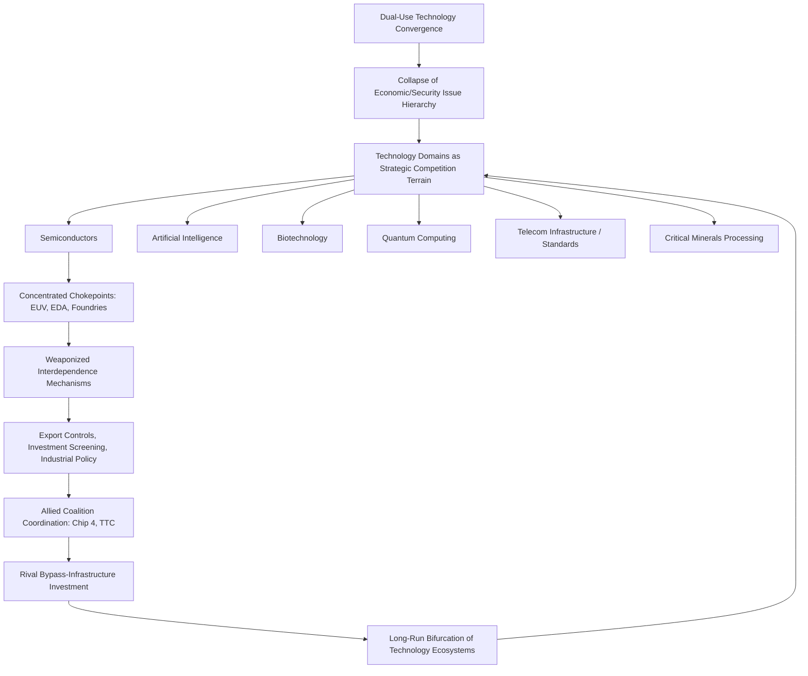

## Technology Competition as the New Terrain of Great Power Rivalry

### Overview

Technology competition has emerged as the primary domain through which contemporary great power rivalry, particularly between the United States and China, is conducted — displacing or at minimum rivaling traditional military buildup and territorial dispute as the central arena of strategic contestation. This shift reflects a convergence of several structural forces: the increasing military relevance of frontier civilian technologies (dual-use convergence), the recognition that long-run economic and military power increasingly derive from control over advanced computation, data, and manufacturing capability rather than from traditional industrial or resource endowments, and the fact that key technology chokepoints (advanced semiconductor fabrication, artificial intelligence model training infrastructure, critical mineral processing) are geographically concentrated in ways that make them directly analyzable through the same structural-power and network-topology frameworks developed for traditional supply chain geopolitics. This item synthesizes the preceding theoretical frameworks — realism, weaponized interdependence, geoeconomics, GVC governance, and power transition theory — as they apply specifically to the technology domain.

### Why Technology Has Become the Central Battleground

**Dual-Use Convergence**

A defining feature of the contemporary technology competition is the erosion of any clean distinction between civilian and military technology. Advanced semiconductors, artificial intelligence systems, quantum computing research, biotechnology, and advanced manufacturing capabilities all carry direct military applicability (precision targeting, autonomous systems, cryptography, surveillance, logistics optimization, and next-generation weapons design) even when developed and initially deployed for purely commercial purposes. This dual-use convergence means that commercial technology competition — semiconductor market share, AI model capability, 5G/6G infrastructure standards — is simultaneously and inescapably a security competition, collapsing the traditional realist distinction between "low politics" (economic) and "high politics" (security) issue areas that complex interdependence theory identified as already eroding.

**Compounding and Cumulative Advantage Dynamics**

Unlike some traditional resource-based sources of national power, advanced technology capability — particularly in semiconductors and artificial intelligence — exhibits strong cumulative and compounding characteristics: leading-edge chip manufacturing capability enables more capable AI systems, which in turn generate revenue and strategic advantage that fund further R&D and manufacturing investment, creating potential winner-take-most dynamics that make early leads in critical technology domains disproportionately valuable relative to more linear, substitutable sources of national power such as raw material access.

**Concentrated Chokepoints Enabling Structural Leverage**

As established in the discussion of weaponized interdependence theory, the technology supply chain (particularly semiconductors) exhibits extreme hub-and-spoke concentration — EUV lithography (ASML, effectively monopolistic), leading-edge fabrication (TSMC, dominant share), and chip design software (a US-dominated oligopoly of Synopsys, Cadence, and Siemens EDA) — creating precisely the kind of concentrated, jurisdiction-controllable chokepoints that generate outsized coercive potential relative to more distributed traditional industrial sectors, making technology competition unusually amenable to geoeconomic instrumentalization.

### Key Domains of Contemporary Technology Competition

**Semiconductors**

The most mature and heavily instrumentalized domain of technology competition, encompassing chip design (EDA software, architecture IP such as ARM and RISC-V), manufacturing equipment (lithography, etching, deposition tools), fabrication capacity (foundries, predominantly TSMC and Samsung for leading-edge nodes), and packaging/testing. US export controls restricting Chinese access to advanced chips and chip-manufacturing equipment, coordinated with allied restrictions from the Netherlands (ASML) and Japan, represent the most extensively developed and precedent-setting instance of technology-domain economic statecraft, directly informing the Blackwill-Harris geoeconomic toolkit and Farrell-Newman's weaponized interdependence chokepoint mechanism.

**Artificial Intelligence**

Increasingly treated as a distinct and possibly even more strategically consequential competition domain than semiconductors themselves (though heavily dependent on semiconductor access for compute infrastructure), AI competition encompasses foundation model development, compute infrastructure (data centers, specialized AI accelerator chips), training data access, and algorithmic talent. US export controls on advanced AI chips (Nvidia's China-specific, deliberately performance-capped chip variants such as the H20 and its successors, and subsequent tightening of even these restricted variants) illustrate the extension of semiconductor-domain chokepoint logic directly into the AI competition, while China's DeepSeek and other domestic model development efforts represent a contested test case for whether compute restrictions can durably constrain frontier AI capability or merely shift development toward more compute-efficient approaches.

**Biotechnology**

An increasingly prominent competition domain encompassing genomic sequencing capability, synthetic biology, pharmaceutical manufacturing (including active pharmaceutical ingredient production, heavily concentrated in China and India), and biosecurity-relevant research — raising distinct supply chain vulnerability concerns given global pharmaceutical supply chain dependency on Chinese and Indian API manufacturing, alongside dual-use biosecurity concerns regarding synthetic biology capability diffusion.

**Quantum Computing and Quantum Communications**

A longer-horizon but strategically significant domain given quantum computing's potential to eventually break current public-key cryptographic standards (with direct implications for financial system and communications security) and quantum communication's potential for theoretically unbreakable encrypted channels — both the US and China have made substantial public quantum-research investment commitments, with the competition currently centered more on fundamental research capability and talent than on mature, deployable chokepoint infrastructure.

**Telecommunications Infrastructure (5G/6G) and Standards-Setting**

The earlier (roughly 2018–2020) phase of US-China technology competition centered substantially on 5G infrastructure, particularly restrictions on Huawei and ZTE equipment in Western telecommunications networks over espionage and infrastructure-control concerns, and on influence over international technical standards-setting bodies (the International Telecommunication Union and 3GPP) that determine baseline global technology specifications — a domain illustrating that technology competition extends beyond hardware chokepoints to encompass the rule-making and standards infrastructure that Susan Strange's knowledge-structure concept directly anticipates.

**Critical Minerals and Materials Processing**

While not "technology" in the narrow sense, critical mineral processing (rare earth elements, lithium, cobalt, gallium, germanium) constitutes essential upstream input to virtually all frontier technology domains (semiconductors, batteries, permanent magnets for advanced motors and defense systems), and China's dominant position in processing and refining capacity (as distinct from raw material extraction, which is more geographically dispersed) constitutes a chokepoint China has directly weaponized in response to Western semiconductor export controls, illustrating the tightly interlinked nature of contemporary technology-domain economic statecraft across multiple sectors simultaneously.

### The Instrument Toolkit Applied to Technology Competition

Applying Blackwill and Harris's geoeconomic instrument taxonomy specifically to the technology domain:

- **Export controls**: The primary negative-sanction instrument, restricting outbound flow of technology, equipment, and technical knowledge to strategic rivals (US Entity List, Foreign Direct Product Rule expansions).
- **Inbound investment screening**: CFIUS review of foreign (particularly Chinese) investment in US technology firms, and equivalent mechanisms across allied states, restricting a rival's ability to acquire strategic technology capability through acquisition.
- **Outbound investment screening**: A more novel instrument, restricting domestic capital and expertise from flowing into a rival's strategic technology sectors even without direct export of controlled goods — the US outbound investment screening regime targeting semiconductor, AI, and quantum investment in China represents a significant instrument-toolkit expansion since roughly 2023.
- **Industrial policy and subsidy**: Positive-sanction/inducement instruments (CHIPS and Science Act, EU Chips Act, Japan's semiconductor subsidy programs) intended to build domestic and allied-territory technology manufacturing capacity, reducing long-run dependency on potentially contestable foreign chokepoints.
- **Talent and immigration policy**: Visa and immigration policy adjustments intended to attract or restrict the flow of specialized technical talent, an increasingly recognized instrument given the centrality of human capital to frontier AI and semiconductor R&D.
- **Allied coalition-building**: The Chip 4 alliance (US, Japan, South Korea, Taiwan) and the US-EU Trade and Technology Council represent minilateral institution-building specifically intended to coordinate technology-domain restrictions and standards across multiple jurisdictions simultaneously, addressing the chokepoint-diffusion problem (a single-jurisdiction control point can be bypassed via allied-jurisdiction suppliers absent coordination).

### Analytical Framework Diagram

### Empirical Illustrations

**Case: The Compounding Escalation of US Semiconductor Export Controls, 2018–2025**

The progression from initial, narrowly targeted restrictions on specific firms (Huawei, ZTE, beginning around 2018–2019) to comprehensive, capability-threshold-based export controls affecting entire categories of advanced logic chips, memory, and manufacturing equipment (October 2022 controls and subsequent expansions through 2023–2025) illustrates the escalatory dynamic technology competition can generate — each round of restriction prompting adaptation (Chinese domestic capability investment, restricted-but-still-functional chip variants such as Nvidia's China-specific offerings) followed by further restriction tightening in response to perceived circumvention.

**Case: DeepSeek and the Compute-Efficiency Response to Restriction**

[Inference] The emergence of Chinese AI developer DeepSeek's efficient model training approaches in early 2025, reportedly achieving competitive model capability with substantially less computational resources than assumed necessary by prevailing Western development approaches, is widely interpreted as at least partial evidence that compute-access restrictions can incentivize algorithmic and efficiency innovation that partially circumvents the intended constraining effect of hardware-focused export controls, though the degree to which this reflects genuine circumvention versus independent efficiency innovation, and its full implications for long-run AI competition dynamics, remains an actively contested and evolving assessment among technical and policy analysts.

**Case: CHIPS and Science Act as Coalition-Anchoring Industrial Policy**

The 2022 US CHIPS and Science Act, alongside parallel EU, Japanese, and South Korean semiconductor subsidy programs, illustrates coordinated allied industrial policy intended not merely to build domestic capacity but to anchor and deepen the "friend-shored" technology ecosystem that underlies coordinated export control enforcement — domestic capacity-building and coalition-based restriction are, in the Blackwill-Harris framework, complementary rather than independent instruments.

### Critiques and Open Debates

**Risk of Self-Fulfilling Escalation**

[Inference] Some analysts, drawing on power transition theory's caution against treating structural competition as deterministic, argue that framing technology competition in maximally zero-sum, existential terms risks becoming self-fulfilling — accelerating exactly the kind of comprehensive bifurcation and mutual technology-denial spiral that reduces overall global innovation capacity and increases crisis-escalation risk, a critique paralleling liberal institutionalist concerns about the erosion of the interdependence-based restraints Keohane and Nye identified as historically moderating great-power conflict.

**Uncertain Effectiveness of Restriction-Based Strategies**

Applying David Baldwin's methodological caution directly, the actual effectiveness of technology-restriction strategies in durably widening rather than merely temporarily slowing a rival's capability growth remains genuinely contested and empirically difficult to assess with confidence, particularly given the DeepSeek case's suggestion that restriction can incentivize compensating innovation rather than simply halting progress.

**Fragmentation Costs and Global Innovation Ecosystem Effects**

Critics from a more liberal-institutionalist perspective argue that bifurcating global technology ecosystems (separate, non-interoperable standards, supply chains, and research communities) imposes substantial efficiency costs on the global innovation system as a whole, potentially slowing beneficial technology diffusion (including for climate-relevant and health-relevant technology) as a side effect of great-power competitive dynamics, a cost-benefit tradeoff not always fully accounted for in competition-focused policy framing.

**Definitional Ambiguity of "Strategic" Technology**

[Inference] The rapid expansion of export control and investment screening scope — from narrowly defined military-relevant technology toward increasingly broad categories of advanced computing, AI, and even certain biotechnology and quantum research — raises open questions about where the boundary of "strategic" technology should reasonably be drawn, with some analysts cautioning that overly expansive definitions risk both diminishing returns (restricting technology with limited genuine military relevance) and accelerating unnecessary escalation.

### Practical Application: How Analysts Use This Framework

**Key Points**

- Assess any given technology domain along the dual-use convergence spectrum — the degree of direct military applicability substantially shapes how readily commercial competition in that domain will be securitized and subjected to geoeconomic instrumentalization.
- Map chokepoint concentration within each technology domain using weaponized interdependence's network-topology approach, since domains with concentrated, jurisdiction-controllable hubs (semiconductors) are structurally more amenable to coercive instrumentalization than more distributed domains.
- Apply Baldwin's effectiveness-evaluation standard when assessing restriction-based technology strategies, explicitly considering realistic alternatives and multiple objectives rather than judging success solely by whether a rival's capability growth is fully halted.
- Track allied coalition coordination breadth and depth as a leading indicator of restriction durability, since single-jurisdiction restrictions on globally sourced technology inputs are generally more easily circumvented than coordinated multi-jurisdiction restrictions.

**Example**

An analyst assessing long-run strategic risk for a firm operating across multiple technology domains would evaluate each domain separately along these dimensions: degree of dual-use military relevance (shaping securitization likelihood), chokepoint concentration and jurisdictional control (shaping restriction feasibility), current allied-coalition coordination status (shaping restriction durability), and observed rival-state adaptation/bypass investment (shaping the domain's long-run competitive trajectory) — producing a differentiated risk map rather than treating "technology competition" as a single undifferentiated strategic variable across semiconductors, AI, biotechnology, and telecommunications simultaneously.

**Next Steps**

- **Related Topics**: Farrell and Newman's theory of weaponized interdependence (direct chokepoint mechanism); Blackwill and Harris and the modern framework for geoeconomics (instrument taxonomy); David Baldwin and the theory of economic statecraft (effectiveness evaluation methodology); the Thucydides Trap and power transition theory (structural competition backdrop); global value chain governance theory applied to semiconductor and AI compute supply chains; the CHIPS and Science Act and allied industrial policy coordination; export control escalation dynamics — Entity List and Foreign Direct Product Rule case study; artificial intelligence compute governance and the DeepSeek case study; critical minerals processing as a Chinese counter-leverage instrument; standards-setting bodies (3GPP, ITU) as contested technology-governance terrain.