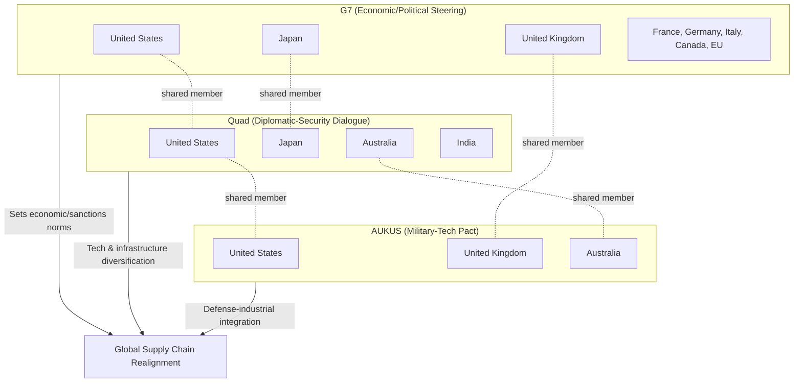

## Alliance Architecture: The G7, the Quad, and AUKUS

### Overview

Alliance architecture refers to the layered network of formal and informal security, economic, and diplomatic groupings that democratic powers use to coordinate policy toward strategic competitors — principally China and Russia — without forming a single monolithic bloc. The G7, the Quad, and AUKUS represent three distinct tiers of this architecture, differentiated by membership, institutional depth, and function: economic-normative coordination, diplomatic-security dialogue, and hard military-technology integration, respectively. Their supply chain relevance stems from their overlapping use as vehicles for "friend-shoring," critical minerals cooperation, semiconductor export controls, and technology-transfer restriction.

### Comparative Structure

| Grouping | Founded | Members | Core Character | Formal Treaty? |
| --- | --- | --- | --- | --- |
| G7 | 1975 | US, UK, France, Germany, Italy, Japan, Canada (+EU) | Economic/political steering group | No |
| Quad | 2007 (revived 2017) | US, Japan, India, Australia | Diplomatic-security dialogue | No |
| AUKUS | 2021 | Australia, UK, US | Military-technology pact | No (executive agreements) |

None of the three is a mutual-defense treaty organization in the NATO sense. This is a deliberate design choice: each avoids the legal and political weight of a formal alliance treaty while still enabling deep coordination, which allows members (especially India, a non-aligned Quad member) to participate without binding collective-defense obligations.

### The G7

**Key Points**

- Originated as the G6 in 1975 (finance-focused response to the oil shocks and Bretton Woods collapse), became G7 with Canada's addition in 1976; Russia's G8 membership (1998–2014) was suspended after the annexation of Crimea.
- Functions through rotating annual presidency, leader-level summits, and a dense substructure of ministerial tracks (finance, foreign affairs, trade, digital, climate/energy, health).
- Has no permanent secretariat or charter; coordination relies on the host nation's "sherpa" system and communiqué-based consensus.
- Since 2022, the G7 has become the primary venue for coordinating sanctions regimes against Russia and export-control alignment against China, functioning as a de facto steering committee for the broader G7+ (adding EU, sometimes Australia/South Korea) sanctions coalition.

**Supply Chain Relevance**

- **Coordinated Sanctions Enforcement**: G7 members synchronize export-control lists (e.g., dual-use goods, advanced semiconductor equipment) to prevent circumvention through non-participating jurisdictions.
- **Critical Minerals Security**: The 2023 G7 Critical Minerals Security Initiative and Hiroshima Action Plan for Resilient Supply Chains address dependency on China for rare earths, lithium, and battery-grade nickel.
- **De-risking, not decoupling**: The G7's 2023 formal adoption of "de-risking" language (rather than "decoupling") from China signaled a calibrated approach — reducing critical dependencies in strategic sectors while preserving broader trade.

[Inference] The G7's influence on supply chains operates primarily through soft coordination and political signaling rather than binding enforcement mechanisms; actual implementation depends on each member's domestic legal instruments (e.g., US CHIPS Act, EU Critical Raw Materials Act).

### The Quad (Quadrilateral Security Dialogue)

**Key Points**

- First convened in 2007 following the 2004 Indian Ocean tsunami relief coordination ("Tsunami Core Group"); dormant after Australia's 2008 withdrawal amid concerns over provoking China; revived in 2017 amid rising China-India border tensions and Belt and Road Initiative expansion.
- Elevated to leader-level summits starting 2021 (virtual) and 2021 in-person (Washington), reflecting increased institutional weight.
- Explicitly framed by members as **not** a military alliance or "Asian NATO" — a framing India in particular insists on, given its strategic autonomy tradition and continued defense ties with Russia.
- Organized around working groups: vaccines, critical and emerging technology, infrastructure, cybersecurity, space, and — most relevant to supply chains — the **Quad Critical and Emerging Technology (CET) Supply Chain Initiative**.

**Supply Chain Relevance**

- **Semiconductor Supply Chain Mapping**: The Quad's 2021-launched semiconductor supply chain initiative maps vulnerabilities across design, fabrication, and assembly/test stages among the four members, aiming to diversify away from single points of failure (notably Taiwan concentration risk and Chinese input dependency).
- **Undersea Cable Resilience**: The Quad Partnership for Cable Connectivity and Resilience (2023) addresses physical infrastructure supply chains for digital connectivity in the Indo-Pacific.
- **Open RAN and Telecom Diversification**: Coordination on Open Radio Access Network standards functions as an implicit alternative to Huawei/ZTE-dominated telecom equipment supply chains.

[Inference] India's participation constrains how far Quad supply chain initiatives can move toward explicit anti-China alignment, since India maintains significant trade relationships with China and resists language that reads as containment.

### AUKUS

**Key Points**

- Announced September 2021: a trilateral security partnership between Australia, the UK, and the US.
- **Pillar I**: Delivery of nuclear-powered (not nuclear-armed) submarines to Australia — via interim US Virginia-class transfers in the early 2030s, followed by the jointly developed SSN-AUKUS design built in Australia and the UK.
- **Pillar II**: Advanced capability-sharing across AI, quantum computing, hypersonics, cyber, electronic warfare, and undersea capabilities — this pillar is the one most directly tied to technology and supply chain integration.
- Triggered the collapse of Australia's prior $65 billion diesel-electric submarine contract with France (Naval Group), causing a significant diplomatic rupture with Paris.
- Requires substantial changes to US arms-export law (ITAR) to permit the technology sharing involved; the 2023 National Defense Authorization Act included AUKUS-specific export-control carve-outs.

**Supply Chain Relevance**

- **Defense-Industrial Base Integration**: AUKUS requires trilateral integration of submarine construction supply chains — including specialty steel, nuclear-reactor components, and a skilled workforce pipeline — across Adelaide (Australia), Barrow-in-Furness (UK), and Groton/Newport News (US) shipyards.
- **Export Control Harmonization**: Pillar II depends on loosening ITAR and UK export-control friction between the three states to allow shared R&D supply chains for sensitive dual-use technology.
- **Rare Earths and Specialty Materials**: Submarine reactors and advanced systems require specific alloys and rare-earth-dependent components, linking AUKUS indirectly to the broader critical-minerals diversification push shared with the Quad and G7.

[Speculation] Given the scale of workforce, dockyard capacity, and nuclear-regulatory buildout required, some analysts question whether the Pillar I submarine delivery timeline (first Virginia-class transfer c. 2032–2033) is achievable without schedule slippage; this remains contested among defense-industrial base experts.

### Interlocking Architecture

The overlapping membership — US in all three, UK and Japan in two — is structurally significant: it allows policy coordination to move fluidly between the economic (G7), diplomatic (Quad), and hard-security (AUKUS) tiers without requiring a single overarching institution, which would face far greater political resistance from members like India.

### Illustrative Example: Semiconductor Supply Chain Response

A composite scenario showing how the three groupings interact on one supply chain issue:

1. **G7** aligns export controls on advanced lithography equipment (building on the US, Netherlands, and Japan's 2023 coordinated restrictions on China-bound semiconductor manufacturing tools).
2. **Quad** working groups map fabrication and packaging capacity across member states to identify where diversified investment (e.g., in India's emerging semiconductor assembly sector) can reduce Taiwan-concentration risk.
3. **AUKUS** Pillar II funds joint R&D on next-generation chips for defense applications (e.g., radiation-hardened or AI-accelerator chips for submarine and autonomous systems), using export-control carve-outs unavailable to non-AUKUS partners.

This layered approach lets the same underlying strategic goal — reducing dependency on adversary-controlled or single-point-of-failure nodes — be pursued through the tier best suited to each dimension (economic policy, diplomatic coordination, or classified defense R&D).

### Points of Friction and Critique

- **France–AUKUS Rupture**: The submarine deal's cancellation strained NATO/EU-US trust and raised questions about consultation norms among allies.
- **India's Balancing Act**: India's Quad participation coexists with continued Russian defense imports and non-participation in Western sanctions on Russia, illustrating the limits of Quad cohesion.
- **ASEAN Concerns**: Southeast Asian states have expressed unease that AUKUS and an expanding Quad could accelerate regional militarization or force binary alignment choices, complicating supply chain diversification efforts that rely on ASEAN manufacturing hubs (Vietnam, Malaysia, Indonesia).
- **Non-Proliferation Debate**: China and some non-proliferation analysts have raised concerns that AUKUS's transfer of naval nuclear propulsion technology (using weapons-grade or near-weapons-grade enriched uranium) tests the boundaries of the Non-Proliferation Treaty's naval-fuel exemption. [Unverified] The precise safeguards arrangement with the IAEA remains a subject of ongoing technical negotiation rather than settled practice.

### Related Topics

- Friend-shoring and nearshoring strategies in critical supply chains
- Export control regimes: ITAR, EAR, and the Wassenaar Arrangement
- Critical minerals diplomacy and the Minerals Security Partnership
- Semiconductor geopolitics: the Taiwan concentration risk and CHIPS Act ecosystem
- NATO's Indo-Pacific engagement (IP4: Japan, South Korea, Australia, New Zealand)
- China's countermeasures: the Global Development Initiative and BRICS+ expansion
- Open RAN and telecom equipment supply chain diversification