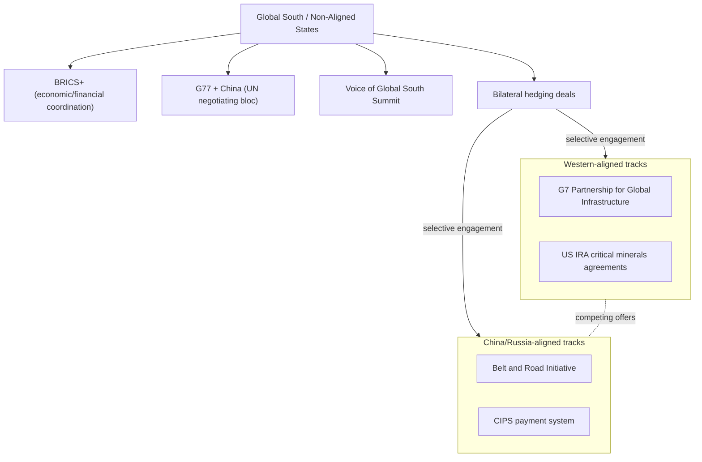

## The Global South and Strategic Non-Alignment

### Overview

Strategic non-alignment describes the foreign policy posture adopted by a large and heterogeneous set of Global South states that deliberately avoid binding themselves to either the US-led coalition (G7/Quad/AUKUS architecture) or the China-Russia axis, instead pursuing issue-by-issue, transactional relationships with multiple powers simultaneously. This is distinct from the Cold War-era Non-Aligned Movement (NAM) in both structure and motivation: it is less ideological, more overtly economic, and pursued primarily through hedging rather than formal bloc membership. For supply chain geopolitics, non-alignment matters because these states — India, Indonesia, Brazil, South Africa, Vietnam, Saudi Arabia, the UAE, and others — increasingly function as critical swing nodes in reconfigured trade, manufacturing, and resource-extraction networks.

### Historical Lineage vs. Contemporary Practice

**Key Points**

- The original Non-Aligned Movement (founded 1961, Belgrade Conference — Nehru, Nasser, Tito, Sukarno, Nkrumah) was an ideological project: explicit refusal to join either NATO or the Warsaw Pact bloc during bipolar Cold War competition.
- Contemporary non-alignment operates in a different structural environment: multipolar/multi-nodal rather than strictly bipolar, with economic interdependence far denser than during the Cold War, making full alignment costlier and hedging more rational.
- The term "Global South" itself is a loose geopolitical-economic grouping (not geographic) encompassing roughly 130+ states, institutionalized informally through forums like the G77, BRICS+, and the Voice of Global South Summit (India-convened, 2023–2024).
- [Inference] The shift from ideological NAM to transactional hedging reflects the declining salience of Cold War-style ideological blocs and the rising salience of supply chain security, resource access, and development financing as the primary currency of great-power competition.

### Mechanics of Strategic Hedging

**Key Points**

- **Multi-vector diplomacy**: States maintain simultaneous, often deep, relationships with competing powers — e.g., India buys discounted Russian oil while deepening Quad defense cooperation with the US; Vietnam hosts both US and Chinese supply chain investment; the UAE balances Chinese tech infrastructure deals with US security guarantees.
- **Institutional forum-shopping**: Non-aligned states participate in overlapping and sometimes contradictory institutions simultaneously (e.g., India in both the Quad and BRICS+; Indonesia in the G20 and ASEAN while resisting bloc pressure from either US or China).
- **Avoidance of exclusive commitments**: Refusal to formally join sanctions regimes (e.g., most Global South states did not join Western sanctions on Russia after 2022) while avoiding open alignment with the sanctioned party's broader strategic project.
- **Leverage extraction**: Non-alignment is used instrumentally to extract better terms from competing suitors — infrastructure financing, technology transfer, market access — by keeping multiple powers in competitive courtship rather than committing early.

### Supply Chain Relevance

**Key Points**

- **"Connector" or "Swing State" Manufacturing Role**: Countries like Vietnam, Mexico, Indonesia, and Morocco have become critical intermediary nodes in "China+1" and friend-shoring strategies — absorbing final-assembly stages while still relying on Chinese intermediate inputs, effectively laundering origin classification without fully decoupling from China.
- **Critical Minerals Leverage**: Resource-rich non-aligned states (Indonesia for nickel, Chile and Argentina for lithium, DRC for cobalt, South Africa for platinum-group metals) increasingly use export policy as strategic leverage rather than passive commodity supply — e.g., Indonesia's nickel-ore export ban (effective 2020) forced downstream battery-processing investment onshore rather than allowing raw export.
- **Dual-Track Infrastructure Financing**: Many Global South states accept simultaneous investment from China's Belt and Road Initiative and Western alternatives (G7's Partnership for Global Infrastructure and Investment, EU's Global Gateway), playing financing sources against each other for better terms and avoiding singular dependency.
- **De-dollarization Experiments**: Non-aligned states have explored local-currency trade settlement and alternative payment rails (e.g., India-UAE rupee-dirham trade, expanded use of China's CIPS payment system) as insurance against being weaponized targets of dollar-based financial sanctions — though [Speculation] the scale of actual de-dollarization remains limited relative to the rhetoric, given the dollar's continued dominance in trade invoicing and reserve holdings.

### Illustrative Example: Indonesia's Nickel Strategy

Indonesia holds the world's largest nickel reserves, essential for EV battery cathodes. Rather than aligning exclusively with either the US-led critical minerals coalition or Chinese processing investment, Indonesia has:

1. Banned raw nickel ore exports (2020) to force domestic smelting investment.
2. Accepted massive Chinese investment in domestic smelters (Tsingshan Group and others), making China the dominant processing partner.
3. Simultaneously negotiated with the US for a limited critical minerals agreement to make Indonesian nickel eligible for US Inflation Reduction Act EV tax credit supply chains — without excluding Chinese capital.
4. Used G20 presidency (2022) and Global South convening power to position itself as an indispensable node rather than a dependent client of either bloc.

This exemplifies the core non-alignment logic: extracting value from competition between powers rather than resolving the competition through exclusive commitment.

### Comparative Snapshot of Key Non-Aligned Actors

| State | Primary Leverage | Illustrative Hedge |
| --- | --- | --- |
| India | Market size, Quad membership, IT/pharma manufacturing | Buys Russian oil/arms while deepening US defense-tech ties |
| Indonesia | Nickel reserves, ASEAN leadership | Bans raw nickel export; courts both US and Chinese capital |
| Vietnam | China+1 manufacturing base | Hosts US and Chinese supply chains; avoids formal alliance with either |
| Saudi Arabia/UAE | Energy leverage, sovereign wealth capital | BRICS+ membership alongside deep US security ties |
| Brazil | Agricultural exports, BRICS+ founding member | Trades heavily with China while maintaining Western institutional ties |
| South Africa | Platinum-group metals, BRICS+ founding member | Non-aligned on Russia-Ukraine votes at the UN |

### Architecture of Non-Aligned Coordination

### Structural Tensions and Limits of Non-Alignment

- **Resource asymmetry among "Global South" states**: The category conflates vastly different capabilities — India's diplomatic weight and manufacturing base differ enormously from smaller commodity-exporting states with limited negotiating leverage, meaning "non-alignment" is more genuinely optional for larger states and more constrained for smaller, aid-dependent ones.
- **Debt-trap and financing risk**: Reliance on Belt and Road financing has, in several cases (Sri Lanka's Hambantota Port, Zambia's debt restructuring), created dependency dynamics that undermine the practical exercise of non-alignment even where the political posture is maintained.
- **Sanctions secondary-effects exposure**: Non-aligned states trading with sanctioned parties (Russia, Iran) face secondary sanctions risk from Western financial systems, creating a persistent tension between formal non-alignment and practical exposure to US dollar-based enforcement.
- **BRICS+ expansion ambiguity**: The 2024 expansion of BRICS (adding Egypt, Ethiopia, Iran, Saudi Arabia, UAE) raises the question of whether BRICS+ is evolving from a loose non-aligned coordination forum into a more structured counter-bloc — a live and contested characterization. [Unverified] Whether BRICS+ develops binding institutional mechanisms (a common currency, unified sanctions policy) remains speculative and disputed among analysts.

### Related Topics

- BRICS+ expansion and de-dollarization initiatives
- China's Belt and Road Initiative: debt-trap diplomacy debates
- Critical minerals nationalism (Indonesia, DRC, Chile export policies)
- Friend-shoring vs. China+1 manufacturing strategies
- Sanctions evasion and secondary sanctions enforcement mechanics
- The G20 as a Global South convening platform
- India's multi-alignment doctrine and strategic autonomy tradition