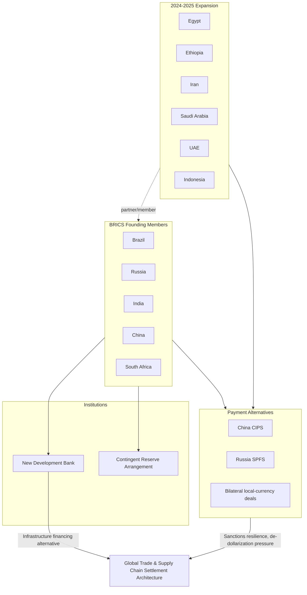

## BRICS Expansion and Alternative Economic Architectures

### Overview

BRICS expansion refers to the 2023–2024 enlargement of the original BRIC/BRICS grouping (Brazil, Russia, India, China, South Africa) into a larger coalition, alongside the broader question of whether this and parallel institutions constitute a genuine alternative economic architecture to the Bretton Woods system (IMF, World Bank, SWIFT-centered dollar clearing). This topic sits at the intersection of the Global South non-alignment dynamic and great-power institutional competition, and it bears directly on supply chain geopolitics through payment-rail alternatives, development financing, and commodity-trade invoicing.

### Origins and Institutional Timeline

**Key Points**

- **2001**: Goldman Sachs economist Jim O'Neill coins "BRIC" as an investment thesis describing Brazil, Russia, India, and China as rising economic powers — originally an analytical category, not a political grouping.
- **2009**: First formal BRIC summit (Yekaterinburg, Russia) converts the acronym into an actual diplomatic coordination forum.
- **2010**: South Africa admitted, forming BRICS.
- **2014**: Establishment of the **New Development Bank (NDB)**, headquartered in Shanghai, and the **Contingent Reserve Arrangement (CRA)** — a swap-line facility functioning as a mini-IMF alternative for balance-of-payments support among members.
- **2023 (Johannesburg Summit)**: Formal invitation extended to Argentina, Egypt, Ethiopia, Iran, Saudi Arabia, and the UAE.
- **2024**: Enlargement takes effect (Argentina, under its new government, declines to join); Ethiopia, Egypt, Iran, Saudi Arabia, and the UAE join, alongside a new "partner country" tier introduced at the 2024 Kazan Summit for states engaging short of full membership (including Indonesia, later a full member in 2025, and others such as Malaysia, Thailand, and Nigeria).
- **2025**: Indonesia formally joins as a full member, reflecting continued institutional growth. [Inference] The organization's trajectory suggests an intent to position BRICS+ as a broad-based Global South coordination platform rather than a narrowly defined bloc, though membership criteria and governance rules remain comparatively informal versus Bretton Woods institutions.

### Institutional Architecture

**Key Points**

- **New Development Bank (NDB)**: Capitalized initially at $50 billion, designed to fund infrastructure and sustainable development projects in member and non-member developing states, explicitly positioned as an alternative to World Bank conditionality-based lending.
- **Contingent Reserve Arrangement (CRA)**: A $100 billion swap-line pool enabling members to draw emergency liquidity during balance-of-payments crises without IMF program conditionality — though in practice, drawdowns above a threshold still reference IMF-linked terms, limiting full independence from the Bretton Woods system.
- **No shared currency**: Despite frequent media framing of a "BRICS currency," no common BRICS currency has been formally adopted or is under near-term implementation; proposals remain largely rhetorical and face substantial structural obstacles (divergent monetary policy, current account positions, and limited fiscal coordination among members). [Unverified] The extent to which any future BRICS common-currency mechanism is technically or politically viable remains contested among economists.
- **Local-currency and bilateral settlement push**: More concretely implemented than a shared currency — expansion of bilateral local-currency trade settlement (e.g., Russia-India rupee-ruble mechanisms, China-Brazil yuan settlement) and increased use of China's **Cross-Border Interbank Payment System (CIPS)** as a SWIFT alternative for a subset of trade flows.

### Alternative Economic Architecture: Components

**Key Points**

- **Payment rail alternatives**: CIPS (China), SPFS (Russia's SWIFT alternative, developed post-2014 Crimea sanctions), and various bilateral local-currency arrangements collectively form a patchwork of dollar-clearing alternatives, though [Speculation] their aggregate transaction volume remains a small fraction of SWIFT-cleared global trade, and interoperability between these separate systems is limited.
- **Development financing alternatives**: NDB alongside China's Belt and Road Initiative financing and the Asian Infrastructure Investment Bank (AIIB, distinct from BRICS but philosophically aligned) offer borrowers financing with fewer governance/human-rights conditionalities than traditional World Bank/IMF lending — a structural draw for many Global South borrowers.
- **Commodity trade denomination shifts**: Incremental moves toward non-dollar invoicing for select commodity trades (e.g., some India-Russia oil trade, China-Saudi Arabia discussions on yuan-denominated oil sales) represent the most concrete near-term de-dollarization vector, since energy-trade invoicing has historically been one of the dollar's core sources of structural demand ("petrodollar" system).
- **Reserve diversification**: Central banks in several Global South and BRICS+ states have incrementally increased gold reserves and reduced dollar-reserve concentration — a slow-moving trend predating BRICS expansion but reinforced by sanctions-weaponization concerns following the 2022 freezing of Russian central bank reserves.

### Supply Chain Relevance

**Key Points**

- **Sanctions-resilience infrastructure**: The core supply chain logic behind BRICS+ payment alternatives is insurance against the weaponization of dollar-clearing infrastructure, as demonstrated when Russia was cut off from SWIFT in 2022 — member states with substantial trade exposure to potential future sanctions (Iran, Russia, and to a lesser degree China) have the strongest incentive to build parallel settlement rails.
- **Commodity supply security**: BRICS+ expansion notably added major energy exporters (Saudi Arabia, UAE, Iran) to a grouping already including Russia, meaning the bloc now represents a very large share of global oil and gas production — raising the theoretical (though currently limited) possibility of coordinated energy-trade settlement outside dollar-denominated benchmarks.
- **Critical minerals and industrial inputs**: NDB financing and BRICS+ coordination increasingly touch critical minerals infrastructure projects, positioning the bank as a potential funding alternative for extraction and processing capacity that avoids Western environmental/governance conditionality — with attendant debate over standards and debt sustainability.
- **Fragmentation risk for global trade**: [Inference] To the extent BRICS+ payment and financing alternatives mature, they raise the prospect of a bifurcated global trading system with parallel, less-interoperable settlement and financing infrastructure — a scenario supply chain risk analysts increasingly model as "geoeconomic fragmentation," though the pace and depth of this bifurcation remains actively debated rather than settled.

### Institutional Comparison: BRICS+ vs. Bretton Woods

| Dimension | IMF/World Bank (Bretton Woods) | BRICS+ (NDB/CRA) |
| --- | --- | --- |
| Founded | 1944 | 2014 (NDB/CRA); BRIC coordination from 2009 |
| Governance | Quota-weighted, historically US/EU-dominated | Equal shareholding among founding members (NDB) |
| Conditionality | Structural adjustment, governance conditions | Comparatively fewer explicit political conditions |
| Currency | Dollar-denominated (SDR basket reference) | Multi-currency; no common currency adopted |
| Membership scale | ~190 countries (IMF) | 10 full members (as of 2025) + partner-country tier |

### Illustrative Example: Russia-India Oil Settlement

Following 2022 Western sanctions, Russia redirected substantial oil exports to India and China. A meaningful portion of this trade has been settled outside dollar clearing:

1. Indian refiners pay for discounted Russian crude in a mix of UAE dirhams, Chinese yuan, and limited rupee-based mechanisms, since large-scale rupee settlement is complicated by Russia's limited ability to spend accumulated rupees (India runs a structural trade surplus with Russia in the other direction).
2. This has produced a well-documented "rupee trap" — Russian entities holding non-convertible rupee balances with restricted deployment options — illustrating a practical limitation of bilateral local-currency settlement absent deeper capital account convertibility.
3. [Speculation] Analysts differ on whether this friction will accelerate movement toward third-currency settlement (yuan, dirham) or toward more developed BRICS-wide clearing infrastructure; no consensus resolution has emerged as of the most recent reporting.

### Architecture Diagram

### Critiques and Structural Limits

- **Heterogeneity constrains cohesion**: BRICS+ now includes states with sharply divergent interests and, in some cases, active rivalries (India-China border tensions; Saudi Arabia-Iran historical rivalry, though partially normalized in 2023), limiting the bloc's capacity for unified economic policy relative to more homogeneous groupings like the G7.
- **China's asymmetric weight**: China's economy dwarfs other BRICS+ members combined, raising persistent concern among members (particularly India) about the bloc functioning as a vehicle for Chinese economic leadership rather than genuine multipolar coordination.
- **Limited institutional depth versus Bretton Woods**: The NDB and CRA remain small relative to IMF/World Bank balance sheets, and neither has developed the deep technical/staff capacity or crisis-response track record of legacy institutions. [Unverified] Whether BRICS+ institutions will meaningfully scale lending capacity and staff expertise over the coming decade, closing the gap with Bretton Woods institutions, is not yet demonstrated.
- **Dollar dominance persistence**: Despite the rhetoric of de-dollarization, the US dollar retains overwhelming dominance in global trade invoicing, foreign exchange reserves, and international debt issuance; near-term structural displacement is not supported by current data, even as marginal diversification proceeds.

### Related Topics

- SWIFT sanctions and payment-system weaponization
- The New Development Bank vs. World Bank lending models
- Petrodollar system origins and de-dollarization debates
- China's Belt and Road Initiative financing architecture
- India's balancing act between BRICS+ and Quad membership
- Central bank gold reserve diversification trends
- Yuan internationalization and capital account convertibility