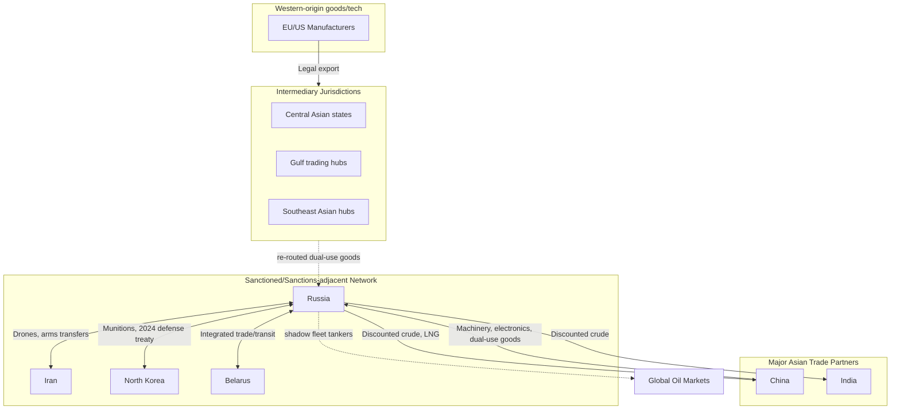

## Russia's Pivot to Asia and Sanctioned State Trade Networks

### Overview

Since 2014, and dramatically accelerating after the 2022 full-scale invasion of Ukraine, Russia has restructured its trade, energy, and financial relationships away from Europe and toward Asia — principally China, India, and a network of other sanctioned or sanctions-adjacent states (Iran, North Korea, Belarus). This "pivot to Asia" is both a response to Western sanctions and a broader structural realignment, and it has catalyzed the formation of parallel trade and payment networks among sanctioned and semi-sanctioned states. For supply chain geopolitics, this matters as a case study in how targeted states adapt logistics, financing, and intermediary structures under sustained external pressure — and in how sanctions-enforcement regimes attempt to track and close resulting gaps.

### Structural Drivers

**Key Points**

- **Pre-2022 baseline**: Russia's pivot began after 2014 Crimea-related sanctions, which prompted early diversification (e.g., the "Power of Siberia" gas pipeline agreement with China, signed 2014).
- **Post-2022 acceleration**: The scale of Western sanctions following the full-scale invasion (SWIFT exclusion for major banks, G7 oil price cap, export controls on dual-use and advanced technology) forced a much faster and deeper reorientation of Russian trade flows.
- **Energy trade redirection**: European pipeline gas exports collapsed; Russia redirected crude oil and LNG exports primarily to China and India via tanker shipments, often at significant price discounts.
- **Import-substitution and parallel imports**: Russia authorized a formal "parallel import" legal regime (2022) permitting import of Western-branded goods without trademark holder consent, primarily routed through third countries.

### Trade Network Architecture

**Key Points**

- **China as primary partner**: China has become Russia's largest trading partner by a wide margin, supplying machinery, electronics, vehicles, and — per Western government assessments — components with potential dual-use military applications, while importing Russian energy and raw materials.
- **India's energy role**: India became a major buyer of discounted Russian seaborne crude post-2022, with Indian refiners processing Russian crude and, in some cases, re-exporting refined products — a pattern Western policymakers have scrutinized under price-cap and sanctions-circumvention concerns.
- **Third-country intermediary hubs**: Trade researchers and government agencies (US Treasury, EU) have documented sharp increases in exports of sanctioned dual-use goods from third countries (including Central Asian states such as Kazakhstan, Kyrgyzstan, and Armenia, and others in the Gulf and Southeast Asia) to Russia, consistent with re-routing of Western-origin goods.
- **Belarus integration**: Belarus functions as a closely integrated secondary node, both as a transit route and as a partner subject to a largely overlapping sanctions regime.
- [Inference] The overall pattern reflects a general dynamic observed across sanctions regimes historically: targeted states shift trade toward jurisdictions with weaker enforcement capacity or divergent political alignment, while some portion of restricted-origin goods continues reaching the target market via re-routing through intermediary jurisdictions.

### Sanctioned-State Coordination Networks

**Key Points**

- **Russia-Iran cooperation**: Documented cooperation has included Iranian-origin drone technology reportedly supplied to Russia for use in the Ukraine conflict, alongside broader trade and financial cooperation between the two heavily sanctioned states.
- **Russia-North Korea cooperation**: Reports from US, South Korean, and UN monitoring bodies have described arms and munitions transfers from North Korea to Russia, alongside a 2024 mutual defense-oriented treaty between the two states — representing an unusually overt deepening of sanctioned-state security cooperation.
- **Shared payment-system experimentation**: Russia, Iran, and other sanctioned or partially sanctioned states have explored linking alternative payment systems (Russia's SPFS, discussions of connecting with Iran's domestic equivalents) and increased use of cryptocurrency and barter-style arrangements for bilateral trade, though [Unverified] the actual transaction volume and reliability of these alternative rails relative to conventional banking channels is not well established in open-source reporting.
- **"Shadow fleet" tanker networks**: A body of older, often reflagged tankers with opaque or shifting ownership structures has been documented by researchers and governments transporting Russian oil to evade the G7 price cap and insurance-related sanctions — a logistics-network adaptation specific to the maritime energy trade.

### Supply Chain Relevance

**Key Points**

- **Dual-use goods leakage tracking**: A major focus of Western export-control enforcement (US BIS, EU, UK) has been identifying and restricting third-country transshipment points used to route sanctioned dual-use components (semiconductors, machine tools, electronics with potential military application) to Russia.
- **Energy market restructuring**: The shift of Russian oil and gas flows toward Asia has restructured global tanker demand patterns, refining economics (particularly in India, which profits from discounted crude input costs), and price-cap enforcement mechanics tied to Western shipping-insurance leverage.
- **Sanctions-evasion detection methods**: Trade-data researchers and government agencies use techniques such as mirror-statistics analysis (comparing exporter-reported vs. importer-reported trade figures to identify discrepancies indicating undeclared re-routing) and vessel-tracking (AIS transponder analysis, satellite imagery correlation) to identify likely circumvention patterns — an increasingly important methodology in supply chain risk and compliance analysis generally.
- **Compliance risk for multinational firms**: Companies with complex global supply chains face growing due-diligence burden to ensure products are not reaching sanctioned end-users via intermediary jurisdictions, driving investment in supply-chain transparency and know-your-customer/know-your-distributor tooling.

### Illustrative Example: Machine Tool Re-Routing Pattern (Generalized)

A pattern frequently described in trade-data research (illustrative structure, not a specific verified transaction):

1. A Western-manufactured precision machine tool with dual-use application is exported legally to a third country with less stringent re-export controls.
2. The good is re-invoiced or lightly modified/repackaged by an intermediary trading entity in that third country.
3. The good is re-exported to Russia, now classified under the third country's own export statistics rather than the original manufacturer's country.
4. Mirror-statistics analysis (comparing the origin country's export data against the third country's import data, and that country's own export data to Russia) can reveal volume discrepancies suggestive of this pattern, prompting targeted enforcement action or updated export-control designations for the intermediary jurisdiction.

This generalized structure illustrates why enforcement increasingly targets intermediary-jurisdiction trade data and financial-transaction monitoring rather than only the originating manufacturer.

### Network Diagram

### Enforcement Response

**Key Points**

- **Expanding secondary sanctions**: The US and allies have increasingly applied secondary sanctions risk to third-country entities and financial institutions facilitating Russia-bound trade in restricted goods, extending enforcement leverage beyond direct US/EU jurisdiction.
- **G7 price cap mechanism**: The G7 oil price cap (implemented late 2022) leverages Western dominance in shipping insurance and maritime services as an enforcement lever, rather than relying solely on direct trade prohibition — an innovative sanctions-design approach specifically adapted to the realities of a globally networked energy supply chain.
- **Entity list expansion**: Repeated rounds of export-control entity-list additions have targeted specific intermediary trading companies identified through trade-data and financial-flow analysis as facilitating circumvention.
- [Speculation] The long-run effectiveness of this enforcement architecture in meaningfully constraining Russia's access to sanctioned technology, versus simply raising transaction costs and shifting routing patterns, remains an actively debated question among sanctions-policy researchers, without clear consensus in the available evidence.

### Related Topics

- G7 oil price cap mechanics and shipping-insurance leverage
- Mirror-statistics and trade-data forensics methodology
- Export control entity lists and secondary sanctions design
- China-Russia energy infrastructure (Power of Siberia pipelines)
- North Korea-Russia arms transfer reporting and UN monitoring mechanisms
- Shadow fleet tanker tracking and maritime sanctions evasion research
- Central Asian states as sanctions-circumvention transshipment hubs