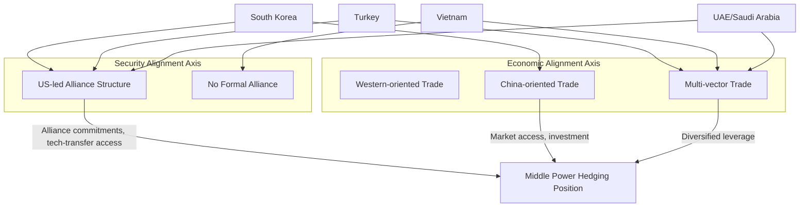

## Middle Powers and Hedging Strategies Between Blocs

### Overview

Middle powers — states with meaningful but non-dominant economic, military, or diplomatic weight (e.g., South Korea, Turkey, Indonesia, Saudi Arabia, the UAE, Vietnam, Poland, Australia in some framings) — occupy a structurally distinct position from both great powers (US, China) and smaller, more dependent states. Their hedging strategies differ from Global South non-alignment primarily in degree of leverage and institutional embeddedness: middle powers often hold formal alliance or treaty commitments to one bloc while simultaneously cultivating substantial economic ties with the rival bloc, producing a more constrained but still consequential form of hedging. This distinction matters for supply chain geopolitics because middle powers frequently function as manufacturing, technology, or logistics chokepoints whose alignment decisions carry outsized systemic weight relative to their size.

### Defining Middle-Power Hedging

**Key Points**

- **Distinct from non-alignment**: Unlike Global South non-aligned states (which typically avoid formal alliance commitments), many middle powers maintain explicit treaty alliances (South Korea-US Mutual Defense Treaty; Australia's ANZUS/AUKUS commitments) while still hedging economically — meaning their hedging operates within, not outside, formal alliance structures.
- **Economic-security decoupling**: The defining middle-power hedge is separating security alignment from economic alignment — accepting a security guarantee from one power while maintaining deep trade/investment relationships with a rival power, on the theory these domains can be managed independently.
- **Issue-specific alignment**: Middle powers frequently align with different blocs on different issues simultaneously (e.g., a state might align with US export controls on advanced semiconductors while maintaining normal trade relations with China across most other sectors).
- [Inference] This more constrained hedging reflects middle powers' typically higher economic dependency on both great powers relative to smaller Global South states, making the costs of full alignment with either side proportionally larger and the incentive for careful issue-differentiation stronger.

### Key Middle-Power Case Studies

**South Korea**

- Formal US treaty ally hosting significant US troop presence; simultaneously China is South Korea's largest trading partner by significant margin.
- Semiconductor supply chain exposure is acute: Samsung and SK Hynix have substantial fabrication and memory-chip operations in China, creating direct tension with US semiconductor export-control policy (particularly post-2022 restrictions on advanced chip-manufacturing equipment).
- 2017 THAAD missile-defense deployment triggered informal Chinese economic retaliation (tourism restrictions, boycotts of South Korean retail/entertainment), illustrating the real economic cost middle powers face when security alignment provokes economic consequences from the other bloc.

**Turkey**

- NATO member (since 1952) that has simultaneously purchased Russian S-400 air defense systems (2019), resulting in US sanctions under CAATSA and Turkey's removal from the F-35 fighter program — a case where hedging produced direct, tangible alliance-partner penalties.
- Maintains significant trade and energy relationships with Russia (including the Akkuyu nuclear power plant, built by Russia's Rosatom) while hosting NATO's second-largest military and playing a mediating role in Russia-Ukraine grain-export negotiations (Black Sea Grain Initiative, 2022–2023).

**Vietnam**

- Pursues a "bamboo diplomacy" doctrine (flexible, multi-directional alignment) — deepened US relations (upgraded to Comprehensive Strategic Partnership in 2023) while maintaining historically rooted, ideologically aligned ties with China as a fellow one-party socialist state.
- Central node in China+1 manufacturing diversification, absorbing significant electronics and apparel manufacturing relocated from China, while still depending heavily on Chinese intermediate-goods inputs for that same manufacturing base — a structural hedge built into its supply chain position itself.

**Saudi Arabia and the UAE**

- Deep, long-standing US security relationship (arms sales, basing arrangements) combined with expanding economic and technology ties to China (Huawei 5G infrastructure deployment in the UAE despite US objections; China-brokered Saudi-Iran normalization deal, 2023).
- BRICS+ membership (Saudi Arabia's status as of 2024 involves ongoing internal deliberation; UAE joined as a full member) pursued in parallel with continued US security dependence, exemplifying the economic/security decoupling pattern.

### Supply Chain Relevance

**Key Points**

- **Semiconductor chokepoint exposure**: South Korea's position illustrates a broader pattern — middle powers with critical technology manufacturing capacity face the most acute hedging pressure, since export-control alignment decisions carry direct, immediate commercial consequences for flagship domestic firms.
- **Manufacturing relocation beneficiaries as structural hedgers**: States absorbing China+1 manufacturing relocation (Vietnam, Mexico, India, Indonesia) are structurally incentivized toward hedging almost by default, since their manufacturing competitiveness often depends on continued access to Chinese intermediate inputs even as final-assembly relocates to serve Western friend-shoring demand.
- **Energy and critical minerals leverage**: Gulf middle powers leverage energy exports and sovereign wealth fund capital as hedging currency, using investment access as a bargaining chip with both blocs — Saudi and UAE sovereign funds have made substantial investments in both US technology firms and Chinese AI/technology ventures.
- **Technology infrastructure bifurcation pressure**: Middle powers face growing pressure to choose between competing technology standards and infrastructure providers (5G equipment vendors, cloud infrastructure, semiconductor toolchains), with the UAE's Huawei deployment despite explicit US objections illustrating the limits of US leverage over middle-power infrastructure decisions even among close security partners.

### Illustrative Example: South Korea's Semiconductor Dilemma

1. US export controls (October 2022, expanded 2023) restrict advanced semiconductor manufacturing equipment sales to China-based fabrication facilities.
2. Samsung and SK Hynix operate substantial memory-chip fabrication facilities within China, representing a significant share of their global production capacity.
3. The US initially granted temporary, renewable waivers allowing continued equipment servicing/upgrades at these China-based facilities, reflecting recognition of the acute economic cost full compliance would impose on a key ally's flagship firms.
4. South Korea has navigated this by seeking continued waiver extensions, slow-walking full compliance timelines, and quietly diversifying some future fabrication investment toward US soil (encouraged by CHIPS Act incentives) — a layered hedge managing both alliance-partner pressure and commercial exposure simultaneously.
5. [Speculation] Whether waiver arrangements persist long-term or are phased out as US-China technology competition intensifies remains an open policy question, with significant consequences for South Korean firms' China-based capacity regardless of the outcome.

### Hedging Spectrum Framework

| Position | Security Alignment | Economic Alignment | Example |
| --- | --- | --- | --- |
| Full Western alignment | Formal alliance | Primarily Western | Poland, Japan |
| Security-West, Economic-hedge | Formal alliance | Substantial rival-bloc trade | South Korea, Turkey |
| Non-aligned hedging | No formal alliance | Multi-vector | India, Vietnam, Indonesia |
| Economic-West, Security-hedge | Limited/no formal alliance | Primarily Western | Rare — few clear cases |
| Full rival-bloc alignment | Formal alliance (non-Western) | Primarily non-Western | North Korea, Belarus |

### Architecture Diagram

### Structural Limits and Risks of Hedging

- **Alliance-partner penalties**: Turkey's F-35 exclusion demonstrates that great powers increasingly treat hedging behavior (particularly security-adjacent hedging like the S-400 purchase) as sanctionable even among formal treaty allies, narrowing the practical space for security-economic decoupling.
- **Forced-choice scenarios**: Escalating US-China technology competition increasingly presents middle powers with binary choices in specific sectors (e.g., 5G vendor selection, advanced semiconductor equipment access) where issue-specific hedging is no longer available and a discrete alignment choice must be made.
- **Domestic political constraints**: Middle-power hedging strategies face domestic political risk when economic dependency on a rival bloc becomes a live electoral issue (e.g., periodic South Korean domestic debate over China economic dependency following the 2017 THAAD retaliation episode).
- [Inference] The overall trajectory of US-China technology competition suggests the space for pure economic-security decoupling is narrowing over time, pushing middle powers toward more frequent discrete alignment choices in strategically sensitive sectors even as they continue hedging in less sensitive ones.

### Related Topics

- South Korea's semiconductor export control waiver negotiations
- Turkey's CAATSA sanctions and F-35 program exclusion
- Vietnam's "bamboo diplomacy" and China+1 manufacturing role
- Gulf state sovereign wealth fund dual-bloc investment strategy
- 5G infrastructure competition: Huawei vs. Western vendor alignment
- CHIPS Act incentives and allied semiconductor reshoring
- THAAD deployment and Chinese economic coercion case studies