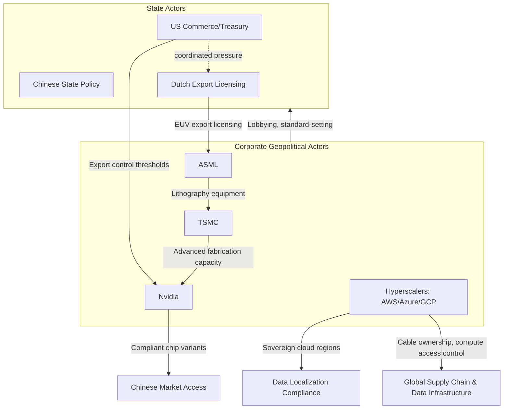

## Multinational Corporations and Hyperscalers as Geopolitical Actors

### Overview

A structural feature of contemporary great-power competition is the emergence of large multinational corporations — and particularly cloud/AI "hyperscalers" (Amazon, Microsoft, Google, Meta, plus Chinese counterparts Alibaba, Tencent, Huawei) — as actors that exercise meaningful independent geopolitical influence rather than functioning purely as instruments of state policy. These firms control infrastructure (cloud compute, undersea cables, satellite constellations, semiconductor supply chains) that states increasingly treat as strategic assets, giving corporate decisions direct bearing on sanctions enforcement, technology diffusion, and supply chain resilience.

### Why Firms Function as Geopolitical Actors

**Key Points**

- **Infrastructure control as leverage**: Hyperscalers own and operate the physical and digital infrastructure (data centers, cloud regions, subsea cable landing stations, satellite networks) that underpins both commercial and government digital operations globally, giving them de facto control over connectivity and compute access that governments cannot easily replicate.
- **Concentration of critical capability**: A small number of firms (Nvidia in AI accelerator chips; TSMC in advanced semiconductor fabrication; the major hyperscalers in cloud infrastructure) hold sufficiently concentrated market position that their individual corporate decisions carry systemic effects comparable to state policy choices.
- **Regulatory arbitrage and jurisdiction-shopping**: Multinational firms structure operations across jurisdictions partly to navigate diverging regulatory regimes (data localization laws, export controls, antitrust frameworks), giving them some latitude to choose which state's rules bind particular operations.
- **Public-private enforcement delegation**: Governments increasingly delegate elements of sanctions and export-control enforcement to private firms themselves (e.g., requiring cloud providers to verify end-user compliance, or chip designers to police downstream customer use), effectively deputizing corporations as geopolitical enforcement agents.

### Case Study: Semiconductor Firms

**Key Points**

- **Nvidia and AI chip export controls**: Nvidia has had to design China-specific, performance-throttled chip variants (e.g., the A800/H800 and subsequent iterations) to remain compliant with evolving US export-control thresholds while preserving access to the large Chinese market — with the US Commerce Department periodically tightening thresholds specifically to close gaps these compliant variants had exploited.
- **TSMC's structural centrality**: Taiwan Semiconductor Manufacturing Company's near-monopoly on the most advanced logic chip fabrication nodes makes it simultaneously a critical commercial supplier to both US and Chinese technology ecosystems and a central variable in cross-strait deterrence calculations — sometimes termed the "silicon shield" thesis, under which TSMC's global economic importance is theorized to raise the cost of Chinese military action against Taiwan. [Speculation] The actual deterrent weight of this "silicon shield" effect relative to other strategic factors is disputed among security analysts.
- **ASML and lithography chokepoint**: The Dutch firm ASML's monopoly on extreme ultraviolet (EUV) lithography machines — essential for the most advanced chip fabrication — has made Dutch export-licensing decisions (made under both domestic and US-coordinated pressure) a direct lever in US-China technology competition, illustrating how a single firm's technology position can elevate a mid-sized state's export-control decisions to great-power significance.

### Case Study: Hyperscaler Cloud Infrastructure

**Key Points**

- **Sovereign cloud and data localization responses**: Governments increasingly require hyperscalers to operate legally and technically separated "sovereign cloud" regions (e.g., Microsoft's government cloud offerings, EU data-residency-compliant regions) in response to concerns about foreign jurisdiction's legal reach over data (such as the US CLOUD Act's extraterritorial data-access provisions).
- **Cloud provider content/access decisions as geopolitical events**: Corporate decisions to restrict or withdraw services in specific jurisdictions (e.g., major cloud and technology firms' business exits from Russia following the 2022 invasion) function as de facto sanctions enforcement independent of, though often coordinated with, formal government sanctions designations.
- **AI compute access as a control point**: Restrictions on cloud-based access to advanced AI training compute (extending export controls beyond physical chip transfer to cover cloud-service-mediated remote access to controlled hardware) represent an evolving enforcement frontier, since a firm's cloud access policies can functionally replicate or undermine hardware export controls.
- **Undersea cable ownership concentration**: Hyperscalers now own or co-own a substantial and growing share of global subsea internet cable capacity (historically the domain of telecom carriers and state-linked consortia), giving firms like Google and Meta direct influence over global data-routing resilience and, by extension, national security-relevant considerations around cable landing points and potential chokepoints.

### Corporate Strategic Postures

**Key Points**

- **Compliance-maximalist posture**: Some firms prioritize strict adherence to the most restrictive applicable jurisdiction's rules across their global operations, accepting reduced market access in exchange for regulatory predictability and reduced enforcement risk.
- **Market-preservation posture**: Other firms pursue product segmentation or localized entity structures specifically to preserve access to strategically important but politically contested markets (the Nvidia China-chip-variant strategy exemplifies this), accepting reduced product capability in a given market rather than exiting it entirely.
- **Lobbying and standard-setting influence**: Major firms actively lobby to shape the export-control rules and technical standards that govern their industries (e.g., semiconductor industry input into the specific technical thresholds used in US export-control regulations), meaning firms are not purely passive rule-takers but active participants in the policy-formation process itself.
- [Inference] The choice between these postures is generally driven by the relative commercial value of contested markets versus the compliance and reputational risk of operating within them, rather than by uniform ideological alignment with any single government's strategic objectives.

### Supply Chain Relevance

**Key Points**

- **Chokepoint concentration risk**: The extreme concentration of critical capability in a small number of firms (TSMC for advanced fabrication, ASML for EUV lithography, Nvidia for AI accelerators) means supply chain risk analysis increasingly must model individual corporate decisions and firm-specific vulnerabilities (labor disputes, natural disaster exposure, single-facility dependency) alongside traditional state-level geopolitical risk factors.
- **Private-sector-mediated export control enforcement**: As enforcement increasingly relies on corporate compliance functions (know-your-customer checks, downstream-use verification, cloud-access gatekeeping), the effectiveness of export-control regimes becomes partially contingent on corporate compliance investment and willingness, introducing a layer of private-sector discretion into what was historically a purely state enforcement function.
- **Corporate supply chain diversification as geopolitical hedging**: Hyperscalers and major manufacturers increasingly diversify data center locations, chip suppliers, and manufacturing partners explicitly for geopolitical risk mitigation (not only cost or reliability reasons), mirroring state-level friend-shoring logic at the firm level.
- **Standard-setting as soft-power extension**: Corporate influence over technical standards (5G, AI governance frameworks, semiconductor design rules) functions as an extension of national technology competition, since standards adopted globally tend to favor the technology ecosystem of firms most involved in setting them.

### Illustrative Example: Nvidia's Compliance Architecture

1. US Commerce Department sets a performance threshold (measured via metrics such as total processing performance) above which AI accelerator chip exports to China require a license, generally denied for the most advanced tier.
2. Nvidia designs China-market-specific chip variants calibrated just below the regulatory threshold, preserving legal export eligibility while reducing chip capability relative to its global flagship products.
3. Commerce Department subsequently revises the threshold downward or adds additional restricted parameters (in response to observing this compliant-workaround pattern), prompting Nvidia to design a further downgraded variant.
4. This iterative cycle illustrates the dynamic, adversarial-compliance relationship between export-control regulators and firms seeking to preserve commercial market access within evolving legal constraints — a pattern with analogues across other export-controlled technology categories.

### Actor Relationship Diagram

### Tensions and Critiques

- **Accountability gap**: Corporate decisions with major geopolitical consequences (market exit, service restriction, compliance posture) are made through corporate governance processes not designed for, or directly accountable to, the public-interest considerations typically associated with state foreign policy decisions.
- **Regulatory capture concerns**: Heavy corporate involvement in shaping the technical thresholds and standards that govern export controls raises structural concerns about firms influencing rules in ways that favor their specific commercial position rather than purely reflecting strategic policy objectives.
- **Uneven state leverage**: Not all states have comparable leverage over hyperscalers and major technology firms — the concentration of headquarters, incorporation, and critical supplier relationships within a handful of jurisdictions (primarily the US, Netherlands, Taiwan, South Korea, and China) means most states have limited direct regulatory leverage over the firms whose infrastructure they nonetheless depend on.
- [Unverified] The long-term trajectory of state-corporate power balance in this domain — whether states will successfully reassert primacy over infrastructure-controlling firms through expanded regulation, or whether firm influence will continue growing relative to state capacity — remains an open and actively contested question among political economy researchers.

### Related Topics

- US export control thresholds and the semiconductor performance-metric arms race
- ASML EUV lithography monopoly and Dutch export licensing politics
- TSMC's "silicon shield" thesis and Taiwan strait deterrence
- Sovereign cloud infrastructure and the CLOUD Act's extraterritorial reach
- Undersea cable ownership shifts from telecoms to hyperscalers
- Corporate sanctions compliance and private-sector enforcement delegation
- AI governance standard-setting as geopolitical competition