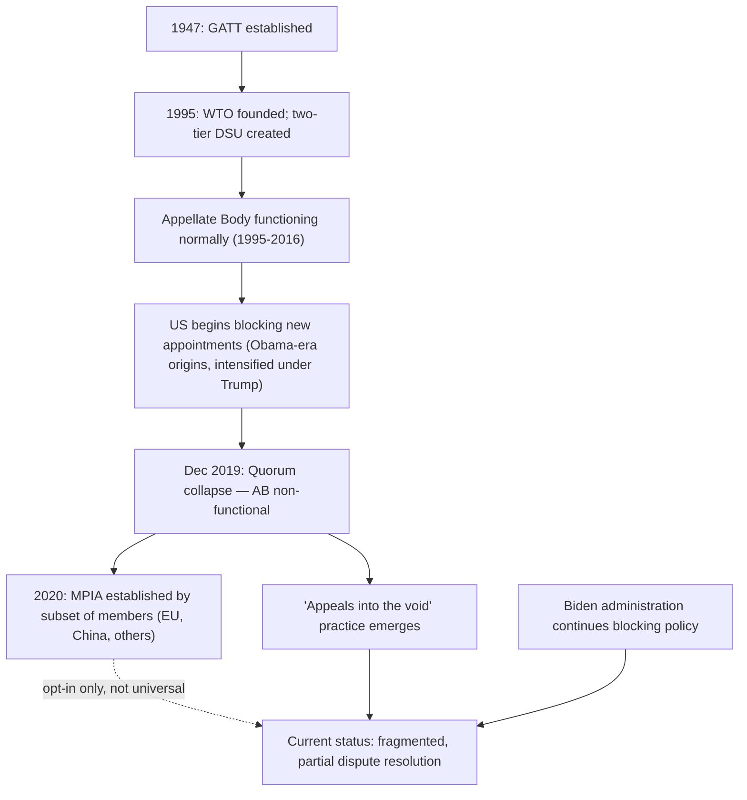

## The World Trade Organization and Its Dispute Settlement Crisis

### Overview

The World Trade Organization (WTO), established in 1995 as the successor to the General Agreement on Tariffs and Trade (GATT), has experienced a sustained institutional crisis centered on its dispute settlement system — historically considered the organization's most significant achievement relative to GATT's weaker enforcement mechanisms. The core of this crisis is the effective paralysis of the WTO's Appellate Body since December 2019, when the United States blocked new appointments to the point where the body fell below the quorum needed to hear appeals. This topic is central to supply chain geopolitics because a weakened multilateral dispute settlement system directly shapes states' willingness to pursue unilateral trade measures (tariffs, export controls, subsidies) that reconfigure global supply chains.

### WTO Institutional Structure

**Key Points**

- **Membership and scope**: 164 members as of the most recent expansion, covering goods (GATT), services (GATS), and intellectual property (TRIPS) — collectively governing the large majority of global trade.
- **Decision-making**: Formally operates by consensus among all members, a structural feature that has made new rule-making (as opposed to dispute adjudication of existing rules) increasingly difficult as membership and interest divergence have grown.
- **Two-tier dispute settlement design (as originally structured)**:
  1. **Panels**: Ad hoc three-member panels hear initial disputes between complaining and responding member states, issuing reports based on WTO agreement interpretation.
  2. **Appellate Body**: A standing seven-member body (with cases typically heard by three-member divisions) reviews panel legal findings on appeal, historically completing review within 60–90 days per WTO rules.
- **Binding enforcement mechanism**: Unlike many international legal bodies, adopted WTO panel/Appellate Body rulings are formally binding, with non-compliance opening the door to WTO-authorized retaliatory trade measures (tariff suspension of concessions) by the prevailing party — historically WTO's key enforcement advantage over other international trade frameworks.

### The Appellate Body Crisis

**Key Points**

- **US blocking of appointments**: Beginning under the Obama administration and continuing and intensifying under Trump, the US used its consensus-blocking power to prevent new Appellate Body member appointments, citing longstanding concerns about judicial overreach, disregard of agreed 90-day deadlines, and the Appellate Body issuing advisory opinions on issues not strictly necessary to resolve disputes.
- **December 2019 quorum collapse**: The Appellate Body requires a minimum of three sitting members to hear any given appeal; continued US blocking of replacement appointments as sitting members' terms expired brought the body below this threshold in December 2019, rendering it functionally unable to hear new appeals.
- **US substantive critiques**: Beyond procedural objections, the US articulated substantive concerns that the Appellate Body had engaged in "judicial activism" — expanding interpretations of trade-remedy rules (particularly anti-dumping and countervailing duty methodology) in ways the US argued constrained legitimate domestic trade-defense measures beyond what members had originally agreed to in the underlying treaty text.
- **Persistence across administrations**: Notably, the Biden administration continued the blocking policy rather than reversing it, indicating the underlying concerns reflect a bipartisan US institutional critique rather than an administration-specific position. [Inference] This continuity suggests the Appellate Body impasse reflects durable US structural concerns about sovereignty and trade-remedy authority rather than a transient political posture likely to reverse quickly.

### Practical Consequences: "Appeals into the Void"

**Key Points**

- **Mechanism**: With no functioning Appellate Body, any WTO member can now block final resolution of a dispute simply by filing a notice of appeal against an unfavorable panel ruling — since the appeal cannot be heard, the panel ruling never becomes legally binding, a practice informally termed "appeal into the void."
- **Effective enforcement collapse**: This has substantially weakened the WTO's core enforcement value proposition, since a losing party facing an adverse panel ruling can indefinitely defer binding resolution and the associated risk of authorized retaliatory measures.
- **Multi-Party Interim Appeal Arbitration Arrangement (MPIA)**: A subset of WTO members (including the EU, China, and other participants, though notably not the US) established the MPIA in 2020 as a voluntary alternative appeal mechanism using WTO arbitration provisions (Article 25 of the Dispute Settlement Understanding) to replicate appellate review among consenting members only — [Unverified] its effectiveness as a full substitute for a universal Appellate Body remains constrained by its opt-in, minority-participation structure, and its long-term durability as an institutional fix is not yet established.
- **Rising first-instance-only reliance**: Members increasingly must rely on unappealed panel reports (when both parties choose not to appeal) or, more commonly, unresolved disputes sit indefinitely in appellate limbo, weakening the practical deterrent effect of the dispute settlement system as a whole.

### Supply Chain Relevance

**Key Points**

- **Reduced constraint on unilateral trade measures**: A weakened dispute settlement system reduces the practical legal risk associated with unilateral tariffs, export controls, and industrial subsidies, since even WTO-inconsistent measures face substantially reduced likelihood of binding, enforceable correction — a significant factor enabling the broader trend toward industrial policy and trade weaponization observed across the current great-power competition landscape.
- **Reduced predictability for supply chain investment**: Firms making long-horizon supply chain and manufacturing-location investment decisions historically relied partly on WTO rules and enforcement predictability to assess trade-policy risk; a weakened enforcement mechanism increases the effective political risk premium attached to cross-border supply chain planning.
- **Proliferation of non-WTO dispute mechanisms**: The dispute settlement crisis has accelerated reliance on bilateral and regional trade agreement dispute mechanisms (e.g., USMCA's dispute panels, CPTPP mechanisms) as partial substitutes, contributing to a more fragmented, less universal global trade governance landscape.
- **Weaponized trade-remedy proliferation**: With reduced appellate constraint, states have shown increased willingness to deploy anti-dumping and countervailing duty measures more expansively (a trend particularly visible in steel, solar panel, and electric vehicle sectors), directly reshaping affected supply chains toward alternative sourcing to avoid duty exposure.

### Illustrative Example: A Hypothetical Appeal-into-the-Void Sequence

1. Country A imposes anti-dumping duties on steel imports from Country B, citing below-cost pricing.
2. Country B challenges the measure at the WTO; a dispute panel is convened and, after review, rules the duties are WTO-inconsistent.
3. Country A, dissatisfied with the panel ruling, files a formal notice of appeal to the Appellate Body.
4. Because the Appellate Body lacks quorum, the appeal cannot be heard; the panel ruling remains legally unadopted and non-binding.
5. The anti-dumping duties remain in effect indefinitely, since Country B has no binding enforcement mechanism to compel compliance, having effectively lost access to the WTO's core enforcement value despite formally prevailing at the panel stage.
6. If both countries are MPIA members, Country B could instead have proposed MPIA arbitration as an alternative appeal path — but this requires Country A's participation in the MPIA framework, which is not universal.

### Institutional Timeline

### Reform Proposals and Structural Debates

**Key Points**

- **US-proposed reforms**: US proposals have generally centered on constraining Appellate Body discretion — stricter adherence to the 90-day deadline, limiting rulings to only what is strictly necessary to resolve the dispute, and addressing concerns about precedent-setting beyond individual case facts.
- **EU and other-member proposals**: Many other WTO members have favored preserving a strong, independent Appellate Body while addressing specific US procedural concerns, reflecting a divide between members who prioritize binding multilateral enforcement and the US position prioritizing sovereignty preservation over trade-remedy authority.
- **Broader WTO reform linkage**: The dispute settlement crisis is frequently linked in negotiations to broader WTO reform debates, including modernizing rules for state-owned enterprises, digital trade, and industrial subsidies — areas where existing WTO agreements are widely seen as outdated relative to contemporary trade patterns (particularly regarding Chinese state-capitalism-linked practices).
- **12th and 13th Ministerial Conference commitments**: WTO members have repeatedly committed at recent Ministerial Conferences (MC12 in 2022, MC13 in 2024) to work toward a fully functioning dispute settlement system by 2024, though [Unverified] as of the most recent available information, a comprehensive resolution restoring full Appellate Body functionality has not been achieved, and the practical timeline for resolution remains uncertain.

### Related Topics

- The Multi-Party Interim Appeal Arbitration Arrangement (MPIA) mechanics
- US trade-remedy law and Appellate Body interpretive disputes
- WTO reform debates: state-owned enterprises and industrial subsidies
- Regional trade agreement dispute mechanisms as WTO alternatives (USMCA, CPTPP)
- Anti-dumping and countervailing duty proliferation trends
- WTO Ministerial Conference outcomes and reform commitments
- The GATT-to-WTO institutional transition and enforcement design history