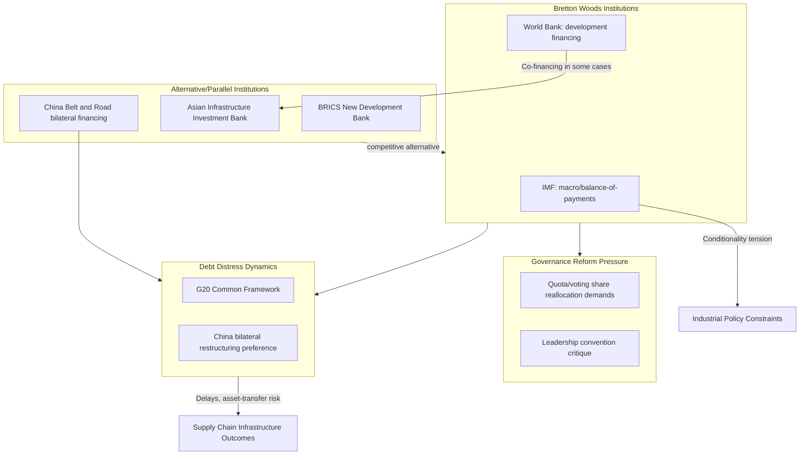

## The IMF and World Bank in an Era of Geoeconomic Competition

### Overview

The International Monetary Fund (IMF) and World Bank — the two core Bretton Woods institutions established in 1944 — face mounting pressure to adapt their governance, lending practices, and strategic relevance amid intensifying great-power competition and the parallel rise of alternative financing architectures (BRICS+ New Development Bank, China's Belt and Road Initiative, AIIB). This topic connects directly to supply chain geopolitics through development financing's role in shaping infrastructure, critical minerals access, and debt dynamics in the states that host key supply chain nodes.

### Institutional Roles and Mandates

**Key Points**

- **IMF mandate**: Primarily focused on macroeconomic and financial stability — balance-of-payments support, exchange-rate surveillance, and crisis lending, typically attached to policy conditionality (structural adjustment, fiscal consolidation, governance reforms).
- **World Bank mandate**: Primarily focused on long-term development financing — infrastructure, poverty reduction, and (increasingly) climate and health financing, operating through the International Bank for Reconstruction and Development (IBRD, middle-income lending) and the International Development Association (IDA, concessional lending to the poorest states).
- **Governance structure**: Both institutions use quota/shareholding-weighted voting systems historically dominated by the US and European states; the US retains an effective veto over major decisions at both institutions due to voting-share thresholds requiring supermajority approval for key structural changes.
- **Leadership convention**: An informal but persistent convention reserves the IMF Managing Director position for a European nominee and the World Bank presidency for a US nominee — a practice increasingly criticized as anachronistic given the shifting weight of the global economy toward Asia and other emerging regions.

### Governance Reform Pressure

**Key Points**

- **Quota reform demands**: Emerging economies (led by China, India, and other large developing states) have long pushed for quota reallocation to better reflect current economic weight, since existing quota formulas still substantially overweight the US and European shareholding relative to contemporary GDP and trade shares.
- **2010 quota reform delay**: A 2010 IMF quota reform agreement, which would have modestly increased China's and other emerging economies' voting share, faced years of delay in US congressional ratification, only taking effect in 2016 — an episode frequently cited by critics as illustrating the institutions' governance rigidity and slow responsiveness to shifting economic realities.
- **Persistent US veto leverage**: Because major IMF decisions require an 85% supermajority and the US alone holds roughly 16–17% of voting share, the US retains unilateral veto power over key structural changes — a structural feature that shapes both the pace of reform and the credibility of the institutions as genuinely multilateral rather than US-anchored.
- [Inference] The slow pace of formal governance reform, relative to the speed of underlying global economic power shifts, is a primary driver of emerging-economy interest in alternative institutions (NDB, AIIB) that offer more balanced founding-member shareholding structures from inception.

### Competition from Alternative Institutions

**Key Points**

- **Asian Infrastructure Investment Bank (AIIB)**: Founded 2016, China-headquartered, with over 100 members including many Western states (UK, Germany, and others notably joined despite initial US objections) — positioned as a complementary rather than fully substitutive institution, often co-financing projects alongside the World Bank.
- **New Development Bank (NDB)**: BRICS-founded institution offering infrastructure financing with comparatively fewer explicit governance conditions than traditional IMF/World Bank lending, appealing to borrowers seeking financing without associated policy-reform requirements.
- **Belt and Road Initiative bilateral financing**: China's BRI represents by far the largest-scale alternative financing channel, though structured primarily as bilateral state-to-state and state-bank lending rather than a multilateral institution, and criticized by Western analysts for limited transparency in loan terms and debt-sustainability practices — critiques BRI proponents dispute as reflecting Western institutional self-interest rather than neutral assessment.
- **Comparative lending speed and conditionality**: A frequently cited borrower preference for BRI/NDB financing relates to faster disbursement timelines and fewer explicit governance conditions compared to IMF/World Bank processes, though [Speculation] the degree to which this reflects genuinely superior terms versus different (and in some cases less transparent) risk allocation remains disputed in development-finance research.

### Debt Distress and Restructuring Complications

**Key Points**

- **Rising debt distress among low-income borrowers**: A substantial number of low- and middle-income countries have entered or approached debt distress in recent years, driven by a combination of pandemic-era borrowing, rising global interest rates, and currency depreciation increasing the local-currency cost of dollar-denominated debt service.
- **G20 Common Framework limitations**: The G20's Common Framework for debt treatment (established 2020) has faced significant implementation delays and coordination difficulties, in substantial part because it was designed primarily around Paris Club creditor practices and has struggled to effectively incorporate China — now the largest bilateral creditor to many distressed low-income states — into a unified restructuring process.
- **China's creditor coordination challenges**: China's preference for bilateral, case-by-case debt restructuring negotiations (rather than participating in standardized multilateral frameworks) has complicated and in several cases significantly delayed comprehensive debt-restructuring processes (Zambia and Sri Lanka being frequently cited examples), since comprehensive restructuring typically requires coordinated agreement across all major creditors.
- **Supply chain infrastructure debt linkage**: A substantial share of the debt distress among affected states is linked to infrastructure financing (ports, railways, energy projects) directly relevant to global supply chain connectivity, meaning debt-restructuring outcomes have direct bearing on the completion, ownership structure, and strategic control of supply-chain-relevant infrastructure assets.

### Supply Chain Relevance

**Key Points**

- **Infrastructure financing as supply chain enabler**: World Bank and IMF-adjacent financing (alongside BRI and NDB alternatives) directly shapes the pace and location of port, rail, and energy infrastructure development that determines which states can effectively participate in reconfigured global supply chains (e.g., friend-shoring destination competitiveness depends heavily on infrastructure quality).
- **Debt-driven asset transfer risk**: Debt distress linked to infrastructure financing has, in specific documented cases (Sri Lanka's Hambantota Port lease to a Chinese state enterprise following debt-service difficulty), resulted in strategic infrastructure assets shifting toward creditor-state control or influence — a dynamic Western analysts have termed "debt-trap diplomacy," though this characterization and its generalizability beyond a small number of cited cases remains a subject of academic and policy dispute, with some researchers arguing the pattern is less widespread and more case-specific than the phrase implies.
- **IMF program conditionality and industrial policy tension**: Traditional IMF fiscal-consolidation conditionality can constrain borrower states' capacity to pursue active industrial policy (subsidies, state investment) aimed at building domestic supply chain capacity — creating tension between IMF program requirements and the industrial-policy approaches increasingly favored globally, including by advanced economies pursuing their own reshoring subsidies.
- **Critical minerals financing gap**: Both institutions have faced calls to expand financing specifically targeted at critical minerals extraction and processing capacity in developing states, positioning this financing gap as a live area of institutional competition between Western-aligned financing (World Bank, US Development Finance Corporation, G7 Partnership for Global Infrastructure and Investment) and Chinese-linked alternatives.

### Illustrative Example: Zambia's Debt Restructuring Process

1. Zambia defaulted on external debt in 2020, with a debt stock including substantial bilateral Chinese lending alongside Eurobond and other creditor exposure.
2. Zambia sought restructuring under the G20 Common Framework, requiring coordinated agreement among a creditor committee that included China as the largest bilateral creditor.
3. The restructuring process faced multi-year delays, with disputes centering partly on differing treatment expectations between traditional Paris Club-style creditors and Chinese state-linked lenders, and partly on comparability-of-treatment provisions relative to private bondholders.
4. An agreement in principle was eventually reached, but the multi-year delay illustrates the practical coordination difficulty created by the absence of a unified, universally accepted multilateral debt-restructuring framework capable of efficiently incorporating China's now-central creditor role.
5. [Unverified] The precise terms and long-term sustainability implications of the final restructuring arrangement, and whether it establishes an effective template for future comparable cases, remains a subject of ongoing assessment by debt-sustainability analysts.

### Institutional Landscape Diagram

### Reform Trajectories and Open Questions

- **World Bank "evolution roadmap"**: Recent World Bank reform efforts (particularly under the 2023-launched "evolution roadmap") have sought to expand the institution's mandate toward global public goods (climate, pandemic preparedness) alongside traditional country-level development lending, reflecting recognition that purely bilateral country-lending models may be insufficient for cross-border challenges.
- **Balance sheet optimization proposals**: Both institutions have faced pressure to expand lending capacity through balance-sheet optimization (adjusted capital-adequacy and risk frameworks) rather than relying primarily on new shareholder capital injections, given the political difficulty of securing fresh capital commitments from major shareholders.
- **Persistent legitimacy question**: [Inference] The core unresolved tension is whether incremental governance and mandate reform can sufficiently address emerging-economy grievances about institutional representation, or whether the continued growth of alternative institutions (NDB, AIIB, BRI) will progressively erode Bretton Woods institutions' centrality regardless of reform efforts — a question without clear resolution in current trends, since both processes (reform and alternative-institution growth) are proceeding in parallel rather than one clearly supplanting the other.

### Related Topics

- G20 Common Framework debt restructuring mechanics and China's creditor role
- BRICS New Development Bank institutional comparison
- "Debt-trap diplomacy" debate: Hambantota Port and comparable cases
- IMF quota reform history and voting-share governance structure
- World Bank "evolution roadmap" and global public goods mandate expansion
- Critical minerals development financing gap and G7 alternatives
- Belt and Road Initiative debt transparency and restructuring practices