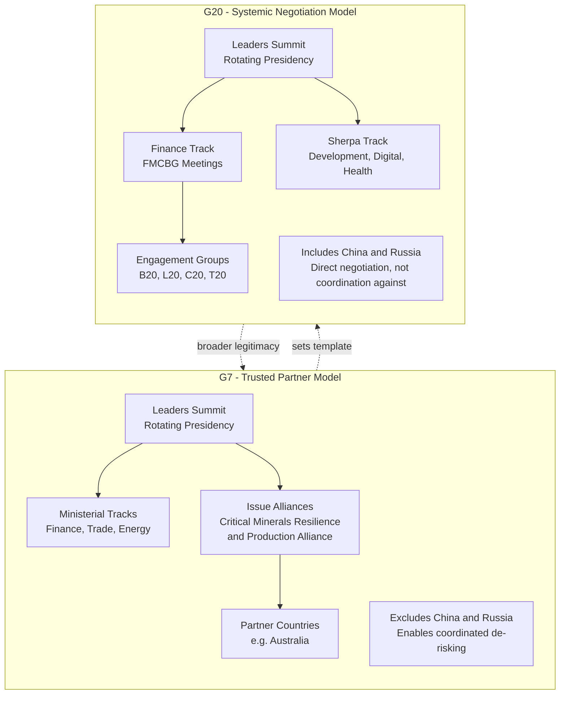

## The G7 and G20 as Coordination Forums

### Definition and Institutional Nature

The G7 (Group of Seven) and G20 (Group of Twenty) are informal, non-treaty-based intergovernmental forums that coordinate macroeconomic policy, trade governance, and — increasingly — supply chain and economic security policy among the world's major economies. Neither body has binding legal authority, a permanent secretariat comparable to the WTO or IMF, or enforcement mechanisms; their output takes the form of leaders' declarations, communiqués, and voluntary "alliances" or "action plans" that rely on member-state implementation.

**Key Points**

- **G7**: United States, Canada, France, Germany, Italy, Japan, United Kingdom, plus the European Union as a non-enumerated participant. Rotating annual presidency (France 2026, hosting the Évian Summit; Canada held 2025).
- **G20**: The G7 members plus Argentina, Australia, Brazil, China, India, Indonesia, Mexico, Russia, Saudi Arabia, South Africa, South Korea, Turkey, plus the EU and African Union. Rotating presidency (United States 2026, hosting the Miami Leaders' Summit and an Asheville, North Carolina finance-track meeting).
- The critical structural distinction for supply chain geopolitics: the G7 excludes China and Russia, making it a "trusted-partner" coordination vehicle for de-risking; the G20 includes China, making it the venue where systemic economic-security disputes must be negotiated directly with the rival power rather than coordinated against it.

### Institutional Architecture

#### G7 Structure

- **Leaders' Track**: Annual summit producing the central declaration.
- **Ministerial Tracks**: Finance, Foreign Affairs, Trade, Energy/Climate, Digital.
- **Sherpa Process**: Senior officials ("sherpas") negotiate text between summits.
- **Working Groups / Alliances**: Issue-specific bodies such as the G7 Critical Minerals Resilience and Production Alliance, first launched under Canada's 2025 presidency and expanded at the 2026 Évian Summit.

#### G20 Structure

- **Leaders' Track**: Annual leaders' summit.
- **Finance Track**: Finance Ministers and Central Bank Governors (FMCBG) meetings, addressing macro-financial and supply-chain-adjacent issues (debt, trade imbalances, sanctions compliance).
- **Sherpa Track**: Broader thematic negotiation (development, health, digital economy, anti-corruption).
- **Engagement Groups**: B20 (business), L20 (labor), C20 (civil society), T20 (think tanks) feed policy recommendations into the official process.

### Mermaid Diagram: Institutional Comparison

### Supply Chain Coordination Mechanisms — Documented 2026 Cases

#### 1. G7 Critical Minerals Resilience and Production Alliance

At the June 2026 Évian Summit, G7 leaders formally established a non-binding G7 Critical Minerals Resilience and Production Alliance, building on the Critical Minerals Production Alliance launched under Canada's 2025 presidency, open to like-minded partners subject to approval of participating countries. The Alliance provides a platform for cooperation within the G7 and partner countries to strengthen diversification and resilience of critical minerals value chains and streamline existing initiatives on critical raw materials.

Concrete commitments include:

- A quantified diversification target: G7+ members aim to reduce dependency on a single supplier outside the G7 and partner countries for rare earths and permanent magnets to under 60% by 2030, with an ambition to reach 50% as soon as possible.
- 195 projects announced since the beginning of 2026 reaching €64 billion of investment, including equity participation and offtake agreements, in critical minerals value chains from G7 and partner countries.
- A commitment to develop a harmonized, end-to-end traceability system for critical minerals based on origin criteria, focusing on interoperability and alignment of technical standards across jurisdictions.
- Adoption of the "G7 Toolkit for Standards-Based Criteria to Identify Risks of Forced Labour in the Extraction of Critical Minerals" (June 2026), used to align extraction practices with labor standards.
- Tasking the IEA and OECD to supply data enabling members to identify and receive early warnings of market distortions and plan coordinated responses.
- Tasking G7 Development Finance Institutions (DFIs) and export credit agencies to enhance coordination with the private sector on critical minerals and enabling infrastructure.

**Example**

A G7 member seeking to reduce reliance on a single non-partner supplier for a specific rare earth would draw on the Alliance's joint offtake mechanism — aggregating demand across multiple G7+ economies to make an alternative mining/processing project commercially viable, since no single G7 economy's demand alone may justify the investment.

#### 2. G20 Finance Track — Supply Chain Resilience Under the 2026 US Presidency

Under the 2026 US G20 presidency, the finance ministerial hosted by Treasury Secretary Scott Bessent in Asheville, North Carolina, linked macroeconomic core priorities — including trade imbalances, sovereign debt, and supply-chain resilience — with sanctions compliance, following Washington's decision to bypass the prior South Africa-led G20 process. The US presidency's stated mandate centers on structural trade imbalances and excess industrial capacity, with G20 policy shifting toward securing energy and technology supply chains.

The broader 2026 US G20 leaders' agenda (Miami Summit) prioritizes energy independence and resilient supply chains as a foundation of economic growth and national security, alongside an innovation line of effort focused on AI and emerging technology diffusion.

Notably, differences over Iran sanctions, tariffs, and China policy were expected to produce a narrower communiqué or chair's summary rather than full consensus — illustrating a structural limitation of the G20 relative to the G7: with China and Russia in the room, contentious economic-security language is harder to agree by consensus. [Inference — this characterization of likely outcomes reflects analyst/reporting expectations ahead of the summit rather than a confirmed final communiqué text.]

#### 3. G20 and Food/Fertilizer Supply Chain Resilience

Separately, the G20 Finance Track (April 2026) addressed agricultural and fertilizer supply chain disruption linked to the Middle East conflict, with many members emphasizing the importance of diversified fertilizer production to buffer the poorest countries from disruptions in food trade supply chains, and calling for avoidance of export prohibitions or restrictions on fertilizers, particularly to protect low-income and vulnerable countries.

### Comparative Table: G7 vs. G20 as Supply Chain Coordination Vehicles

| Dimension | G7 | G20 |
| --- | --- | --- |
| **Membership logic** | Like-minded advanced economies | Systemically important economies (includes rivals) |
| **China/Russia present** | No | Yes |
| **Best suited for** | Coordinated de-risking, joint industrial alliances, standard-setting among trusted partners | Macro-level negotiation, crisis management, broad-based commitments requiring rival buy-in |
| **Binding force** | Non-binding declarations and alliances | Non-binding communiqués or chair's summaries |
| **2026 flagship supply chain output** | Critical Minerals Resilience and Production Alliance | Finance-track supply chain resilience linked to trade imbalances and sanctions |
| **Key structural weakness** | Limited market/resource scale without partner countries; risk of alienating non-members whose cooperation is needed | Consensus routinely blocked by strategic rivalry, producing weaker or narrower outputs |

### Strategic Function Analysis

Policy analysis published ahead of France's 2026 G7 presidency frames the G7's comparative advantage explicitly around China's absence: the G7's format is described as flexible enough to coordinate a network of trusted partners and far better positioned than the G20 to do so, given China's absence from the grouping — functioning, at its best, as an "operating system" for economic security coordination. This analysis proposes three concrete avenues for the G7's 2026 economic-security agenda: economic intelligence as a tool for supply-chain resilience; coordinated introduction of non-price criteria to shape markets for strategic goods (with the caution that measures aimed at reducing dependence on Chinese concentration could unintentionally harm other partners, so criteria should be targeted, proportionate, transparent, and predictable); and a project-based approach to reducing exposure to potential weaponization of supply chains by China.

**Conclusion**

The G7 and G20 occupy structurally distinct and complementary roles in supply chain governance. The G7 functions as an *exclusionary coordination* vehicle — a smaller, values-aligned club capable of building concrete alliances (such as the Critical Minerals Resilience and Production Alliance) and quantified diversification targets precisely because its principal strategic rival is absent from the table. The G20 functions as an *inclusionary negotiation* vehicle — the only major forum where economic security demands must be reconciled directly with China and other systemically significant but non-aligned states, which tends to produce weaker, more general commitments (chair's summaries rather than full communiqués) but retains unique legitimacy for issues requiring near-universal buy-in, such as global food and fertilizer supply security. [Inference — this functional division is an analytical framing supported by the cited 2026 sources' characterizations, not a formally codified division of labor between the two bodies.]

**Related Topics**

- The WTO's role versus G7/G20 informal governance in trade rule-making
- Critical Minerals Production Alliance: implementation mechanics and offtake financing structures
- B20/T20 engagement groups and their influence on official G20 outcomes
- Sanctions coordination and secondary sanctions compliance as a G20 finance-track function
- The IEA and OECD as technical data providers underpinning G7 critical minerals early-warning systems
- Comparing G7 economic security tools to EU "de-risking" and US "small yard, high fence" doctrines
- Food and fertilizer supply chain resilience in multilateral forums (G20, FAO, World Bank)
- Sherpa-track negotiation dynamics and the limits of consensus-based communiqués