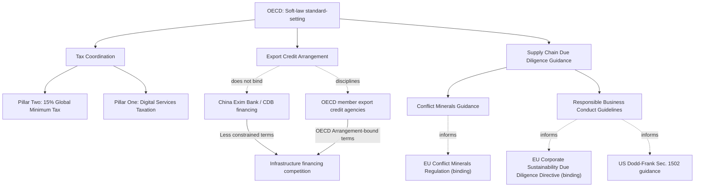

## The OECD and International Regulatory Coordination

### Overview

The Organisation for Economic Co-operation and Development (OECD), founded in 1961 as successor to the Marshall Plan-era Organisation for European Economic Co-operation (OEEC), functions as a "soft law" standard-setting body rather than a binding treaty organization. Its core method — generating shared statistical frameworks, policy guidelines, and non-binding standards that member and increasingly non-member states voluntarily adopt — makes it a distinct but consequential layer of international economic governance, particularly relevant to supply chain geopolitics through its work on international tax coordination, export credit rules, and due-diligence guidance for multinational supply chains.

### Institutional Character

**Key Points**

- **Membership scope**: 38 member countries as of recent expansion (predominantly high-income, market-economy states), though the OECD engages extensively with non-member "key partner" economies (Brazil, China, India, Indonesia, South Africa) and has admitted new members in recent years, reflecting gradual broadening beyond its original transatlantic core.
- **Soft-law mechanism**: Unlike the WTO or IMF, OECD instruments (Guidelines, Recommendations, Declarations) are generally non-binding; influence operates through peer pressure, technical credibility, reputational effects, and voluntary domestic legal incorporation rather than formal enforcement mechanisms.
- **Statistical and analytical infrastructure**: A substantial share of the OECD's practical influence derives from its role as a trusted, methodologically rigorous source of comparative economic statistics and policy analysis (e.g., PISA education rankings, economic outlook forecasts, tax statistics) that shape policy debate even absent binding authority.
- **Consensus-based standard-setting**: Like the WTO, OECD standard development generally proceeds by member consensus, which can slow adoption of contentious new rules but tends to produce standards with broad legitimacy once agreed.

### Key Regulatory Coordination Domains

**International Tax Coordination**

- **Base Erosion and Profit Shifting (BEPS) project**: Launched 2013, developed a 15-action plan addressing multinational corporate tax avoidance strategies (profit-shifting to low-tax jurisdictions, treaty shopping, digital-economy taxation gaps), adopted with varying implementation speed across member and partner states.
- **Global minimum tax (Pillar Two)**: The OECD/G20 Inclusive Framework's 2021 agreement on a 15% global minimum corporate tax rate represents one of the most significant recent achievements in international tax coordination, agreed by over 140 jurisdictions, though implementation has proceeded unevenly, with some major economies (including the US) not having fully enacted matching domestic legislation, creating ongoing coordination gaps. [Unverified] The pace and completeness of full global implementation remains in flux and should be checked against current status given the rapidly evolving legislative landscape across implementing jurisdictions.
- **Digital services taxation (Pillar One)**: A parallel, more contentious workstream addressing taxing rights over large digital/technology firms' profits has faced significantly slower progress and unresolved disagreement, with several states maintaining unilateral digital services taxes in the interim.

**Export Credit and Trade Finance Rules**

- **Arrangement on Officially Supported Export Credits**: An OECD-negotiated framework establishing common minimum terms (interest rates, repayment periods, premium levels) for government-backed export credit agencies among participating states, designed to prevent a subsidy race in officially supported trade finance.
- **Relevance to supply chain competition**: This framework is directly implicated in great-power competition over infrastructure financing, since China's export credit and development-finance institutions (China Export-Import Bank, China Development Bank) operate largely outside the OECD Arrangement's disciplines, giving Chinese state-backed financing greater flexibility on terms — a frequently cited factor in developing-state financing preference patterns.

**Corporate Conduct and Supply Chain Due Diligence**

- **OECD Guidelines for Multinational Enterprises**: Non-binding recommendations covering labor rights, environmental practice, anti-corruption, and (increasingly) supply chain due diligence expectations, implemented through National Contact Points in member states that can receive and mediate complaints against firms.
- **Due Diligence Guidance for Responsible Business Conduct**: Provides a widely referenced framework for supply chain human-rights and environmental due diligence, influencing the design of subsequent binding legislation such as the EU's Corporate Sustainability Due Diligence Directive and various national supply-chain-transparency laws.
- **Conflict minerals guidance**: The OECD Due Diligence Guidance for Responsible Supply Chains of Minerals from Conflict-Affected and High-Risk Areas has become a foundational reference standard incorporated into binding regulations (EU Conflict Minerals Regulation, elements of US Dodd-Frank Section 1502 implementation).

### Supply Chain Relevance

**Key Points**

- **Export credit competition dynamics**: The gap between OECD Arrangement-disciplined export credit terms (available to OECD member exporters) and less-constrained Chinese state financing terms creates a structural competitive disadvantage for OECD-based exporters and financiers bidding on the same infrastructure projects in developing markets — a persistent point of tension in trade-finance policy discussions.
- **Due diligence standard diffusion**: OECD supply chain due-diligence frameworks function as widely adopted "soft law" templates that shape binding national and regional legislation, meaning OECD guidance often precedes and directly informs subsequent mandatory corporate supply-chain-transparency requirements even though the original OECD instruments themselves remain non-binding.
- **Tax coordination and supply chain location decisions**: Global minimum tax implementation reduces the relative tax-arbitrage incentive for multinational firms to locate supply chain and headquarters functions purely for tax-minimization purposes, [Inference] potentially shifting the relative weight of other location factors (labor cost, logistics access, political risk, proximity to end markets) in future supply chain configuration decisions, though the magnitude of this effect will depend heavily on final implementation completeness across major jurisdictions.
- **Critical minerals and responsible sourcing standards**: OECD conflict-minerals and responsible-sourcing guidance increasingly extends beyond its original conflict-mineral focus (tin, tantalum, tungsten, gold) toward broader critical-minerals due diligence expectations relevant to battery and semiconductor supply chains, positioning the OECD as a key standard-setter in the responsible-sourcing dimension of critical minerals competition.

### Illustrative Example: Conflict Minerals Due Diligence Chain

1. A company sourcing tantalum for electronics manufacturing references the OECD Due Diligence Guidance framework's five-step model: establish strong company management systems, identify and assess supply chain risk, design and implement a risk-mitigation strategy, conduct independent third-party audits of smelter/refiner due diligence practices, and publicly report on due diligence findings.
2. This voluntary OECD framework has been substantively incorporated into the EU Conflict Minerals Regulation (binding for EU importers above certain volume thresholds since 2021) and referenced in US Dodd-Frank Section 1502 implementing guidance.
3. Downstream electronics manufacturers increasingly require supplier attestation against OECD-aligned due-diligence frameworks as a contractual condition, illustrating how non-binding OECD guidance propagates through supply chains via a combination of binding regional regulation and voluntary commercial adoption.

### Regulatory Coordination Architecture

### Structural Tensions and Critiques

- **Non-binding nature limits enforcement**: The OECD's fundamental reliance on soft law means compliance depends on member reputational concern and voluntary domestic incorporation, offering no direct enforcement mechanism comparable to WTO dispute settlement or binding treaty obligations — a structural limitation particularly visible where major non-member economies (China) are not bound by OECD frameworks that directly compete with their financing and development practices.
- **Membership composition critique**: The OECD's predominantly high-income, market-economy membership has drawn longstanding criticism as insufficiently representative of the broader global economy, particularly as economic weight continues shifting toward non-member emerging economies — though the organization's expanding "key partner" engagement and recent membership growth partially address this critique.
- **Fragmentation risk from uneven implementation**: Global minimum tax implementation gaps (particularly major-economy non-enactment) illustrate a recurring OECD coordination challenge: agreement at the negotiating table does not guarantee uniform domestic legislative follow-through, creating residual competitive distortion even after nominal consensus is reached.
- [Speculation] Whether OECD-originated soft-law standards will continue to function as effective precursors to binding regulation at the pace observed in the due-diligence domain, or whether growing great-power fragmentation will increasingly bypass OECD consensus-building in favor of more overtly bloc-specific standard-setting (e.g., through G7 or EU-only initiatives), remains an open question without clear resolution in current trends.

### Related Topics

- OECD/G20 Inclusive Framework and global minimum tax implementation status
- EU Corporate Sustainability Due Diligence Directive and supply chain legal exposure
- Conflict minerals regulation: Dodd-Frank Section 1502 vs. EU Regulation comparison
- Export credit agency competition: OECD Arrangement vs. Chinese state financing
- Responsible sourcing standards for critical minerals and battery supply chains
- G7 Partnership for Global Infrastructure and Investment as a financing alternative
- OECD key partner engagement and non-member economic integration