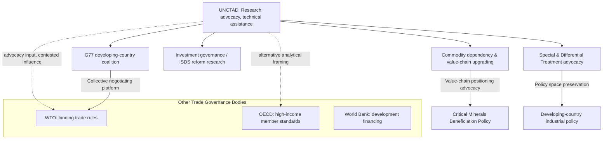

## UNCTAD and Global South Trade Advocacy

### Overview

The United Nations Conference on Trade and Development (UNCTAD), established in 1964, functions as the principal UN-system body dedicated to representing developing-country interests in global trade and development policy. Unlike the WTO's binding trade-rule focus or the OECD's high-income-member standard-setting, UNCTAD operates as a research, consensus-building, and advocacy institution explicitly oriented toward addressing structural inequities developing states argue are embedded in the broader global trade and investment architecture. Its relevance to supply chain geopolitics lies in its role shaping the intellectual and diplomatic framing around commodity dependency, investment governance, and developing-country supply chain positioning.

### Institutional Origins and Character

**Key Points**

- **Founding context**: Established in 1964 amid decolonization-era concern that GATT (the WTO's predecessor) was structured primarily around industrialized-country trade interests, with insufficient attention to the distinct challenges facing newly independent developing states — commodity price volatility, terms-of-trade deterioration, and limited industrial capacity.
- **G77 institutional linkage**: UNCTAD's founding is closely linked to the emergence of the Group of 77 (G77), a coalition of developing states (now encompassing 130+ members, still using the original "G77" name despite far larger membership) that has historically used UNCTAD conferences as a primary venue for collective developing-country trade-policy advocacy.
- **Research and advocacy rather than binding rule-making**: UNCTAD does not create binding trade law; its influence operates through research publications (the World Investment Report, Trade and Development Report), technical assistance to developing-country trade negotiators, and periodic quadrennial ministerial conferences that shape international policy discourse.
- **Structural economics intellectual tradition**: UNCTAD's analytical framework has historically drawn on structuralist and dependency-theory-influenced economics (associated with its first Secretary-General, Raúl Prebisch), emphasizing structural terms-of-trade disadvantages facing commodity-exporting developing economies relative to industrialized manufacturing exporters — a perspective that has evolved but continues to inform the institution's analytical orientation.

### Core Advocacy Themes

**Key Points**

- **Commodity dependency and terms-of-trade concerns**: UNCTAD has long highlighted the structural vulnerability of states whose exports remain concentrated in raw commodities, arguing this exposes them to price volatility and limits their capacity to capture higher-value-added stages of global supply chains.
- **Special and Differential Treatment (SDT)**: UNCTAD has been a consistent advocate for preserving and expanding SDT provisions in international trade rules — allowing developing countries longer implementation timelines, reduced obligations, or preferential market access — a principle also embedded in WTO agreements but subject to ongoing contestation regarding scope and eligibility criteria.
- **Investment governance and Investor-State Dispute Settlement (ISDS) reform**: UNCTAD has produced influential research critiquing aspects of traditional ISDS mechanisms in international investment agreements, arguing certain provisions can constrain legitimate developing-country regulatory policy space (environmental, public health, labor regulation) in ways that outweigh their intended investment-protection benefits.
- **Digital economy and e-commerce governance**: More recent UNCTAD work has focused on ensuring developing-country participation and data-governance interests are represented in international digital trade and e-commerce rule-making discussions, an area where technical capacity gaps risk further marginalizing developing-state negotiating positions.

### Supply Chain Relevance

**Key Points**

- **Value-chain upgrading advocacy**: A central and recurring UNCTAD policy theme is encouraging developing states to move beyond raw commodity export toward higher-value-added participation in global supply chains (processing, manufacturing, and eventually design/innovation stages) — directly relevant to contemporary debates over critical minerals processing location (e.g., whether cobalt or nickel should be exported raw or processed domestically before export).
- **Global Trade Update and supply chain disruption monitoring**: UNCTAD regularly publishes analysis tracking global trade flow shifts, supply chain reconfiguration patterns (friend-shoring, nearshoring), and their differential impact on developing versus developed economies, providing one of the more comprehensive developing-country-focused data sources on these trends.
- **Commodities and Development Report**: UNCTAD's periodic commodities-focused reporting addresses critical minerals dependency dynamics directly, examining how developing commodity-exporting states can better capture value from the accelerating global demand for battery metals and other energy-transition-critical minerals rather than remaining confined to raw extraction.
- **Landlocked and small-island developing state advocacy**: UNCTAD maintains dedicated programming addressing the distinct supply chain and logistics vulnerabilities of landlocked developing countries (dependent on transit through neighboring states) and small-island developing states (facing acute shipping-connectivity and scale disadvantages), populations often underrepresented in broader trade-policy discussions dominated by larger economies.

### Illustrative Example: Critical Minerals Value-Chain Positioning

UNCTAD's advocacy approach to critical minerals illustrates its broader institutional function:

1. UNCTAD research documents that a large share of value captured from battery-metal supply chains (lithium, cobalt, nickel) accrues to downstream processing, battery manufacturing, and end-product assembly stages, disproportionately located outside the resource-producing developing states themselves.
2. UNCTAD publications and ministerial-conference discussions advocate for developing-country policy space to pursue local beneficiation requirements (e.g., export restrictions on raw ore paired with domestic processing investment incentives, following patterns seen in Indonesia's nickel policy) without this being constrained by international trade or investment-agreement obligations that might otherwise restrict such industrial policy.
3. UNCTAD technical assistance programs support developing-country trade negotiators in structuring critical-minerals investment agreements and mining-sector contracts that aim to secure a larger share of downstream value capture, rather than accepting terms that confine the host state to raw-material export.
4. This exemplifies UNCTAD's characteristic function: providing analytical framing, technical capacity support, and diplomatic advocacy platforms for positions developing states might otherwise struggle to articulate with comparable technical sophistication in negotiations against better-resourced developed-economy and multinational-corporate counterparts.

### UNCTAD in the Broader Institutional Landscape

### Structural Limits and Critiques

- **Advocacy without binding authority**: UNCTAD's fundamental limitation, relative to the WTO, is its lack of binding rule-making or dispute-settlement authority — its influence is confined to shaping discourse, providing technical capacity support, and offering a diplomatic platform, meaning its policy recommendations carry no formal enforcement mechanism.
- **Institutional relevance debates**: UNCTAD has periodically faced questions about its relevance and mandate overlap with other institutions (WTO for trade rules, UNIDO for industrial development, World Bank for financing), with some critics arguing its research-and-advocacy function could be more efficiently absorbed elsewhere, while defenders emphasize its distinct value as a developing-country-oriented institutional voice largely absent from more industrialized-country-dominated bodies.
- **G77 internal heterogeneity**: Similar to the broader Global South non-alignment dynamic, the G77's collective advocacy platform contains substantial internal diversity of interest (major emerging economies like India, Brazil, and China alongside least-developed and small-island states with very different structural positions), complicating fully unified negotiating positions on any given trade issue.
- [Inference] UNCTAD's continued relevance likely depends on its capacity to remain a credible, technically rigorous analytical source on emerging supply chain and critical-minerals value-chain issues specifically, since this is an area where developing-country structural interests remain distinctly underrepresented in dominant Western and Chinese-led institutional frameworks alike — though whether this niche proves sufficient to sustain the institution's broader diplomatic weight over time is not clearly resolved by current trends.

### Related Topics

- Special and Differential Treatment debates in WTO negotiations
- Critical minerals beneficiation policy: Indonesia's nickel precedent
- Investor-State Dispute Settlement reform proposals
- Terms-of-trade theory and commodity dependency (Prebisch-Singer hypothesis)
- Landlocked developing country transit and logistics vulnerability
- G77 coalition dynamics and internal heterogeneity
- UNCTAD World Investment Report and global FDI flow analysis