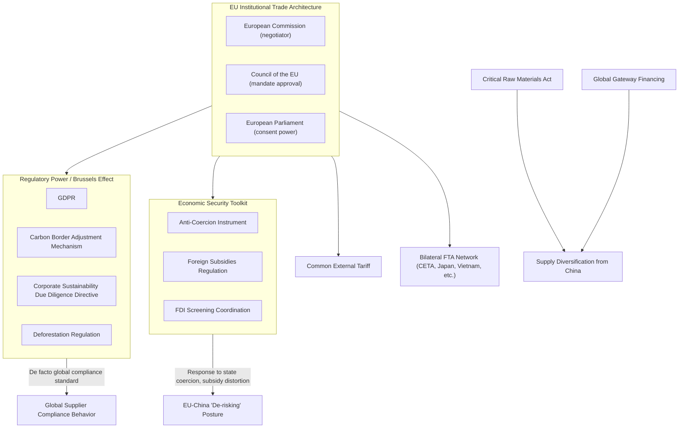

## The European Union as a Supranational Trade Actor

### Overview

The European Union occupies a structurally unique position in global trade governance: it is the only major international economic actor that exercises exclusive, supranational trade competence on behalf of its 27 member states, meaning trade policy — tariff-setting, trade-agreement negotiation, and increasingly, sanctions and economic-security instruments — is conducted centrally by EU institutions rather than by individual member states. This gives the EU negotiating weight comparable to the US or China in aggregate market size while operating through a distinctive multi-level governance structure. For supply chain geopolitics, the EU's trade-policy architecture matters both as a major destination market shaping global supplier compliance behavior and as an increasingly active user of economic-security instruments.

### Institutional Architecture of EU Trade Competence

**Key Points**

- **Exclusive competence under the Treaty on the Functioning of the European Union (TFEU)**: Common commercial policy (Article 207 TFEU) is an area of exclusive EU competence, meaning individual member states cannot independently negotiate trade agreements or set tariffs — a degree of supranational delegation without parallel among other major economic blocs.
- **European Commission as negotiator**: The European Commission (specifically the Directorate-General for Trade) negotiates trade agreements on behalf of all member states under a mandate approved by the Council of the EU, with the European Parliament holding consent power over final agreement ratification since the Lisbon Treaty (2009) expanded Parliament's trade-policy role.
- **Common External Tariff**: EU member states apply a unified tariff schedule to imports from non-EU countries, functioning as a single customs territory — the foundational mechanism enabling the EU to negotiate as one actor in multilateral and bilateral trade contexts.
- **Mixed agreements complication**: Some trade agreements (particularly comprehensive ones touching areas of shared EU-member-state competence, such as investment protection) require ratification by both the EU institutions and individual national (and sometimes regional) parliaments — a process that has historically caused significant delays or complications (e.g., the Belgian region of Wallonia's initial 2016 blocking of the EU-Canada CETA agreement before a resolution was reached).

### EU Trade Agreement Network

**Key Points**

- **Extensive bilateral FTA network**: The EU maintains one of the world's most extensive networks of bilateral and regional free trade agreements, including agreements with Canada (CETA), Japan, South Korea, Vietnam, Mercosur (concluded in principle but facing ongoing ratification difficulty), and numerous others.
- **Deep and Comprehensive Free Trade Areas (DCFTAs)**: A distinctive EU agreement category used particularly with Eastern Partnership countries (Ukraine, Moldova, Georgia), combining trade liberalization with regulatory alignment toward EU standards — functioning as both trade instruments and geopolitical tools reinforcing these states' Western orientation.
- **Trade agreements as geopolitical instruments**: EU trade agreements increasingly incorporate explicit political and values-based conditionality (human rights clauses, Paris Agreement climate commitments as "essential elements" clauses enabling suspension), reflecting the EU's characteristic approach of embedding regulatory and normative objectives within trade instruments rather than treating trade policy as purely commercial.
- **Mercosur agreement complications**: The EU-Mercosur agreement (Brazil, Argentina, Paraguay, Uruguay), concluded in principle in 2019 and again updated in 2024, has faced persistent ratification obstacles due to European agricultural-sector opposition and environmental/deforestation concerns — illustrating how EU internal political economy can significantly constrain even completed negotiations from reaching final implementation.

### EU as Regulatory Power: The "Brussels Effect"

**Key Points**

- **Definition and mechanism**: The "Brussels Effect" (a term coined by legal scholar Anu Bradford) describes the phenomenon whereby EU regulatory standards become de facto global standards, as multinational firms find it more efficient to apply EU-compliant standards globally rather than maintaining separate product lines or processes for different regulatory jurisdictions.
- **GDPR as paradigmatic example**: The EU's General Data Protection Regulation (2018) is frequently cited as the clearest instance of this effect, having substantially influenced data-protection legislation design in numerous non-EU jurisdictions and corporate global data-handling practices well beyond firms' strict EU-market obligations.
- **Extension to supply chain regulation**: This regulatory-power dynamic increasingly extends to supply-chain-specific instruments — the Corporate Sustainability Due Diligence Directive (CSDDD), the Carbon Border Adjustment Mechanism (CBAM), the Deforestation Regulation (EUDR), and battery-sourcing regulations — each imposing compliance requirements that reach beyond EU-based firms to any supplier seeking EU market access, effectively projecting EU standards into global supply chain practice.
- **Carbon Border Adjustment Mechanism (CBAM)**: A mechanism imposing a carbon-price-equivalent charge on imports of specified carbon-intensive goods (steel, cement, aluminum, fertilizers, electricity, hydrogen), designed to prevent "carbon leakage" while functioning as a significant supply-chain-reshaping instrument that incentivizes exporting countries to adopt comparable carbon-pricing mechanisms.

### The EU's Emerging Economic-Security Toolkit

**Key Points**

- **Anti-Coercion Instrument (ACI)**: Adopted 2023, provides the EU with a mechanism to respond to third-country economic coercion against EU member states (a response partly to China's informal trade retaliation against Lithuania following Lithuania's deepened Taiwan ties) — allowing coordinated EU-wide countermeasures rather than requiring the targeted individual member state to respond alone.
- **Foreign Subsidies Regulation**: Grants the European Commission authority to investigate and address market-distorting effects of foreign government subsidies benefiting firms operating in the EU single market — directly targeting concerns about Chinese state-subsidized firms gaining unfair competitive advantage in EU markets, including in supply-chain-relevant sectors like electric vehicles and renewable energy equipment.
- **Screening of foreign direct investment**: An EU framework (not itself mandatory but coordinating member-state practice) for screening inbound foreign investment in sensitive sectors, reflecting growing EU alignment with the broader Western trend toward investment-screening as an economic-security tool, particularly regarding Chinese investment in critical infrastructure and technology firms.
- **"De-risking" adoption**: The EU has explicitly adopted "de-risking, not decoupling" language (paralleling G7 framing) regarding China economic relations, seeking to reduce specific strategic dependencies (critical raw materials, certain technology inputs) while preserving the broader, substantial EU-China trade relationship.

### Supply Chain Relevance

**Key Points**

- **Regulatory compliance cost as market-access gate**: EU supply-chain regulations (CSDDD, CBAM, EUDR, battery regulation) function as de facto global standards for any supplier seeking EU market access, meaning firms across global supply chains — regardless of domicile — increasingly must build compliance capacity oriented around EU requirements specifically.
- **Critical Raw Materials Act**: The EU's 2023 Critical Raw Materials Act sets domestic extraction, processing, and recycling capacity benchmarks (e.g., targets for the share of EU annual consumption met by domestic capacity) explicitly aimed at reducing dependency on single-source suppliers (predominantly China) for strategic minerals essential to green and digital-transition supply chains.
- **Trade defense instrument activism**: The EU has become more active in deploying anti-subsidy and anti-dumping measures in strategically sensitive sectors, most notably the 2024 provisional countervailing duties imposed on Chinese-made electric vehicles following an EU-initiated anti-subsidy investigation — a significant instance of the EU using traditional trade-defense tools explicitly framed around supply chain and industrial-strategy concerns rather than purely commercial dumping complaints.
- **Global Gateway as financing counterweight**: The EU's Global Gateway infrastructure-financing initiative (launched 2021, targeting approximately €300 billion in mobilized investment through 2027) functions as the EU's contribution to the broader G7-aligned effort to offer infrastructure-financing alternatives to China's Belt and Road Initiative, with direct relevance to supply-chain-connectivity infrastructure in partner regions.

### Illustrative Example: CBAM Implementation Effect on Steel Supply Chains

1. A non-EU steel exporter (e.g., based in a country with limited domestic carbon pricing) seeking to sell into the EU market must, under CBAM's transitional reporting phase (begun October 2023) and subsequent full implementation, report the embedded carbon emissions associated with their production process.
2. Beginning with full CBAM implementation, importers must purchase CBAM certificates corresponding to the carbon price differential between the exporting country's domestic carbon cost (if any) and the EU's carbon price under its Emissions Trading System.
3. This creates a direct financial incentive for exporting-country steel producers to invest in lower-carbon production processes (e.g., electric-arc-furnace or hydrogen-based direct-reduction methods) specifically to remain cost-competitive in the EU market, illustrating the Brussels Effect's operation in a concrete supply-chain-reshaping context.
4. [Inference] Given the EU's substantial share of global steel import demand, CBAM is likely to exert meaningful influence on global steel-industry decarbonization investment patterns even among producers with limited direct EU sales exposure, as industry-wide production-process standards shift in response to the EU's benchmark-setting role — though the precise magnitude of this spillover effect across the full range of CBAM-covered sectors remains to be fully observed as implementation matures.

### EU Trade Governance Architecture

### Structural Tensions and Limits

- **Member-state unanimity friction in adjacent areas**: While trade policy itself is exclusive EU competence, closely related areas (foreign policy sanctions, some investment-agreement elements) often still require unanimity among member states, creating friction points where trade-adjacent economic-security measures can be slowed or blocked by individual member-state objection — a persistent structural tension given the EU's otherwise centralized trade authority.
- **Ratification bottlenecks**: The mixed-agreement ratification process (Mercosur, and historically CETA) illustrates how domestic and even sub-national political dynamics in individual member states can indefinitely delay agreements the Commission has already substantively concluded, creating a gap between EU negotiating capacity and final implementation certainty.
- **Internal economic divergence**: Member states hold varying degrees of economic exposure to and preference regarding China relations specifically (Germany's substantial automotive-sector China exposure versus more security-focused positions from states like Lithuania), complicating fully unified EU posture on China-related trade and economic-security measures despite formal supranational trade competence.
- [Speculation] Whether the EU's expanding economic-security toolkit (ACI, Foreign Subsidies Regulation, investment screening) will be deployed with sufficient frequency and coherence to constitute a genuinely comparable economic-statecraft capacity to the US, or will remain comparatively underused due to internal political constraints and industry lobbying, remains contested among EU trade-policy analysts, without clear resolution based on the still-limited track record of these relatively new instruments.

### Related Topics

- The Brussels Effect and global regulatory standard diffusion
- Carbon Border Adjustment Mechanism implementation timeline and sector coverage
- EU Critical Raw Materials Act targets and diversification strategy
- EU-China electric vehicle anti-subsidy investigation and countervailing duties
- Global Gateway vs. Belt and Road Initiative financing comparison
- EU Anti-Coercion Instrument and the Lithuania-China trade dispute precedent
- Mixed agreement ratification complications: CETA and Mercosur case studies