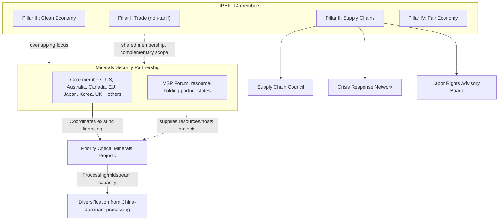

## Minilateral Groupings: IPEF and the Minerals Security Partnership

### Overview

Minilateralism describes a coordination model that sits between bilateral deals and full multilateral institutions like the WTO: a smaller, purpose-built group of states cooperates on specific functional issues without pursuing a comprehensive treaty-bound trade agreement. The Indo-Pacific Economic Framework for Prosperity (IPEF) and the Minerals Security Partnership (MSP) exemplify this model as applied to supply chain resilience specifically — both emerged directly from the recognition that traditional FTA negotiation is politically difficult (particularly for the US, given domestic market-access sensitivities) while targeted, non-tariff functional cooperation remains achievable.

### Why Minilateralism Emerged as a Preferred Model

**Key Points**

- **US domestic political constraint on market-access agreements**: Following the 2017 US withdrawal from the Trans-Pacific Partnership, subsequent US administrations have faced substantial domestic political resistance to new comprehensive trade agreements involving tariff reduction and market-access commitments, pushing US Indo-Pacific economic strategy toward non-tariff functional cooperation frameworks instead.
- **Speed and flexibility advantages**: Minilateral groupings can be assembled and modified more quickly than treaty-based multilateral institutions, since they typically avoid the ratification requirements, binding dispute mechanisms, and consensus-among-many-members constraints that slow full FTA or multilateral-institution processes.
- **Issue-specific coalition flexibility**: Minilateral structures allow states to cooperate deeply on a narrow functional issue (supply chain resilience, critical minerals, digital trade standards) without requiring alignment across the full spectrum of trade policy, enabling participation from states that might resist a comprehensive alliance-style commitment.
- [Inference] The proliferation of minilateral groupings across the Indo-Pacific and critical-minerals domains reflects a broader structural shift in trade governance: as full multilateral consensus (WTO) and comprehensive bilateral/regional FTAs become harder to conclude amid growing US-China competition, functional minilateralism has emerged as the most politically viable remaining tool for achieving meaningful economic coordination among like-minded states.

### Indo-Pacific Economic Framework for Prosperity (IPEF)

**Key Points**

- **Launch and membership**: Announced May 2022, IPEF comprises 14 member economies including the US, Japan, South Korea, India, Australia, New Zealand, and most ASEAN states — representing a substantial share of global GDP despite lacking the tariff-reduction core of traditional trade agreements.
- **Four-pillar structure**:
  1. **Trade** (Pillar I): Covers labor, environment, digital trade, and regulatory cooperation — notably excluding traditional market-access/tariff negotiations, a deliberate design choice reflecting US political constraints.
  2. **Supply Chains** (Pillar II): The pillar most directly relevant to this topic, establishing crisis-response coordination mechanisms and supply chain resilience commitments among members.
  3. **Clean Economy** (Pillar III): Covers clean-energy transition cooperation, including critical minerals and clean-technology supply chains.
  4. **Fair Economy** (Pillar IV): Addresses anti-corruption and tax cooperation.
- **Non-tariff design as both feature and limitation**: IPEF's explicit exclusion of market-access negotiations has drawn criticism from several partner states (particularly some ASEAN members) who view traditional trade-agreement market access as the primary incentive for deep economic cooperation with the US — meaning IPEF's practical draw depends heavily on the substantive value of its non-tariff commitments.
- **Supply Chain pillar entry into force**: The IPEF Supply Chain Agreement was the first pillar to reach formal agreement (2023) and enter into force, establishing a Supply Chain Council (coordinating sector-specific action plans), a Crisis Response Network (enabling rapid member consultation during supply disruptions), and a Labor Rights Advisory Board — representing a concrete, if still early-stage, institutional structure for coordinated supply chain resilience response.

### The Minerals Security Partnership (MSP)

**Key Points**

- **Launch and purpose**: Announced June 2022 by the US State Department, the MSP brings together a group of countries (including the US, Australia, Canada, EU, Japan, South Korea, UK, and other members added subsequently) explicitly to catalyze investment in critical minerals supply chains outside China-dominated processing and refining capacity.
- **Focus on the "midstream" processing bottleneck**: The MSP's distinctive strategic focus is not primarily on raw extraction (where supply is often geographically diverse) but on processing and refining capacity — the midstream stage where China holds an especially concentrated global market share for numerous critical minerals (rare earths, lithium, cobalt, graphite processing in particular).
- **Project-based coordination model**: Rather than functioning as a standing institution with independent financing capacity, the MSP primarily coordinates existing national financing instruments (US Export-Import Bank, US International Development Finance Corporation, comparable export-credit and development-finance agencies among other members) toward jointly identified priority critical-minerals projects.
- **MSP Forum expansion**: A broader "MSP Forum," launched to include resource-rich partner countries (rather than solely processing/consuming-country members), has expanded engagement to states such as several African, Latin American, and Central Asian critical-minerals producers, reflecting recognition that durable supply diversification requires direct engagement with resource-holding states rather than only coordination among consuming/processing economies.

### Supply Chain Relevance

**Key Points**

- **Direct response to single-point-of-failure concentration**: Both IPEF's Supply Chain pillar and the MSP were designed explicitly in response to recognized over-concentration risk — Chinese dominance in critical minerals processing (MSP's focus) and broader supply chain vulnerability exposed by COVID-19-era disruptions and geopolitical tension (IPEF's broader focus).
- **Crisis-response institutionalization**: IPEF's Crisis Response Network represents one of the more concrete institutional innovations in this space — a standing mechanism for member states to rapidly consult and potentially coordinate response during acute supply chain disruption events (analogous in concept, though smaller in scale, to emergency coordination mechanisms in other policy domains).
- **Complementary rather than overlapping scope**: IPEF's supply chain focus is broad and cross-sectoral (semiconductors, pharmaceuticals, critical minerals, and other strategic goods), while the MSP is narrowly focused on critical minerals processing specifically — the two groupings have overlapping membership (many MSP members also participate in IPEF) and are generally understood as complementary rather than competing initiatives within the broader US-led Indo-Pacific and allied economic-security architecture.
- **Financing gap addressed through coordination, not new capital pools**: A key structural feature distinguishing the MSP from institutions like the NDB or AIIB is that it does not itself provide financing — its function is coordinating and de-risking projects for existing national financing institutions, meaning its practical impact depends heavily on member states' willingness to direct their own bilateral financing toward jointly prioritized projects.

### Illustrative Example: MSP-Coordinated Graphite Processing Project (Generalized Pattern)

A generalized pattern illustrating how MSP coordination is designed to function:

1. MSP members' technical working groups identify a strategic gap — for example, insufficient non-Chinese battery-grade graphite processing capacity, given China's dominant global share of graphite anode processing.
2. A processing project in a partner country (potentially an MSP Forum resource-holding member) is identified as a priority candidate, based on resource availability, project viability, and alignment with member supply-diversification objectives.
3. Rather than the MSP itself financing the project, member national development-finance institutions (e.g., US DFC, Canada's export-credit agency, or comparable Japanese or Korean institutions) are encouraged to coordinate financing packages, potentially blending concessional and commercial capital.
4. The project's output is intended to supply MSP-member battery and technology manufacturers, reducing collective reliance on Chinese-processed graphite for the associated supply chain segment.
5. [Speculation] The pace at which such coordinated projects can meaningfully shift the aggregate processing-capacity balance away from China's current dominant share remains uncertain and disputed among critical-minerals analysts, given the multi-year lead times typically required for new processing facility development and the scale gap between currently announced projects and total addressable demand.

### Minilateral Architecture Diagram

### Structural Tensions and Critiques

- **Limited binding commitment depth**: Both IPEF and the MSP rely on voluntary cooperation and coordination rather than binding treaty obligations, meaning their practical effectiveness depends substantially on sustained member political will rather than enforceable legal commitment — a structural limitation shared with most minilateral formats.
- **Partner-state market-access disappointment**: Several IPEF partner states, particularly some ASEAN members with strong traditional interest in US market access, have expressed disappointment that IPEF's design excludes tariff reduction, questioning whether the framework offers sufficient concrete economic benefit to justify the political capital invested in participation.
- **Coordination-only financing model limitation**: The MSP's reliance on coordinating existing national financing instruments rather than pooling dedicated new capital means its scale is inherently constrained by the sum of participating states' individual financing capacity and political willingness to prioritize MSP-identified projects over competing domestic or other international priorities.
- [Inference] The long-term significance of both IPEF and the MSP will likely depend less on their formal institutional design and more on whether member states sustain political and financial commitment over the multi-year timelines required for supply chain diversification (particularly critical minerals processing capacity, which involves substantial capital investment and lead time) — a test that has not yet been fully evidenced given both groupings' relatively recent establishment.

### Related Topics

- IPEF Supply Chain Agreement and the Crisis Response Network mechanics
- China's critical minerals processing market concentration by mineral category
- US Development Finance Corporation and allied export-credit coordination
- ASEAN states' market-access expectations and IPEF reception
- Indonesia's nickel policy as a critical-minerals value-chain case study
- G7 Critical Minerals Security Initiative and MSP overlap
- The Trans-Pacific Partnership's collapse and its influence on US minilateral strategy