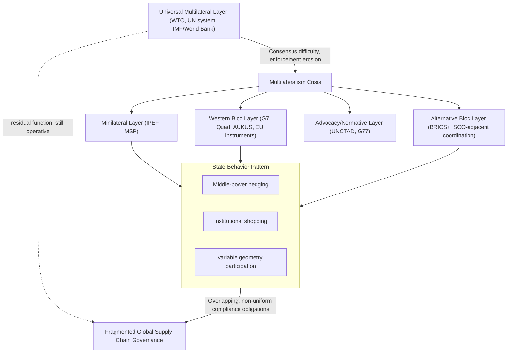

## The Crisis of Multilateralism and the Rise of Ad Hoc Coalitions

### Overview

This topic synthesizes a pattern threaded through the preceding institutional analyses: the perceived decline of comprehensive, universal-membership multilateral institutions (WTO, UN system bodies) as the primary mechanism for global economic governance, and the corresponding rise of narrower, purpose-built coalitions — minilateral groupings (IPEF, MSP), bloc-specific architectures (G7, Quad, AUKUS, BRICS+), and issue-specific ad hoc arrangements. Understanding this shift is central to supply chain geopolitics because it explains why contemporary supply chain policy increasingly operates through overlapping, sometimes competing coalition structures rather than through a single universally accepted rule-based framework.

### Diagnosing the Crisis: What "Multilateralism" Meant and Why It Is Contested

**Key Points**

- **Post-1945 multilateral design premise**: The core institutions of the post-WWII order (UN, GATT/WTO, IMF, World Bank) were built on an assumption of near-universal membership working toward shared rules with binding or quasi-binding enforcement — a model that functioned most effectively during periods of relatively convergent great-power interest or clear US-anchored unipolarity.
- **Consensus requirement as structural vulnerability**: Universal-membership institutions requiring consensus or near-consensus for new rule-making (WTO Doha Round's effective collapse after failing to reach agreement across its full membership since 2001) become progressively harder to operate as membership grows and interests diverge, particularly amid deepening US-China strategic competition.
- **Enforcement erosion**: The WTO Appellate Body crisis exemplifies a broader pattern — even where multilateral rules formally exist, enforcement mechanisms can be structurally undermined by a single major member's willingness to block institutional functioning, revealing that universal-membership design does not guarantee durable enforcement capacity.
- [Inference] The multilateralism crisis is better understood as a crisis of consensus-based, universal-enforcement institutional design specifically, rather than a wholesale collapse of international cooperation as such — since the proliferation of minilateral and coalition-based cooperation documented throughout this chapter demonstrates continued, in some respects intensifying, international economic coordination, just organized through different structural forms.

### The Shift Toward Ad Hoc and Minilateral Coalitions

**Key Points**

- **"Coalition of the willing" logic applied to economics**: Rather than seeking universal buy-in, contemporary economic-security cooperation increasingly follows a pattern where a smaller group of aligned states move forward on specific functional cooperation (supply chain resilience, critical minerals, export-control harmonization) without requiring or waiting for broader multilateral consensus.
- **Variable geometry across issues**: A defining feature of the current landscape is that the same states participate in different, non-identical coalition configurations depending on the specific issue — India in the Quad but not AUKUS; the EU in G7 but pursuing independent economic-security instruments; Indonesia moving from MSP Forum partner toward full BRICS+ membership — producing a complex, overlapping "variable geometry" rather than a clean bipolar bloc structure.
- **Speed and specificity advantages driving adoption**: Ad hoc and minilateral coalitions can be formed and adapted more quickly around specific emergent challenges (semiconductor export controls, critical minerals bottlenecks) than universal institutions can generate comparable consensus-based responses, making them the practically preferred tool even among states that continue to value multilateral institutions rhetorically.
- **Legitimacy and universality trade-off**: What ad hoc coalitions gain in speed and specificity, they generally sacrifice in universal legitimacy and comprehensive rule-coverage — a minilateral supply chain agreement among 14 IPEF members carries less universal legal weight and predictability than a comparable WTO-wide commitment would, even if the latter is currently harder to achieve.

### Synthesizing the Institutional Landscape

**Key Points**

- **Layered rather than replaced architecture**: Ad hoc coalitions have generally supplemented rather than fully replaced existing multilateral institutions — the WTO continues to function for many day-to-day trade matters even amid its Appellate Body crisis, and the IMF/World Bank continue substantial lending operations even as BRICS+ alternatives grow, producing a genuinely layered rather than a clean succession pattern.
- **Institutional shopping as a state strategy**: States increasingly engage in explicit "institutional shopping" — selecting whichever available venue (WTO, bilateral FTA, minilateral coalition, regional bloc) offers the most favorable terms or fastest path for a given objective, a pattern visible across virtually every case examined in this chapter (Indonesia's simultaneous MSP Forum and BRICS+ engagement; middle powers' issue-specific hedging).
- **Erosion of universal rule predictability**: The cumulative effect of this fragmentation is reduced predictability for firms and states operating across multiple jurisdictions, since supply chain and trade-policy compliance increasingly requires navigating a patchwork of overlapping, sometimes contradictory coalition-specific rules rather than a single coherent global framework.
- **Great-power competition as primary driver**: [Inference] The underlying driver connecting virtually every institutional dynamic examined in this chapter — WTO paralysis, BRICS+ expansion, minilateral proliferation, EU economic-security instrument development — is the intensification of US-China strategic competition specifically, which has made universal-consensus institutions increasingly difficult to sustain while creating strong incentive for like-minded-state coalition-building on both sides of the competition.

### Illustrative Synthesis: A Single Supply Chain Issue Across Multiple Institutional Layers

Consider how critical minerals policy alone now operates across the full institutional landscape surveyed in this chapter:

1. **WTO layer**: Formal trade-rule constraints on export restrictions technically apply, but weakened Appellate Body enforcement reduces practical constraint on measures like Indonesia's nickel export ban.
2. **G7 layer**: Coordinates high-level political commitment and export-control alignment among wealthy democracies (Hiroshima Action Plan).
3. **Minilateral layer**: The MSP coordinates specific processing-capacity investment projects among a narrower subset of states plus resource-holding partners.
4. **Bloc-specific layer**: The EU's Critical Raw Materials Act sets binding EU-specific targets; China's own critical-minerals export-control responses (e.g., restrictions on gallium, germanium, and graphite exports) function as a competing bloc-specific instrument.
5. **Alternative institution layer**: BRICS+ NDB financing offers resource-holding developing states an alternative to Western-aligned MSP financing for the same underlying processing-capacity investment need.
6. **Global South advocacy layer**: UNCTAD research and G77 advocacy shape the normative framing around resource-holding states' right to pursue domestic beneficiation policy across all the above venues simultaneously.

No single institution comprehensively governs this issue; instead, the same underlying supply chain challenge is addressed through at least six distinct, only partially coordinated institutional layers simultaneously — a structure illustrative of the broader fragmentation this topic describes.

### Fragmentation Architecture Diagram

### Critiques and Counter-Perspectives

- **"Crisis" framing itself contested**: Some scholars argue the "crisis of multilateralism" framing overstates decline relative to adaptation — pointing to continued WTO functioning for the majority of routine trade matters, sustained World Bank/IMF lending volumes, and the sheer proliferation of new cooperative instruments (however minilateral) as evidence of continued, if restructured, international economic cooperation rather than genuine collapse.
- **Fragmentation costs versus benefits**: While fragmentation reduces predictability and comprehensive rule coverage, proponents of minilateral approaches argue the alternative — continued paralysis awaiting unachievable universal consensus — would represent a worse outcome for addressing urgent supply chain resilience and critical minerals challenges than imperfect but actionable coalition-based cooperation.
- **Risk of institutional proliferation without coordination**: A frequently raised concern is that the sheer number of overlapping coalitions (as the critical-minerals synthesis example illustrates) risks duplicative or even contradictory efforts absent adequate inter-coalition coordination mechanisms, potentially reducing collective effectiveness relative to a more consolidated approach.
- [Speculation] Whether the current trajectory represents a durable new equilibrium of layered, coalition-based global economic governance, or a transitional period preceding either renewed multilateral consolidation or further fragmentation into more clearly separated competing blocs, remains genuinely unresolved and is actively debated among international relations and trade-policy scholars, without a clear empirical basis yet for confidently predicting the longer-term trajectory.

### Related Topics

- WTO Appellate Body crisis and dispute settlement paralysis
- Variable geometry and issue-specific state alignment patterns
- Critical minerals policy across overlapping institutional layers
- BRICS+ expansion as a counter-multilateral coordination experiment
- Great-power competition as the structural driver of institutional fragmentation
- Institutional shopping and forum-selection strategy by states
- The Doha Round's collapse and its implications for WTO rule-making capacity