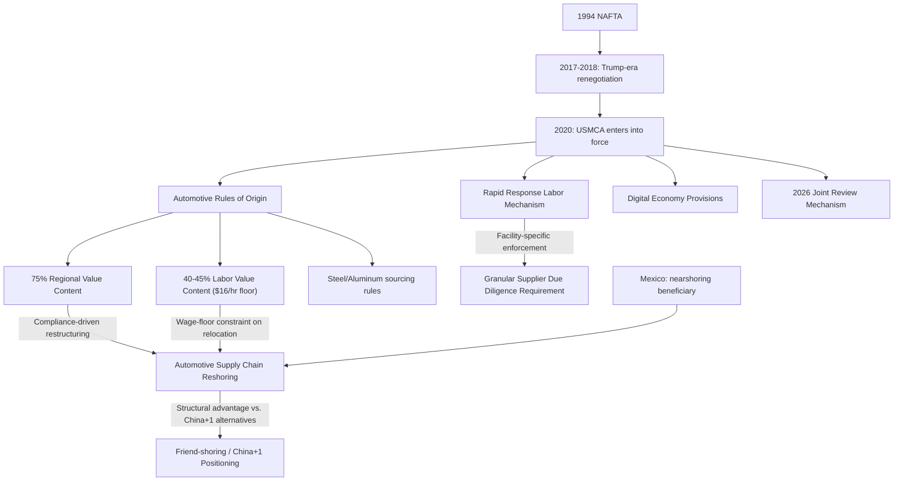

## The USMCA and North American Production Integration

### Overview

The United States-Mexico-Canada Agreement (USMCA), which entered into force July 1, 2020, replacing the 1994 North American Free Trade Agreement (NAFTA), represents both a continuation and a significant restructuring of North American economic integration. While preserving the core tariff-free trade zone established under NAFTA, USMCA introduced substantially stricter rules of origin, new labor-enforcement mechanisms, and digital-economy provisions reflecting three decades of accumulated political economy lessons and, more directly, the Trump administration's renegotiation priorities. For supply chain geopolitics, USMCA is a central case study in how a major trade bloc has been explicitly restructured to serve both traditional trade-liberalization and contemporary supply-chain-reshoring/friend-shoring objectives simultaneously.

### From NAFTA to USMCA: Renegotiation Drivers

**Key Points**

- **Political pressure for renegotiation**: NAFTA faced sustained domestic US political criticism (particularly regarding manufacturing job losses attributed to production relocation to Mexico) that became a central 2016 campaign issue, driving the Trump administration's 2017 announcement of renegotiation intent.
- **Formal renegotiation and signing**: Negotiations concluded in 2018, with the agreement signed by all three governments, followed by a further round of amendments (particularly strengthening labor and environmental enforcement provisions) negotiated with congressional Democrats before US ratification in early 2020.
- **Core continuity with new restrictions layered on top**: USMCA preserves NAFTA's fundamental tariff-free goods-trade zone among the three countries but substantially tightens the conditions (rules of origin, labor-value content) required for goods to qualify for this preferential treatment — reflecting an explicit policy intent to increase North American (and particularly US) content and production activity relative to the NAFTA-era baseline.
- **Six-year joint review mechanism**: A structural innovation distinguishing USMCA from NAFTA is a mandatory joint review process, first scheduled for 2026, at which the three parties must formally assess whether to extend the agreement for a further 16-year term — creating a built-in periodic renegotiation pressure point absent from NAFTA's indefinite structure. [Unverified] The specific outcome and dynamics of the 2026 review should be checked against current reporting given its direct relevance and proximity to the current date.

### Automotive Rules of Origin: The Centerpiece Reform

**Key Points**

- **Increased regional value content (RVC) threshold**: USMCA raised the required North American content share for automobiles to qualify for tariff-free treatment from NAFTA's 62.5% to 75%, a substantial tightening explicitly designed to increase North American-sourced parts content and discourage extensive use of non-North American (particularly Asian) components in vehicles assembled in the region.
- **Labor Value Content (LVC) requirement**: A novel USMCA provision requires that a specified percentage of vehicle content (generally 40-45% depending on vehicle category) be produced by workers earning at least US$16 per hour — a provision explicitly designed to reduce the incentive for automakers to shift production to lower-wage Mexican facilities by requiring a minimum wage floor for qualifying content regardless of production location.
- **Steel and aluminum sourcing requirements**: USMCA also introduced specific requirements that a defined share of steel and aluminum used in qualifying vehicles be North American-melted-and-poured (steel) or smelted-and-cast (aluminum), adding a further layer of supply-chain-specific origin restriction beyond the general RVC threshold.
- **Auto industry compliance transition**: These stricter rules have required substantial automotive supply chain restructuring, with manufacturers needing to reassess and in many cases relocate supplier relationships to maintain preferential tariff treatment — representing one of the most concrete, measurable instances of trade-policy-driven supply chain reshoring within a major existing trade bloc.

### Labor Enforcement: The Rapid Response Mechanism

**Key Points**

- **Novel facility-specific enforcement tool**: USMCA's Rapid Response Labor Mechanism (RRLM) allows the US (and reciprocally, other parties) to request expedited investigation of specific individual Mexican manufacturing facilities suspected of denying workers' rights to free association and collective bargaining, with verified violations resulting in tariff suspension or import denial for goods from that specific facility.
- **Departure from state-to-state dispute models**: This facility-specific mechanism represents a significant departure from traditional trade-agreement labor provisions (including NAFTA's largely unused side-agreement labor mechanism), since it enables targeted action against individual factories rather than requiring a slower, more diplomatically fraught state-to-state dispute process.
- **Active utilization**: The RRLM has been invoked in numerous cases since USMCA's entry into force, representing one of the more actively used enforcement provisions in the agreement and demonstrating a substantively different enforcement posture than NAFTA's largely dormant labor side-agreement.
- **Supply chain compliance implications**: The RRLM's facility-level targeting means individual supplier plants within a broader supply chain can face tariff consequences independent of the overall trade relationship, requiring multinational firms sourcing from Mexico to conduct more granular, facility-specific labor-practice due diligence than was practically necessary under NAFTA's weaker enforcement structure.

### Digital Economy and Modernization Provisions

**Key Points**

- **Data localization prohibition**: USMCA includes provisions generally prohibiting data-localization requirements among the three parties (with limited exceptions), reflecting the agreement's more contemporary digital-economy focus relative to NAFTA, which predated the modern digital trade landscape entirely.
- **E-commerce and digital trade facilitation**: Provisions address cross-border data flows, source-code protection, and digital customs procedures — areas entirely unaddressed in the original 1994 NAFTA text given the vastly different digital-economy landscape at that time.
- **Intellectual property modernization**: USMCA extended copyright terms and updated IP enforcement provisions relative to NAFTA, aligning more closely with contemporary US IP-policy preferences, though certain provisions (particularly around pharmaceutical patent protection) were subsequently modified during the pre-ratification congressional negotiation round.

### Supply Chain Relevance

**Key Points**

- **Explicit reshoring/friend-shoring policy instrument**: USMCA's stricter automotive rules of origin represent one of the clearest examples globally of a trade agreement explicitly re-engineered to incentivize supply chain reshoring toward the bloc's own territory, using preferential tariff access as the enforcement lever rather than direct subsidy or mandate.
- **"Nearshoring" beneficiary positioning**: Mexico has emerged as a significant beneficiary of the broader global "China+1" and friend-shoring trend, with USMCA's preferential market access to the US serving as a key structural advantage attracting manufacturing investment (particularly in automotive, electronics, and appliance sectors) seeking to diversify away from China while maintaining preferential US market access.
- **Semiconductor and critical supply chain cooperation**: Beyond the core agreement text, the US, Mexico, and Canada have pursued supplementary cooperation initiatives (including semiconductor supply chain and critical minerals dialogue) building on the USMCA framework, reflecting the broader trend of using existing trade-bloc relationships as platforms for more targeted supply-chain-security cooperation.
- **Compliance cost as competitive filter**: The substantially increased rules-of-origin complexity (RVC thresholds, LVC requirements, steel/aluminum sourcing rules) creates meaningful compliance costs that favor larger, more sophisticated manufacturers capable of managing complex supply-chain documentation and sourcing requirements, potentially disadvantaging smaller suppliers relative to the comparatively simpler NAFTA-era rules.

### Illustrative Example: Automotive Supply Chain Restructuring Under USMCA

1. Under NAFTA's 62.5% regional value content threshold, an automaker could source a meaningful share of vehicle components from non-North American suppliers (particularly Asian electronics and certain specialized parts) while still qualifying vehicles for tariff-free North American trade.
2. USMCA's 75% RVC threshold, combined with new Labor Value Content and steel/aluminum sourcing requirements, requires that automaker to substantially reassess its supplier base — either relocating previously offshore-sourced component production to North America, or accepting tariff exposure for vehicles that fail to meet the higher threshold.
3. The Labor Value Content requirement specifically constrains the automaker's ability to simply relocate the additional required North American content to lower-wage Mexican facilities, since qualifying content must meet the wage floor regardless of location — pushing some additional content toward higher-wage US or Canadian facilities specifically, or toward higher-wage Mexican facilities meeting the threshold.
4. [Inference] The cumulative effect of these interlocking rules-of-origin provisions is a meaningfully different automotive supply chain configuration incentive structure than existed under NAFTA, though the precise scale of resulting production relocation, and how much reflects direct USMCA rule compliance versus the broader concurrent trend toward North American nearshoring for other reasons (geopolitical risk reduction, logistics-cost considerations), is difficult to cleanly separate in available industry data.

### USMCA Structural Overview

### Structural Tensions and Open Issues

- **US-Mexico tomato, tariff, and sector-specific disputes**: Despite the overarching USMCA framework, sector-specific trade tensions persist (agricultural disputes, ongoing disagreements over Mexican energy-sector policy treatment of US and Canadian investors), illustrating that a functioning trade bloc does not eliminate all friction even among closely integrated partners.
- **Canada-US-Mexico trilateral versus bilateral dynamics**: Some analysts note a tendency toward USMCA functioning in practice as two overlapping bilateral relationships (US-Mexico, US-Canada) rather than a fully symmetrical trilateral partnership, given the substantially larger US economic weight relative to both partners individually.
- **2026 review uncertainty**: The mandatory joint review creates a structural point of potential renegotiation or even partial unwinding of current provisions, introducing a degree of medium-term policy uncertainty for firms making long-horizon North American supply chain investment decisions specifically because the agreement's terms are not treated as permanently fixed. [Unverified] Given the review's proximity to the current date, checking current reporting for its actual proceedings and outcome would be necessary for an up-to-date assessment.
- [Speculation] Whether USMCA's stricter rules-of-origin approach will be viewed retrospectively as a successful template for using trade-bloc restructuring to drive supply chain reshoring, or whether the compliance costs and sector-specific frictions will be judged to have outweighed the reshoring benefits achieved, remains a live empirical and political debate without clear resolution based on currently available assessment.

### Related Topics

- USMCA automotive Regional Value Content and Labor Value Content mechanics
- Rapid Response Labor Mechanism case history and facility-specific enforcement
- Mexico's nearshoring boom and China+1 manufacturing relocation
- The 2026 USMCA joint review process and renegotiation stakes
- NAFTA-to-USMCA digital trade provision comparison
- North American semiconductor and critical minerals supply chain cooperation
- US-Mexico energy-sector investment disputes under USMCA