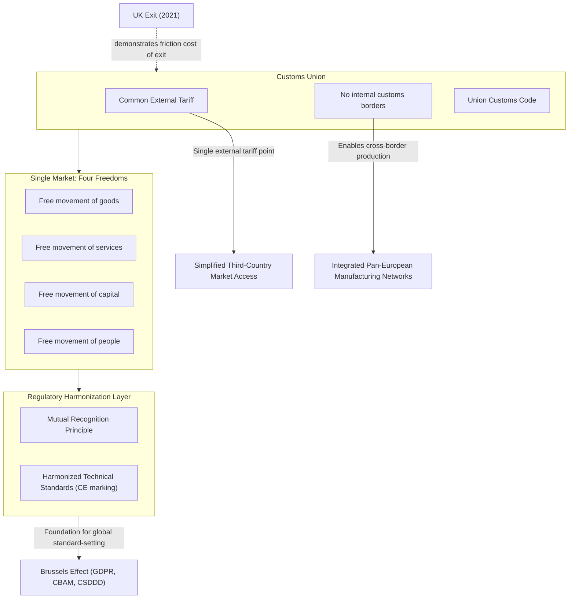

## The EU Single Market and Customs Union

### Overview

The EU Single Market and Customs Union constitute the foundational economic infrastructure underlying the supranational trade authority examined earlier in this syllabus — the "four freedoms" framework (goods, services, capital, people) combined with a unified external customs regime that together make the EU function as a single economic territory for internal trade and production purposes, while presenting a unified face to external trading partners. This distinction — internal market integration versus external trade representation — is foundational to understanding how the EU functions in global supply chains, both as an integrated production zone and as a single large-market gatekeeper for external suppliers.

### The Customs Union: Structural Mechanics

**Key Points**

- **Common External Tariff (CET)**: All goods entering any EU member state from a non-EU country face the same tariff rate regardless of port of entry, and once cleared, circulate freely among all member states without further customs checks — the foundational mechanism distinguishing a customs union from a simple free trade area (where member states retain individually differentiated external tariffs).
- **No internal customs borders**: Goods moving between EU member states cross no customs checkpoints and face no tariffs or quantitative restrictions, enabling genuinely integrated cross-border production processes where components can cross multiple internal EU borders during manufacturing without customs friction.
- **Single customs territory legal status**: The EU customs union extends beyond the 27 EU member states to include several additional territories through separate customs agreements (Monaco, and historically included the UK's Northern Ireland under post-Brexit arrangements via the Windsor Framework), illustrating the customs union's distinct legal architecture from EU political membership itself.
- **Union Customs Code**: A harmonized EU-wide customs regulatory framework (most recent comprehensive version effective 2016) standardizes customs procedures, documentation, and enforcement across all member states, reducing the administrative friction that would otherwise arise from 27 separately administered national customs systems.

### The Single Market: The Four Freedoms

**Key Points**

- **Free movement of goods**: Beyond the customs union's tariff-free internal trade, single market rules also prohibit non-tariff barriers to goods trade among member states (quantitative restrictions, discriminatory technical standards), enforced through mutual recognition principles and harmonized product standards.
- **Free movement of services**: Extends market integration beyond physical goods to services provision — allowing firms established in one member state to provide services across the EU, though services integration has historically proceeded less completely than goods integration due to greater regulatory complexity (professional licensing, sector-specific national regulation).
- **Free movement of capital**: Enables cross-border investment and financial-services activity without member-state-level capital controls, foundational to the integrated EU financial market and cross-border corporate investment/ownership structures.
- **Free movement of people**: Encompasses both worker mobility (EU citizens' right to work in any member state without additional visa/work-permit requirements) and the closely related but legally distinct Schengen Area border-free travel zone (which includes some non-EU members and excludes some EU members, illustrating that the four freedoms and Schengen are related but not identical frameworks).

### Regulatory Harmonization as the Deeper Integration Layer

**Key Points**

- **Mutual recognition principle**: Established through the EU Court of Justice's 1979 Cassis de Dijon ruling, this principle holds that a product lawfully produced and sold in one member state must generally be permitted for sale in all others, even absent full regulatory harmonization — a foundational legal mechanism enabling market integration without requiring identical national regulations in every domain.
- **Harmonized technical standards**: Beyond mutual recognition, the EU has pursued extensive positive harmonization (CE marking requirements, unified product-safety standards, harmonized technical specifications) particularly for goods where safety or interoperability concerns make mutual recognition alone insufficient.
- **Single Market Programme depth**: The 1992 completion of the original Single Market Programme (building on the 1986 Single European Act) addressed a substantial share of remaining non-tariff barriers, though services-sector integration and certain "new economy" areas (digital single market provisions) have continued to develop through subsequent, ongoing legislative initiatives.
- **This regulatory depth underlies the "Brussels Effect"**: The extensive harmonized regulatory framework discussed in the earlier EU supranational trade actor analysis (GDPR, CBAM, CSDDD) is built directly on this single-market regulatory infrastructure — the EU's capacity to set globally influential standards stems substantially from having first achieved this deep internal regulatory harmonization across 27 member states.

### Supply Chain Relevance

**Key Points**

- **Integrated pan-European production networks**: The combination of tariff-free internal trade and harmonized technical standards has enabled deeply integrated cross-border manufacturing supply chains within the EU (particularly visible in automotive manufacturing, where components frequently cross multiple internal EU borders during production before final assembly), a structural feature that would be substantially more costly to replicate under a looser free-trade-area arrangement.
- **Single external tariff simplifies third-country market access strategy**: For non-EU exporters, the customs union's single external tariff and unified customs procedures mean a single point of market entry (any EU port of entry) provides access to the entire 27-member, ~450-million-consumer market — a significant logistics and compliance simplification relative to negotiating separate market access to 27 individually tariff-setting states.
- **Regulatory compliance as the practical market-access gate**: Given the customs union's relatively low common external tariffs on many goods categories, the more significant practical barrier for external suppliers seeking EU market access is often meeting harmonized EU technical, safety, and (increasingly) sustainability/due-diligence standards rather than tariff cost itself — directly connecting single-market regulatory infrastructure to the Brussels Effect dynamics examined in the EU's supranational trade actor role.
- **Brexit as a case study in customs union exit costs**: The UK's 2020 exit from both the EU single market and customs union provides a directly observable case study in the supply chain friction costs of customs union departure — UK-EU goods trade has faced new customs documentation requirements, rules-of-origin checks, and regulatory divergence costs that were entirely absent while the UK remained within the customs union, offering empirical insight into the trade-facilitation value the customs union structure provides.

### Illustrative Example: Brexit's Supply Chain Friction Effect

1. Prior to Brexit, a UK-based automotive parts manufacturer could ship components to a German assembly plant with no customs documentation, tariff payment, or border delay — functionally identical to shipping between two locations within a single country.
2. Following the UK's departure from the EU customs union (effective January 2021, subject to the terms of the UK-EU Trade and Cooperation Agreement), the same shipment requires customs declarations, potential rules-of-origin verification (to confirm eligibility for the TCA's tariff-free treatment), and exposure to new regulatory-divergence risk as UK and EU technical standards potentially diverge over time.
3. Even though the UK-EU Trade and Cooperation Agreement preserves tariff-free trade for goods meeting rules-of-origin requirements, the additional administrative burden and border-friction costs have been widely documented (through UK government and independent economic analysis) as having measurably increased trade costs and, in some sectors, reduced UK-EU trade volume relative to pre-Brexit trends.
4. [Inference] This outcome illustrates that customs union membership provides trade-facilitation value substantially beyond simple tariff elimination — the removal of customs procedures, documentation requirements, and regulatory-alignment guarantees represents a distinct and economically significant additional layer of integration that a tariff-only free trade agreement (such as the UK-EU TCA) does not replicate.

### Single Market and Customs Union Architecture

### Structural Tensions and Ongoing Development

- **Services integration incompleteness**: Despite the formal "four freedoms" framework, services-sector single-market integration remains meaningfully less complete than goods integration, due to persistent national regulatory divergence in areas like professional qualifications, financial services, and other sectors where harmonization has proven more politically and technically difficult than goods-standard harmonization.
- **Northern Ireland's unique post-Brexit position**: The Windsor Framework arrangement keeps Northern Ireland aligned with certain EU single-market goods rules (while remaining part of the UK customs territory for other purposes) specifically to avoid a hard customs border on the island of Ireland — illustrating the customs union and single market's capacity to be applied in geographically and politically complex partial arrangements beyond simple full-membership/non-membership binaries.
- **Digital Single Market ongoing development**: Unlike the largely mature goods and customs union framework, digital-economy single-market integration (covering cross-border e-commerce, digital services regulation, and data-flow rules) remains a more actively evolving policy area, reflecting the comparatively recent emergence of digital trade as a major economic sector relative to the single market's original 1980s-90s design period.
- [Inference] The customs union and single market's demonstrated depth of integration — and the measurable friction costs revealed by the UK's departure — provide a useful comparative benchmark for assessing the likely trade-facilitation limitations of the shallower minilateral and coalition-based cooperation frameworks examined elsewhere in this syllabus (IPEF, MSP), since those frameworks generally do not attempt to replicate this level of customs and regulatory integration.

### Related Topics

- Brexit's UK-EU Trade and Cooperation Agreement and customs friction data
- The Cassis de Dijon ruling and mutual recognition legal doctrine
- CE marking and harmonized EU technical product standards
- Northern Ireland's Windsor Framework dual-alignment arrangement
- Digital Single Market development and cross-border e-commerce rules
- Schengen Area versus EU membership: distinguishing the two frameworks
- Automotive cross-border production networks within the EU single market