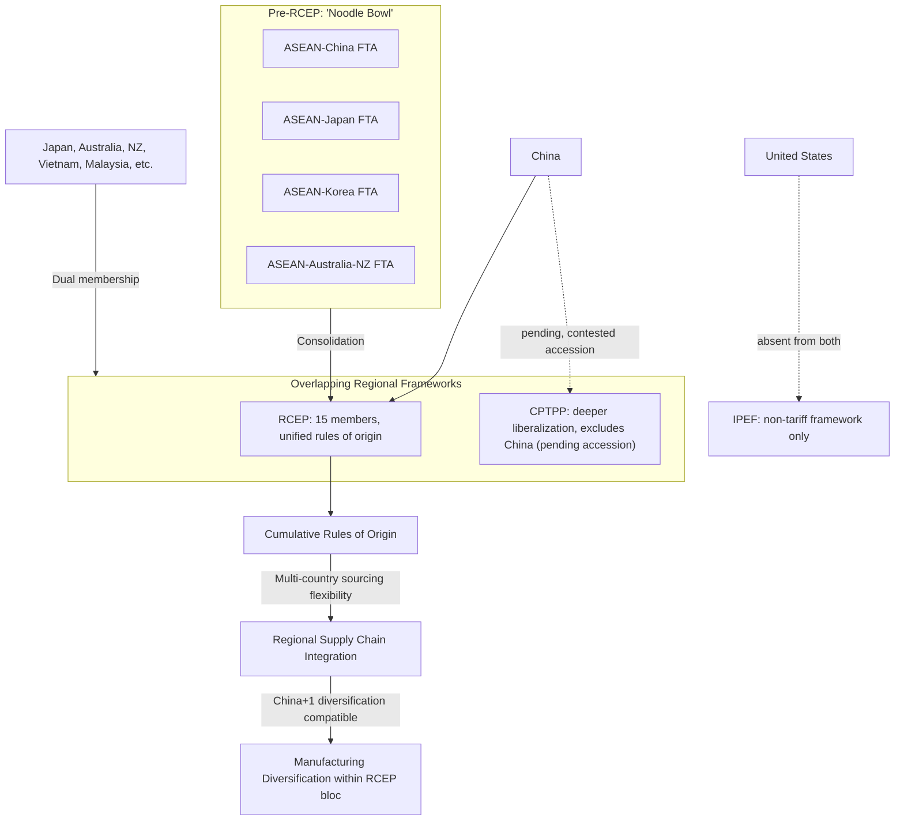

## RCEP and the Asia Pacific Trade Architecture

### Overview

The Regional Comprehensive Economic Partnership (RCEP), which entered into force January 1, 2022, is the world's largest trade agreement by population and GDP coverage — encompassing 15 Asia-Pacific economies including China, Japan, South Korea, Australia, New Zealand, and the 10 ASEAN member states. RCEP's significance for supply chain geopolitics lies substantially in its consolidating function: it unifies a previously fragmented "noodle bowl" of overlapping bilateral and ASEAN-plus-one agreements into a single, more coherent regional framework, while notably including China at its center — a structural contrast with the more overtly China-excluding architecture of frameworks like IPEF or the CPTPP as currently constituted.

### Origins and the "Noodle Bowl" Problem

**Key Points**

- **ASEAN centrality in origin**: RCEP originated from ASEAN's initiative to consolidate its existing network of separate "ASEAN+1" free trade agreements (ASEAN-China, ASEAN-Japan, ASEAN-Korea, ASEAN-Australia-New Zealand, ASEAN-India) into a single unified framework, addressing the compliance complexity firms faced navigating multiple overlapping agreements with differing rules of origin and tariff schedules.
- **The "noodle bowl" (or "spaghetti bowl") problem**: A term describing the practical difficulty multinational firms face when multiple overlapping bilateral and regional trade agreements, each with distinct rules of origin and preferential-tariff qualification criteria, apply to the same trade relationships — creating substantial compliance complexity that can offset the theoretical benefits of any individual agreement's tariff preferences.
- **Negotiation history and India's withdrawal**: RCEP negotiations began in 2012 and concluded in 2020; India, an original negotiating participant, withdrew in 2019 citing concerns about potential import surges (particularly from China) and insufficient market-access reciprocity for Indian services and labor mobility — resulting in the final 15-member agreement excluding what would have been RCEP's second-largest economy.
- **Entry into force**: RCEP entered into force January 1, 2022, for the first group of ratifying members, with remaining signatories' ratification taking effect progressively through 2023.

### Structural Features

**Key Points**

- **Unified rules of origin**: RCEP's most significant structural innovation is establishing a single, common set of rules of origin applicable across all member trade relationships — allowing a good to qualify for preferential treatment based on cumulative regional content across any RCEP member, rather than requiring separate origin calculations for each bilateral relationship as under the prior noodle-bowl structure.
- **Cumulative rules of origin as supply chain integration mechanism**: This cumulation provision is particularly significant for regional supply chains, since a product can incorporate inputs from multiple RCEP member countries and still qualify for preferential tariff treatment as long as the cumulative regional content threshold is met — actively incentivizing supply chain integration across the full RCEP membership rather than confining sourcing to bilateral-agreement-specific origin requirements.
- **Comparatively shallow liberalization depth**: RCEP's tariff-reduction commitments and non-tariff provisions (intellectual property, labor, environment, state-owned enterprise disciplines) are generally considered less ambitious than the CPTPP or comparable high-standard agreements, reflecting the need to accommodate the developmental diversity across its membership (ranging from highly developed economies like Japan and Australia to lower-income ASEAN members like Cambodia and Laos).
- **Services and investment provisions**: RCEP includes services and investment liberalization commitments, though generally less extensive than comparable provisions in CPTPP, reflecting the broader pattern of RCEP prioritizing breadth of membership and rules-of-origin consolidation over liberalization depth.

### RCEP in the Broader Asia-Pacific Trade Architecture

**Key Points**

- **Comparison with CPTPP**: The Comprehensive and Progressive Agreement for Trans-Pacific Partnership (CPTPP) — the successor to the US-negotiated but ultimately US-abandoned Trans-Pacific Partnership — represents a higher-standard, deeper-liberalization alternative regional framework, with overlapping but not identical Asia-Pacific membership (notably excluding China and the US, though China has formally applied for accession, with the application still under review as of recent reporting).
- **Overlapping membership complexity**: A substantial number of Asia-Pacific economies (Japan, Australia, New Zealand, Vietnam, Malaysia, Singapore, Brunei) are members of both RCEP and CPTPP simultaneously, meaning firms operating across the region must still navigate two distinct (though individually more consolidated) frameworks rather than a single unified Asia-Pacific trade architecture.
- **China's strategic positioning**: RCEP's inclusion of China as a founding and central member, contrasted with China's exclusion from CPTPP (pending its contested accession application) and from US-led frameworks like IPEF, positions RCEP as China's primary vehicle for deep formal trade-agreement integration with the broader Asia-Pacific region, carrying distinct strategic significance amid the broader US-China competition context.
- **No comparable US framework participation**: The US is notably absent from both RCEP and CPTPP (having withdrawn from the original TPP negotiations that became CPTPP), meaning current US Asia-Pacific economic engagement relies primarily on the non-tariff IPEF framework rather than participation in either of the region's two major comprehensive trade agreements — a structural gap frequently noted by regional trade-policy analysts as a distinguishing feature of the current US Indo-Pacific economic strategy.

### Supply Chain Relevance

**Key Points**

- **Regional value chain consolidation incentive**: RCEP's cumulative rules of origin directly incentivize firms to structure supply chains using inputs sourced across multiple RCEP members rather than concentrating sourcing within single-country or narrower bilateral-agreement boundaries, actively supporting the kind of multi-country regional production networks already characteristic of East and Southeast Asian electronics, automotive, and textile manufacturing.
- **China+1 diversification compatibility**: Because RCEP's cumulation rules span both China and its regional China+1 diversification destinations (Vietnam, Malaysia, Indonesia, Thailand), firms pursuing manufacturing diversification away from China-concentrated production can do so while still benefiting from RCEP-wide preferential treatment, provided the diversified supply chain remains within RCEP membership — a notable contrast with USMCA's stricter North-America-specific content requirements.
- **Reduced compliance burden for regional manufacturers**: The consolidation of previously separate ASEAN+1 agreements into a single rules-of-origin framework meaningfully reduces the customs-documentation and origin-certification complexity for firms operating supply chains across multiple RCEP member countries, a practical efficiency gain independent of RCEP's comparatively modest tariff-liberalization ambitions.
- **Absence of binding labor/environmental supply chain provisions**: Unlike USMCA's Rapid Response Labor Mechanism or CPTPP's more robust labor chapter, RCEP includes comparatively limited binding labor and environmental provisions, meaning RCEP-preferential supply chains face less agreement-embedded labor-standard compliance pressure than comparable USMCA or CPTPP-qualifying supply chains — a distinction relevant to firms weighing regional sourcing strategy against differing agreement-specific compliance-risk profiles.

### Illustrative Example: Electronics Supply Chain Under RCEP Cumulation

1. An electronics manufacturer assembles a finished product in Vietnam using semiconductor components sourced from South Korea, display panels from China, and other components from Malaysia and Japan — all RCEP member countries.
2. Under RCEP's cumulative rules of origin, the regional content contributed by each of these RCEP-member input sources can be aggregated together when calculating whether the finished product meets the applicable regional-value-content threshold for preferential-tariff qualification, rather than requiring separate bilateral-agreement-specific origin calculations for each individual input source.
3. This allows the manufacturer to build a genuinely multi-country Asia-Pacific supply chain — consistent with the broader China+1 diversification pattern of shifting final assembly to Vietnam while still relying on established regional component supply relationships — while qualifying the finished product for preferential treatment when exported to any other RCEP member's market.
4. [Inference] This cumulation-driven flexibility likely reinforces existing East and Southeast Asian regional production-network patterns rather than fundamentally reshaping them, since it reduces documentary friction for supply chains that were already substantially regionally integrated prior to RCEP's entry into force, though the precise magnitude of RCEP's independent causal contribution to regional supply chain patterns (versus reinforcing pre-existing trends) is difficult to isolate from other concurrent factors in available trade data.

### Asia-Pacific Trade Architecture Diagram

### Structural Tensions and Critiques

- **Liberalization depth versus membership breadth trade-off**: RCEP's comparatively modest tariff-reduction and non-tariff-provision ambitions, relative to CPTPP, reflect a deliberate design trade-off prioritizing broad membership inclusion (accommodating developmental diversity) over the deeper liberalization commitments a smaller, more homogeneous membership might have permitted — a trade-off some analysts argue limits RCEP's practical economic impact relative to its headline size.
- **India's absence as a structural gap**: India's 2019 withdrawal means RCEP excludes what would have been its second-largest economy and a major potential participant in regional supply chain diversification, with India instead pursuing separate bilateral arrangements and its own Quad/IPEF-oriented Indo-Pacific engagement rather than RCEP membership.
- **Limited binding enforcement relative to USMCA**: RCEP's comparatively weaker labor, environmental, and state-owned-enterprise provisions, relative to USMCA or CPTPP, mean it offers less agreement-embedded leverage for addressing supply-chain-adjacent governance concerns (labor conditions, environmental practice) than these alternative frameworks provide.
- [Speculation] Whether China's CPTPP accession application will ultimately succeed — which would create unprecedented overlapping membership between the two major regional frameworks and carry substantial implications for the broader US-China Asia-Pacific trade-architecture competition — remains genuinely uncertain and contested, with existing CPTPP members (particularly given territorial and trade-practice disputes with China) showing mixed and evolving positions on the application as of the most recent available reporting.

### Related Topics

- CPTPP structure and China's pending accession application
- ASEAN+1 agreement consolidation and the "noodle bowl" problem
- India's RCEP withdrawal and alternative Indo-Pacific engagement strategy
- Cumulative rules of origin mechanics and regional value chain design
- China+1 manufacturing diversification within RCEP membership
- US absence from major Asia-Pacific trade agreements and IPEF's non-tariff alternative
- Comparative labor and environmental provisions: RCEP vs. CPTPP vs. USMCA