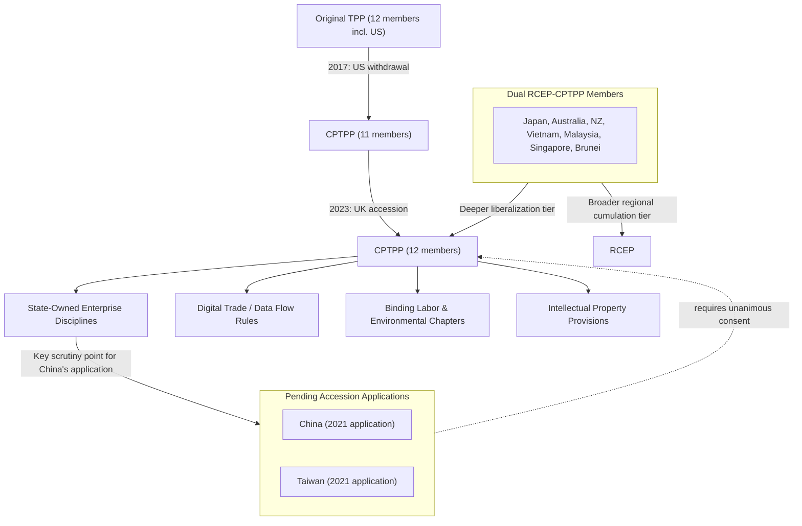

## The CPTPP and High-Standard Trade Rules

### Overview

The Comprehensive and Progressive Agreement for Trans-Pacific Partnership (CPTPP), which entered into force December 30, 2018, is the successor agreement to the original Trans-Pacific Partnership (TPP) following the United States' 2017 withdrawal. Comprising 12 members as of its most recent expansion (the original 11 remaining TPP signatories plus the United Kingdom, which acceded in 2023 as the first new member and first non-original-Pacific-Rim state to join), CPTPP is widely regarded as the most comprehensive, deeply liberalizing trade agreement currently in force in the Asia-Pacific region — offering a direct point of comparison to RCEP's broader-membership, shallower-liberalization model.

### From TPP to CPTPP: Origins and the US Withdrawal

**Key Points**

- **TPP as Obama-era strategic pivot instrument**: The original TPP, negotiated among 12 countries including the US, was conceived partly as an economic dimension of the Obama administration's broader "pivot to Asia" strategy, designed to establish high-standard trade rules — explicitly including provisions addressing state-owned enterprises and digital trade — that would set a competing template to China's economic model, with the explicit (if not always publicly stated) strategic objective of shaping regional trade norms ahead of any prospective Chinese-led alternative.
- **2017 US withdrawal**: One of the Trump administration's first trade-policy actions was formal US withdrawal from TPP (January 2017), reflecting domestic political concerns about the agreement's effects on US manufacturing employment and broader skepticism toward multilateral trade agreements characteristic of that administration's trade posture.
- **CPTPP as successor agreement**: The remaining 11 original signatories (Australia, Brunei, Canada, Chile, Japan, Malaysia, Mexico, New Zealand, Peru, Singapore, Vietnam) proceeded to conclude a modified successor agreement, formally renamed CPTPP, which suspended (rather than fully removing) approximately 20 provisions from the original TPP text — predominantly provisions the US had specifically prioritized (particularly extended intellectual property and pharmaceutical patent protections) — while preserving the bulk of the original high-standard framework.
- **UK accession as a structural departure**: The UK's 2023 accession represents CPTPP's first expansion beyond its original Pacific-Rim membership, demonstrating the agreement's design as an open, accession-eligible framework rather than a geographically fixed regional bloc — with several other economies (including China, Taiwan, and others) having subsequently submitted formal accession applications.

### Core High-Standard Provisions

**Key Points**

- **State-owned enterprise (SOE) disciplines**: CPTPP includes among the most robust SOE-discipline provisions of any major trade agreement, requiring member-state SOEs to operate on commercial considerations in most circumstances and imposing transparency requirements regarding government subsidies and preferential treatment — provisions widely understood as specifically designed to establish rules addressing the state-capitalism model associated with China's economic system, relevant to any future Chinese accession consideration.
- **Digital trade and e-commerce provisions**: CPTPP includes prohibitions on data-localization requirements, provisions protecting cross-border data flows, and source-code protection requirements — representing some of the most comprehensive digital-trade rules in any regional trade agreement at the time of the original TPP's negotiation, later provisions in USMCA and other subsequent agreements have drawn substantially on this CPTPP/TPP template.
- **Intellectual property provisions**: While CPTPP suspended several of the original TPP's most extensive IP provisions (particularly extended pharmaceutical data-exclusivity periods that had been priorities for US negotiators specifically), it retains substantial IP protection commitments relative to WTO baseline TRIPS obligations.
- **Labor and environmental chapters**: CPTPP includes binding labor and environmental provisions subject to the agreement's dispute-settlement mechanism, representing a notably higher standard of enforceable commitment in these areas than RCEP's comparatively limited provisions, though generally considered less robust than USMCA's facility-specific Rapid Response Labor Mechanism.
- **Investment and dispute settlement**: CPTPP includes Investor-State Dispute Settlement (ISDS) provisions, though with certain reforms relative to earlier-generation ISDS mechanisms addressing some of the regulatory-policy-space concerns that have drawn broader international criticism of traditional ISDS design (a concern also raised by UNCTAD's investment-governance research, discussed elsewhere in this syllabus).

### Comparative Standard: CPTPP versus RCEP

**Key Points**

- **Liberalization depth**: CPTPP's tariff elimination commitments are generally more comprehensive and its non-tariff provisions (SOE disciplines, digital trade, labor/environment) substantially more extensive than RCEP's, reflecting CPTPP's smaller, more economically homogeneous membership enabling deeper mutual commitment than RCEP's broader developmental-diversity membership permitted.
- **Rules of origin approach**: While both agreements use cumulative rules of origin allowing content aggregation across member states, CPTPP's overall regional-value-content and product-specific origin requirements are generally considered more rigorous than RCEP's comparatively more permissive thresholds.
- **Membership overlap and strategic complementarity**: Several economies (Japan, Australia, New Zealand, Vietnam, Malaysia, Singapore, Brunei) belong to both agreements, using CPTPP for deeper liberalization with a smaller partner set while relying on RCEP for broader regional market access and supply chain cumulation flexibility including China — illustrating the "institutional shopping" and layered-architecture pattern characteristic of the broader Asia-Pacific trade landscape.
- [Inference] This dual-membership pattern suggests many Asia-Pacific economies view CPTPP and RCEP as serving complementary rather than substitutable functions — CPTPP for high-standard rule-setting and deeper preferential access among a smaller partner group, RCEP for broad regional supply chain integration including China — rather than treating the two frameworks as competing alternatives requiring an exclusive choice.

### China's Accession Application

**Key Points**

- **Application submitted 2021**: China formally applied for CPTPP accession in September 2021, a notable strategic move given CPTPP's SOE-discipline and other high-standard provisions were substantially designed, during the original TPP negotiation, with an implicit objective of establishing rules that would be difficult for China's existing economic model to meet without significant reform.
- **Taiwan's parallel application**: Taiwan submitted its own CPTPP accession application shortly after China's, creating a complex parallel-consideration dynamic given the political sensitivities among existing CPTPP members regarding cross-strait relations and China's stated opposition to Taiwan's independent participation in international economic frameworks.
- **Accession requires unanimous existing-member consent**: CPTPP accession requires consensus agreement among all existing members, meaning any single member's objection can block an applicant's accession — a significant hurdle given that several existing CPTPP members (including Australia, Canada, and Japan) have publicly noted concerns about China's ability to meet the agreement's SOE-discipline, market-access, and other high-standard commitments in practice.
- [Unverified] The status and trajectory of both China's and Taiwan's accession applications remain unresolved and should be checked against current reporting, since accession negotiations of this nature typically proceed over extended multi-year timelines with outcomes that are difficult to predict confidently from any fixed point in the process.

### Supply Chain Relevance

**Key Points**

- **SOE-discipline effects on cross-border sourcing decisions**: CPTPP's robust SOE-discipline provisions create a distinct compliance and competitive-fairness environment for supply chains sourcing from or competing against state-owned-enterprise suppliers within CPTPP member states, relevant to sectors (steel, certain manufacturing inputs) where SOE participation is significant in some member economies.
- **Digital trade rules as supply chain data-flow enabler**: CPTPP's prohibition on data-localization requirements and protection of cross-border data flows directly supports the kind of integrated digital supply chain management systems (inventory tracking, logistics coordination, supplier data-sharing platforms) increasingly central to sophisticated global supply chain operations.
- **High-standard rules as a diversification destination signal**: For firms pursuing China+1 or broader supply chain diversification strategy, CPTPP membership can function as a signal of regulatory predictability and rule-of-law commitment (given the agreement's binding, enforceable high-standard provisions), a consideration alongside more traditional factors (labor cost, logistics infrastructure) in evaluating alternative manufacturing-location options among CPTPP members like Vietnam, Malaysia, or Mexico.
- **Potential China accession implications for supply chain rule-setting**: [Speculation] Were China's accession application ultimately to succeed, it would represent an unprecedented case of a major state-capitalist economy formally committing to CPTPP's SOE-discipline and related high-standard provisions, with significant and difficult-to-predict implications for both Chinese domestic economic-policy practice and the broader credibility and enforcement dynamics of the agreement's existing high-standard framework — an outcome analysts differ substantially on regarding both its likelihood and its probable practical effects should it occur.

### Illustrative Example: SOE Discipline Application

1. A CPTPP member-state SOE operating in a sector also served by private-sector competitors (for example, a state-owned steel producer) is required under CPTPP's SOE chapter to make purchasing and sales decisions based on commercial considerations, rather than receiving preferential government financing, regulatory treatment, or non-commercial pricing support that would disadvantage private-sector or foreign competitors.
2. Member states must provide transparency regarding subsidies, financial support, and preferential treatment extended to covered SOEs, enabling other members to assess and potentially challenge measures believed to violate these commercial-consideration requirements through the agreement's dispute-settlement mechanism.
3. This provision is directly relevant to supply chain competitive-fairness concerns in sectors where SOE participation has been a source of trade tension (steel overcapacity concerns being a frequently cited example in broader US-China and US-EU trade-policy discussions), illustrating how CPTPP's high-standard provisions extend beyond traditional tariff-focused trade-agreement scope into structural competitive-fairness territory.
4. [Inference] This SOE-discipline framework is widely understood as the specific provision category most directly relevant to assessing the difficulty of any future Chinese CPTPP accession, since compliance would require substantial verifiable change to how Chinese state-owned enterprises are financed and operated relative to current practice, though the precise scope of change that would be required for successful accession, and China's willingness to make it, remains a matter of ongoing analysis and negotiation rather than a settled question.

### CPTPP Architecture and Positioning Diagram

### Structural Tensions and Open Questions

- **US absence as a structural gap**: Despite CPTPP's origins as a US-led strategic initiative, continued US non-participation means the agreement's high-standard rules currently operate without the market-access weight US participation would have provided, a persistent point of discussion regarding whether any future US administration might reconsider accession.
- **China accession's unresolved strategic and technical questions**: China's application raises simultaneously a technical question (can China's current economic practices realistically meet CPTPP's SOE and market-access standards) and a strategic question (would existing members, given broader geopolitical tensions with China, be willing to approve accession even if technical compliance were demonstrated) — with no clear resolution to either question currently apparent.
- **UK accession as a precedent for further non-regional expansion**: The UK's successful accession establishes a precedent for CPTPP membership extending beyond its original Pacific-Rim conception, raising open questions about the agreement's longer-term identity and membership scope should further non-regional accession applications emerge.
- [Speculation] Whether CPTPP will continue to function primarily as a smaller, high-standard complement to RCEP's broader regional framework, or whether successful future accessions (particularly a hypothetical US return or a resolved China application) could substantially reshape its role within the broader Asia-Pacific trade architecture, remains genuinely open and is the subject of ongoing, unresolved speculation among trade-policy analysts.

### Related Topics

- China's CPTPP accession application and SOE-discipline compliance questions
- Taiwan's parallel accession application and cross-strait political sensitivities
- UK CPTPP accession as the first non-Pacific-Rim expansion precedent
- CPTPP versus RCEP: liberalization depth and dual-membership strategy
- State-owned enterprise disciplines and steel-sector competitive fairness disputes
- Digital trade and cross-border data flow provisions across major agreements
- The original TPP's strategic origins and the "pivot to Asia" economic dimension