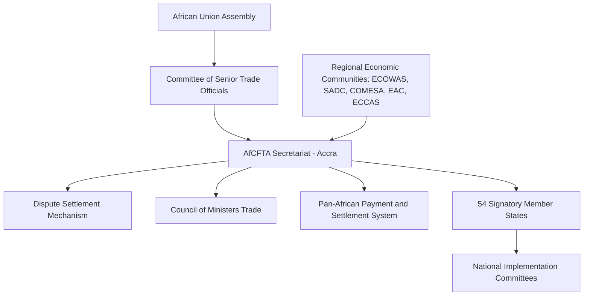
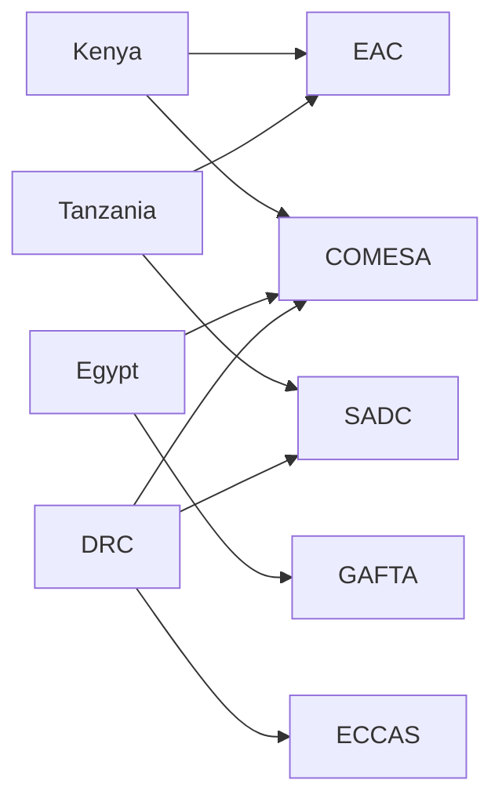

## The African Continental Free Trade Area

### Overview

The African Continental Free Trade Area (AfCFTA) is a trade liberalization agreement establishing a single continental market for goods and services across the African Union's 55 member states, with 54 having signed and the vast majority having ratified as of the current period. It creates the largest free trade area by number of participating countries in the world, covering a market of approximately 1.3 billion people and a combined GDP of roughly $3.4 trillion. The agreement is administered by the AfCFTA Secretariat, headquartered in Accra, Ghana, and falls under the broader institutional framework of the African Union.

AfCFTA succeeds decades of fragmented regional integration attempts under overlapping Regional Economic Communities (RECs) such as ECOWAS, SADC, COMESA, and the EAC, and represents an effort to consolidate these into a single continental architecture rather than replace them outright.

### Historical and Institutional Background

**Key Points**

- Negotiations were launched at the AU Summit in Johannesburg in June 2015, building on the 2012 Boma Declaration and the Action Plan for Boosting Intra-African Trade (BIAT).
- The Agreement Establishing the AfCFTA was signed in Kigali, Rwanda, in March 2018.
- The agreement entered into force in May 2019, after ratification by the required 22 member states.
- Trading formally commenced on January 1, 2021, following delays tied to the COVID-19 pandemic and unresolved technical annexes (Rules of Origin, tariff schedules).
- Nigeria and South Africa, the continent's two largest economies, were initially reluctant signatories, joining later after domestic consultations.

The AfCFTA is legally structured as a framework agreement with multiple protocols negotiated in phases:

- **Phase I**: Trade in Goods, Trade in Services, and Dispute Settlement
- **Phase II**: Investment, Intellectual Property Rights, and Competition Policy
- **Phase III**: Digital Trade and Women/Youth in Trade

This phased architecture mirrors the WTO's approach of building consensus incrementally rather than requiring full agreement across all issue areas simultaneously.

### Core Legal and Economic Provisions

#### Tariff Liberalization

Member states committed to eliminating tariffs on 90% of tariff lines over a transition period (5 years for developing countries, 10 years for Least Developed Countries, LDCs). An additional 7% of tariff lines are designated "sensitive products" with longer liberalization schedules, while up to 3% can be excluded entirely, provided exclusions do not exceed 10% of intra-African import value from other State Parties.

$$\text{Liberalized Trade Value} = \sum_{i=1}^{n} T_i \times (1 - \tau_i)$$

Where $T_i$ is the trade value of tariff line $i$ and $\tau_i$ is the applied tariff rate, which converges toward zero for the 90% "non-sensitive" category over the transition period.

#### Rules of Origin

Rules of Origin (RoO) determine which goods qualify for preferential tariff treatment by establishing sufficient African content or transformation. AfCFTA RoO negotiations were among the most protracted, given their direct implications for regional value chains, particularly in automotive, textiles, and agro-processing sectors. Criteria generally include:

- **Wholly obtained** goods (minerals, agricultural products grown entirely within a State Party)
- **Value-addition threshold** (commonly a non-originating material cap, often around 40% ex-works price, varying by product-specific rule)
- **Change in tariff heading (CTH)** under the Harmonized System (HS) classification

[Inference] Because product-specific rules are negotiated line-by-line and continue to be finalized incrementally, exact thresholds vary substantially by sector and should be verified against the current consolidated Rules of Origin schedule published by the AfCFTA Secretariat.

#### Trade in Services

Liberalization initially targeted five priority sectors: business services, communication services, financial services, tourism, and transport services, using a "positive list" scheduling approach similar to GATS (General Agreement on Trade in Services) modalities.

### Institutional Architecture

The **Dispute Settlement Mechanism (DSM)** is modeled closely on the WTO's DSU (Dispute Settlement Understanding), including panel formation, appellate review, and adoption procedures, reflecting an intent to build legal predictability into intra-African trade relations.

The **Pan-African Payment and Settlement System (PAPSS)**, developed jointly with Afreximbank, addresses a critical non-tariff barrier: the scarcity of direct currency convertibility between African currencies, which historically forced many intra-African transactions to route through USD or EUR correspondent banking, adding cost and delay.

### Geopolitical and Strategic Significance

#### Reducing External Dependency

AfCFTA is frequently framed as a structural response to Africa's historical position in global value chains as a raw-material exporter and finished-goods importer. Intra-African trade has hovered around 14-18% of total African trade, substantially lower than intra-EU (~60%) or intra-Asia (~55%) figures. Diversifying trade partners across neighboring states is viewed as a hedge against volatility in commodity-dependent export relationships with China, the EU, and the United States.

#### Relationship to Existing Power Blocs

- **China**: AfCFTA does not replace bilateral Belt and Road Initiative (BRI) infrastructure financing but is viewed as complementary; improved intra-African logistics corridors increase the utility of Chinese-financed ports, rail, and roads by enabling onward regional distribution.
- **European Union**: AfCFTA intersects with existing Economic Partnership Agreements (EPAs) between the EU and African RECs, creating potential legal friction between continental and bilateral preferential regimes.
- **United States**: The African Growth and Opportunity Act (AGOA) operates in parallel; AfCFTA's harmonization of standards could, over time, reduce compliance costs for African exporters seeking to qualify under AGOA's rules simultaneously with continental preferences.
- **Gulf States and India**: Growing investment interest, particularly in ports and logistics (UAE's DP World holdings across multiple African ports), positions these actors to benefit from AfCFTA-driven volume increases.

#### Fragmentation Risk: The "Spaghetti Bowl" Problem

A central technical challenge is the overlapping membership of RECs, where individual countries may belong to two or three RECs with differing external tariffs and rules of origin.

[Inference] This overlapping structure creates administrative complexity for customs authorities determining which preferential regime applies to a given shipment, and harmonizing these into a single AfCFTA tariff schedule is expected to remain a multi-year technical undertaking.

### Non-Tariff Barriers (NTBs) and Implementation Challenges

- **Infrastructure deficits**: Poor road, rail, and port connectivity between many neighboring states, particularly landlocked countries, limits the practical realization of tariff gains. Intra-African transport costs are frequently cited as significantly higher per kilometer than comparable routes in other regions.
- **Border administration**: Non-harmonized customs documentation, informal payments, and inconsistent application of the Harmonized System classification create delays disproportionate to the actual tariff savings.
- **Non-Tariff Barriers reporting mechanism**: AfCFTA operates an online NTB reporting and monitoring platform allowing traders to flag obstacles for resolution by national focal points, modeled on similar tools used within the Tripartite Free Trade Area (COMESA-EAC-SADC).
- **Political economy resistance**: Domestic industries fearing import competition (notably Nigeria's manufacturing and agricultural lobbies) have historically slowed ratification and tariff-line concessions.

### Worked Example: Tariff Impact on a Textile Exporter

Consider a textile manufacturer in Country A exporting cotton garments to Country B, both AfCFTA State Parties, where the pre-AfCFTA Most-Favored-Nation (MFN) tariff was 20%.

**Example**

1. Product qualifies under Rules of Origin (cotton wholly grown and processed within Country A) → satisfies "wholly obtained" criterion.
2. Tariff line falls within the 90% "non-sensitive" category → scheduled for full liberalization within the 5-year transition window.
3. Applied tariff at Year 3 of implementation (assuming linear phase-down):

$$\tau_3 = \tau_0 \times \left(1 - \frac{3}{5}\right) = 20\% \times 0.4 = 8\%$$

4. Exporter must present a valid AfCFTA Certificate of Origin at customs to claim the reduced rate; absent this documentation, the standard MFN rate applies regardless of actual origin.

This illustrates how RoO documentation compliance, not just the tariff schedule itself, determines whether preferential treatment is actually realized at the border. [Unverified] The precise phase-down curve (linear versus front-loaded or back-loaded) varies by country schedule and should be confirmed against the specific State Party's tariff offer.

### Diagram: AfCFTA Trade Flow Under Preferential Treatment (svg_diagram)

<svg xmlns="http://www.w3.org/2000/svg" viewBox="0 0 760 300">
<text x="380" y="24" text-anchor="middle" font-size="15" font-weight="bold" fill="#1a1a1a">AfCFTA Preferential Trade Flow (svg_diagram)</text>
<rect x="20" y="70" width="150" height="70" rx="6" fill="#e8f0fe" stroke="#1a56db" stroke-width="1.5" />
<text x="95" y="100" text-anchor="middle" font-size="12" fill="#1a1a1a">Exporter</text>
<text x="95" y="118" text-anchor="middle" font-size="11" fill="#444">Country A</text>
<rect x="220" y="70" width="160" height="70" rx="6" fill="#fef3e0" stroke="#b45309" stroke-width="1.5" />
<text x="300" y="95" text-anchor="middle" font-size="12" fill="#1a1a1a">Certificate of</text>
<text x="300" y="112" text-anchor="middle" font-size="12" fill="#1a1a1a">Origin Issued</text>
<text x="300" y="129" text-anchor="middle" font-size="10" fill="#444">(RoO verification)</text>
<rect x="430" y="70" width="150" height="70" rx="6" fill="#e6f4ea" stroke="#1e7e34" stroke-width="1.5" />
<text x="505" y="100" text-anchor="middle" font-size="12" fill="#1a1a1a">Customs</text>
<text x="505" y="118" text-anchor="middle" font-size="11" fill="#444">Country B Border</text>
<rect x="620" y="70" width="120" height="70" rx="6" fill="#f3e8fd" stroke="#7c3aed" stroke-width="1.5" />
<text x="680" y="100" text-anchor="middle" font-size="12" fill="#1a1a1a">Importer</text>
<text x="680" y="118" text-anchor="middle" font-size="11" fill="#444">Country B</text>
<line x1="170" y1="105" x2="215" y2="105" stroke="#333" stroke-width="1.5" marker-end="url(#arrow)" />
<line x1="380" y1="105" x2="425" y2="105" stroke="#333" stroke-width="1.5" marker-end="url(#arrow)" />
<line x1="580" y1="105" x2="615" y2="105" stroke="#333" stroke-width="1.5" marker-end="url(#arrow)" />
<rect x="220" y="190" width="360" height="70" rx="6" fill="#fff" stroke="#999" stroke-width="1" stroke-dasharray="4,3" />
<text x="400" y="212" text-anchor="middle" font-size="12" font-weight="bold" fill="#1a1a1a">Decision at Border</text>
<text x="400" y="232" text-anchor="middle" font-size="11" fill="#444">Valid CoO + qualifying RoO → Preferential Tariff</text>
<text x="400" y="248" text-anchor="middle" font-size="11" fill="#444">Missing/invalid CoO → Standard MFN Tariff Applied</text>
<line x1="505" y1="140" x2="400" y2="188" stroke="#999" stroke-width="1" marker-end="url(#arrow)" />
</svg>

### Comparative Position Among Global Trade Blocs

| Dimension | AfCFTA | EU Single Market | ASEAN Free Trade Area | USMCA |
| --- | --- | --- | --- | --- |
| Member states | 54 signatories | 27 | 10 | 3 |
| Population covered | ~1.3 billion | ~450 million | ~680 million | ~500 million |
| Institutional depth | Framework agreement, phased protocols | Supranational, common currency subset | Intergovernmental, consensus-based | Trade agreement, no supranational body |
| Dispute mechanism | WTO-modeled DSM | European Court of Justice | ASEAN Protocol on Enhanced Dispute Settlement Mechanism | USMCA Chapter 31 panels |
| Currency integration | PAPSS (payment settlement, not currency union) | Eurozone (subset) | None | None |

[Inference] AfCFTA's institutional depth is closer to an early-stage ASEAN than to the EU, given its reliance on national implementation committees and phased protocol ratification rather than supranational enforcement authority.

### Sector-Specific Implications

- **Automotive**: Regional value chain rules incentivize component sourcing within Africa; South Africa's established automotive manufacturing base is positioned as a potential regional hub under AfCFTA-compliant RoO.
- **Agriculture**: Tariff elimination on processed agricultural goods could shift value capture from raw commodity export toward in-country processing, though this depends heavily on resolving non-tariff barriers around SPS (Sanitary and Phytosanitary) standards harmonization.
- **Digital trade and e-commerce**: The Phase III Protocol on Digital Trade addresses cross-border data flows, e-payments, and digital services taxation, an area of growing relevance given the expansion of African fintech ecosystems.
- **Pharmaceuticals**: AfCFTA is linked conceptually to the African Medicines Agency (AMA) initiative, aiming to reduce the continent's historical reliance on pharmaceutical imports, a vulnerability highlighted during COVID-19 vaccine distribution shortfalls.

### Critiques and Open Debates

- **Revenue loss concerns**: Tariff revenue constitutes a significant share of government income in several LDCs; rapid liberalization raises fiscal sustainability questions absent compensatory mechanisms.
- **Uneven benefit distribution**: [Inference] Larger, more industrialized economies (Nigeria, South Africa, Egypt, Kenya) are generally expected to capture disproportionate early gains due to existing manufacturing capacity, potentially widening rather than narrowing intra-continental development gaps, though outcomes will depend on complementary industrial policy.
- **Implementation capacity gaps**: Customs digitization, single-window trade systems, and RoO verification infrastructure remain unevenly developed across member states, meaning legal entry into force does not guarantee uniform practical implementation.
- **Overlap with REC obligations**: Legal questions remain regarding precedence when AfCFTA provisions conflict with existing REC-level trade protocols, particularly on rules of origin thresholds.

### Conclusion

The AfCFTA represents the most ambitious continental trade integration project in Africa's post-colonial history, structurally aimed at reducing reliance on extra-continental trade partners and reshaping Africa's position within global value chains. Its ultimate geopolitical significance depends less on the legal text, already largely ratified, and more on execution: infrastructure investment, customs harmonization, RoO simplification, and resolution of REC overlap. As a supply chain geopolitics case study, AfCFTA illustrates how trade bloc formation functions simultaneously as an economic integration project and a strategic hedge against dependency on non-African trading powers.

**Related Topics**

- Regional Economic Communities (ECOWAS, SADC, COMESA, EAC) and REC-AfCFTA legal harmonization
- Pan-African Payment and Settlement System (PAPSS) and de-dollarization of intra-African trade
- Rules of Origin design and its role in regional value chain formation
- Belt and Road Initiative infrastructure financing and African port/logistics corridors
- African Growth and Opportunity Act (AGOA) and US-Africa trade policy
- EU Economic Partnership Agreements and their interaction with continental trade law
- Non-Tariff Barrier reporting mechanisms and customs digitization initiatives
- WTO Dispute Settlement Understanding as an institutional template for regional trade blocs