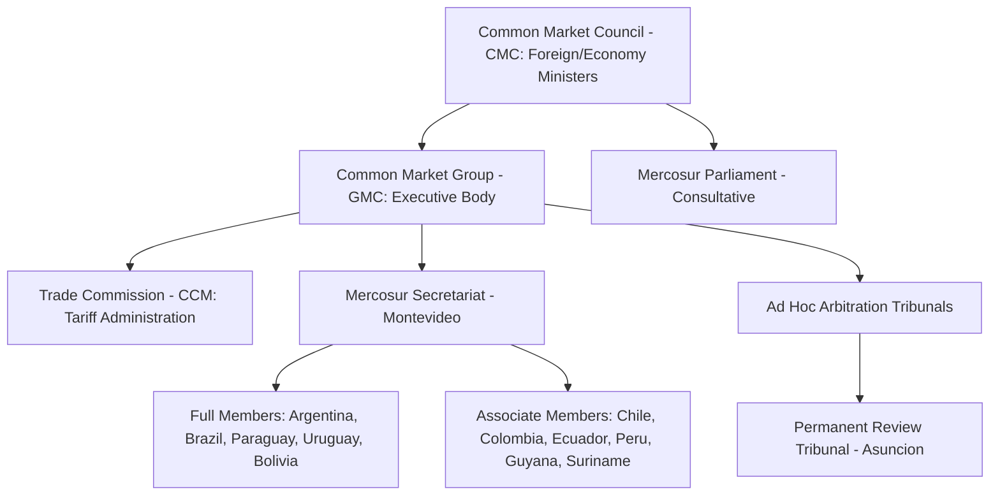
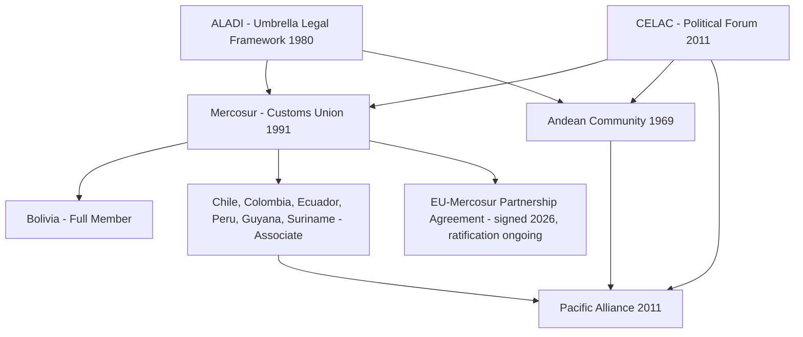

## Mercosur and Latin American Integration Efforts

### Overview

Mercosur (Mercado Común del Sur / Southern Common Market) is the principal trade bloc of South America, established to create a common market among its founding members. It operates alongside, and sometimes in tension with, a broader ecosystem of Latin American integration schemes, including the Pacific Alliance, the Andean Community (CAN), CELAC, and ALADI (the Latin American Integration Association). Understanding Mercosur requires situating it within this fragmented regional landscape, where overlapping and sometimes competing integration philosophies (protectionist-developmentalist versus open-regionalist) have shaped outcomes over three decades.

### Historical Formation and Legal Basis

**Key Points**

- Founded by the **Treaty of Asunción** in March 1991, signed by Argentina, Brazil, Paraguay, and Uruguay.
- Institutionalized as a customs union through the **Ouro Preto Protocol** in December 1994, which established Mercosur's legal personality and institutional structure.
- Venezuela was admitted as a full member in 2012 but was suspended in 2017 under the bloc's democratic clause (Ushuaia Protocol) amid political crisis.
- Bolivia signed its accession protocol in 2015 and had its membership ratified by Mercosur's founding members, with implementation proceeding gradually through subsequent years.
- Associate members (not full members, without voting rights over common external tariff decisions) include Chile, Colombia, Ecuador, Guyana, Peru, and Suriname.

The founding objective was to build a **customs union**, a deeper integration form than a simple free trade area, requiring member states to harmonize their external tariffs toward third countries via the Common External Tariff (CET), in addition to eliminating internal tariffs among themselves.

### Institutional Structure

Mercosur is intergovernmental rather than supranational: decisions require consensus, and there is no independent court with binding supranational authority comparable to the European Court of Justice.

- **Common Market Council (CMC)**: highest decision-making body, composed of foreign affairs and economy ministers.
- **Common Market Group (GMC)**: executive organ implementing CMC decisions.
- **Trade Commission (CCM)**: administers common trade policy instruments, including the CET.
- **Permanent Review Tribunal (TPR)**, based in Asunción, Paraguay, provides appellate review of ad hoc arbitration panel rulings, functioning as Mercosur's closest analog to a dispute settlement court, though its rulings still depend on member state compliance rather than automatic supranational enforcement.
- **Mercosur Parliament (Parlasur)**: consultative body with no binding legislative power, reflecting the bloc's intergovernmental character.

### The Common External Tariff (CET)

The CET is central to Mercosur's identity as a customs union rather than a mere free trade area. It sets uniform tariff rates applied to imports from non-member countries across most product categories, ranging historically between approximately 0% and 20%, with numerous national exceptions lists (Listas de Excepciones) permitted for sensitive sectors such as capital goods, informatics, and telecommunications equipment.

$$\text{CET}_j = \text{Common Rate for HS Category } j \quad \text{(subject to national exception lists)}$$

[Inference] The persistence of national exception lists for multiple decades after CET adoption indicates that Mercosur functions as an imperfect customs union in practice, with member states retaining substantial unilateral tariff-setting latitude in politically sensitive sectors; the specific product coverage of exceptions should be verified against current CCM decisions.

### Dispute Settlement Mechanism

Mercosur's dispute resolution system is governed by the **Protocolo de Olivos** (2002), which established the two-tier structure of ad hoc tribunals followed by the Permanent Review Tribunal. This system has adjudicated disputes over issues such as Argentine import restrictions and Uruguayan cellulose plant environmental disputes (the Botnia/Fray Bentos pulp mill case, which was also litigated separately at the International Court of Justice between Argentina and Uruguay).

[Unverified] The comparative caseload and enforcement effectiveness of the TPR relative to WTO panels is a matter of ongoing scholarly debate and should not be assumed equivalent without current empirical review.

### The EU-Mercosur Association Agreement

One of the most geopolitically significant developments is the **EU-Mercosur Association Agreement**, a negotiation spanning over two decades.

**Key Points**

- Political agreement on the trade pillar was reached in June 2019 after 20 years of negotiation.
- The agreement stalled over concerns from EU member states (notably France) regarding Amazon deforestation, agricultural competition (particularly beef), and environmental/sustainability commitments.
- A renewed political agreement, incorporating additional sustainability provisions, was announced in December 2024.
- As of the current period, ratification by EU member state parliaments and the European Parliament remains an ongoing process, and the agreement's final entry into force timeline should be verified against current EU and Mercosur official sources given the multi-stage ratification requirements.

Let me verify the current ratification status with a search, since this is a live, evolving geopolitical process.

Searched the webEU Mercosur agreement ratification status 2026

Now I have current information. Continuing with the comprehensive content.

**Current Status** (as of the most recent available information): The EU-Mercosur relationship moved significantly in early 2026. On January 9, 2026, EU member states authorized signature of two distinct instruments: the **EU-Mercosur Partnership Agreement (EMPA)**, a comprehensive "mixed agreement" covering political dialogue and cooperation requiring ratification by all EU member states individually, and a narrower **Interim Trade Agreement (iTA)**, covering only trade and investment liberalization within the EU's exclusive competence and thus requiring only EU-level (not national) ratification. Both were signed on January 17, 2026. The European Parliament passed a resolution on January 21, 2026 requesting a Court of Justice of the EU (CJEU) opinion on whether the EMPA and iTA are compatible with EU law, which suspended the Parliament's consent procedure. This referral suspended Parliament's ratification process by an estimated 16 to 18 months. On the Mercosur side, ratification proceeded faster: Brazil completed ratification on February 25, 2026, and Paraguay became the last Mercosur country to ratify the EMPA on March 17, 2026, with Argentina and Uruguay having already completed domestic ratification of the iTA by February 26, 2026. The agreement began provisional application on May 1, 2026. [Unverified] Given the CJEU referral and the historical precedent of EU mixed agreements like CETA remaining unratified by all member states years after signature, the timeline to full, final entry into force should be checked against current sources at the time of use. [EU to provisionally apply EU–Mercosur Interim Trade Agreement pending CJEU opinion | White & Case LLP +3](https://www.whitecase.com/insight-alert/eu-provisionally-apply-eu-mercosur-interim-trade-agreement-pending-cjeu-opinion)

### Diagram: EU-Mercosur Ratification Architecture (svg_diagram)

<svg xmlns="http://www.w3.org/2000/svg" viewBox="0 0 760 340">
<text x="380" y="24" text-anchor="middle" font-size="15" font-weight="bold" fill="#1a1a1a">EU-Mercosur Dual-Instrument Ratification (svg_diagram)</text>
<rect x="40" y="55" width="300" height="90" rx="6" fill="#e8f0fe" stroke="#1a56db" stroke-width="1.5" />
<text x="190" y="80" text-anchor="middle" font-size="13" font-weight="bold" fill="#1a1a1a">Interim Trade Agreement (iTA)</text>
<text x="190" y="100" text-anchor="middle" font-size="11" fill="#444">EU exclusive competence</text>
<text x="190" y="118" text-anchor="middle" font-size="11" fill="#444">Ratified at EU level only</text>
<text x="190" y="134" text-anchor="middle" font-size="11" fill="#444">Provisional application: May 2026</text>
<rect x="420" y="55" width="300" height="90" rx="6" fill="#fef3e0" stroke="#b45309" stroke-width="1.5" />
<text x="570" y="80" text-anchor="middle" font-size="13" font-weight="bold" fill="#1a1a1a">Partnership Agreement (EMPA)</text>
<text x="570" y="100" text-anchor="middle" font-size="11" fill="#444">Mixed agreement (political +</text>
<text x="570" y="116" text-anchor="middle" font-size="11" fill="#444">cooperation pillar)</text>
<text x="570" y="132" text-anchor="middle" font-size="11" fill="#444">Requires all 27 national ratifications</text>
<rect x="230" y="180" width="300" height="70" rx="6" fill="#fdecea" stroke="#c0392b" stroke-width="1.5" />
<text x="380" y="205" text-anchor="middle" font-size="12" font-weight="bold" fill="#1a1a1a">CJEU Compatibility Opinion Requested</text>
<text x="380" y="223" text-anchor="middle" font-size="11" fill="#444">Jan 21, 2026 — suspends EP consent</text>
<text x="380" y="239" text-anchor="middle" font-size="11" fill="#444">Estimated 16-18 month delay</text>
<line x1="190" y1="145" x2="330" y2="180" stroke="#999" stroke-width="1" marker-end="url(#arrow2)" />
<line x1="570" y1="145" x2="430" y2="180" stroke="#999" stroke-width="1" marker-end="url(#arrow2)" />
<rect x="130" y="280" width="500" height="45" rx="6" fill="#e6f4ea" stroke="#1e7e34" stroke-width="1.5" />
<text x="380" y="307" text-anchor="middle" font-size="11" fill="#1a1a1a">Mercosur side: Argentina, Uruguay, Brazil, Paraguay ratified Feb-Mar 2026</text>
</svg>

### Geopolitical Significance of the EU-Mercosur Deal

- **Counterweight to China**: Once ratified, the agreement would represent the largest trade deal struck by both the EU (449 million inhabitants) and Mercosur (260 million inhabitants), in terms of the number of citizens involved. This is broadly interpreted as an EU strategic move to diversify critical raw material and food supply chains away from over-reliance on China, particularly for lithium, and agricultural commodities. [Wikipedia](https://en.wikipedia.org/wiki/EU%E2%80%93Mercosur_Partnership_Agreement)
- **Domestic agricultural opposition**: French farmers' associations and several EU governments (notably France, and at various points Poland, Ireland, Austria, and Hungary, per the January 2026 Council vote) have opposed the deal on grounds of unfair competition from Mercosur beef, poultry, and sugar produced under less stringent environmental and animal welfare standards. The iTA was approved in the Council despite opposition from five EU Member States and an abstention by Belgium. [White & Case LLP](https://www.whitecase.com/insight-alert/eu-provisionally-apply-eu-mercosur-interim-trade-agreement-pending-cjeu-opinion)
- **Deforestation and sustainability linkage**: The renewed 2024 political agreement incorporated additional sustainability safeguards partly in response to EU Deforestation Regulation (EUDR) compliance concerns tied to Amazon basin agricultural expansion.
- **Precedent risk (CETA parallel)**: The complexity of gaining approval from more than 27 national and sub-national legislatures has caused significant delays in EU ratification of mixed agreements in the past; the 2017 EU-Canada CETA agreement remains only partially ratified, with 17 of 27 EU member states having completed national ratification. This precedent is widely cited as a caution against assuming EU-Mercosur will reach full legal force quickly even after provisional application begins. [Squire Patton Boggs](https://www.squirepattonboggs.com/insights/publications/eu-mercosur-trade-agreement-signed-starting-ratification-process/)

### Broader Latin American Integration Landscape

Mercosur exists within a wider, historically fragmented constellation of regional schemes:

| Bloc | Founded | Members | Integration Depth | Orientation |
| --- | --- | --- | --- | --- |
| Mercosur | 1991 | Argentina, Brazil, Paraguay, Uruguay, Bolivia (full) | Customs union (imperfect) | Historically developmentalist/protectionist |
| Andean Community (CAN) | 1969 | Bolivia, Colombia, Ecuador, Peru | Customs union (weaker enforcement) | Mixed |
| Pacific Alliance | 2011 | Chile, Colombia, Mexico, Peru | Deep FTA, financial integration | Open regionalism, export-oriented |
| ALADI | 1980 | 13 Latin American states | Framework for bilateral/plurilateral agreements | Umbrella legal framework |
| CELAC | 2011 | 33 states (all of Latin America/Caribbean) | Political dialogue forum, no trade authority | Political coordination |
| UNASUR (largely defunct) | 2008 | Former: 12 South American states | Political/infrastructure coordination | Political, weakened post-2018 |

[Inference] The Pacific Alliance's contrasting "open regionalism" model, emphasizing unilateral trade liberalization and integration into Asia-Pacific value chains, is frequently framed by trade economists as an implicit rival development model to Mercosur's historically more protected, industrial-policy-oriented approach, though several Pacific Alliance members (Chile, Colombia, Peru) also hold Mercosur associate status, illustrating that these blocs are not mutually exclusive in practice.

### Automotive Sector Case Study: Managed Trade Within Mercosur

The Argentina-Brazil automotive trade regime is a frequently cited technical example of Mercosur's approach to sensitive sectors, historically operating under a bilateral flex/compensation mechanism (rather than pure free trade) that ties the volume of tariff-free vehicle trade between the two countries to a negotiated trade-balance ratio, periodically renewed via bilateral protocols within the Mercosur framework.

**Example**

1. Argentina and Brazil negotiate a **flex ratio** (e.g., a specified export-to-import dollar ratio) governing tariff-free automotive trade between the two countries.
2. Trade within the ratio moves duty-free under Mercosur intra-bloc rules.
3. Trade exceeding the negotiated ratio is subject to a tariff, incentivizing a managed balance rather than a purely market-determined trade flow.
4. This mechanism has been renewed and adjusted multiple times since the 2000s, reflecting periodic renegotiation rather than a permanently fixed rule.

[Unverified] The specific flex ratio and tariff rate in effect vary by renewal period and should be confirmed against the current bilateral protocol in force at time of use, as these figures are renegotiated periodically.

### Non-Tariff and Structural Barriers to Deeper Integration

- **Infrastructure**: Poor cross-border road and rail connectivity, particularly across the Andes and through the Gran Chaco, limits physical trade flow between Atlantic and Pacific-facing economies.
- **Macroeconomic volatility**: Argentina's recurring currency and inflation crises have historically disrupted intra-Mercosur trade predictability, at times prompting unilateral Argentine import restrictions that triggered Mercosur dispute proceedings.
- **Political alignment swings**: Ideological shifts between left-leaning and right-leaning governments across member states (e.g., differing stances between successive Argentine and Brazilian administrations) have periodically stalled common positions on external negotiations, including the EU deal itself.
- **Absence of supranational enforcement**: Unlike the EU, Mercosur rulings under the Olivos Protocol rely on member state compliance rather than automatic supranational legal force, weakening the practical bite of dispute outcomes.

### Diagram: Mercosur's Position in the Latin American Integration Landscape

### Conclusion

Mercosur remains the anchor institution of South American economic integration, but its trajectory illustrates the recurring tension in Latin American regionalism between deeper institutional integration and the persistence of national economic sovereignty, exceptions, and macroeconomic divergence among members. The EU-Mercosur Partnership Agreement, now signed and moving through a contested, multi-track ratification process as of 2026, represents the bloc's most consequential external validation and its most significant test of institutional follow-through. Its outcome will shape whether Mercosur is understood primarily as a durable customs union capable of major external agreements, or as a looser, intergovernmental framework whose deepest achievements remain aspirational relative to its legal design.

**Related Topics**

- The EU Deforestation Regulation (EUDR) and its interaction with Mercosur agricultural exports
- CETA as a precedent for EU mixed-agreement ratification delays
- The Pacific Alliance and open regionalism as a contrasting Latin American trade model
- Argentina-Brazil automotive flex-trade protocols as managed trade case studies
- ALADI's legal framework function underlying bilateral/plurilateral Latin American agreements
- CJEU review procedures under Article 218(11) TFEU for EU external agreements
- Lithium and critical mineral supply chains in the Mercosur-EU relationship
- Democratic clause suspensions in regional trade blocs (Venezuela's 2017 Mercosur suspension)