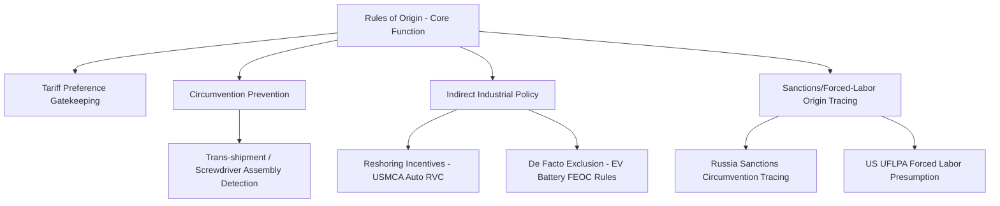

## Rules of Origin as a Geopolitical and Economic Instrument

### Overview

Rules of origin (RoO) are the legal criteria used to determine the economic "nationality" of a traded good, that is, which country a product is deemed to originate from for purposes of customs treatment. While technically a customs administration mechanism, RoO function as one of the most consequential and least visible instruments of trade policy, shaping where multinational firms locate production, which countries capture value-added activity within global value chains, and how effectively preferential trade agreements deliver their intended economic and geopolitical outcomes. Unlike tariffs, which are visible and politically salient, RoO operate through technical annexes, product-specific rules, and customs documentation, making them a quieter but frequently more decisive lever of supply chain geography.

### Why Rules of Origin Exist

In a world of multiple overlapping preferential trade agreements (PTAs) with differing tariff schedules, RoO prevent **tariff shopping** or **trade deflection**, where an exporter routes goods through the PTA member with the lowest external tariff (or best PTA terms) to reach a final destination, rather than through the country of actual production. Without RoO, a country with a low MFN (Most-Favored-Nation) tariff could function as a pass-through hub for goods manufactured entirely elsewhere, undermining the economic logic and negotiated balance of the preferential agreement.

**Key Points**

- RoO are the mechanism that converts a legal tariff preference into an enforceable economic reality at the border.
- Without RoO, free trade agreements would be exploitable via simple trans-shipment.
- RoO are negotiated line-by-line (often at the 6- to 8-digit Harmonized System level), making them one of the most technically granular parts of any trade agreement.

### Core Technical Mechanisms

There are three principal families of origin-conferring criteria, frequently combined within a single agreement depending on product category.

#### 1. Wholly Obtained Criterion

Applies to goods entirely grown, extracted, or produced within a single country with no imported inputs: minerals extracted from the territory, agricultural products harvested there, or live animals born and raised there. This is the simplest and least contested category.

#### 2. Change in Tariff Classification (CTC)

Requires that non-originating inputs undergo a sufficient transformation, evidenced by a shift in their Harmonized System (HS) classification code between the imported input and the exported final good. Sub-variants include:

- **Change in Chapter (CC)**: shift in the first 2 digits of the HS code (strictest form)
- **Change in Tariff Heading (CTH)**: shift in the first 4 digits
- **Change in Tariff Subheading (CTSH)**: shift in the first 6 digits (least strict of the three)

#### 3. Value-Added / Regional Value Content (RVC) Threshold

Requires that a minimum percentage of the good's value derive from originating materials and processing within the PTA region. Commonly expressed as:

$$\text{RVC} = \frac{\text{Transaction Value} - \text{Value of Non-Originating Materials (VNM)}}{\text{Transaction Value}} \times 100\%$$

or, under a build-up method:

$$\text{RVC} = \frac{\text{Value of Originating Materials} + \text{Direct Labor} + \text{Direct Overhead} + \text{Profit}}{\text{Total Cost}} \times 100\%$$

The threshold varies significantly by agreement and product: USMCA's automotive RVC requirement, for example, was raised substantially above its NAFTA predecessor, a change with direct, deliberate geopolitical intent (discussed below).

#### 4. Technical/Process Requirement

Mandates that specific manufacturing operations occur within the originating territory, regardless of value content, common in textiles (e.g., "yarn-forward" rules requiring spinning and weaving within the region) and chemicals (specific reaction requirements).

### Diagram: Rules of Origin Decision Logic (svg_diagram)

<svg xmlns="http://www.w3.org/2000/svg" viewBox="0 0 760 380">
<text x="380" y="24" text-anchor="middle" font-size="15" font-weight="bold" fill="#1a1a1a">Origin Determination Decision Tree (svg_diagram)</text>
<rect x="300" y="50" width="160" height="55" rx="6" fill="#e8f0fe" stroke="#1a56db" stroke-width="1.5" />
<text x="380" y="82" text-anchor="middle" font-size="12" fill="#1a1a1a">Good enters customs</text>
<rect x="300" y="135" width="160" height="55" rx="6" fill="#fff" stroke="#666" stroke-width="1.5" />
<text x="380" y="158" text-anchor="middle" font-size="11" fill="#1a1a1a">Wholly obtained</text>
<text x="380" y="174" text-anchor="middle" font-size="11" fill="#1a1a1a">in single territory?</text>
<rect x="60" y="220" width="170" height="50" rx="6" fill="#e6f4ea" stroke="#1e7e34" stroke-width="1.5" />
<text x="145" y="250" text-anchor="middle" font-size="11" fill="#1a1a1a">YES → Originating</text>
<rect x="300" y="220" width="160" height="55" rx="6" fill="#fff" stroke="#666" stroke-width="1.5" />
<text x="380" y="243" text-anchor="middle" font-size="11" fill="#1a1a1a">NO → Apply CTC</text>
<text x="380" y="259" text-anchor="middle" font-size="11" fill="#1a1a1a">and/or RVC test</text>
<rect x="530" y="220" width="170" height="50" rx="6" fill="#fdecea" stroke="#c0392b" stroke-width="1.5" />
<text x="615" y="250" text-anchor="middle" font-size="11" fill="#1a1a1a">Fails test → Non-originating</text>
<rect x="300" y="305" width="160" height="55" rx="6" fill="#e6f4ea" stroke="#1e7e34" stroke-width="1.5" />
<text x="380" y="328" text-anchor="middle" font-size="11" fill="#1a1a1a">Passes threshold →</text>
<text x="380" y="344" text-anchor="middle" font-size="11" fill="#1a1a1a">Originating (Cert. of Origin)</text>
<line x1="380" y1="105" x2="380" y2="130" stroke="#333" stroke-width="1.5" marker-end="url(#a3)" />
<line x1="300" y1="165" x2="150" y2="218" stroke="#333" stroke-width="1.5" marker-end="url(#a3)" />
<line x1="380" y1="190" x2="380" y2="215" stroke="#333" stroke-width="1.5" marker-end="url(#a3)" />
<line x1="460" y1="245" x2="525" y2="245" stroke="#333" stroke-width="1.5" marker-end="url(#a3)" />
<line x1="380" y1="275" x2="380" y2="300" stroke="#333" stroke-width="1.5" marker-end="url(#a3)" />
</svg>

### Cumulation: The Mechanism That Enables Regional Value Chains

**Cumulation** allows inputs originating in one PTA member to count as "originating" content when incorporated into a final good manufactured in another PTA member, effectively treating the PTA region as a single originating territory for value-content purposes.

- **Bilateral cumulation**: applies only between the two parties to an agreement.
- **Diagonal cumulation**: extends to a defined group of countries with compatible, harmonized origin rules (e.g., the Pan-Euro-Mediterranean (PEM) Convention system).
- **Full cumulation**: the most permissive form, allowing any processing step performed in any PTA member to count toward the origin calculation, even if that step alone would not confer originating status.

[Inference] The scope of cumulation permitted in an agreement is often as consequential as the RVC threshold itself, since broad cumulation effectively enlarges the geographic pool from which "originating" inputs can be sourced, while narrow (bilateral-only) cumulation restricts regional value chains to tightly closed loops between the specific treaty parties.

### Geopolitical Function 1: Reshoring and Value-Chain Steering

RoO can be deliberately calibrated to redirect investment and production location decisions, functioning as an indirect industrial policy tool layered on top of trade liberalization.

**Example: USMCA Automotive Rules of Origin**

1. Under NAFTA, the RVC requirement for qualifying vehicles was 62.5%.
2. Under USMCA (effective 2020), the RVC threshold was raised to 75%, phased in over several years.
3. USMCA additionally introduced a **Labor Value Content (LVC)** requirement, mandating that a defined percentage of vehicle value be produced by workers earning at least a specified minimum wage (roughly $16/hour), an explicit mechanism to counteract wage-driven production shifts toward Mexico.
4. USMCA also introduced a **steel and aluminum purchasing requirement**, mandating that a specified share of these inputs be sourced from North America.

[Inference] These combined provisions were widely understood by trade policy analysts as deliberately designed to discourage further offshoring of automotive value chains to non-North American, particularly Asian, suppliers, and to incentivize reshoring or nearshoring of component production, though the actual realized shift in production location versus mere compliance-cost absorption by manufacturers is an empirical question requiring ongoing verification against production data.

### Geopolitical Function 2: Circumvention Prevention in Trade Disputes

RoO serve as the primary enforcement mechanism against **tariff circumvention**, where firms route goods through a third country to disguise origin and evade anti-dumping duties, safeguard tariffs, or sanctions.

**Case pattern**: During the US-China tariff escalation beginning in 2018, a documented pattern emerged of Chinese-origin goods undergoing minimal "screwdriver assembly" processing in Southeast Asian countries (notably Vietnam and Malaysia) before export to the United States, attempting to qualify for non-China origin designation and avoid Section 301 tariffs. [Unverified] The precise scale of this practice and specific enforcement outcomes vary by product category and year, and should be verified against current U.S. Customs and Border Protection (CBP) enforcement actions and academic trade-flow studies for any specific claim.

This dynamic has driven increased scrutiny of RoO verification, including:

- **Verification visits** by customs authorities to production facilities in third countries
- **Substantial transformation** tests applied more rigorously to catch minimal-processing circumvention
- **De minimis rule** tightening, restricting how much non-qualifying content can be included while a good still qualifies (typically a threshold like 7-10% of transaction value)

### Geopolitical Function 3: Sanctions and Export Control Enforcement

Origin determination extends beyond preferential tariff eligibility into sanctions compliance and export control enforcement, where "substantial transformation" tests determine whether a good is treated as originating from a sanctioned jurisdiction.

- **G7 Russia-related sanctions**: Rules determining whether goods incorporating Russian-origin inputs (e.g., diamonds, steel, or refined petroleum products blended with third-country inputs) can be considered non-Russian-origin have become a significant point of technical dispute, particularly around Russian diamonds processed in India or Russian crude refined into products in third countries (sometimes termed "laundering" by critics of insufficiently strict origin tracing).
- **Forced labor origin tracing**: The US Uyghur Forced Labor Prevention Act (UFLPA) creates a rebuttable presumption that goods with any nexus to Xinjiang-sourced inputs (notably cotton and polysilicon) are barred from entry, requiring importers to trace and document supply chain origin down to raw material extraction, a substantially more granular standard than typical preferential RoO.

[Inference] These sanctions and forced-labor origin-tracing regimes represent an expansion of origin-determination logic beyond its traditional tariff-preference function into a broader instrument of geopolitical and human-rights-driven supply chain governance, requiring due-diligence documentation standards that exceed those of conventional customs RoO.

### Geopolitical Function 4: Strategic Bloc Formation and De Facto Exclusion

RoO thresholds can be calibrated, intentionally or as a byproduct of negotiation, to effectively exclude specific third-country inputs from qualifying for preferential treatment, functioning as an indirect trade barrier against non-member economies without violating the letter of the agreement.

**Example**: Electric vehicle battery and critical mineral RoO provisions in agreements such as USMCA and the US Inflation Reduction Act's foreign entity of concern (FEOC) restrictions functionally exclude Chinese-processed battery materials and components from qualifying for tax credits or preferential treatment, even when nominally "rules of origin" or "content" requirements rather than explicit country bans.

$$\text{Qualifying Battery Value \%} = \frac{\text{Value of Critical Minerals/Components from Non-FEOC Sources}}{\text{Total Battery Value}} \times 100\%$$

[Inference] This represents a convergence of RoO-style content rules with explicit geopolitical exclusion criteria, a trend that appears likely to expand into other strategic sectors (semiconductors, pharmaceuticals, rare earths) as supply chain "de-risking" policy intensifies, though the specific legal mechanisms and thresholds are evolving and should be checked against current implementing regulations.

### Diagram: RoO as a Layered Policy Instrument

### Compliance Costs and the "Spaghetti Bowl" Problem

The proliferation of PTAs, each with distinct RoO, creates substantial compliance complexity for firms operating across multiple preferential regimes simultaneously, an effect widely termed the **"spaghetti bowl"** phenomenon in trade economics literature.

**Key Points**

- Firms exporting the same product to multiple destination markets under different PTAs must often maintain separate origin documentation and potentially separate production/sourcing strategies to satisfy divergent RoO across agreements.
- Small and medium enterprises (SMEs) face disproportionately high compliance costs relative to large multinational firms with dedicated trade compliance departments, since certificate-of-origin documentation, supplier declarations, and potential verification audits carry largely fixed administrative costs.
- [Inference] This compliance burden is frequently cited in trade literature as a partial explanation for why actual utilization rates of preferential tariffs under many PTAs fall meaningfully below their theoretical maximum, since some exporters find compliance costs exceed the tariff savings for lower-value shipments, though exact utilization rates vary substantially by agreement and should be verified against current customs administration data for any specific claim.

### Worked Example: RVC Calculation Under a Hypothetical PTA

Consider an electronics assembler in Country X exporting a finished device under a PTA requiring a 50% Regional Value Content threshold (build-down method).

**Example**

- Transaction (export) value: $100 per unit
- Value of non-originating materials (imported semiconductor components from a non-PTA country): $38 per unit

$$\text{RVC} = \frac{100 - 38}{100} \times 100\% = 62\%$$

Since 62% exceeds the 50% threshold, the good qualifies as originating and is eligible for preferential tariff treatment when exported to the PTA partner country, provided the exporter obtains and presents a valid Certificate of Origin. If the non-originating material value instead rose to $55 (e.g., due to a shift toward higher-value imported chips), the RVC would fall to 45%, below threshold, disqualifying the good from preference regardless of the country of final assembly.

This illustrates why RoO create direct incentives for firms to adjust their sourcing mix of inputs, not merely their final assembly location, in order to preserve preferential eligibility.

### Comparative RoO Stringency Across Major Agreements

| Agreement | Automotive RVC (approx.) | Cumulation Scope | Notable Feature |
| --- | --- | --- | --- |
| NAFTA (legacy) | 62.5% | Bilateral (US-Canada-Mexico) | Superseded by USMCA |
| USMCA | 75% (phased) | Bilateral (regional) | Adds Labor Value Content requirement |
| EU-Mercosur (iTA) | Product-specific, varies | Bilateral | Differentiated by sector, incl. agri-food |
| AfCFTA | Varies by product-specific rule | Continental (in phased development) | Still finalizing consolidated schedules |
| RCEP | Generally CTC or 40% RVC (varies) | Diagonal cumulation across 15 members | Broader cumulation eases regional sourcing |

[Unverified] Exact percentage thresholds are subject to periodic renegotiation and phased implementation schedules; figures above should be cross-checked against the current consolidated text of each agreement before being cited as precise, current values.

### Conclusion

Rules of origin sit at the technical core of trade policy but function as instruments of considerable geopolitical consequence, determining not merely whether a tariff preference applies, but where multinational firms choose to locate production, how effectively sanctions and forced-labor restrictions can be enforced, and which countries are drawn into or excluded from strategically favored supply chains. As geopolitical competition increasingly manifests through supply chain policy, rather than through tariffs alone, RoO design is likely to remain a central, if technically obscure, battleground for shaping the geography of global production.

**Related Topics**

- Substantial transformation doctrine in customs law and sanctions enforcement
- The Uyghur Forced Labor Prevention Act (UFLPA) and forced-labor origin tracing
- Critical mineral and battery component "foreign entity of concern" restrictions
- Trade deflection and circumvention enforcement mechanisms
- The Pan-Euro-Mediterranean (PEM) cumulation system
- Preferential tariff utilization rates and the "spaghetti bowl" phenomenon
- De minimis thresholds and their role in origin qualification
- Nearshoring and friend-shoring as RoO-driven corporate sourcing responses