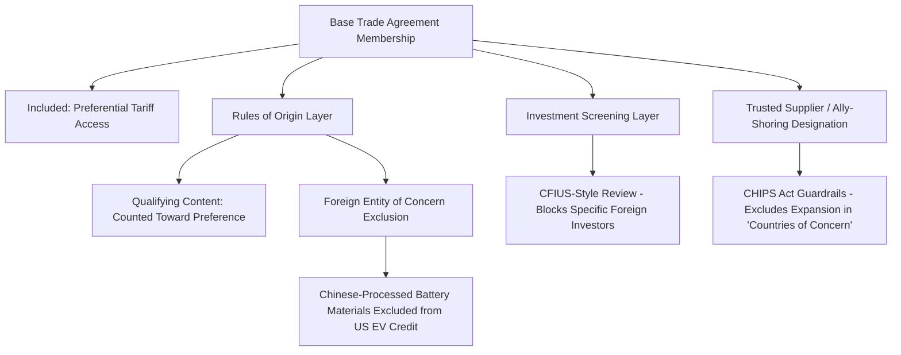

## Exclusion from Trade Agreements as a Geopolitical Signal

### Overview

Exclusion from preferential trade agreements (PTAs) is frequently as strategically significant as inclusion. Where membership confers preferential market access, regulatory alignment, and institutional standing, exclusion functions as a deliberate or structural signal of political distance, strategic distrust, or contested economic-system compatibility. Analyzing which countries are left outside a given trade architecture, and why, reveals as much about the geopolitics of supply chains as analyzing the agreements themselves. Exclusion operates through multiple mechanisms: explicit disqualification clauses, membership criteria calibrated to filter out specific economic models, deliberate non-invitation, and structural incompatibility with an agreement's regulatory or labor standards.

### Taxonomy of Exclusion Mechanisms

**Key Points**

- **Explicit political conditionality**: agreements containing democratic governance or human rights clauses that permit suspension or bar accession of non-qualifying states.
- **Deliberate non-invitation**: a bloc simply does not extend membership talks to a candidate country, without formal legal justification required.
- **Regulatory/standards incompatibility**: a country's domestic regulatory system (SPS standards, data governance, state-owned enterprise rules) is structurally incompatible with an agreement's requirements, functioning as de facto exclusion even absent explicit political intent.
- **Sequential/positional exclusion**: a country is excluded not from the agreement itself but from strategic supply chain positioning within it, via rules of origin, investment screening, or "trusted supplier" carve-outs layered on top of the base agreement.

### Mechanism 1: Explicit Political and Democratic Conditionality

Some trade blocs embed formal clauses permitting suspension or barring membership on political grounds, converting economic integration into an explicit instrument of political alignment enforcement.

**Example**: Mercosur's Ushuaia Protocol (1998) establishes a democratic clause permitting the suspension of a member state in the event of a rupture of democratic order. This was invoked to suspend Venezuela's Mercosur membership in 2017, following widespread concern among other member states regarding the erosion of democratic institutions and human rights conditions under the Maduro government.

[Inference] This case illustrates how a trade bloc's legal architecture can be activated as a political sanctioning tool distinct from, and in addition to, bilateral sanctions regimes imposed by individual states or other multilateral bodies such as the OAS.

Similarly, EU accession and association agreements have historically embedded human rights and rule-of-law conditionality (the "essential elements" clause common in EU external agreements), permitting suspension of trade preferences in the event of serious violations, which has been invoked in various contexts affecting EU trade relations with third countries.

### Mechanism 2: Deliberate Non-Invitation and Strategic Bloc Formation

Unlike explicit conditionality clauses, exclusion by simple non-invitation requires no formal justification and often carries the strongest geopolitical signaling precisely because it is discretionary rather than rule-bound.

**Case Study: The Trans-Pacific Partnership (TPP) and China**

The original Trans-Pacific Partnership negotiations (concluded 2015, later reconstituted as the CPTPP after US withdrawal in 2017) notably did not include China among its negotiating parties, despite China's central role in Asia-Pacific trade volumes. [Inference] This exclusion was widely interpreted by trade and foreign policy analysts as a deliberate element of the Obama administration's "pivot to Asia" strategy, intended to write regional trade rules (on state-owned enterprises, labor standards, digital trade, and intellectual property) that would set a high-standard template China would either need to reform toward or remain outside of, rather than an agreement designed primarily around commercial gains from including the region's largest economy.

China subsequently applied for CPTPP accession in September 2021, a request that remains under review by existing members, with several members expressing concerns about China's compatibility with CPTPP's state-owned enterprise disciplines and other structural provisions. [Unverified] The current status of China's accession bid, and the positions of individual CPTPP members toward it, should be verified against current reporting, as this is an active, evolving negotiation.

### Mechanism 3: Regulatory and Standards-Based De Facto Exclusion

Even absent explicit political intent, an agreement's technical requirements can function as structural exclusion when a candidate country's domestic economic system is fundamentally incompatible with the agreement's disciplines.

**Example**: State-owned enterprise (SOE) disciplines in agreements like CPTPP and USMCA require that SOEs operate on commercial terms, face competitive neutrality vis-à-vis private firms, and avoid certain forms of non-commercial assistance. [Inference] Because state-directed industrial policy and SOE-centric development models remain structurally significant in several major economies, including China, compliance with these specific disciplines would require substantial domestic economic restructuring, meaning the exclusionary effect operates through regulatory design rather than an explicit country-targeted clause.

This pattern also appears in:

- **Digital trade/data localization rules**: agreements requiring free cross-border data flow and prohibiting forced data localization structurally conflict with countries maintaining strict data sovereignty regimes.
- **Environmental and labor chapters**: increasingly stringent labor rights and environmental enforcement provisions in agreements like USMCA's rapid-response labor mechanism can function as a de facto barrier for economies with weaker labor enforcement infrastructure, independent of any explicit political targeting.

### Mechanism 4: Sequential/Positional Exclusion Within Supply Chains

A distinct and increasingly prominent form of exclusion operates not at the level of agreement membership, but within the technical architecture of an agreement, is excluding specific countries from qualifying as an "originating" or "trusted" source even for goods traded among agreement members.

**Example**: The US CHIPS and Science Act's guardrail provisions restrict recipients of US semiconductor manufacturing subsidies from expanding advanced semiconductor manufacturing capacity in "countries of concern" (including China) for a specified period, functioning as an exclusionary mechanism layered on top of, and independent from, any formal trade agreement membership question. [Unverified] Specific guardrail terms, covered technology thresholds, and enforcement mechanisms are subject to regulatory refinement and should be verified against current implementing regulations from the US Department of Commerce.

### Case Study: Russia's Exclusion from Global Trade Architecture Post-2022

The scale and speed of Russia's exclusion from Western-aligned trade and financial infrastructure following the February 2022 invasion of Ukraine represents one of the most extensive and rapid coordinated exclusion events in recent trade history.

**Key Points**

- Multiple jurisdictions (EU, US, UK, Japan, and others) revoked or suspended Most-Favored-Nation tariff treatment toward Russia, in some cases coordinated through formal WTO notification processes.
- Major Russian banks were excluded from the SWIFT international payment messaging system, a financial infrastructure exclusion functioning alongside, and reinforcing, trade-level sanctions.
- The G7 Price Cap Coalition on Russian oil created a novel enforcement mechanism conditioning access to Western shipping insurance and services on compliance with a price ceiling, effectively creating a parallel, discriminatory market access structure for Russian energy exports.
- Russia's own countermeasures, including the "unfriendly countries" list restricting certain exports and payment mechanisms toward sanctioning states, illustrate that exclusion dynamics in this case operated bidirectionally.

[Inference] The Russia case illustrates how exclusion from trade architecture can escalate rapidly from targeted sectoral sanctions to near-comprehensive removal from Western-aligned trade and payment systems, and how such exclusion drives the excluded state toward alternative trade architecture (in Russia's case, deepened trade and payment integration with China, India, and other non-sanctioning states), a dynamic sometimes termed "sanctions-driven bloc realignment."

### Diagram: Exclusion Mechanisms Spectrum (svg_diagram)

<svg xmlns="http://www.w3.org/2000/svg" viewBox="0 0 760 320">
<text x="380" y="24" text-anchor="middle" font-size="15" font-weight="bold" fill="#1a1a1a">Spectrum of Trade Exclusion Mechanisms (svg_diagram)</text>
<line x1="60" y1="180" x2="700" y2="180" stroke="#999" stroke-width="2" />
<circle cx="120" cy="180" r="7" fill="#1a56db" />
<text x="120" y="205" text-anchor="middle" font-size="10" fill="#1a1a1a">Structural</text>
<text x="120" y="219" text-anchor="middle" font-size="10" fill="#1a1a1a">Incompatibility</text>
<text x="120" y="150" text-anchor="middle" font-size="10" fill="#444">SOE rules,</text>
<text x="120" y="164" text-anchor="middle" font-size="10" fill="#444">data localization</text>
<circle cx="270" cy="180" r="7" fill="#1a56db" />
<text x="270" y="205" text-anchor="middle" font-size="10" fill="#1a1a1a">Deliberate</text>
<text x="270" y="219" text-anchor="middle" font-size="10" fill="#1a1a1a">Non-Invitation</text>
<text x="270" y="150" text-anchor="middle" font-size="10" fill="#444">TPP/China,</text>
<text x="270" y="164" text-anchor="middle" font-size="10" fill="#444">CPTPP accession review</text>
<circle cx="420" cy="180" r="7" fill="#b45309" />
<text x="420" y="205" text-anchor="middle" font-size="10" fill="#1a1a1a">Positional/RoO</text>
<text x="420" y="219" text-anchor="middle" font-size="10" fill="#1a1a1a">Layered Exclusion</text>
<text x="420" y="150" text-anchor="middle" font-size="10" fill="#444">FEOC battery rules,</text>
<text x="420" y="164" text-anchor="middle" font-size="10" fill="#444">CHIPS Act guardrails</text>
<circle cx="570" cy="180" r="7" fill="#c0392b" />
<text x="570" y="205" text-anchor="middle" font-size="10" fill="#1a1a1a">Conditionality</text>
<text x="570" y="219" text-anchor="middle" font-size="10" fill="#1a1a1a">Clause Suspension</text>
<text x="570" y="150" text-anchor="middle" font-size="10" fill="#444">Mercosur/Venezuela,</text>
<text x="570" y="164" text-anchor="middle" font-size="10" fill="#444">EU essential elements clause</text>
<circle cx="680" cy="180" r="7" fill="#c0392b" />
<text x="680" y="205" text-anchor="middle" font-size="10" fill="#1a1a1a">Comprehensive</text>
<text x="680" y="219" text-anchor="middle" font-size="10" fill="#1a1a1a">Removal</text>
<text x="680" y="150" text-anchor="middle" font-size="10" fill="#444">Russia post-2022</text>

<text x="380" y="270" text-anchor="middle" font-size="11" fill="#666" font-style="italic">Left: structural/passive exclusion —— Right: explicit/active exclusion</text>

</svg>

### Economic Consequences of Exclusion for the Excluded State

**Key Points**

- **Trade diversion loss**: excluded countries face relative cost disadvantages as preferential tariffs give included competitors a pricing edge in the same third-country markets, a well-documented trade-diversion effect in trade economics literature.
- **Investment diversion**: firms may relocate production toward PTA members specifically to gain preferential access, reducing FDI inflows to excluded economies even where labor costs or other fundamentals would otherwise favor them.
- **Standard-setting exclusion**: countries outside an agreement have no voice in shaping the regulatory standards (digital trade rules, IP protection norms, environmental disciplines) that the agreement's members establish, and that may later become de facto global benchmarks if the bloc is large enough (the so-called "Brussels effect" observed with EU regulatory standards).
- **Alternative bloc formation incentive**: exclusion frequently accelerates the excluded country's efforts to construct or deepen alternative trade architecture, as seen in China's expansion of RCEP participation and Belt and Road bilateral agreements partly in response to exclusion from CPTPP-style high-standard agreements, and Russia's pivot toward the Eurasian Economic Union and BRICS-aligned trade arrangements following Western sanctions.

$$\Delta \text{Export Competitiveness}_{excluded} = \tau_{MFN} - \tau_{preferential,competitor}$$

Where the excluded country's exporters face the full MFN tariff $\tau_{MFN}$ in a given destination market while included competitors benefit from the lower preferential rate $\tau_{preferential,competitor}$, creating a persistent cost disadvantage proportional to the tariff differential.

### Worked Example: Trade Diversion from Exclusion

Consider two countries, A (PTA member with destination market Z) and B (excluded from the same PTA), both exporting an identical manufactured good to market Z, where the MFN tariff is 15% and the PTA preferential rate is 0%.

**Example**

1. Country A's exporters land the good in market Z at production cost plus 0% tariff.
2. Country B's exporters land the same good at production cost plus 15% tariff.
3. Even if Country B's underlying production cost is 10% lower than Country A's (e.g., due to lower labor costs), the 15-percentage-point tariff differential exceeds this cost advantage, making Country B's landed price higher despite superior underlying competitiveness:

$$\text{Landed Price}_B = \text{Cost}_B \times 1.15 = 0.90 \times \text{Cost}_A \times 1.15 = 1.035 \times \text{Cost}_A$$

$$\text{Landed Price}_A = \text{Cost}_A \times 1.00 = 1.00 \times \text{Cost}_A$$

4. Country B remains priced out of market Z despite a genuine cost advantage, illustrating how exclusion from preferential architecture can override underlying comparative advantage in determining actual trade flows.

### Exclusion as Leverage in Ongoing Negotiations

Exclusion, or the credible threat of it, functions as negotiating leverage in ongoing accession processes. Countries seeking to join a bloc often undertake substantial unilateral domestic regulatory reform specifically to meet accession criteria, meaning the exclusion mechanism shapes domestic policy even before, and regardless of whether, formal membership is ultimately achieved.

[Inference] This dynamic, sometimes termed the "anchor effect" of prospective trade bloc membership in political economy literature, has historically been significant in EU accession candidate reforms and is argued by some analysts to apply similarly to CPTPP accession candidates undertaking SOE and digital trade reforms in pursuit of membership, though the causal strength of this effect relative to other domestic reform drivers is difficult to isolate empirically and claims of this kind should be treated as an interpretive framework rather than a precisely measured effect.

### Conclusion

Exclusion from trade agreements is rarely a neutral byproduct of negotiation logistics; it is frequently a deliberate or structurally embedded signal of political alignment, strategic distrust, or a bloc's intent to establish rules that an excluded economy's domestic system cannot readily meet. As global trade architecture increasingly bifurcates along geopolitical lines, exclusion mechanisms, whether through explicit conditionality clauses, deliberate non-invitation, regulatory incompatibility, or technical layering within rules of origin and investment screening, have become as central to understanding supply chain geopolitics as the terms of inclusion themselves. Analyzing who is left out, and through which mechanism, offers a direct window into the strategic intent underlying a given trade architecture.

**Related Topics**

- The "Brussels effect" and extraterritorial regulatory influence of major trade blocs
- CPTPP accession criteria and the China, Taiwan, and UK applications
- G7 price cap mechanisms and parallel market access architecture
- State-owned enterprise disciplines as a structural trade barrier
- The CHIPS Act guardrails and "countries of concern" provisions
- Sanctions-driven bloc realignment and alternative payment architecture (CIPS, BRICS Pay)
- Democratic and human rights conditionality clauses in regional trade agreements
- Trade and investment diversion effects in customs union theory