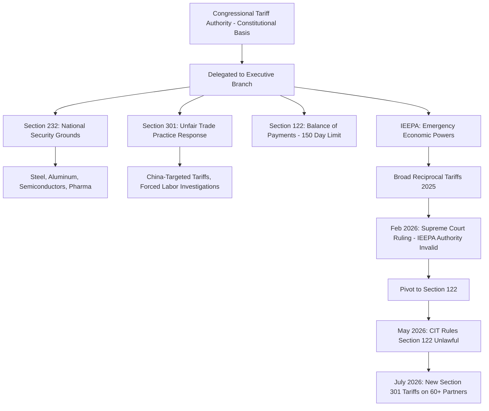

## Tariffs as a Geopolitical Instrument

### Overview

Tariffs, taxes levied on imported goods, are the oldest and most visible instrument of economic statecraft, predating modern trade theory by centuries. While conventional trade economics frames tariffs primarily as revenue tools or protectionist devices shielding domestic industry from foreign competition, their geopolitical function extends considerably further: tariffs are used to coerce policy changes in target states, signal alliance alignment, punish adversarial behavior, reshape global supply chain geography, and serve as bargaining leverage in broader diplomatic negotiations unrelated to trade itself. Understanding tariffs purely through an economic-efficiency lens misses their role as a discrete, escalatable, and reversible tool of state power, positioned between diplomatic pressure and harder instruments like sanctions or export controls.

### Legal and Institutional Basis for Tariff Authority

**Key Points**

- In the US system, tariff authority is constitutionally vested in Congress, but has been delegated to the executive branch through several statutory mechanisms, each with distinct legal thresholds and procedural requirements.
- **Section 232** (Trade Expansion Act of 1962): permits tariffs justified on national security grounds, historically used for steel, aluminum, and more recently semiconductors and pharmaceuticals.
- **Section 301** (Trade Act of 1974): permits tariffs in response to unfair foreign trade practices, requiring a USTR investigation process.
- **Section 122** (Trade Act of 1974): permits temporary (150-day) balance-of-payments tariffs without extensive investigation, a faster but more legally constrained mechanism.
- **IEEPA** (International Emergency Economic Powers Act): grants the president emergency economic powers during a declared national emergency; this was the primary legal basis used for the broad "reciprocal" tariffs imposed beginning in early 2025.

This layered legal architecture matters geopolitically because different statutory bases carry different speed, durability, and legal vulnerability characteristics, directly shaping how credibly and how quickly a tariff threat can be deployed or withdrawn as a negotiating tool.

### Recent Legal Developments (Current as of Late 2026)

The legal foundation for the sweeping tariff program implemented from 2025 onward faced significant judicial challenge during 2026. On February 20, 2026, the US Supreme Court ruled 6-3 that the president lacked statutory authority under IEEPA to impose the broad "reciprocal" tariffs that had been implemented since early 2025. Following this ruling, the administration responded by invoking Section 122 to impose an across-the-board 10% tariff (later intended to rise to 15%) using this alternative legal basis. However, on May 14, 2026, the Court of International Trade (CIT) ruled the Section 122 tariffs unlawful as well, and the Section 122-based 10% global tariffs were set to expire on July 24, 2026, with new Section 301 tariffs on more than 60 trading partners taking effect immediately afterward at 12:01 ET the same day.

[Unverified] Given the pace of litigation, statutory pivoting between IEEPA, Section 122, Section 301, and Section 232 authorities, and ongoing court proceedings, the precise legal basis, rates, and country coverage of US tariffs in effect at any given moment should be verified against current USTR, CBP, and court filings rather than treated as static, as this area has demonstrated unusually high volatility through 2025-2026.

By May 2025, the average applied US tariff rate had climbed to roughly 27%, described as the highest level in nearly a century, with cumulative tariff rates on some Chinese goods reaching between 145% and over 190% at their peak in April 2025. By August 2026, the average effective US tariff rate had climbed to approximately 18.6%, described as the highest since the Great Depression era of the 1930s, following the Supreme Court's February ruling and subsequent legal maneuvering to reinstate paused tariffs through alternative authorities.

### Diagram: Tariff Authority and Escalation Pathway

### Geopolitical Function 1: Coercive Leverage Beyond Trade Issues

Tariffs are frequently deployed to extract policy concessions in domains entirely unrelated to trade itself, using market access as leverage over foreign policy, immigration, or security cooperation decisions.

**Example**: Tariffs on Indian goods rose from 25% to 50% on selected items by August 2025, a move substantially tied to India's continued energy trade with Russia rather than any bilateral US-India trade dispute. This illustrates the use of tariff policy as a secondary sanctions-style instrument, penalizing a third country's commercial relationship with a sanctioned state rather than addressing a grievance with the tariffed country's own trade practices.

[Inference] This pattern, using tariffs against country A to influence country A's economic relationship with country B, represents a form of extraterritorial economic pressure that blurs the traditional distinction between trade policy and sanctions policy, and is likely to remain a recurring instrument as geopolitical competition intensifies around energy and critical mineral supply chains.

### Geopolitical Function 2: Supply Chain Reshoring and Decoupling

Tariffs function as a blunt but effective instrument for deliberately raising the cost of maintaining supply chain dependency on a strategic rival, intended to accelerate reshoring, nearshoring, or friend-shoring of production.

**Key Points**

- Sustained high tariffs on Chinese-origin goods across the 2018-2026 period are widely understood as intended to reduce US manufacturing and consumer dependency on Chinese supply chains, independent of any specific unfair-practice grievance tied to individual product categories.
- A parallel and increasingly significant tool is the **Section 301 investigation into "structural excess manufacturing capacity"**, initiated by USTR to evaluate whether foreign government subsidies and industrial policies are creating global overproduction in strategic sectors. This investigation, covering 16 major trading partners as of early 2026, spans electronics and semiconductors, automotive and EV components, batteries and energy equipment, machinery, and metals and raw materials.
- [Unverified] Whether this investigation leads to additional country-specific tariffs, and against which specific trading partners, remains pending the conclusion of the public consultation and investigation process, and should be verified against current USTR announcements.

### Geopolitical Function 3: Signaling and Alliance Management

Tariff policy communicates alignment or distance in ways that extend beyond their immediate economic effect, functioning as a public, legible signal of a state's strategic posture toward another.

- **Differentiated tariff treatment across allies versus rivals**: even within a broad tariff program, the relative severity applied to different trading partners (e.g., substantially higher rates on Chinese goods than on treaty allies) signals a hierarchy of strategic relationships more clearly than diplomatic statements alone.
- **Tariff exemptions as reward mechanisms**: carve-outs or negotiated reductions (such as ongoing US-India negotiations to reduce the 50% tariff, with talks scheduled into 2026) function as tangible incentives offered in exchange for policy alignment, creating an implicit reward-and-punishment structure around tariff schedules.
- **Retaliatory tariff symmetry as a signal of resolve**: when targeted states respond with proportionate retaliatory tariffs (as China, Canada, and others have done at various points), this retaliation itself signals a state's willingness to absorb economic cost to defend its position, information relevant to how credible future coercive threats will be perceived.

### Worked Example: Tariff Pass-Through and Domestic Political Economy

Consider a 25% tariff imposed on an imported intermediate good (e.g., steel) used by domestic manufacturers.

**Example**

1. Pre-tariff import price: $800 per ton.
2. Post-tariff landed cost:

$$\text{Landed Cost} = 800 \times (1 + 0.25) = \$1{,}000 \text{ per ton}$$

3. Domestic steel producers, no longer facing import competition at the pre-tariff price, can raise their own prices toward the new import-inclusive price ceiling, benefiting domestic steel producers while raising input costs for downstream domestic manufacturers (e.g., automakers, construction firms) that consume steel as an input.
4. [Inference] This dynamic illustrates why tariffs create winners and losers within the same domestic economy, not simply between domestic and foreign producers, a factor with direct political economy consequences: protected upstream industries (steel) tend to support the tariff, while downstream consuming industries (auto manufacturing) tend to oppose it, and this internal domestic political division is frequently a more decisive constraint on tariff policy durability than foreign retaliation itself.

Reporting associated with the 2026 tariff program cited a US manufacturing activity survey indicating factory expansion for the first time in over two years, and noted the US surpassed Japan in crude steel production for the first time since 1999, though the same reporting cautioned that attributing these shifts solely to tariff policy is complex, since macroeconomic data reflects many variables and economists continue to debate the relative contribution of tariffs versus other factors.

### Enforcement Dimension: Tariff Evasion and Circumvention

As tariff rates have risen, enforcement against evasion has become an increasingly prominent secondary policy front. Reporting indicates the Department of Justice is expected to significantly increase enforcement against tariff evasion in 2026, with one industry assessment characterizing 2025 as "the year of tariff policy" and 2026 as "the year of enforcement."

This connects directly to the rules-of-origin and circumvention dynamics discussed in trade bloc contexts: transshipment through third countries, undervaluation of declared customs value, and misclassification under the Harmonized System are the primary evasion vectors that enforcement resources target.

### Comparative Table: Tariff Legal Bases and Geopolitical Use Cases

| Authority | Speed | Legal Durability (2026) | Primary Geopolitical Use |
| --- | --- | --- | --- |
| IEEPA | Fast (emergency declaration) | Ruled unconstitutional for broad tariffs (Feb 2026) | Broad coercive leverage across many partners simultaneously |
| Section 122 | Fast (150-day cap) | Ruled unlawful by CIT (May 2026) | Rapid balance-of-payments response |
| Section 301 | Slower (requires investigation) | More legally durable, procedurally grounded | Targeted response to specific unfair practices; structural capacity investigations |
| Section 232 | Moderate (national security review) | Legally durable when tied to genuine security rationale | Sector-specific protection (steel, semiconductors, pharma) |

[Inference] The judicial invalidation of the faster, broader-authority tools (IEEPA, Section 122) through 2026 appears to be pushing US tariff policy toward greater reliance on the procedurally slower but more legally durable Section 301 and Section 232 mechanisms, which may reduce the speed at which future tariff actions can be implemented but could increase their durability against legal challenge; this trend should be monitored against ongoing litigation and policy announcements.

### Diagram: Tariffs Within the Broader Economic Statecraft Toolkit (svg_diagram)

<svg xmlns="http://www.w3.org/2000/svg" viewBox="0 0 760 300">
<text x="380" y="24" text-anchor="middle" font-size="15" font-weight="bold" fill="#1a1a1a">Tariffs Within the Economic Statecraft Spectrum (svg_diagram)</text>
<line x1="60" y1="160" x2="700" y2="160" stroke="#999" stroke-width="2" />
<circle cx="110" cy="160" r="7" fill="#1a56db" />
<text x="110" y="185" text-anchor="middle" font-size="10" fill="#1a1a1a">Diplomatic</text>
<text x="110" y="198" text-anchor="middle" font-size="10" fill="#1a1a1a">Pressure</text>
<circle cx="260" cy="160" r="7" fill="#1a56db" />
<text x="260" y="185" text-anchor="middle" font-size="10" fill="#1a1a1a">Tariffs</text>
<text x="260" y="198" text-anchor="middle" font-size="10" fill="#1a1a1a">(Reversible, Graduated)</text>
<circle cx="410" cy="160" r="7" fill="#b45309" />
<text x="410" y="185" text-anchor="middle" font-size="10" fill="#1a1a1a">Export Controls /</text>
<text x="410" y="198" text-anchor="middle" font-size="10" fill="#1a1a1a">Investment Screening</text>
<circle cx="560" cy="160" r="7" fill="#c0392b" />
<text x="560" y="185" text-anchor="middle" font-size="10" fill="#1a1a1a">Financial</text>
<text x="560" y="198" text-anchor="middle" font-size="10" fill="#1a1a1a">Sanctions</text>
<circle cx="680" cy="160" r="7" fill="#c0392b" />
<text x="680" y="185" text-anchor="middle" font-size="10" fill="#1a1a1a">Comprehensive</text>
<text x="680" y="198" text-anchor="middle" font-size="10" fill="#1a1a1a">Embargo</text>

<text x="380" y="240" text-anchor="middle" font-size="11" fill="#666" font-style="italic">Escalation increases →: speed of harm, difficulty of reversal, diplomatic cost</text>

<text x="380" y="260" text-anchor="middle" font-size="11" fill="#666" font-style="italic">Tariffs occupy a distinctive middle position: economically significant yet politically reversible</text>

</svg>

### Why Tariffs Occupy a Distinct Strategic Niche

[Inference] Relative to sanctions or export controls, tariffs offer several properties that make them a particularly favored instrument of economic statecraft: they are unilaterally imposable without requiring multilateral coordination, they are granular and can be calibrated by product category and country with fine precision, they are visibly and credibly reversible (creating negotiating leverage through the promise of removal, not just the threat of imposition), and they generate domestic revenue rather than purely imposing cost, unlike most sanctions regimes. These properties make tariffs an attractive tool for sustained, iterative negotiation leverage, though the same graduated, reversible character also means they are frequently perceived by targeted states as a lower-cost signal than harder instruments, potentially limiting their coercive effectiveness against determined adversaries.

### Conclusion

Tariffs have evolved from a primarily fiscal and protectionist tool into a central, actively contested instrument of geopolitical leverage, used to coerce policy alignment on issues far beyond trade, accelerate supply chain decoupling from strategic rivals, and signal alliance hierarchies through differentiated treatment. The 2025-2026 period illustrates both the scale of ambition possible under emergency executive tariff authority and its legal fragility, as courts have repeatedly constrained the broadest applications while narrower, procedurally grounded mechanisms persist. As a case study in economic statecraft, tariffs demonstrate how a nominally economic policy tool becomes inseparable from broader strategic competition once wielded at sufficient scale and against sufficiently interconnected global supply chains.

**Related Topics**

- Section 301 structural excess capacity investigations and their sectoral targets
- The Supreme Court's IEEPA ruling and its implications for executive trade authority
- Tariff evasion enforcement and transshipment detection
- Secondary tariffs as an extension of sanctions policy (the India-Russia energy case)
- Section 232 national security tariff justifications across sectors
- Domestic political economy effects of tariffs: upstream versus downstream industry impacts
- USMCA renegotiation and the shift toward bilateral US trade agreements
- De minimis threshold changes and low-value import policy shifts