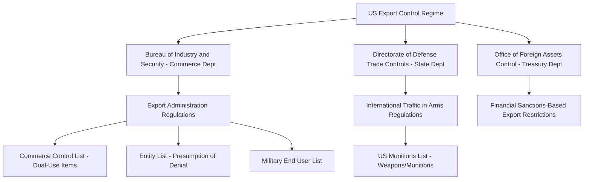
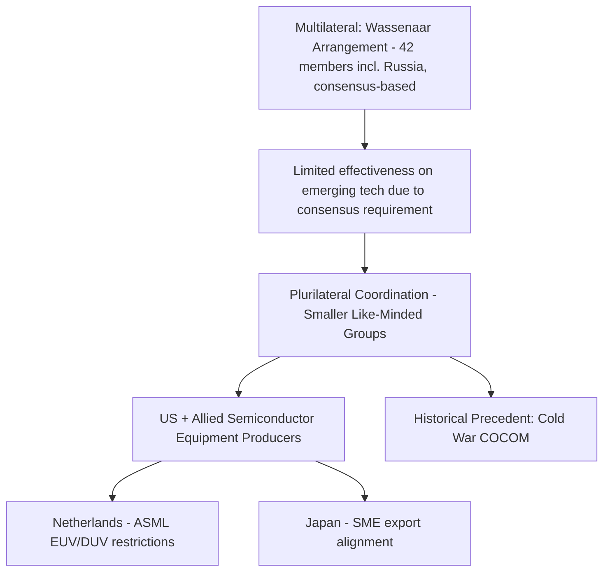

## Export Controls and Dual-Use Technology Restrictions

### Overview

Export controls restrict the transfer of specific goods, software, and technology to designated foreign parties, end uses, or destinations, distinguishing them from tariffs by acting as quantity restrictions (often outright prohibitions) rather than price mechanisms. **Dual-use technologies**, items with legitimate civilian applications but also potential military or strategic utility (advanced semiconductors, certain chemicals, machine tools, cryptographic software, unmanned aerial vehicle components), sit at the center of this regime because their civilian commercial value creates constant tension with their strategic sensitivity. Export controls have become one of the most consequential and rapidly evolving instruments of economic statecraft, particularly in the US-China technology relationship, where they function to preserve a qualitative and temporal lead in strategically decisive technology domains rather than merely to deny an adversary all access.

### Institutional and Legal Architecture (US System)

The US export control regime divides responsibility across three separate agencies with distinct legal authorities and target categories.

- **Bureau of Industry and Security (BIS)**, within the Commerce Department, administers the Export Administration Regulations (EAR), covering dual-use items and less sensitive military items, including advanced semiconductors and related manufacturing technologies. This is the primary agency relevant to dual-use technology restrictions.
- **Directorate of Defense Trade Controls (DDTC)**, within the State Department, administers the International Traffic in Arms Regulations (ITAR), covering weapons and munitions on the US Munitions List.
- **Office of Foreign Assets Control (OFAC)**, within the Treasury Department, oversees export restrictions arising from financial sanctions programs.

The **Export Control Reform Act of 2018 (ECRA)** codified and modernized US export control authority, which had previously relied substantially on IEEPA, with an explicit new focus on emerging and foundational technologies such as artificial intelligence and advanced semiconductors.

### Core Regulatory Mechanisms

#### The Commerce Control List (CCL) and ECCNs

Controlled dual-use items are classified under **Export Control Classification Numbers (ECCNs)**, a structured coding system indicating the category, reason for control, and licensing requirements for a given item. For example, advanced computing integrated circuits are controlled under ECCN 3A090 of the Commerce Control List, with thresholds defined by technical performance metrics such as Total Processing Performance (TPP).

#### The Entity List

The **Entity List** designates specific foreign parties (companies, research institutions, individuals) subject to heightened licensing requirements, frequently under a **"presumption of denial"** standard, meaning license applications for listed parties are presumptively rejected absent a compelling exception. Due to this presumption, Entity List placement can effectively cut off a listed party's access to controlled US-origin technology entirely.

#### The Military End User (MEU) List

The MEU list identifies parties requiring licensing for dual-use item exports to China and Russia specifically due to risks of military end use or technology transfer, addressing a gap where an item might not warrant outright denial but poses elevated risk when destined to a military-affiliated end user even for ostensibly civilian purposes.

#### License Exceptions

Specific license exceptions permit exports that would otherwise require case-by-case licensing, provided defined conditions are met. **License Exception Strategic Trade Authorization (STA)**, for example, permits export of certain controlled items to trusted partner and allied countries (Country Group A:5) without individual licensing, functioning as a mechanism to ease trade friction among allied and trusted states while maintaining restrictions toward adversarial destinations.

### Case Study: The Evolution of US Semiconductor Export Controls Toward China

Semiconductor and semiconductor-manufacturing-equipment (SME) controls represent the most consequential and closely watched application of the dual-use export control regime.

**Key Points**

- Controls have targeted not only finished advanced chips but also the **semiconductor manufacturing equipment (SME)** required to produce them, including equipment using extreme ultraviolet lithography (EUV) and deep ultraviolet lithography (DUV), reflecting a strategy of denying the entire production capability rather than only the end product.
- BIS has periodically closed loopholes allowing foreign companies to export semiconductor manufacturing equipment and technology to China license-free, requiring these companies to obtain licenses where they previously operated without one.
- Licensing policy toward China has fluctuated between a strict presumption-of-denial posture and more permissive case-by-case review depending on administration priorities and periods of negotiation.

**Recent Development (2026)**: A new rule effective January 15, 2026 revised BIS's export license review policy for certain advanced computing semiconductors, including the Nvidia H200 and AMD Mi325X and their equivalents, moving from a presumption-of-denial standard to case-by-case review for exports to China and Macau. This marked a notable policy shift, though BIS maintained strict compliance requirements exporters must satisfy before submitting license applications.

[Inference] This shift toward case-by-case review for specific chip categories suggests a calibrated approach balancing continued national security restriction against commercial and diplomatic considerations, including preserving US semiconductor firms' revenue exposure to the Chinese market, rather than a wholesale loosening of the broader control regime, though the practical approval rate under case-by-case review versus the prior presumption-of-denial standard should be verified against actual licensing outcomes data as they become available.

### Enforcement Tensions and Oversight

The 2026 semiconductor licensing shift generated significant bipartisan congressional concern. Senators Jim Banks and Elizabeth Warren urged immediate suspension of licenses in March 2026, citing smuggling cases, including a cited $2.5 billion Super Micro/Nvidia hardware diversion case, and raising questions about industry claims regarding the absence of diversion to unauthorized destinations. Legislative proposals such as the SAFE Chips Act aimed to codify stricter limits, including restricting exports to older chip classes through 2028.

[Unverified] The legislative status and enactment likelihood of proposals like the SAFE Chips Act should be verified against current congressional records, as such bills frequently remain pending or are substantially modified before any enactment.

### The "Affiliates Rule" and Extraterritorial Reach

A significant recent regulatory development is the **BIS Affiliates Rule**, which extends Entity List-style restrictions to corporate affiliates of listed parties, addressing a structural loophole where a restricted entity's subsidiaries or affiliated companies, not themselves individually listed, could otherwise continue receiving controlled technology. Enforcement of this rule was reported as paused until late 2026, though its promulgation signals a fundamental shift in regulatory expectations toward treating corporate group structures, not just individually named entities, as the relevant unit of control.

[Inference] Extending controls to corporate affiliates substantially increases compliance complexity for both US exporters and foreign purchasers, since verifying the full corporate affiliate structure of a counterparty is a materially harder due-diligence task than checking a single named entity against the Entity List, and this approach is likely to increase compliance costs across the board even for transactions with no intended diversion risk.

### Open-Weight AI and the Diffusion Framework

Export control policy has extended into artificial intelligence model governance, an emerging and technically distinct application of dual-use logic.

- Under the framework established around January 2025, **open-weight AI models** (publicly published model weights, released without dissemination restrictions) are generally treated as "published" and exempt from export controls under the EAR, including for otherwise dual-use-relevant capabilities, reflecting the EAR's long-standing publication exemption for openly available technical information.
- **Closed-weight, advanced "frontier" AI models** trained using computational resources above defined thresholds face export restrictions on model weight transfer to China, treating certain AI model weights analogously to controlled technology transfer rather than as software freely exportable under general exemptions.
- API-based access to controlled advanced models may implicate export control obligations if such access is deemed to constitute a "release" of controlled technology to a foreign person, an interpretively contested area given the technical distinction between providing inference access versus transferring underlying model weights.

[Unverified] The precise compute thresholds, model categories, and API-access interpretive guidance governing AI export controls are subject to ongoing regulatory refinement and should be checked against the current BIS framework text, as this is one of the most actively evolving areas of the export control regime.

### Multilateral Coordination Challenges: The Wassenaar Arrangement

Unlike tariffs, which can be applied unilaterally with reasonable effectiveness, export controls face an inherent **multilateral coordination problem**: if only one country restricts an item, and equivalent items are available from firms in non-restricting countries, the control's practical effect is undermined by substitution rather than genuine denial.

The **Wassenaar Arrangement**, established in 1996, is the primary existing multilateral export control regime for dual-use technologies, comprising 42 member states including Russia but not China. [Inference] Wassenaar is widely assessed as largely ineffective at controlling emerging technologies because it requires consensus among all members to update its control lists, a structural vulnerability given that adversarial or obstructionist members can block updates addressing precisely the technologies of greatest current strategic concern.

In response to Wassenaar's limitations, the US and allied partners have increasingly relied on **plurilateral coordination**, smaller groupings of like-minded states (more than two, but fewer than a full multilateral body) coordinating controls on a narrow set of specific technologies outside the consensus-bound Wassenaar structure. This approach echoes the Cold War-era COCOM (Coordinating Committee for Multilateral Export Controls) model, where the Western bloc harmonized dual-use export restrictions toward the Soviet bloc outside formal treaty structures.

[Inference] The practical effectiveness of unilateral or plurilateral US semiconductor controls depends substantially on parallel restriction by the handful of allied countries (notably the Netherlands and Japan) that host the world's most advanced semiconductor manufacturing equipment producers, since without their cooperation, China could potentially source equivalent equipment from non-restricting suppliers, undermining the control's strategic purpose; the degree of ally alignment has varied over time and should be assessed against current bilateral coordination agreements.

### Worked Example: Entity List Impact on a Hypothetical Transaction

Consider a US semiconductor equipment manufacturer seeking to export a controlled EUV lithography component to a foreign semiconductor fabrication facility.

**Example**

1. The exporter checks the ECCN classification of the item against the Commerce Control List; suppose it is classified under an ECCN requiring a license for export to the destination country for national security (NS) reasons.
2. The exporter screens the named end-user and its known corporate affiliates against the Entity List and Military End User list.
3. If the end-user (or, under the Affiliates Rule, its parent or affiliated entities) appears on the Entity List under a presumption-of-denial standard, the license application is very likely to be rejected regardless of the stated civilian end use, since the presumption places the burden on the exporter to overcome the default denial.
4. If the end-user is unlisted but operates in a designated country subject to MEU controls, the exporter must additionally certify the end use is non-military and may still face licensing requirements depending on the item's specific ECCN reason for control.
5. Absent a valid license or applicable license exception (such as STA for trusted-partner destinations), the export is prohibited, and knowingly proceeding without authorization exposes the exporter to civil and potential criminal enforcement penalties under the EAR.

### Distinguishing Export Controls from Adjacent Instruments

| Instrument | Mechanism | Reversibility | Primary Target |
| --- | --- | --- | --- |
| Tariffs | Price increase on imports | High (can be lowered/removed) | Broad trade flows, often country-wide |
| Export controls | Prohibition or licensing gate on outbound transfer | Moderate (licensing policy can shift; listing removal is possible but rarer) | Specific items, technologies, and named end-users |
| Financial sanctions (OFAC) | Asset freezes, transaction prohibitions | Low to moderate (listing/delisting processes can be slow) | Named individuals, entities, and sometimes sectors |
| Investment screening (CFIUS) | Blocks or conditions specific foreign investment transactions | Case-specific | Individual transactions, not ongoing trade flows |

[Inference] Export controls occupy a distinctive position between tariffs and sanctions: unlike tariffs, they are not primarily revenue-generating and function as quantity/access gates rather than price signals; unlike comprehensive sanctions, they typically target specific technologies or named parties rather than a state's entire economy, allowing for more surgically calibrated strategic denial, though this precision also requires substantially more detailed technical classification and end-user due diligence infrastructure to implement effectively.

### Conclusion

Export controls on dual-use technologies have become one of the most technically intricate and geopolitically consequential instruments of economic statecraft, particularly in the domain of advanced semiconductors and artificial intelligence, where the line between civilian and strategic application is inherently contested. The 2025-2026 period illustrates the regime's rapid evolution: shifting licensing postures toward China, extension of controls to corporate affiliates, emerging governance frameworks for AI model weights, and continued reliance on plurilateral coordination given the structural limits of consensus-based multilateral regimes like Wassenaar. As a supply chain geopolitics instrument, export controls demonstrate how strategic competition increasingly operates through control of specific technological choke points, particularly semiconductor manufacturing equipment, rather than through broad-based trade restriction alone.

**Related Topics**

- The Commerce Control List and ECCN classification methodology
- The BIS Affiliates Rule and extraterritorial compliance burden
- Open-weight versus closed-weight AI model export governance
- Semiconductor manufacturing equipment (SME) chokepoints: ASML, EUV/DUV lithography
- The Wassenaar Arrangement's consensus-based limitations on emerging technology
- CFIUS investment screening as a complementary instrument to export controls
- Entity List and Military End User (MEU) list mechanics and delisting processes
- Historical COCOM precedent for Cold War-era plurilateral export coordination