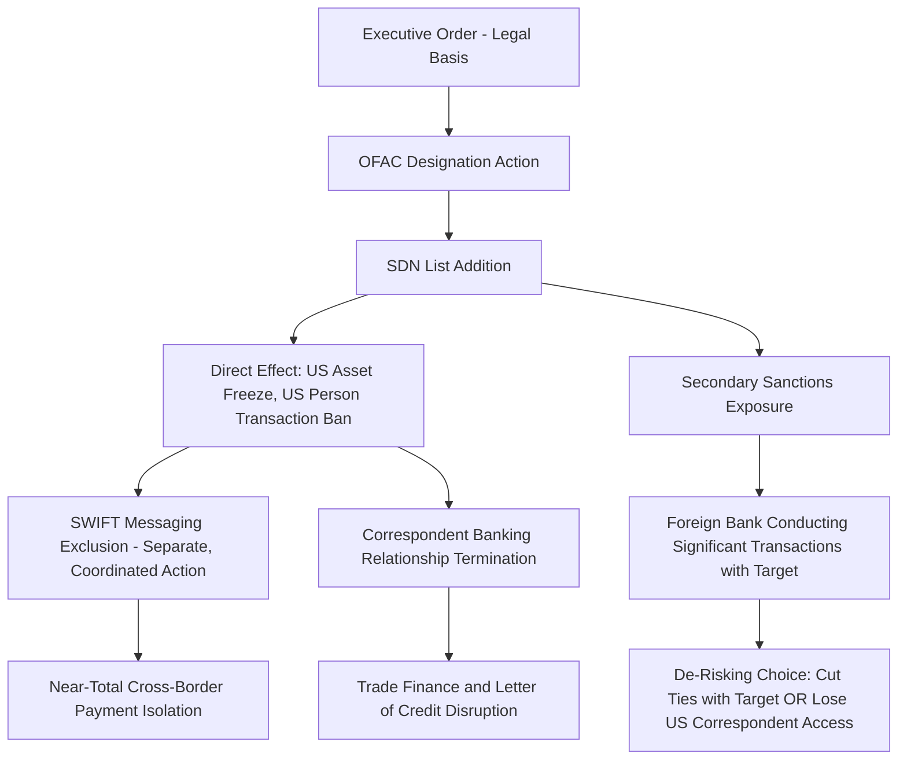

## Financial Sanctions and Their Transmission Mechanisms

### Overview

Financial sanctions restrict a targeted state, entity, or individual's access to financial systems, assets, and payment infrastructure, functioning through a fundamentally different mechanism than tariffs or export controls. Where tariffs alter price incentives and export controls gate specific physical or technical transfers, financial sanctions exploit the target's dependency on globally dominant financial infrastructure, principally US dollar clearing systems, SWIFT messaging, and correspondent banking relationships, to impose cost or outright exclusion. Understanding sanctions requires understanding their **transmission mechanisms**: the specific technical and institutional pathways through which a sanctions designation translates into real economic effect on the target, since sanctions are only as powerful as the financial infrastructure through which they propagate.

### Legal and Institutional Basis (US System)

**Key Points**

- The **Office of Foreign Assets Control (OFAC)**, within the US Treasury Department, administers and enforces most US financial sanctions programs.
- Primary legal authorities include the **International Emergency Economic Powers Act (IEEPA)**, the **Trading with the Enemy Act (TWEA)**, and specific congressionally mandated sanctions statutes (e.g., CAATSA, the Countering America's Adversaries Through Sanctions Act).
- Sanctions are implemented through **Executive Orders** that establish the legal basis for a given sanctions program, followed by OFAC regulations and designation actions that identify specific targeted parties.
- The **Specially Designated Nationals and Blocked Persons List (SDN List)** is the primary designation mechanism: once listed, a person or entity's US assets are frozen, and US persons are generally prohibited from transacting with them.

### Core Sanctions Types

#### 1. Asset Freezes (Blocking Sanctions)

The most direct mechanism: upon designation, any assets of the target within US jurisdiction (or under the control of a US person, anywhere) are frozen, and all transactions by US persons with the target are prohibited absent a specific license.

#### 2. Sectoral Sanctions

Rather than comprehensively blocking a party, sectoral sanctions restrict specific types of transactions, commonly new debt or equity financing above defined maturities, without freezing all assets or prohibiting all activity. This creates a more surgical restriction than blocking sanctions, often used against major economic actors where a full asset freeze would create excessive systemic spillover.

#### 3. Secondary Sanctions

Secondary sanctions target **third-country parties** who conduct significant transactions with already-sanctioned primary targets, extending sanctions' reach extraterritorially by threatening the third party's own access to the US financial system if they continue the prohibited dealings. This is a critical transmission amplifier: it converts a bilateral restriction (US versus target) into an effectively global one, since foreign banks and firms with any US financial system exposure face pressure to comply even absent any US jurisdictional nexus to their underlying transaction.

#### 4. Sectoral/Technology-Linked Sanctions

Increasingly, sanctions target specific economic sectors deemed strategically important to a targeted state's revenue base or military capacity (energy, defense, financial services), rather than only named individuals or entities.

### Diagram: Sanctions Designation and Transmission Pathway

### Transmission Mechanism 1: Correspondent Banking Dependency

Most cross-border transactions, particularly those denominated in US dollars, rely on **correspondent banking relationships**, where a bank without a direct presence in a given jurisdiction routes transactions through a correspondent bank that does. Because a large share of global trade and financial transactions are dollar-denominated, and most major international banks maintain US correspondent relationships (often via a US-based subsidiary or correspondent account) to facilitate dollar clearing, sanctions targeting a party's access to correspondent banking can functionally isolate that party from most cross-border dollar transactions, even transactions that do not directly involve any US party or US territory.

$$\text{Transmission Reach} \propto \text{Target's Reliance on USD-Denominated Trade} \times \text{Counterparty Exposure to US Correspondent Banking}$$

[Inference] This dependency explains why financial sanctions can achieve near-global reach despite being nominally a unilateral US legal action: the mechanism does not require other countries' governments to adopt matching sanctions, since private foreign banks independently choose compliance to protect their own access to the US financial system, a phenomenon distinct from and more pervasive than formal multilateral sanctions coordination.

### Transmission Mechanism 2: SWIFT Messaging Exclusion

The **Society for Worldwide Interbank Financial Telecommunication (SWIFT)** is a messaging network, not itself a payment or clearing system, used by financial institutions globally to securely transmit payment instructions. Exclusion from SWIFT does not freeze assets directly but severely disrupts a bank's ability to efficiently communicate payment instructions internationally, forcing reliance on slower, less standardized, and higher-friction alternative communication channels.

**Case Reference**: Following Russia's 2022 invasion of Ukraine, a coordinated action by the EU, US, UK, Canada, and allied partners excluded a set of major Russian banks from SWIFT, layered on top of direct asset-freezing sanctions against those institutions and the Central Bank of Russia. [Inference] Because SWIFT exclusion is a distinct action from asset-freezing designation, requiring separate coordination among SWIFT's Belgium-based governance structure and member country consensus, its use as a sanctions tool illustrates how financial infrastructure that is nominally private and international can nonetheless become an instrument of coordinated state sanctions policy when a sufficiently unified coalition of major economies agrees to act.

### Transmission Mechanism 3: Central Bank Reserve Freezes

A particularly severe and structurally significant sanctions action involves freezing a targeted state's **central bank foreign exchange reserves** held in sanctioning jurisdictions, restricting the state's ability to use those reserves for currency stabilization, debt servicing, or import payment.

**Key Points**

- The freezing of a substantial portion of the Central Bank of Russia's foreign reserves held in Western jurisdictions following the 2022 invasion represented an unusually aggressive application of this mechanism against a G20 economy's sovereign reserves.
- This action prompted extensive debate over the **precedent effect**: other states holding substantial reserves in US dollar or euro-denominated assets may rationally reassess their reserve currency diversification strategy in light of demonstrated willingness to freeze sovereign reserves, a dynamic frequently cited in discussions of long-term "dedollarization" incentives among non-aligned or adversarial states.
- [Inference] This precedent effect represents a potential long-term structural cost to the sanctioning coalition's own financial system dominance, since demonstrating the reserve-freezing capability, even when justified by the underlying conduct, provides other states an incentive to reduce future exposure to that same vulnerability, though the empirical pace and scale of any resulting reserve diversification is difficult to measure precisely and claims about its magnitude should be treated cautiously.

### Transmission Mechanism 4: Trade Finance and Letter of Credit Disruption

A substantial share of international trade, particularly for large shipments and cross-border commodity transactions, relies on **trade finance instruments** such as letters of credit, which require a bank (often the exporter's bank) to guarantee payment on the buyer's behalf, contingent on presentation of compliant shipping documentation. Sanctions targeting banks or specific transaction types disrupt this financing infrastructure, since banks providing trade finance face compliance risk if the underlying transaction, or any correspondent bank in the payment chain, involves a sanctioned party.

**Example**

1. An exporter in Country A ships goods to a buyer in sanctioned Country B, with payment structured via a letter of credit issued by a bank in Country B and confirmed by a bank in Country A.
2. If the issuing bank in Country B is itself sanctioned, or if the transaction would require clearing through a correspondent relationship involving a sanctioned institution, the confirming bank in Country A faces a compliance decision: proceed and risk secondary sanctions exposure, or decline the transaction.
3. Given the asymmetric risk (potential loss of US correspondent banking access versus the value of a single trade transaction), banks with meaningful US financial system exposure will generally decline to process the transaction, even absent any explicit legal prohibition specifically covering that bank's home jurisdiction.
4. This illustrates how sanctions achieve effect through counterparty risk aversion and compliance cost avoidance, not solely through direct legal prohibition, a phenomenon sometimes termed "over-compliance" or the "chilling effect" of sanctions exposure.

### Sanctions Evasion and Circumvention Responses

**Key Points**

- **Shadow fleet operations**: sanctioned oil exporters, notably Russia in the post-2022 period, have relied on fleets of tankers operating with obscured ownership, non-Western flag registration, and reduced reliance on Western shipping insurance to continue exports despite price-cap and sanctions restrictions.
- **Alternative payment messaging**: development of non-SWIFT payment messaging alternatives, such as Russia's SPFS (System for Transfer of Financial Messages) and China's CIPS (Cross-Border Interbank Payment System), aims to reduce dependency on SWIFT-mediated infrastructure, though these systems currently handle a materially smaller volume and network of participating institutions than SWIFT.
- **Currency substitution**: increased use of non-dollar currencies (Chinese yuan, and various bilateral local-currency settlement arrangements) in trade between sanctioned and non-aligned states reduces exposure to dollar-clearing-based transmission mechanisms.
- **Front companies and layered ownership structures**: sanctioned parties and their trading partners frequently employ shell companies and complex ownership layering to obscure the ultimate beneficiial owner of a transaction from screening processes, a pattern requiring increasingly sophisticated beneficial-ownership due diligence by compliant financial institutions.

[Unverified] The quantitative effectiveness of these evasion mechanisms, that is, what share of sanctioned trade successfully circumvents restrictions through shadow fleets, alternative payment rails, or currency substitution, is contested in available research and should be treated with caution absent citation to specific, current empirical studies, as this is an area of active analysis with significant measurement difficulty given the deliberately obscured nature of the underlying transactions.

### Diagram: Sanctions Evasion and Counter-Evasion Cycle (svg_diagram)

<svg xmlns="http://www.w3.org/2000/svg" viewBox="0 0 760 320">
<text x="380" y="24" text-anchor="middle" font-size="15" font-weight="bold" fill="#1a1a1a">Sanctions Evasion / Counter-Evasion Cycle (svg_diagram)</text>
<rect x="40" y="60" width="180" height="60" rx="6" fill="#fdecea" stroke="#c0392b" stroke-width="1.5" />
<text x="130" y="85" text-anchor="middle" font-size="12" fill="#1a1a1a">Sanctions Designation</text>
<text x="130" y="102" text-anchor="middle" font-size="11" fill="#444">Target loses direct access</text>
<rect x="290" y="60" width="180" height="60" rx="6" fill="#fef3e0" stroke="#b45309" stroke-width="1.5" />
<text x="380" y="85" text-anchor="middle" font-size="12" fill="#1a1a1a">Evasion Response</text>
<text x="380" y="102" text-anchor="middle" font-size="11" fill="#444">Shadow fleets, shells, CIPS/SPFS</text>
<rect x="540" y="60" width="180" height="60" rx="6" fill="#e8f0fe" stroke="#1a56db" stroke-width="1.5" />
<text x="630" y="85" text-anchor="middle" font-size="12" fill="#1a1a1a">Enforcement Adaptation</text>
<text x="630" y="102" text-anchor="middle" font-size="11" fill="#444">Secondary sanctions expansion,</text>
<text x="630" y="115" text-anchor="middle" font-size="9" fill="#444">beneficial-ownership screening</text>
<line x1="220" y1="90" x2="285" y2="90" stroke="#333" stroke-width="1.5" marker-end="url(#a5)" />
<line x1="470" y1="90" x2="535" y2="90" stroke="#333" stroke-width="1.5" marker-end="url(#a5)" />
<line x1="630" y1="120" x2="380" y2="180" stroke="#999" stroke-width="1.2" stroke-dasharray="4,3" marker-end="url(#a5)" />
<rect x="290" y="185" width="180" height="60" rx="6" fill="#fff" stroke="#666" stroke-width="1.2" />
<text x="380" y="210" text-anchor="middle" font-size="11" fill="#1a1a1a">Adapted Evasion Tactics</text>
<text x="380" y="227" text-anchor="middle" font-size="10" fill="#444">Cycle continues iteratively</text>

<text x="380" y="290" text-anchor="middle" font-size="11" fill="#666" font-style="italic">Sanctions effectiveness depends on the pace of enforcement relative to evasion adaptation</text>

</svg>

### Worked Example: Secondary Sanctions Compliance Decision

Consider a bank headquartered in a non-sanctioning third country, evaluating whether to process a transaction for a client with commercial ties to a sanctioned entity.

**Example**

1. The bank's compliance department screens the transaction and identifies that the counterparty has a documented, significant commercial relationship with an SDN-listed entity.
2. The bank assesses its own US financial system exposure: it holds a US dollar correspondent account with a major US bank, essential for the bulk of its international dollar-clearing operations.
3. Under secondary sanctions exposure, continuing to facilitate significant transactions with the sanctioned entity's associate risks OFAC designation of the bank itself, which would result in loss of US correspondent access, an existential threat to the bank's international operations given dollar-clearing centrality to global trade finance.
4. The expected cost of maintaining the single client relationship is vastly outweighed by the systemic risk of losing US correspondent banking access, so the bank declines the transaction or terminates the client relationship entirely, a decision made independent of the third country's own government policy toward the sanctions program.

This illustrates the core transmission logic of secondary sanctions: compliance is driven by rational risk-avoidance calculations of globally interconnected financial institutions, not primarily by legal jurisdiction or diplomatic alignment.

### Comparative Table: Sanctions Mechanisms and Reach

| Mechanism | Direct Legal Reach | Practical Global Reach | Primary Vulnerability Exploited |
| --- | --- | --- | --- |
| Blocking sanctions (SDN) | US persons/jurisdiction | High, via correspondent banking dependency | Target's need for dollar-clearing access |
| Secondary sanctions | Nominally extraterritorial | Very high, via third-party risk aversion | Third parties' own US financial system exposure |
| SWIFT exclusion | Messaging network access | High for cross-border payment efficiency | Communication infrastructure dependency |
| Central bank reserve freeze | Assets held in sanctioning jurisdictions | Severe but jurisdiction-specific | Reserve currency concentration in sanctioning states |
| Sectoral sanctions | Specific transaction types (e.g., new debt) | Moderate, more surgical | Access to capital markets financing |

### Conclusion

Financial sanctions achieve their geopolitical effect not primarily through direct legal jurisdiction over a target, but through exploiting the target's, and crucially, third parties' dependency on globally dominant financial infrastructure, principally dollar-clearing systems, correspondent banking, and payment messaging networks like SWIFT. This transmission structure explains both sanctions' remarkable reach, achieving effective near-global compliance without requiring universal multilateral agreement, and their principal long-term structural risk: demonstrating this reach incentivizes targeted and non-aligned states alike to invest in alternative financial infrastructure, potentially eroding the very dominance that makes the mechanism so powerful. Understanding sanctions as a supply chain geopolitics instrument requires tracing not just who is designated, but through which specific financial pathway that designation is intended to bite.

**Related Topics**

- Alternative payment infrastructure: China's CIPS and Russia's SPFS systems
- The G7 Russian oil price cap as a hybrid sanctions/market-access mechanism
- Shadow fleet operations and maritime sanctions evasion
- Dedollarization trends and central bank reserve diversification incentives
- Beneficial ownership due diligence and shell company screening
- OFAC licensing exceptions and humanitarian carve-outs
- CAATSA and congressionally mandated sanctions statutes
- The interaction between export controls, tariffs, and financial sanctions as a combined toolkit