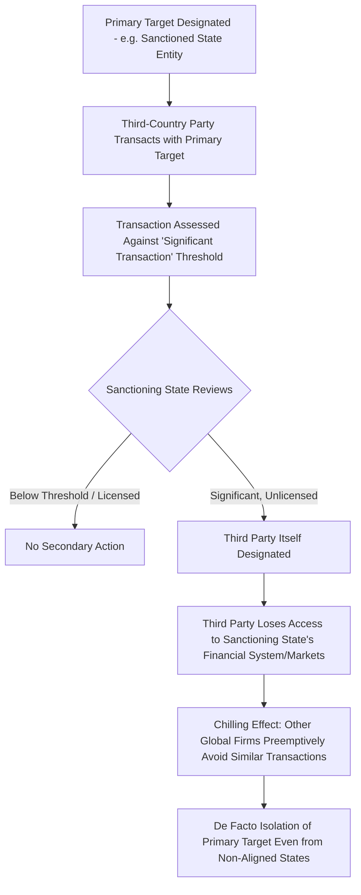

## Secondary Sanctions and Extraterritorial Enforcement

### Overview

Secondary sanctions extend a sanctioning state's coercive reach beyond its own jurisdiction and beyond the primary target of a sanctions program, by threatening penalties against **third-country parties** who conduct significant transactions with an already-sanctioned entity, even where those third parties have no direct legal or territorial connection to the sanctioning state. This mechanism represents one of the most legally and diplomatically contentious instruments of economic statecraft precisely because it asserts a form of extraterritorial jurisdiction that many foreign governments regard as a violation of sovereign legal authority, while sanctioning states justify it as a necessary tool to prevent circumvention of otherwise-porous primary sanctions. Secondary sanctions sit conceptually adjacent to, but analytically distinct from, the broader financial sanctions transmission mechanisms, functioning specifically as an enforcement amplifier that converts bilateral restriction into effectively global compliance pressure.

### Distinguishing Primary and Secondary Sanctions

**Key Points**

- **Primary sanctions** restrict the sanctioning state's own persons and entities (US persons, EU persons) from transacting with the designated target; jurisdiction is grounded in traditional nationality or territorial nexus.
- **Secondary sanctions** target non-US (or non-EU, depending on the sanctioning jurisdiction) persons and entities for transactions conducted entirely outside the sanctioning state's territory, between two non-sanctioning-state parties, based solely on the transaction's connection to an already-sanctioned primary target.
- The legal jurisdictional theory underlying secondary sanctions typically does not rest on direct territorial or nationality-based jurisdiction over the third party's conduct itself, but rather on the sanctioning state's authority to determine who may access its own financial system and markets, using denial of that access as the enforcement lever against the third party's unrelated conduct.

$$\text{Primary Sanctions Scope} = \{\text{Sanctioning State Persons}\} \times \{\text{Sanctioned Target}\}$$

$$\text{Secondary Sanctions Scope} = \{\text{Any Global Party}\} \times \{\text{Sanctioned Target}\} \rightarrow \{\text{Risk to Sanctioning State Market Access}\}$$

### The Jurisdictional and Legal Basis

Secondary sanctions are typically authorized through specific legislative or executive mechanisms rather than being an inherent feature of every sanctions program.

- **CAATSA** (Countering America's Adversaries Through Sanctions Act, 2017): explicitly authorized secondary sanctions targeting parties conducting significant transactions with Russian defense and intelligence sectors, and separately addressed Iran and North Korea.
- **Iran Sanctions Act** and related executive orders: historically among the most extensively used secondary sanctions frameworks, targeting foreign financial institutions and firms conducting significant transactions in Iran's energy, shipping, and financial sectors.
- **Executive Order-based secondary sanctions**: many secondary sanctions authorities derive from IEEPA-based executive orders rather than standalone statutes, granting the executive branch substantial discretion over scope and implementation.

[Inference] The reliance on IEEPA and executive order-based authority for much secondary sanctions activity means the scope and durability of specific programs can shift more readily with administration changes than would be the case under more rigid statutory frameworks, a dynamic that itself factors into how foreign parties assess the durability of secondary sanctions risk when making long-term compliance investment decisions.

### Diagram: Secondary Sanctions Enforcement Pathway

### The "Significant Transaction" Standard

A recurring technical and legally contested element of secondary sanctions design is the **"significant transaction"** threshold, the standard used to determine whether a third party's dealings with a sanctioned entity rise to a level warranting secondary sanctions exposure.

**Key Points**

- "Significant" is typically not defined by a precise numerical threshold in statute, but assessed through a multi-factor analysis considering transaction size, frequency, whether it involves deceptive practices, the sanctioned party's degree of ownership or control involved, and the nexus to conduct the underlying sanctions program targets.
- This ambiguity is a deliberate design feature from the sanctioning state's perspective, preserving discretion and unpredictability that increases the deterrent effect (encouraging broad risk-averse compliance rather than narrow technical threshold-testing), but it is simultaneously criticized by foreign governments and firms as creating excessive legal uncertainty and compliance burden.
- [Inference] This ambiguity systematically favors risk-averse over-compliance among third-country financial institutions, since the cost of incorrectly guessing that a transaction falls below the threshold (loss of market access) vastly exceeds the cost of foregoing a permissible transaction out of excess caution, a dynamic that extends secondary sanctions' practical reach beyond their formal legal scope.

### Case Study: Iran Sanctions and the "Chilling Effect" on Non-US Firms

The pre-JCPOA and post-2018 "maximum pressure" Iran sanctions regimes are frequently cited as the paradigmatic case of extensive secondary sanctions usage, given the multi-decade duration and broad sectoral scope (energy, shipping, insurance, financial services) of the underlying program.

[Inference] European and Asian firms with substantial commercial interests in Iran's energy sector have historically withdrawn from Iranian market engagement following the reimposition of secondary sanctions, even in instances where their home governments (notably EU member states, which maintained the JCPOA nuclear deal commitments even after US withdrawal in 2018) did not themselves impose matching primary sanctions, illustrating the chilling effect's independence from the third country's own governmental sanctions policy. This dynamic prompted the EU's development of the **INSTEX** (Instrument in Support of Trade Exchanges) special purpose vehicle, an attempt to create a barter-like mechanism allowing EU-Iran trade in humanitarian goods to bypass dollar-clearing and secondary sanctions exposure. [Unverified] INSTEX's practical transaction volume and effectiveness were widely reported as limited relative to its stated ambitions, and current operational status should be verified against recent reporting given the mechanism's low public profile in more recent periods.

### Case Study: CAATSA and Third-Country Defense Procurement

CAATSA's application to defense-sector transactions illustrates secondary sanctions' use against allied and partner states, not solely adversarial ones, creating distinctive diplomatic friction.

**Example**

1. A US-aligned state seeks to procure a major air defense system from a CAATSA-designated Russian defense entity.
2. Because CAATSA authorizes secondary sanctions against parties conducting significant transactions with Russia's defense and intelligence sectors, the purchasing state's own defense procurement officials and potentially its broader defense-industrial relationship with US suppliers become exposed to secondary sanctions risk.
3. This has generated documented diplomatic tension in cases involving procurement of Russian-origin air defense systems by states that simultaneously maintain significant US defense cooperation relationships, since the purchasing decision creates a direct conflict between the state's sovereign procurement choices and its access to the US defense-industrial and financial ecosystem.
4. [Unverified] The specific outcomes of individual CAATSA waiver determinations and designation decisions in such cases vary by country and time period and should be verified against current State Department and Treasury announcements, as waiver determinations are made on a case-specific basis reflecting broader bilateral relationship considerations.

This illustrates how secondary sanctions can function as leverage even against formally allied states, using defense-industrial and financial dependency as the transmission mechanism regardless of the broader alliance relationship.

### Foreign Government Pushback: Blocking Statutes and Sovereignty Objections

Secondary sanctions' extraterritorial character has prompted formal legal countermeasures from affected jurisdictions, most notably the **EU Blocking Statute** (Council Regulation (EC) No 2271/96), originally enacted in response to US secondary sanctions on Cuba, Iran, and Libya.

**Key Points**

- The EU Blocking Statute purports to prohibit EU persons from complying with specified extraterritorial US sanctions laws, and permits EU firms to recover damages arising from such compliance where those damages result from the underlying foreign law's application.
- In practice, EU firms with substantial US market or financial system exposure have generally prioritized US secondary sanctions compliance over Blocking Statute compliance, given the practically greater economic cost of losing US market access relative to the more limited EU-level enforcement of the Blocking Statute itself, illustrating a structural asymmetry between the credibility of the two competing legal demands.
- [Inference] This asymmetric compliance outcome, where firms comply with the extraterritorial secondary sanctions despite their home jurisdiction's formal prohibition on doing so, is frequently cited as empirical evidence of the practical primacy of US financial market centrality over EU blocking legislation, at least for firms with meaningful transatlantic commercial exposure, though smaller firms without significant US exposure may calculate differently and available evidence on firm-level compliance variation should be treated as illustrative rather than comprehensive.

### Diagram: Competing Legal Pressures on a Third-Country Firm (svg_diagram)

<svg xmlns="http://www.w3.org/2000/svg" viewBox="0 0 760 320">
<text x="380" y="24" text-anchor="middle" font-size="15" font-weight="bold" fill="#1a1a1a">Competing Legal Pressures: Secondary Sanctions vs Blocking Statute (svg_diagram)</text>
<rect x="440" y="70" width="260" height="80" rx="6" fill="#fdecea" stroke="#c0392b" stroke-width="1.5" />
<text x="570" y="95" text-anchor="middle" font-size="12" font-weight="bold" fill="#1a1a1a">US Secondary Sanctions</text>
<text x="570" y="113" text-anchor="middle" font-size="11" fill="#444">Threat: Loss of US market/</text>
<text x="570" y="128" text-anchor="middle" font-size="11" fill="#444">correspondent banking access</text>
<rect x="60" y="70" width="260" height="80" rx="6" fill="#e8f0fe" stroke="#1a56db" stroke-width="1.5" />
<text x="190" y="95" text-anchor="middle" font-size="12" font-weight="bold" fill="#1a1a1a">EU Blocking Statute</text>
<text x="190" y="113" text-anchor="middle" font-size="11" fill="#444">Prohibits compliance with</text>
<text x="190" y="128" text-anchor="middle" font-size="11" fill="#444">extraterritorial sanctions</text>
<rect x="250" y="200" width="260" height="70" rx="6" fill="#fff" stroke="#666" stroke-width="1.5" />
<text x="380" y="225" text-anchor="middle" font-size="12" fill="#1a1a1a">Third-Country Firm</text>
<text x="380" y="243" text-anchor="middle" font-size="11" fill="#444">Weighs relative economic exposure</text>
<text x="380" y="258" text-anchor="middle" font-size="10" fill="#444">to each jurisdiction</text>
<line x1="570" y1="150" x2="420" y2="200" stroke="#c0392b" stroke-width="1.5" marker-end="url(#a6)" />
<line x1="190" y1="150" x2="340" y2="200" stroke="#1a56db" stroke-width="1.5" marker-end="url(#a6)" />

<text x="380" y="300" text-anchor="middle" font-size="11" fill="#666" font-style="italic">Outcome typically driven by relative magnitude of US vs EU market exposure</text>

</svg>

### China's Response: Countermeasure Legal Frameworks

China has developed its own countermeasure legal architecture partly in response to extraterritorial US and EU sanctions and export control application, including the **Anti-Foreign Sanctions Law** (2021) and an "Unreliable Entity List" mechanism, which permit Chinese authorities to impose countermeasures against foreign parties complying with sanctions or restrictions China deems to unjustifiably harm Chinese entities' interests.

[Inference] This creates an increasingly complex compliance environment for multinational firms with both US and Chinese market exposure, since compliance with US secondary sanctions or export control obligations in a given transaction could theoretically expose a firm to Chinese countermeasures, and vice versa, forcing firms into forced-choice compliance scenarios with no jurisdictionally "safe" option in certain high-tension cases; the practical frequency and severity of such forced-choice scenarios to date is a matter that should be assessed against current case reporting rather than assumed to be pervasive across all transactions.

### Worked Example: Secondary Sanctions Risk Assessment Matrix

Consider a multinational firm evaluating a proposed transaction with a counterparty that has some connection to a sanctioned entity.

**Example**

1. **Step 1 — Nexus identification**: Determine whether the counterparty, or any entity in its ownership chain, has documented dealings with a designated primary sanctions target.
2. **Step 2 — Materiality assessment**: Estimate whether the transaction's size, frequency, and nature would plausibly meet a "significant transaction" threshold under the relevant secondary sanctions authority, informed by prior enforcement patterns and public guidance, while recognizing the inherent ambiguity in this standard.
3. **Step 3 — Exposure weighting**: Assess the firm's own relative exposure to the sanctioning jurisdiction's market and financial system versus the value of the proposed transaction and the firm's exposure to any competing legal obligation (e.g., a blocking statute or foreign countermeasure regime) in its home jurisdiction.
4. **Step 4 — Decision**: Given that a firm's calculation typically shows secondary sanctions exposure (loss of a major market) vastly exceeds the value of most individual transactions with sanctioned-adjacent counterparties, risk-averse firms with meaningful sanctioning-jurisdiction market exposure generally decline the transaction even when the "significant transaction" threshold determination is genuinely uncertain, rather than accept the tail risk of designation.

### Comparative Effectiveness Considerations

[Inference] Secondary sanctions are generally regarded in policy analysis as one of the most effective mechanisms for achieving broad multilateral-equivalent compliance without requiring actual multilateral agreement, since they operationalize compliance through private firms' independent risk calculations rather than through coordinated intergovernmental action. However, this effectiveness carries offsetting costs: it generates sustained diplomatic friction even with allied states whose firms are affected, incentivizes long-term development of alternative, sanctions-resistant financial and trade infrastructure by both targeted and non-aligned third states, and raises genuine questions of extraterritorial jurisdictional legitimacy under international law that remain unresolved and contested among legal scholars and affected governments.

### Conclusion

Secondary sanctions represent the most extraterritorially ambitious instrument within the broader financial sanctions toolkit, converting a sanctioning state's domestic market and financial system access into global leverage over conduct occurring entirely outside its territorial jurisdiction. Their effectiveness rests on third parties' independent, risk-averse compliance calculations rather than on any claim to direct legal authority over the third party's underlying conduct, a structural feature that both explains their remarkable practical reach and generates sustained sovereignty-based legal and diplomatic objections from affected states, including formal countermeasures such as the EU Blocking Statute and China's Anti-Foreign Sanctions Law. As a supply chain geopolitics instrument, secondary sanctions illustrate how control over globally central financial infrastructure can be converted into policy leverage extending far beyond a sanctioning state's formal jurisdictional boundaries.

**Related Topics**

- CAATSA and its application to third-country defense procurement decisions
- The EU Blocking Statute and its practical enforcement limitations
- China's Anti-Foreign Sanctions Law and Unreliable Entity List
- INSTEX and alternative payment mechanisms designed to bypass secondary sanctions
- The "significant transaction" standard and its role in compliance over-caution
- OFAC's 50 Percent Rule for ownership-based sanctions attribution
- Iran "maximum pressure" sanctions as a case study in sustained secondary sanctions application
- De-risking behavior among global financial institutions facing extraterritorial compliance regimes