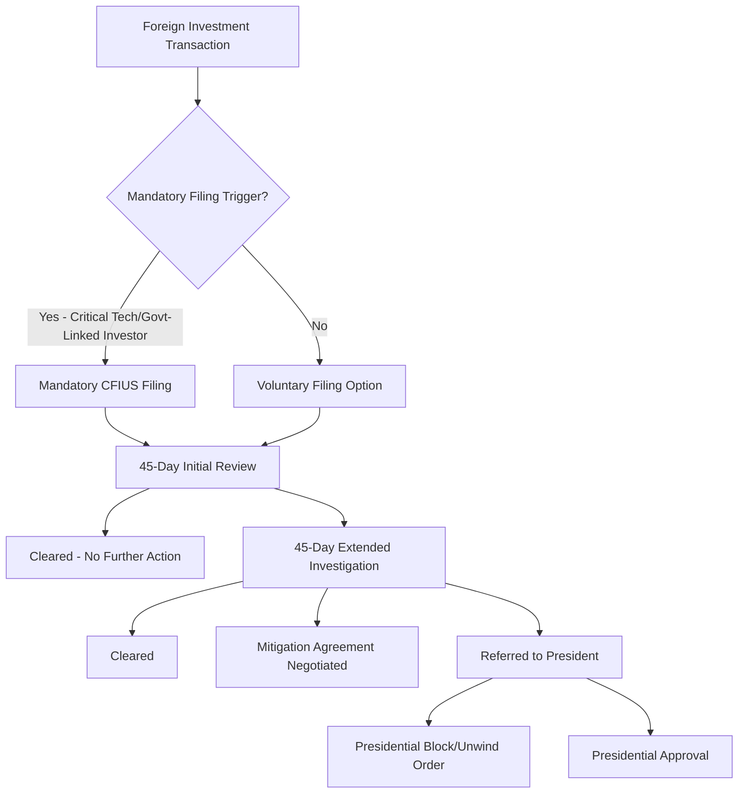

## Inbound Investment Screening and National Security Review

### Overview

Inbound investment screening mechanisms allow a state to review, condition, or block foreign investment into domestic entities on national security grounds, functioning as a distinct instrument of economic statecraft that operates at the point of capital and ownership transfer rather than at the point of goods, technology, or payment flow. Unlike tariffs, export controls, or sanctions, which primarily restrict trade or financial transactions, investment screening addresses a different vulnerability: the risk that foreign ownership or control of domestic firms, particularly those in critical infrastructure, advanced technology, or sensitive data sectors, could enable espionage, supply chain sabotage, technology transfer to strategic competitors, or leverage over critical goods and services during a crisis. The proliferation and tightening of investment screening regimes globally over the past decade reflects growing recognition that ownership and control, not just trade flows, are a central battleground in supply chain and technology competition.

### The US System: CFIUS

**Key Points**

- The **Committee on Foreign Investment in the United States (CFIUS)** is an interagency body, chaired by the Treasury Department, with representation from Defense, State, Commerce, Homeland Security, and other agencies, reviewing foreign investment transactions for national security risk.
- CFIUS's modern statutory authority derives from the **Foreign Investment Risk Review Modernization Act (FIRRMA)**, enacted in 2018, which significantly expanded CFIUS's jurisdiction beyond controlling investments to include certain non-controlling investments in critical technology, critical infrastructure, and sensitive personal data companies (the "TID" categories: technology, infrastructure, data).
- FIRRMA also introduced **mandatory filing requirements** for specified transaction types (notably certain investments involving critical technologies or foreign government-linked investors), moving CFIUS from a largely voluntary notification system toward one with defined mandatory triggers.
- CFIUS review can result in transaction approval, approval subject to mitigation conditions (such as data security agreements, board composition restrictions, or information barrier requirements), or a recommendation that the President block or unwind the transaction, a presidential authority exercised only in limited cases but with the practical effect of an absolute veto when invoked.

### CFIUS Review Process Architecture

### Key Jurisdictional Categories Under FIRRMA

- **Controlling transactions**: any transaction resulting in foreign control of a US business, the traditional core of CFIUS jurisdiction.
- **TID US businesses**: non-controlling investments providing the foreign investor with (a) access to material non-public technical information, (b) board membership or observer rights, or (c) involvement in substantive decision-making regarding critical technology, critical infrastructure, or sensitive personal data, even absent formal control.
- **Real estate transactions**: FIRRMA extended CFIUS jurisdiction to certain real estate purchases near sensitive US government facilities, including military installations, reflecting concern about surveillance and access risk independent of any operating business transaction.

### Worked Example: Applying the TID Framework

Consider a foreign investment fund seeking to acquire a 15% non-controlling equity stake, with an accompanying board observer seat, in a US semiconductor design firm.

**Example**

1. The transaction does not confer "control" in the traditional sense (below majority ownership, no controlling voting rights).
2. However, the semiconductor design firm likely qualifies as engaged in "critical technology" given its role in semiconductor intellectual property.
3. The board observer seat provides the foreign investor with access to non-public technical and strategic information and potential involvement in decision-making, satisfying the TID non-controlling investment jurisdictional trigger under FIRRMA.
4. Depending on the investor's nationality and any government ownership or control linkage, this may trigger a **mandatory** CFIUS filing requirement rather than remaining purely voluntary.
5. CFIUS review could result in approval, approval conditioned on eliminating the board observer right and implementing an information access restriction (a common form of mitigation), or, in a small minority of cases, a recommendation to block the transaction entirely.

This illustrates how FIRRMA's expansion beyond controlling transactions substantially increased CFIUS's practical reach into minority investment and venture capital-style transactions that would have fallen outside pre-2018 CFIUS jurisdiction.

### Comparative International Landscape

Investment screening has expanded substantially beyond the US system over the past decade, with most major economies now maintaining some form of national security-based inbound investment review.

| Jurisdiction | Mechanism | Notable Feature |
| --- | --- | --- |
| United States | CFIUS (Treasury-chaired interagency committee) | Mandatory filing triggers under FIRRMA; presidential block authority |
| European Union | EU Foreign Direct Investment Screening Regulation (2019) | Coordination framework; actual screening remains a member-state competence |
| Germany | Foreign Trade and Payments Act (AWG) screening | Lowered thresholds for critical infrastructure and health-sector sectors |
| United Kingdom | National Security and Investment Act (2021) | Introduced mandatory notification for 17 specified sensitive sectors |
| Japan | Foreign Exchange and Foreign Trade Act (FEFTA) screening | Prior notification requirements for designated sensitive sectors |
| Australia | Foreign Investment Review Board (FIRB) | Notably tightened thresholds and scrutiny following heightened China-related concerns |

[Inference] The near-simultaneous tightening of investment screening regimes across most major advanced economies over the 2018-2024 period reflects a broadly shared, if not formally coordinated, reassessment of foreign ownership risk in critical technology and infrastructure sectors, likely influenced by common concerns regarding a similar set of strategic competitor states, though the specific triggering events and domestic political drivers varied by jurisdiction and a claim of deliberate multilateral coordination (as opposed to parallel independent responses to similar perceived risks) should not be overstated without specific evidence of formal coordination mechanisms.

### The EU Coordination Mechanism: A Distinct Model

Unlike the US's centralized CFIUS structure, the EU's Foreign Direct Investment Screening Regulation does not create a supranational review authority. Instead, it establishes a **cooperation mechanism** among member states and the European Commission, under which member states share information about screened transactions and the Commission and other member states may issue opinions, though final screening decisions remain a national competence of the member state where the investment occurs.

[Inference] This structural difference, information-sharing coordination rather than centralized decision authority, reflects the EU's underlying constitutional allocation of competences, where national security remains substantially a member-state prerogative, and means the practical stringency and consistency of investment screening outcomes can vary considerably across EU member states despite the shared coordination framework, a contrast to the more uniform application achievable under CFIUS's single centralized process.

### Sector-Specific Focus Areas

Investment screening regimes globally have converged on broadly similar categories of heightened concern, though specific coverage and thresholds vary by jurisdiction.

**Key Points**

- **Critical infrastructure**: energy grids, water systems, ports, telecommunications networks, and transportation infrastructure, reflecting concern about potential sabotage or coercive leverage during a crisis.
- **Advanced/critical technology**: semiconductors, artificial intelligence, quantum computing, biotechnology, and advanced materials, reflecting concern about both direct military application and broader technological competitiveness.
- **Sensitive personal data**: firms holding large volumes of sensitive personal data (health records, financial data, geolocation data) on domestic citizens, reflecting concern about potential foreign intelligence exploitation of aggregated data sets.
- **Defense-adjacent and dual-use manufacturing**: firms producing components with both civilian and military application, overlapping conceptually with export control dual-use categories but addressed through the separate lens of ownership and control rather than transaction-specific export licensing.

### Diagram: Investment Screening Within the Broader Economic Statecraft Toolkit (svg_diagram)

<svg xmlns="http://www.w3.org/2000/svg" viewBox="0 0 760 300">
<text x="380" y="24" text-anchor="middle" font-size="15" font-weight="bold" fill="#1a1a1a">Investment Screening's Distinct Point of Intervention (svg_diagram)</text>
<rect x="40" y="70" width="150" height="70" rx="6" fill="#e8f0fe" stroke="#1a56db" stroke-width="1.5" />
<text x="115" y="95" text-anchor="middle" font-size="11" fill="#1a1a1a">Tariffs</text>
<text x="115" y="113" text-anchor="middle" font-size="10" fill="#444">Point: Goods crossing</text>
<text x="115" y="126" text-anchor="middle" font-size="10" fill="#444">the border</text>
<rect x="220" y="70" width="150" height="70" rx="6" fill="#fef3e0" stroke="#b45309" stroke-width="1.5" />
<text x="295" y="95" text-anchor="middle" font-size="11" fill="#1a1a1a">Export Controls</text>
<text x="295" y="113" text-anchor="middle" font-size="10" fill="#444">Point: Technology/item</text>
<text x="295" y="126" text-anchor="middle" font-size="10" fill="#444">transfer outbound</text>
<rect x="400" y="70" width="150" height="70" rx="6" fill="#fdecea" stroke="#c0392b" stroke-width="1.5" />
<text x="475" y="95" text-anchor="middle" font-size="11" fill="#1a1a1a">Financial Sanctions</text>
<text x="475" y="113" text-anchor="middle" font-size="10" fill="#444">Point: Payment/asset</text>
<text x="475" y="126" text-anchor="middle" font-size="10" fill="#444">access</text>
<rect x="580" y="70" width="150" height="70" rx="6" fill="#f3e8fd" stroke="#7c3aed" stroke-width="1.5" />
<text x="655" y="95" text-anchor="middle" font-size="11" fill="#1a1a1a">Investment Screening</text>
<text x="655" y="113" text-anchor="middle" font-size="10" fill="#444">Point: Ownership/</text>
<text x="655" y="126" text-anchor="middle" font-size="10" fill="#444">control transfer</text>

<text x="380" y="200" text-anchor="middle" font-size="11" fill="#666" font-style="italic">Investment screening is the only instrument acting BEFORE any transaction crosses a</text>

<text x="380" y="218" text-anchor="middle" font-size="11" fill="#666" font-style="italic">border or affects trade flow — it addresses structural ownership risk pre-emptively</text>

</svg>

### Mitigation Agreements as an Alternative to Outright Blocking

Outright blocking of a foreign investment transaction is relatively rare in practice; the more common CFIUS and comparable-regime outcome is a **mitigation agreement**, a negotiated set of conditions allowing the transaction to proceed while addressing the specific identified national security risk.

**Common mitigation measures include:**

- Establishment of a security committee with government-approved independent members overseeing sensitive operations
- Restrictions on foreign investor access to specific facilities, technical data, or personnel
- Data localization and access-control requirements for sensitive personal data
- Divestiture of specific business lines or assets prior to closing
- Ongoing compliance monitoring and reporting obligations, sometimes including a government-appointed monitor

[Inference] The prevalence of negotiated mitigation over outright blocking reflects a policy preference for preserving beneficial foreign capital inflows and cross-border commercial relationships wherever the specific identified risk can be addressed through structural conditions, reserving outright blocking for cases where no feasible mitigation could adequately address the underlying concern, though the criteria distinguishing "mitigable" from "non-mitigable" risk are not fully codified and involve case-specific interagency judgment.

### Investment Screening as a Complement to Export Controls

Investment screening and export controls address related but distinct vulnerabilities and are increasingly deployed as a coordinated pair rather than independently.

[Inference] Export controls restrict the outbound transfer of a specific controlled item or technology at the point of transaction, while investment screening addresses the more structural risk that foreign ownership or board-level access could provide an ongoing, less easily monitored pathway to the same underlying technology or capability, circumventing transaction-specific export licensing entirely by embedding access within the ownership structure itself. This complementarity explains why critical technology sectors subject to the most stringent export controls (semiconductors, AI, quantum computing) are also generally the sectors receiving the most stringent investment screening scrutiny, reflecting a shared underlying policy objective addressed through two structurally different intervention points.

### Conclusion

Inbound investment screening addresses a structurally distinct vulnerability from other economic statecraft instruments: the risk embedded in ownership and control itself, rather than in a specific transaction, trade flow, or payment. The rapid expansion and tightening of screening regimes across the US, EU, UK, and other major economies over the past decade, particularly the shift toward covering non-controlling investments in critical technology sectors, reflects a broader reassessment of how foreign capital access to strategically sensitive firms can constitute an ongoing security exposure independent of any single trade transaction. As supply chain and technology competition intensifies, investment screening is likely to remain a central and continuously evolving component of the economic statecraft toolkit, operating in close coordination with export controls and sanctions to address the full lifecycle of technology and capability exposure to foreign access.

**Related Topics**

- FIRRMA's expansion of CFIUS jurisdiction to non-controlling investments
- Mitigation agreements and government-appointed compliance monitors
- The EU FDI Screening Regulation's coordination-without-centralization model
- Real estate transaction screening near sensitive government facilities
- Outbound investment screening as an emerging, distinct policy tool
- Sensitive personal data protection as an investment screening trigger
- Coordination between CFIUS review and export control licensing decisions
- Sovereign wealth fund and state-linked investor scrutiny under national security review