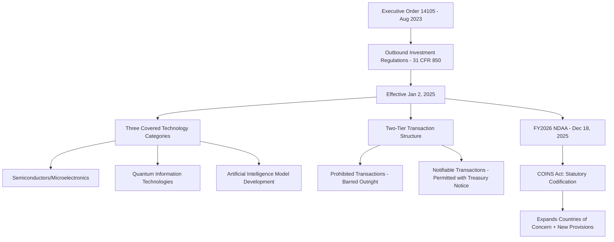

## Outbound Investment Screening and Technology Transfer Limits

### Overview

Outbound investment screening restricts a country's own persons and entities from investing capital, expertise, and managerial involvement into foreign firms in strategically sensitive sectors, functioning as the structural mirror image of inbound investment screening (covered separately). Where inbound screening (CFIUS-style review) addresses the risk of foreign ownership over domestic assets, outbound screening addresses a different concern: that domestic capital, technical expertise, and managerial engagement flowing into a strategic competitor's technology sector can accelerate that competitor's capability development in ways that plain export controls, which govern the transfer of specific physical items or technical data, do not adequately capture. Investment carries with it intangible transfers, managerial know-how, governance influence, network access, and signaling effects that outbound screening specifically targets. This is a comparatively new instrument in the US toolkit, having moved from executive order to statutory footing only very recently, and remains in an active, evolving implementation phase.

### The US Outbound Investment Security Program (OISP): Origins and Structure

**Key Points**

- Established by **Executive Order 14105** ("Addressing United States Investments in Certain National Security Technologies and Products in Countries of Concern"), issued August 9, 2023, which declared a national emergency regarding the threat posed by countries of concern seeking to develop sensitive technologies for military, intelligence, surveillance, or cyber-enabled capabilities.
- Implementing regulations, the **Outbound Investment Regulations (OIR)** at 31 CFR Part 850, were finalized by Treasury on October 28, 2024, with an effective date of January 2, 2025.
- The program targets three specific technology categories: **semiconductors and microelectronics, quantum information technologies, and artificial intelligence**.
- Originally, the sole designated "country of concern" was the People's Republic of China, including the Special Administrative Regions of Hong Kong and Macau.
- The program operates through two tiers: **prohibited transactions** (barred outright) and **notifiable transactions** (permitted but requiring notification to Treasury), with the specific tier depending on the technology subcategory and level of sensitivity involved.

### Diagram: OISP Structural Logic

### Statutory Codification: The COINS Act (FY2026 NDAA)

A major structural development occurred on December 18, 2025, when the **Comprehensive Outbound Investment National Security Act of 2025 (COINS Act)**, incorporated into the FY2026 National Defense Authorization Act, was signed into law. This represents Congress's most significant step to date toward codifying and expanding US outbound investment controls, converting the program from a purely executive-order-based mechanism (vulnerable to reversal by a future administration) into a statutorily grounded regime, signaling bipartisan consensus that outbound investment screening should be a permanent fixture of the national security regulatory architecture.

**Key elements of the COINS Act include:**

- **Expanded "Country of Concern" list**: extends coverage beyond the PRC, Hong Kong, and Macau to also include Cuba, Iran, North Korea, Russia, and Venezuela (under the Maduro regime), substantially broadening the geographic scope of the outbound screening regime beyond its original China-specific focus.
- **Revised ownership attribution test**: replaces the original OIR's 50% rule (based on 50% of revenue, net income, capital expenditure, or operating expenditure) with a 50% ownership-based test applying to persons owned 50% or more, directly or indirectly, by a country of concern or covered foreign person, a shift toward a cleaner, more traditional ownership-based jurisdictional trigger.
- **Intelligence activity exemption**: authorized intelligence activities are excluded from OIR restrictions.
- **Non-binding feedback mechanism**: parties may now seek non-binding US government feedback on how the OIR would apply to a contemplated transaction prior to executing it, addressing a significant source of investor uncertainty under the original framework.
- **Potential public database**: the Treasury Secretary is authorized (though not required) to establish a publicly accessible, non-exhaustive database identifying covered foreign persons engaged in prohibited or notifiable technology activities.
- **Authorized (not mandatory) sanctions linkage**: the COINS Act authorizes, but does not require, the President to use IEEPA authorities to impose targeted sanctions on Chinese Covered Foreign Persons knowingly engaged in significant defense-material or surveillance-technology sector operations, creating an explicit bridge between the outbound investment regime and the financial sanctions toolkit.
- **Implementation timeline**: the NDAA authorizes $150 million for implementation and requires Treasury to issue implementing regulations within 450 days of NDAA passage, placing the regulatory deadline around mid-March 2027. Until those regulations are issued, the existing OISP under the original 2024 rule remains in effect and enforceable.

[Unverified] Because Treasury retains significant discretion in shaping the specific implementing regulations required under the COINS Act, and because the regulatory process is still pending as of the current period, the precise final scope, thresholds, and compliance requirements of the codified regime should be verified against Treasury's forthcoming rulemaking rather than assumed to mirror the original 2024 OIR exactly.

### Interim Compliance Guidance

Treasury has continued to issue clarifying guidance under the existing OISP while the COINS Act implementing regulations remain pending. On December 23, 2025, Treasury issued additional Frequently Asked Questions guidance clarifying that a number of routine public capital markets transactions are not captured by the rule, addressing industry concerns about overbroad application to passive index-fund or public securities exposure.

Additionally, under existing OIR provisions, a **limited partner investment in a non-US fund** is generally not treated as a covered transaction if the limited partner obtains a binding contractual assurance that its capital will not be used to engage in prohibited or notifiable transactions, a mechanism designed to allow US institutional investors to maintain diversified fund exposure without triggering direct compliance obligations for fund-level investment decisions made by fund managers, provided appropriate contractual safeguards are in place.

### Worked Example: Applying the Outbound Screening Framework

Consider a US venture capital fund evaluating a proposed Series B investment in a semiconductor design startup headquartered in a jurisdiction designated as a country of concern.

**Example**

1. **Step 1 — Ownership/jurisdictional nexus check**: Confirm the target entity is located in, or is majority-owned by persons connected to, a designated country of concern under the applicable ownership attribution test.
2. **Step 2 — Technology category check**: Determine whether the startup's activities fall within one of the three covered categories (here, semiconductors), and if so, which specific subcategory, since the OIR distinguishes between narrower prohibited-tier technology (e.g., certain advanced chip design/fabrication capabilities) and broader notifiable-tier technology.
3. **Step 3 — Transaction tier determination**: If the specific semiconductor subcategory involved falls within the prohibited tier, the US fund cannot proceed with the investment at all. If it falls within the notifiable tier, the fund may proceed but must submit a notification to Treasury within the required timeframe.
4. **Step 4 — Documentation and monitoring**: The fund maintains compliance documentation supporting its tier determination and, if applicable, its notification filing, recognizing that Treasury's forthcoming public database (if established) could later identify the target entity as a covered foreign person, requiring retrospective reassessment of the fund's compliance posture.

### Comparative Note: Outbound Screening's Relative Novelty

[Inference] Compared to inbound investment screening (CFIUS), export controls, and financial sanctions, all of which have decades of institutional and legal precedent, outbound investment screening remains a substantially newer and less-tested instrument, with its foundational executive order dating only to August 2023 and its first statutory codification only to December 2025. This relative novelty means both the substantive scope and the practical enforcement patterns of the regime are likely to continue evolving significantly over the coming years as Treasury issues implementing regulations, gains enforcement experience, and responds to identified compliance gaps or unintended consequences, and any specific compliance guidance should be checked against the most current Treasury materials given the pace of change already demonstrated between the 2023 executive order, 2024 final rule, and 2025 statutory codification.

### Complementary Policy: Sector-Specific Procurement Restrictions

Alongside the broader OISP framework, more targeted sector-specific restrictions have also advanced. The FY2026 NDAA additionally adopted provisions restricting the use of certain Chinese biotechnology equipment by federal contractors (associated with the BIOSECURE Act policy approach), illustrating a parallel but distinct policy track: rather than screening capital investment flows, this mechanism restricts a different transmission channel, federal government and contractor procurement relationships with specific foreign biotechnology firms, reflecting similar underlying national security logic applied through government purchasing power rather than private investment screening.

### International Coordination Efforts

The COINS Act, consistent with the original executive order, encourages the heads of federal agencies to engage with US allies and partners to coordinate and develop similar outbound investment screening programs abroad, reflecting recognition that a US-only outbound screening regime has limited effectiveness if allied capital can simply substitute for restricted US capital in financing the same target technology sectors.

**Key Points**

- The **European Union** has begun considering its own outbound investment screening program, with member states expected to issue a report on the framework by June 2026, though this remains in the diplomatic/preparatory stage as of the current period rather than an operational program.
- [Unverified] The pace and eventual scope of EU (or other allied-state) outbound screening coordination should be tracked against current EU Commission and member-state announcements, since this is an early-stage policy development area with substantial room for divergence from the eventual US framework given the different institutional and legal structures involved (paralleling the earlier-discussed EU FDI Screening Regulation's information-sharing-without-centralized-authority model for inbound screening).

### Diagram: Outbound Screening as a Complement to Export Controls (svg_diagram)

<svg xmlns="http://www.w3.org/2000/svg" viewBox="0 0 760 300">
<text x="380" y="24" text-anchor="middle" font-size="15" font-weight="bold" fill="#1a1a1a">Outbound Screening vs Export Controls: Distinct Transmission Points (svg_diagram)</text>
<rect x="60" y="70" width="280" height="90" rx="6" fill="#e8f0fe" stroke="#1a56db" stroke-width="1.5" />
<text x="200" y="95" text-anchor="middle" font-size="12" font-weight="bold" fill="#1a1a1a">Export Controls</text>
<text x="200" y="115" text-anchor="middle" font-size="11" fill="#444">Restricts: physical items,</text>
<text x="200" y="130" text-anchor="middle" font-size="11" fill="#444">software, technical data transfer</text>
<text x="200" y="145" text-anchor="middle" font-size="11" fill="#444">Point: discrete transaction</text>
<rect x="420" y="70" width="280" height="90" rx="6" fill="#f3e8fd" stroke="#7c3aed" stroke-width="1.5" />
<text x="560" y="95" text-anchor="middle" font-size="12" font-weight="bold" fill="#1a1a1a">Outbound Investment Screening</text>
<text x="560" y="115" text-anchor="middle" font-size="11" fill="#444">Restricts: capital, managerial</text>
<text x="560" y="130" text-anchor="middle" font-size="11" fill="#444">involvement, know-how transfer</text>
<text x="560" y="145" text-anchor="middle" font-size="11" fill="#444">Point: ongoing ownership relationship</text>

<text x="380" y="210" text-anchor="middle" font-size="11" fill="#666" font-style="italic">Export controls miss intangible transfers embedded in investment relationships</text>

<text x="380" y="228" text-anchor="middle" font-size="11" fill="#666" font-style="italic">(board access, technical guidance, network introductions, governance influence)</text>

<text x="380" y="246" text-anchor="middle" font-size="11" fill="#666" font-style="italic">Outbound screening closes this gap by addressing the capital relationship itself</text>

</svg>

### Comparative Table: Inbound vs. Outbound Investment Screening

| Dimension | Inbound Screening (CFIUS) | Outbound Screening (OISP/COINS Act) |
| --- | --- | --- |
| Direction | Foreign capital into domestic firms | Domestic capital into foreign firms |
| Institutional lead | Treasury-chaired interagency CFIUS | Treasury (Outbound Investment Security Program) |
| Legal maturity | Decades of precedent; FIRRMA (2018) modernization | New; executive order (2023), statutory codification (2025) |
| Technology scope | Broad (TID categories: tech, infrastructure, data) | Narrow, currently three categories (semiconductors, quantum, AI) |
| Typical remedy | Mitigation agreement or block | Prohibition (bar) or notification requirement |
| Country scope | All foreign investors, risk-weighted | Currently PRC/HK/Macau, expanding to Cuba, Iran, North Korea, Russia, Venezuela under COINS |

### Conclusion

Outbound investment screening represents one of the newest and most rapidly evolving instruments in the economic statecraft toolkit, addressing the specific vulnerability that domestic capital and managerial engagement can transfer intangible strategic value, expertise, governance influence, and signaling effects, to a competitor's most sensitive technology sectors in ways that transaction-specific export controls do not capture. The program's rapid progression from a 2023 executive order to a 2025 statutory codification under the COINS Act, alongside its expanding country-of-concern list and pending implementing regulations, signals a durable bipartisan US policy commitment to this instrument, even as significant implementation details remain unsettled pending Treasury's forthcoming rulemaking. As allied jurisdictions, notably the EU, begin exploring parallel frameworks, outbound investment screening appears positioned to become an increasingly coordinated, rather than purely unilateral, component of the broader supply chain and technology competition toolkit.

**Related Topics**

- The COINS Act's expanded country-of-concern list and its geopolitical rationale
- CFIUS "Known Investor Program" fast-track proposals and their relationship to outbound screening
- The BIOSECURE Act and federal procurement restrictions on foreign biotechnology
- EU outbound investment screening framework development timeline
- Semiconductor, quantum computing, and AI as the initial covered technology categories
- Limited partner contractual assurance mechanisms in fund-of-funds structures
- The intersection of outbound screening with IEEPA-authorized sanctions on covered foreign persons
- Allied coordination challenges in outbound investment policy, paralleling export control plurilateralism