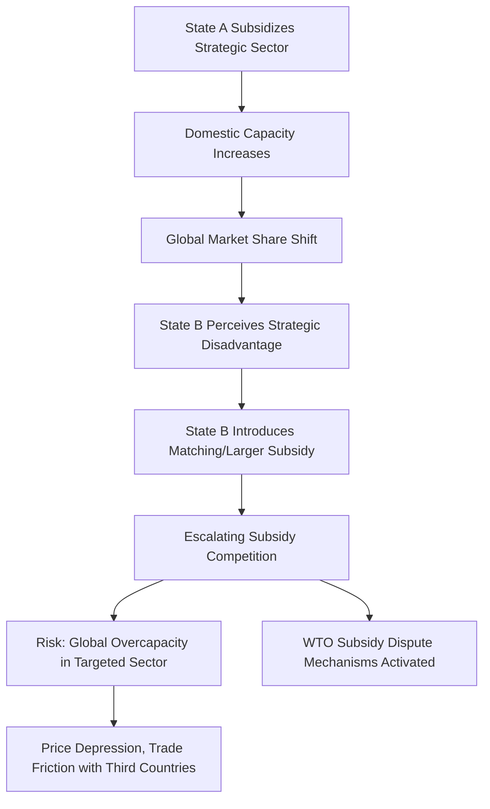

## Industrial Subsidies as a Tool of Strategic Competition

### Overview

Industrial subsidies, direct government financial support to domestic firms or sectors, function as a fundamentally different instrument of economic statecraft than tariffs, export controls, or sanctions: rather than restricting foreign access or transactions, subsidies build domestic capability directly, aiming to alter the underlying global distribution of production capacity, technological leadership, and supply chain control through positive investment rather than negative restriction. In the context of strategic competition, subsidies are increasingly deployed not merely to correct market failures or protect declining industries (the traditional economic justifications) but explicitly to contest control over technologies and production capacity deemed critical to national security, economic resilience, or long-term geopolitical leverage, a shift that has significant implications for global trade rules, allied coordination, and the risk of subsidy races among competing blocs.

### Economic Rationale Versus Strategic Rationale

**Key Points**

- **Traditional economic rationale for subsidies**: correcting market failures such as positive externalities from research and development (firms underinvest in R&D relative to the social benefit because they cannot capture all resulting value), infant industry protection during a competitive catch-up phase, or addressing coordination failures in industries requiring large, risky upfront capital investment.
- **Strategic/geopolitical rationale**: building domestic production capacity and technological capability specifically to reduce dependency on a strategic competitor, ensure supply security for critical goods during crisis or conflict, and prevent a rival state from achieving decisive technological or production leverage.
- [Inference] In practice, contemporary major-economy subsidy programs in semiconductors, batteries, and critical minerals blend both rationales simultaneously, and disentangling the "market failure correction" justification from the "strategic competition" justification in any specific case is often not fully possible, since policymakers frequently invoke both simultaneously in public justification of the same program.

### Case Study: The US CHIPS and Science Act

The CHIPS and Science Act (2022) represents one of the most significant and closely studied contemporary examples of subsidy-based strategic competition, providing approximately $52 billion in subsidies and tax incentives for domestic semiconductor manufacturing, alongside substantial additional research and workforce development funding.

**Key Points**

- Direct manufacturing incentives target advanced semiconductor fabrication facility ("fab") construction and equipment investment within US territory.
- The Act includes **guardrail provisions** restricting recipients of CHIPS Act subsidies from expanding advanced semiconductor manufacturing capacity in "countries of concern" (including China) for a specified period after receiving funding, directly linking the positive subsidy incentive to a negative restriction on recipient behavior toward the strategic competitor, illustrating how subsidy programs increasingly incorporate export-control-like conditionality rather than functioning as pure financial incentives.
- A 25% **investment tax credit** for semiconductor manufacturing and equipment provides an additional, broader-based incentive alongside the direct grant funding, operating through the tax code rather than discretionary grant allocation.

$$\text{Effective Subsidy Value} = \text{Direct Grant} + (\text{Investment Tax Credit Rate} \times \text{Qualifying Capital Expenditure})$$

### Case Study: China's Industrial Policy Approach

China's industrial subsidy architecture, encompassing programs such as "Made in China 2025" and sector-specific state guidance funds, is frequently cited in Western trade policy discourse as both a precipitating cause of, and justification for, the more recent wave of Western strategic subsidy programs.

[Inference] Chinese industrial policy is generally understood by trade economists to operate through a broader and less transparent mix of instruments than typical Western subsidy programs, including preferential state-bank lending, land-use grants, direct equity investment through state guidance funds, and local government-level incentives, making direct dollar-for-dollar comparison with Western programs like the CHIPS Act methodologically difficult; specific claims about the total scale of Chinese industrial subsidies should be treated with appropriate caution given documented measurement and transparency challenges, and current, sourced estimates should be consulted for any specific figure.

### Diagram: Subsidy Race Dynamics

### The Global Subsidy Race: Batteries and Electric Vehicles

The electric vehicle battery supply chain illustrates a particularly active contemporary subsidy competition, spanning the US, EU, and China simultaneously.

**Key Points**

- The US **Inflation Reduction Act (IRA)** provides consumer tax credits for electric vehicles meeting domestic and allied-sourcing content requirements for battery components and critical minerals, alongside production tax credits for domestic battery and critical mineral processing facilities under Section 45X.
- The IRA's **Foreign Entity of Concern (FEOC)** restrictions bar vehicles containing battery components or critical minerals from specified foreign entities (effectively China-linked entities) from qualifying for consumer tax credits, functioning as a subsidy-conditionality mechanism analogous to CHIPS Act guardrails, and connecting directly to the rules-of-origin-style content qualification logic discussed elsewhere in this material.
- The **EU** has responded with its own Net-Zero Industry Act and associated state aid framework flexibility, permitting EU member states greater latitude to subsidize domestic clean-technology manufacturing in response to perceived competitive pressure from both US IRA incentives and Chinese battery/EV subsidies.
- China's battery and EV sector has received substantial, multi-year state support, contributing to globally dominant Chinese market share in battery cell production and resulting in EU and US countervailing duty investigations into Chinese EV imports, reflecting the trade-remedy response typically triggered when subsidized imports are perceived to cause material injury to domestic competing industries.

### Worked Example: Subsidy-Induced Trade Remedy Dynamics

Consider a scenario where Country X's battery manufacturers receive substantial state subsidies, enabling them to export batteries to Country Y's market at prices below what would be sustainable absent the subsidy.

**Example**

1. Country Y's domestic battery producers experience declining market share and profitability as subsidized imports from Country X capture market share at lower price points.
2. Country Y's domestic industry, or its government directly, may file a **countervailing duty (CVD)** petition, alleging that Country X's subsidies constitute an unfair trade practice causing material injury.
3. If Country Y's trade authority determines both that a countervailable subsidy exists and that it causes material injury to the domestic industry, it may impose a **countervailing duty**, an additional tariff specifically calibrated to offset the estimated subsidy margin:

$$\text{CVD Rate} \approx \frac{\text{Estimated Subsidy Value per Unit}}{\text{Export Price per Unit}} \times 100\%$$

4. This illustrates how subsidy competition frequently generates a secondary layer of trade friction through the countervailing duty mechanism, converting an initial subsidy-based industrial policy competition into a formal trade remedy dispute, potentially litigated at the WTO or through bilateral/regional trade agreement dispute mechanisms.

### WTO Subsidy Disciplines and Their Limitations

**Key Points**

- The WTO's **Agreement on Subsidies and Countervailing Measures (SCM Agreement)** establishes categories of prohibited subsidies (export subsidies, local-content subsidies) and actionable subsidies (those causing adverse effects to another member, subject to dispute and potential countervailing measures).
- [Inference] Contemporary strategic subsidy programs in semiconductors, batteries, and critical minerals are frequently structured, whether deliberately or incidentally, to avoid the most clearly prohibited subsidy categories (e.g., subsidies explicitly conditioned on export performance) while still achieving substantial strategic capacity-building effects, illustrating a broader pattern where major economies design subsidy programs with WTO-compliance considerations in mind from the outset rather than as an afterthought.
- The WTO's dispute settlement system's own institutional weakening, particularly the multi-year non-functioning of the Appellate Body due to unfilled judicial vacancies, has reduced the practical enforceability of SCM Agreement disciplines, creating a governance gap that has arguably enabled the accelerated pace of large-scale strategic subsidy programs across major economies without effective binding multilateral constraint.

### Diagram: Subsidy Programs Across Major Economies (Illustrative Comparison)

<svg xmlns="http://www.w3.org/2000/svg" viewBox="0 0 760 320">
<text x="380" y="24" text-anchor="middle" font-size="15" font-weight="bold" fill="#1a1a1a">Major Strategic Subsidy Programs by Sector Focus (svg_diagram)</text>
<rect x="40" y="60" width="210" height="220" rx="6" fill="#e8f0fe" stroke="#1a56db" stroke-width="1.5" />
<text x="145" y="85" text-anchor="middle" font-size="12" font-weight="bold" fill="#1a1a1a">United States</text>
<text x="145" y="110" text-anchor="middle" font-size="10" fill="#444">CHIPS Act</text>
<text x="145" y="126" text-anchor="middle" font-size="10" fill="#444">(semiconductors, ~$52B)</text>
<text x="145" y="150" text-anchor="middle" font-size="10" fill="#444">Inflation Reduction Act</text>
<text x="145" y="166" text-anchor="middle" font-size="10" fill="#444">(batteries, clean energy)</text>
<text x="145" y="190" text-anchor="middle" font-size="10" fill="#444">Guardrails/FEOC</text>
<text x="145" y="206" text-anchor="middle" font-size="10" fill="#444">restrict China expansion</text>
<rect x="275" y="60" width="210" height="220" rx="6" fill="#fef3e0" stroke="#b45309" stroke-width="1.5" />
<text x="380" y="85" text-anchor="middle" font-size="12" font-weight="bold" fill="#1a1a1a">European Union</text>
<text x="380" y="110" text-anchor="middle" font-size="10" fill="#444">Net-Zero Industry Act</text>
<text x="380" y="126" text-anchor="middle" font-size="10" fill="#444">(clean tech manufacturing)</text>
<text x="380" y="150" text-anchor="middle" font-size="10" fill="#444">Chips Act (EU)</text>
<text x="380" y="166" text-anchor="middle" font-size="10" fill="#444">(semiconductor capacity)</text>
<text x="380" y="190" text-anchor="middle" font-size="10" fill="#444">State aid framework</text>
<text x="380" y="206" text-anchor="middle" font-size="10" fill="#444">flexibility expanded</text>
<rect x="510" y="60" width="210" height="220" rx="6" fill="#fdecea" stroke="#c0392b" stroke-width="1.5" />
<text x="615" y="85" text-anchor="middle" font-size="12" font-weight="bold" fill="#1a1a1a">China</text>
<text x="615" y="110" text-anchor="middle" font-size="10" fill="#444">Made in China 2025</text>
<text x="615" y="126" text-anchor="middle" font-size="10" fill="#444">(broad tech self-sufficiency)</text>
<text x="615" y="150" text-anchor="middle" font-size="10" fill="#444">National IC Fund</text>
<text x="615" y="166" text-anchor="middle" font-size="10" fill="#444">(semiconductor investment)</text>
<text x="615" y="190" text-anchor="middle" font-size="10" fill="#444">State guidance funds,</text>
<text x="615" y="206" text-anchor="middle" font-size="10" fill="#444">preferential lending</text>
</svg>

[Unverified] The illustration above reflects broadly documented programmatic categories; specific current dollar figures, program status, and precise eligibility terms for each program shift frequently through amendment, reauthorization, or administrative guidance and should be verified against current official sources for any specific figure cited in analysis or decision-making.

### Overcapacity Concerns and Third-Country Effects

A significant emerging concern in subsidy-driven strategic competition is **global overcapacity risk**: when multiple major economies simultaneously subsidize expansion in the same strategic sector, aggregate global production capacity can exceed sustainable global demand, generating price depression that disproportionately harms third countries lacking comparable subsidy resources to remain competitive.

[Inference] This dynamic is central to the USTR's Section 301 investigation into "structural excess manufacturing capacity" discussed in the broader tariffs material, since subsidy-driven overcapacity in one major economy (frequently attributed to China in Western policy discourse) can generate downstream trade friction even for third countries not directly party to the original subsidy competition, as those countries' own domestic industries face import competition from artificially low-cost, subsidized excess production seeking export markets; this framing is contested by the subsidizing state, which typically attributes competitive success to efficiency and scale rather than unfair subsidization, and the underlying economic dispute over causation (subsidy versus genuine comparative advantage) frequently remains a matter of continued analytical and diplomatic disagreement.

### Allied Coordination Versus Competitive Fragmentation

**Key Points**

- Some subsidy coordination among allied states aims to build a distributed, resilient "friend-shored" supply chain (e.g., informal US-Japan-South Corea-Taiwan-Netherlands coordination around semiconductor supply chain resilience, given the concentration of advanced lithography and fabrication capability among these specific allies).
- However, allied states simultaneously compete with each other for the same mobile investment (a semiconductor fab could plausibly be sited in the US, Germany, Japan, or South Korea), creating a **subsidy competition even among nominally aligned states**, not only between geopolitical blocs, a dynamic sometimes termed a "subsidy race to the top" among allies competing to attract the same firms' investment decisions.
- [Inference] This intra-alliance subsidy competition creates a structural tension between the stated strategic goal of building a resilient, distributed allied supply chain and the practical incentive for each individual allied government to maximize domestic capture of the same limited pool of mobile advanced manufacturing investment, a tension not fully resolved by existing coordination mechanisms and likely to persist as a recurring feature of allied industrial policy competition.

### Conclusion

Industrial subsidies have evolved from a primarily domestic economic policy tool into an increasingly explicit instrument of strategic competition, deployed to build sovereign or allied production capacity in sectors deemed critical to national security and long-term technological leadership. The blending of positive financial incentive with negative conditionality (guardrails, FEOC restrictions) illustrates how contemporary subsidy programs increasingly converge with the logic of export controls and rules of origin, using financial support as leverage to shape recipient firms' broader strategic behavior, not merely to fund domestic capacity in isolation. As major economies simultaneously escalate subsidy competition in semiconductors, batteries, and critical minerals, the resulting dynamics, WTO discipline erosion, overcapacity risk, countervailing duty disputes, and intra-alliance competitive tension, represent an increasingly central and unresolved dimension of the broader supply chain geopolitics landscape.

**Related Topics**

- The CHIPS Act guardrail provisions and countries-of-concern manufacturing restrictions
- IRA Foreign Entity of Concern (FEOC) rules and battery supply chain qualification
- WTO Agreement on Subsidies and Countervailing Measures (SCM) and Appellate Body dysfunction
- Countervailing duty investigation methodology and injury determination standards
- Section 301 structural excess capacity investigations
- The EU Net-Zero Industry Act and state aid framework flexibility
- Semiconductor allied coordination: US, Japan, South Korea, Taiwan, Netherlands
- China's state guidance fund model and industrial policy financing architecture