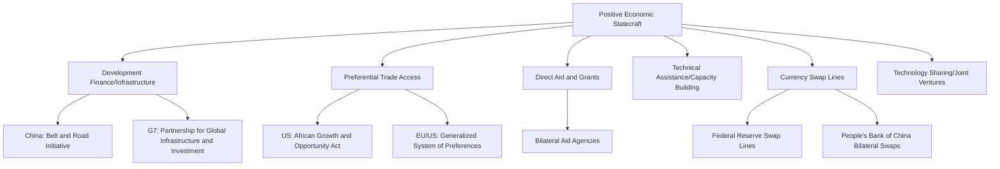

## Positive Economic Statecraft: Incentives, Aid, and Partnership Offers

### Overview

Positive economic statecraft encompasses the deployment of economic benefits, development finance, trade preferences, infrastructure investment, and partnership frameworks to build alignment, influence, or dependency in a target state, functioning as the inverse of the restrictive instruments (tariffs, sanctions, export controls) examined elsewhere in this toolkit. Where negative instruments impose cost to coerce or punish, positive instruments confer benefit to attract, reward, or bind a target state more closely to the sponsoring state's interests and institutional orbit. Positive statecraft is frequently underexamined relative to its coercive counterparts in trade policy discourse, yet it plays an equally central role in supply chain geopolitics, shaping which countries gain access to capital, technology, and market opportunity, and consequently which strategic bloc a given state's infrastructure, trade relationships, and institutional alignment gravitate toward over time.

### Taxonomy of Positive Economic Statecraft Instruments

**Key Points**

- **Development finance and infrastructure investment**: large-scale lending or grant financing for physical infrastructure (ports, railways, power generation, telecommunications), typically structured through state development banks, export-import banks, or multilateral development institutions.
- **Preferential trade access**: unilateral or negotiated tariff preferences, quota expansions, or market access commitments extended to a target state, often without requiring full reciprocal concessions.
- **Technical assistance and capacity building**: provision of expertise, training, and institutional support to help a target state build regulatory, administrative, or technical capacity, often as a precursor to deeper trade or investment integration.
- **Direct foreign aid and grants**: non-repayable financial transfers, frequently tied to specific development objectives, humanitarian needs, or, more controversially, explicit or implicit policy alignment expectations.
- **Currency swap lines and financial backstops**: central bank-level arrangements providing a target state's financial system with emergency access to a reserve currency, reducing that state's vulnerability to currency crises and correspondingly increasing its financial dependency on the swap-line provider.
- **Technology sharing and joint venture facilitation**: state-facilitated arrangements encouraging domestic firms to transfer technology or establish joint ventures with counterparts in a target state, building technical capacity while embedding commercial relationships.

### Diagram: Positive Statecraft Instrument Map

### Case Study: China's Belt and Road Initiative (BRI) as Positive Statecraft

The Belt and Road Initiative, launched in 2013, represents one of the most extensive contemporary applications of infrastructure-based positive economic statecraft, providing financing for ports, railways, power plants, and telecommunications infrastructure across a large number of participating countries, primarily in Asia, Africa, Latin America, and parts of Europe.

**Key Points**

- BRI financing is predominantly structured through Chinese state policy banks (notably the China Development Bank and the Export-Import Bank of China) rather than through purely commercial lending, allowing financing terms and project selection to reflect strategic as well as commercial considerations.
- Critics frequently characterize BRI lending practices as contributing to unsustainable debt burdens in some recipient countries, sometimes termed "debt-trap diplomacy," a framing that is itself contested; alternative analyses argue debt distress in specific cases stems from a broader mix of factors, including recipient-country fiscal management and pre-existing debt burdens, rather than deliberate strategic design by the lender in every instance. [Unverified] The empirical validity of the "debt-trap" framing as a general characterization (as opposed to describing specific individual cases) remains genuinely disputed among researchers and should not be presented as a settled consensus without citing current, specific case-level evidence.
- BRI-financed port infrastructure has, in several documented cases, transitioned to long-term Chinese state-linked operational control following recipient-country debt servicing difficulties, a pattern frequently cited (using the Hambantota Port case in Sri Lanka as the most commonly referenced example) as illustrating how infrastructure financing can convert into longer-term strategic asset control, though the specific facts and causal narrative of the Hambantota case itself remain subject to differing interpretations in available analysis and should be checked against current, balanced sourcing rather than a single characterization.

### Case Study: The G7 Partnership for Global Infrastructure and Investment (PGII)

The G7's Partnership for Global Infrastructure and Investment, launched in 2022, represents a coordinated Western-aligned response explicitly framed as an alternative to BRI-style infrastructure financing, aiming to mobilize hundreds of billions of dollars in infrastructure investment across developing economies through a combination of public and mobilized private capital.

[Inference] PGII's explicit framing as a values-based, transparent, and debt-sustainable alternative to BRI reflects a deliberate strategic positioning exercise: rather than simply competing on financing terms alone, PGII emphasizes governance standards, environmental and social safeguards, and debt sustainability analysis as differentiating features intended to appeal to recipient countries wary of the debt sustainability concerns associated with some BRI-financed projects, though PGII's actual disbursement pace and completed project volume relative to its announced funding targets is a matter that should be assessed against current, independently verified reporting rather than initial funding announcements alone, since large multi-year infrastructure initiatives frequently experience gaps between announced ambition and realized disbursement.

### Case Study: Currency Swap Lines as Financial Positive Statecraft

Central bank currency swap lines, arrangements allowing a foreign central bank to access a reserve currency (typically US dollars or, increasingly, Chinese yuan) in exchange for its own currency, function as an important but less publicly visible form of positive economic statecraft, providing crisis-period financial stability support that correspondingly deepens the recipient's financial dependency on and alignment with the provider.

**Key Points**

- The **Federal Reserve's dollar swap line network**, extended to a set of allied and systemically significant central banks, provides emergency dollar liquidity access during periods of financial stress, reinforcing the US dollar's role as the dominant global reserve and transaction currency and correspondingly reinforcing the reach of the dollar-based transmission mechanisms discussed in the financial sanctions material.
- The **People's Bank of China's bilateral swap line network** has expanded substantially over the past decade, extending yuan-denominated liquidity access to a growing number of partner central banks, a policy understood as serving both a commercial objective (promoting yuan internationalization and trade settlement) and a strategic objective (building financial dependency and yuan-denominated transaction infrastructure among partner states as a long-term complement to dedollarization efforts).
- [Inference] The comparative scale, terms, and strategic conditionality (if any) attached to Federal Reserve versus PBOC swap line access represent an important but technically under-examined dimension of great-power financial competition, since swap line access (or denial) during a crisis can have decisive effects on a recipient state's financial stability, giving the provider state substantial influence, and current comparative data on swap line utilization and terms should be consulted for any specific claim about relative scale or influence.

### Worked Example: Preferential Trade Access as Positive Statecraft

Consider the US **African Growth and Opportunity Act (AGOA)**, which provides eligible Sub-Saharan African countries with duty-free access to the US market for a wide range of products, without requiring full reciprocal tariff concessions from the beneficiary countries.

**Example**

1. A qualifying country's textile exporter gains duty-free access to the US market under AGOA, compared to the standard MFN tariff that would otherwise apply.
2. This preferential access, extended unilaterally by the US rather than negotiated as a fully reciprocal trade agreement, functions as a form of positive economic statecraft: it provides tangible economic benefit to the beneficiary country's export sector without demanding equivalent market-opening concessions in return.
3. AGOA eligibility is conditioned on beneficiary countries meeting specified criteria related to market-based economic policies, rule of law, human rights, and elimination of barriers to US trade and investment, meaning continued preferential access functions as an ongoing incentive for the beneficiary state to maintain policies aligned with US-favored governance and economic standards.
4. [Inference] This conditionality structure illustrates how even non-reciprocal, seemingly purely beneficial preferential trade programs typically embed an implicit or explicit alignment-maintenance mechanism, since continued access depends on ongoing compliance with the granting state's specified criteria, distinguishing positive statecraft instruments from unconditional aid or assistance in their underlying incentive structure.

### Positive and Negative Statecraft as a Combined System

[Inference] Positive and negative (coercive) economic statecraft instruments are frequently deployed as a coordinated pair rather than independently: preferential trade access or development finance offers to a target state often exist alongside implicit or explicit conditions whose violation could result in suspension of the preference (a negative consequence), while sanctions or tariff programs are frequently paired with offers of relief or preferential treatment contingent on policy change, creating an integrated carrot-and-stick architecture rather than two wholly separate toolkits. This pairing is evident, for example, in Mercosur's Ushuaia democratic clause (examined in the trade blocs material), which converts continued preferential trade bloc membership itself into a conditional benefit contingent on democratic governance, illustrating how the line between "positive" and "negative" statecraft is often a matter of framing (offering a benefit versus threatening its withdrawal) around the same underlying conditional relationship.

### Diagram: Positive-Negative Statecraft Integration (svg_diagram)

<svg xmlns="http://www.w3.org/2000/svg" viewBox="0 0 760 300">
<text x="380" y="24" text-anchor="middle" font-size="15" font-weight="bold" fill="#1a1a1a">Positive and Negative Statecraft as an Integrated System (svg_diagram)</text>
<rect x="60" y="70" width="280" height="90" rx="6" fill="#e6f4ea" stroke="#1e7e34" stroke-width="1.5" />
<text x="200" y="95" text-anchor="middle" font-size="12" font-weight="bold" fill="#1a1a1a">Positive Offer</text>
<text x="200" y="115" text-anchor="middle" font-size="11" fill="#444">Preferential access, aid,</text>
<text x="200" y="130" text-anchor="middle" font-size="11" fill="#444">infrastructure finance</text>
<text x="200" y="145" text-anchor="middle" font-size="11" fill="#444">Conditioned on alignment</text>
<rect x="420" y="70" width="280" height="90" rx="6" fill="#fdecea" stroke="#c0392b" stroke-width="1.5" />
<text x="560" y="95" text-anchor="middle" font-size="12" font-weight="bold" fill="#1a1a1a">Withdrawal Threat</text>
<text x="560" y="115" text-anchor="middle" font-size="11" fill="#444">Suspension of preference,</text>
<text x="560" y="130" text-anchor="middle" font-size="11" fill="#444">tariff reimposition, aid cutoff</text>
<text x="560" y="145" text-anchor="middle" font-size="11" fill="#444">Triggered by non-compliance</text>
<line x1="340" y1="115" x2="415" y2="115" stroke="#333" stroke-width="1.5" marker-end="url(#a7)" marker-start="url(#a7start)" />

<text x="380" y="200" text-anchor="middle" font-size="11" fill="#666" font-style="italic">Same underlying conditional relationship — the distinction between "positive" and</text>

<text x="380" y="218" text-anchor="middle" font-size="11" fill="#666" font-style="italic">"negative" statecraft is often a matter of framing around one integrated mechanism</text>

</svg>

### Effectiveness Considerations and Limitations

**Key Points**

- **Credibility and durability**: positive statecraft offers are only as effective as the recipient state's confidence in their durability; a preferential trade program subject to unilateral renewal decisions (as with AGOA, requiring periodic congressional reauthorization) carries less certain long-term value than a fully ratified, legally binding trade agreement, potentially limiting the depth of investment and alignment a recipient state is willing to commit in reliance on the preference.
- **Competing offers and recipient leverage**: in a multipolar environment where multiple major economies offer competing infrastructure finance, trade preferences, or aid packages, recipient states gain leverage to negotiate improved terms or to hedge by accepting benefits from multiple competing sponsors simultaneously, an outcome that limits any single sponsor's ability to convert positive statecraft into durable exclusive alignment.
- **Absorptive capacity constraints**: a recipient state's institutional and administrative capacity to effectively utilize large-scale aid or infrastructure finance can constrain the practical development impact of a given positive statecraft offer, independent of the offer's nominal financial scale.
- [Inference] These limitations suggest positive statecraft, while an essential complement to coercive instruments, does not straightforwardly translate financial scale into proportional strategic alignment outcomes, since recipient state agency, competing offers, and absorptive capacity all mediate the relationship between the scale of an offer and its actual influence effect, a consideration frequently underweighted in public discourse that treats aid or investment totals as a direct proxy for geopolitical influence gained.

### Conclusion

Positive economic statecraft, infrastructure finance, preferential trade access, aid, currency swap lines, and technology partnership, represents an essential and frequently underexamined complement to the coercive instruments more commonly associated with economic statecraft. Major powers' competing infrastructure and development finance offers, exemplified by China's Belt and Road Initiative and the G7's Partnership for Global Infrastructure and Investment, illustrate how positive statecraft has become an active arena of great-power competition in its own right, not merely a residual or secondary consideration behind sanctions and tariffs. Understanding supply chain geopolitics fully requires attending equally to which states are being drawn toward a given power's institutional orbit through beneficial offers, and through which specific financial or trade mechanism that pull is being exercised, alongside the more visible negative instruments examined throughout this toolkit.

**Related Topics**

- The Belt and Road Initiative's debt sustainability debate and the Hambantota Port case
- The G7 Partnership for Global Infrastructure and Investment (PGII) disbursement tracking
- Federal Reserve and PBOC currency swap line networks compared
- AGOA eligibility criteria and periodic congressional reauthorization risk
- Yuan internationalization strategy and its relationship to swap line expansion
- Conditional trade preference programs and democratic/governance clauses
- Multilateral development bank lending versus bilateral state development bank financing
- Recipient-state hedging strategies amid competing great-power investment offers