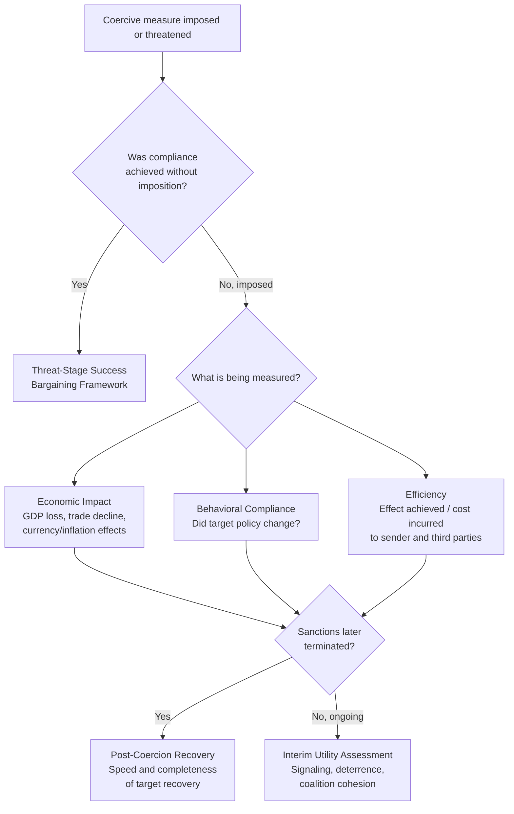

## Measuring the Effectiveness of Economic Coercion

### Definition and Conceptual Terminology

Economic coercion refers to the deliberate use of economic instruments — sanctions, tariffs, export controls, asset freezes, trade embargoes, or investment restrictions — by a sender state (or coalition) to compel a target state, entity, or individual to change behavior. "Measuring effectiveness" is a distinct and contested sub-discipline within economic statecraft research, because coercion can simultaneously fail on one metric and succeed on another.

A foundational terminological distinction from the sanctions-effectiveness literature separates five related-but-distinct concepts, addressing a research fallacy identified as the continued reliance on behavioral change as the primary measure of assessment:

**Key Points**

- **Impact**: The measurable economic/social change caused by the coercive measure (e.g., GDP contraction, trade volume decline), regardless of whether it changes target behavior.
- **Effectiveness**: Whether the coercive measure achieves its stated policy objective (e.g., target reverses the sanctioned behavior).
- **Efficiency**: The ratio of achieved effect to cost incurred by the sender (and third parties).
- **Utility**: The broader strategic value of the measure, including signaling, deterrence, and coalition-management functions, independent of target compliance.
- **Success**: A composite judgment often conflated with effectiveness but properly encompassing whether the coercion was worth its costs relative to alternative policy tools.

A central research puzzle is that despite nearly four decades of empirical research on economic sanctions, there is still no consensus on the direction and magnitude of the key variables theoretically determining sanction success — reflected in a meta-analysis of 37 studies (1985–2018) examining trade linkage, prior relations, and duration as core determinants, which found that differences across primary studies were driven substantially by methodological and contextual moderator variables rather than converging on a single effect size.

### Core Measurement Frameworks

#### 1. Behavioral Compliance Framework (Traditional)

The oldest approach measures success as: *did the target state alter the specific policy the coercion targeted?* This is the framework most criticized in recent literature for being too narrow, since sanctions may achieve partial concessions, deterrence of future action, or coalition-signaling value without full target capitulation.

#### 2. Economic Impact / Cost-Imposition Framework

This framework treats coercion as successful if it demonstrably raises costs on the target economy, using metrics such as:

- GDP growth-rate penalty relative to a synthetic counterfactual
- Per-capita income loss
- Trade volume contraction with sanctioning coalition
- Currency depreciation and inflation effects
- Sectoral output declines (e.g., oil exports, financial-sector access)

**Example**

Econometric modeling of Iran under prolonged sanctions estimates an average annual growth penalty of 1–2 percentage points, corroborated by an estimated per-capita GDP contraction of approximately −0.6% annually over a multi-year period; separate research finds Iran's middle class shrank substantially relative to a synthetic counterfactual, with average annual per-capita income losses estimated in the thousands of dollars over a multi-year window, and a measurable rise in income inequality (Gini coefficient) over the sanctions period. [Unverified — these figures derive from a single synthesized source aggregating multiple cited studies; the underlying primary studies were not independently cross-verified in this response.]

A stylized budget-constraint formalization used in this literature models sanctions as tightening a target economy's resource constraint:

$$\sum_{j} p_j c_j \leq w - \delta(\mathbf{x}_s), \quad \delta(\mathbf{x}_s) \geq 0$$

where $p_j$ and $c_j$ are prices and consumption of good $j$, $w$ is baseline wealth/income, and $\delta(\mathbf{x}_s)$ is a cost function increasing in sanctions intensity $\mathbf{x}_s$ — capturing the idea that coercion effectiveness on this framework is measured by the magnitude of $\delta$ rather than by target policy change.

#### 3. Comparative Advantage / Trade Structure Framework

Recent quantitative research reframes sanction success as a function of the relative trade structures of sender and target: sanctions are more likely to succeed when the sanctioning coalition holds a comparative advantage in the goods it restricts to the target, but more likely to fail if the target's export portfolio is diverse or if the target holds comparative advantage in its own exports — a dynamic the literature calls each side's differing "power to hurt." This finding is particularly pronounced for imposed (as opposed to merely threatened) sanctions.

#### 4. Threat-Stage / Bargaining Framework

A separate research stream studies success at the *threat* stage — i.e., cases where the mere threat of sanctions extracts concessions without imposition ever occurring. Three competing (non-mutually-exclusive) explanatory mechanisms are typically tested: coercive credibility, information revelation about resolve, and commitment-problem resolution. Analysis of historical threat-vs-imposition case comparisons finds that situations where sanctions threats succeed without needing imposition are systematically different — and more likely to generate successful outcomes — than the broader population of cases where sanctions are actually imposed, implying that studies measuring only *imposed* sanctions systematically underestimate the total utility of economic coercion as a policy tool, since the threat-only "successes" are excluded from that sample by construction.

#### 5. Post-Coercion Recovery Framework

A more recent framework evaluates effectiveness not only during the coercion episode but through the *post-termination recovery trajectory* of the target economy, asking why some countries recover swiftly after sanctions are lifted while others face prolonged stagnation — treating slow recovery itself as evidence of deeper structural effectiveness (or economic damage) beyond the sanction period itself.

#### 6. Six-Phase Comprehensive Evaluation Method

In response to the terminological confusion outlined above, a proposed six-phase method for evaluating sanctions effectiveness was developed and applied to the case of sanctions on Russia and Belarus following the 2022 invasion of Ukraine, explicitly designed to separate impact, effectiveness, efficiency, utility, and success as distinct evaluative stages rather than collapsing them into a single "did it work" binary. [Inference — the exact sequential content of each of the six phases was not retrievable from available search results; the source confirms the method's existence and stated purpose but full phase-by-phase methodology could not be verified in this response.]

### Mermaid Diagram: Measurement Framework Decision Tree

### Key Determinants Identified in the Literature

| Determinant | Effect on Effectiveness | Evidence Basis |
| --- | --- | --- |
| **Trade linkage / dependence** | Higher pre-sanction trade dependence generally increases coercive leverage, though findings vary across studies | Core variable in meta-analytic literature |
| **Sender comparative advantage** | Sanctions more likely to succeed when sender has comparative advantage in restricted goods | Commodity-level trade data analysis |
| **Target export diversification** | Higher diversification reduces sanction effectiveness | Same comparative-advantage research stream |
| **Prior relations between sender/target** | Mixed evidence; a moderator variable with inconsistent direction across studies | Meta-analysis of 37 studies |
| **Duration** | Long-duration sanctions show inconsistent effects; some evidence of "sanctions fatigue" reducing marginal effectiveness | Meta-analytic and duration-model studies |
| **Democratic institutions in target** | Institutional-quality theories suggest democratic targets face different compliance incentives than autocratic ones | Institutional theory of sanctions literature |
| **Sanction circumvention / enforcement gaps** | Effectiveness is reduced by circumvention through global value chains and third-country intermediaries | Research on sanction bypass via GVC trade routing |
| **Extraterritorial reach** | Sanctions with extraterritorial application (e.g., secondary sanctions) tend to broaden effective impact beyond direct bilateral trade | Research on extraterritorial effects of sanctions |

### Data Infrastructure Used in Measurement

- **Global Sanctions Data Base (GSDB)**: The most comprehensive macro-level source cataloguing sanction regimes, used as the starting point for stylized-facts analysis in recent quantitative reviews.
- **International Sanctions Termination (IST) Dataset**: Tracks sanctions termination events (1990–2018) to study target compliance versus sender capitulation as distinct termination pathways.
- Firm-level and customs microdata: Increasingly used to detect sanction circumvention, such as estimating the degree of control sanctioned entities retain over ostensibly independent companies in third countries.

### Practical Example: Applying Multiple Frameworks to One Case

Consider a hypothetical export-control regime imposed by a sender coalition on a target's semiconductor sector:

1. **Impact metric**: Measure the target's domestic chip production output decline and import-substitution cost increase.
2. **Effectiveness metric**: Assess whether the target abandoned or delayed the specific program the controls targeted (e.g., a weapons or dual-use technology program).
3. **Efficiency metric**: Calculate lost export revenue to sender-coalition firms as the cost side of the ledger.
4. **Circumvention check**: Analyze whether target-linked shell entities or transshipment routes through third countries eroded the intended impact — a documented pattern in sanctions-evasion research.
5. **Utility assessment**: Independent of full compliance, evaluate whether the controls slowed technological progress enough to have strategic (deterrent) value, and whether the coalition's cohesion around the measure itself generated diplomatic utility.

### Common Methodological Pitfalls

- **Behavioral-change reductionism**: Treating "did the target fully comply" as the sole success criterion, ignoring partial concessions, deterrence value, or signaling utility.
- **Selection bias from excluding threat-only cases**: Studying only *imposed* sanctions excludes the population of successful threats, biasing effectiveness estimates downward.
- **Ignoring sender-side costs**: Effectiveness assessments that omit efficiency (cost to sender and third parties) can overstate a measure's net strategic value.
- **Static analysis of a dynamic process**: Measuring effectiveness only at imposition or only at termination, rather than across impact, effectiveness, efficiency, and post-termination recovery phases.
- **Aggregation across heterogeneous cases**: Meta-analytic literature shows that pooling sanction episodes without accounting for moderating variables (regime type, trade structure, duration, multilateral vs. unilateral character) produces inconsistent and non-generalizable effect estimates.

**Conclusion**

Measuring the effectiveness of economic coercion is methodologically unresolved not for lack of data but because "effectiveness" itself is a contested, multidimensional construct spanning impact, effectiveness (narrowly defined), efficiency, utility, and success. Contemporary research has moved decisively away from single-metric behavioral-compliance judgments toward multi-phase, trade-structure-aware, and lifecycle-inclusive (threat-to-recovery) frameworks. For supply chain geopolitics specifically, this means economic coercion should be evaluated not merely by whether a target state changes policy, but by its measurable effect on trade flows, cost structures, comparative advantage shifts, circumvention behavior through global value chains, and the coercing coalition's own economic exposure — a genuinely multidimensional accounting rather than a binary success/failure judgment. [Inference — this synthesis integrates multiple distinct research streams into a unified assessment; no single cited source presents this exact integrated conclusion.]

**Related Topics**

- The Global Sanctions Data Base (GSDB): structure and use in empirical research
- Sanctions circumvention via global value chains and transshipment routing
- Secondary sanctions and extraterritorial jurisdiction as coercion-effectiveness multipliers
- Comparative advantage theory applied to trade-based economic statecraft
- Post-sanctions economic recovery trajectories and their policy implications
- Export controls versus financial sanctions: differing effectiveness measurement approaches
- The role of multilateral coalition cohesion in sanctions efficiency
- Case study: measuring the effectiveness of sanctions on Russia post-2022 using the six-phase evaluation method