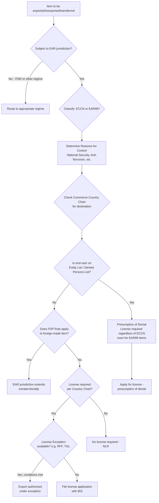

## The Architecture of US Export Control Law: The BIS and the EAR

### Institutional Foundation

The Bureau of Industry and Security (BIS) is the agency within the US Department of Commerce responsible for administering and enforcing the Export Administration Regulations (EAR), the primary legal framework governing the export, reexport, and in-country transfer of "dual-use" items — goods, software, and technology with both civilian and military/strategic applications. BIS operates alongside, but distinctly from, the State Department's Directorate of Defense Trade Controls (DDTC), which administers the International Traffic in Arms Regulations (ITAR) for inherently military items on the US Munitions List.

**Key Points**

- The EAR's legal authority derives from the Export Control Reform Act (ECRA) of 2018, which succeeded the lapsed Export Administration Act.
- BIS decisions on entity designations are made through an interagency Entity Review Committee (ERC), composed mainly of the Departments of Commerce, State, Defense, and Energy.
- Jurisdictional boundaries between BIS/EAR and other regulatory regimes are not always self-evident; even items classified as EAR99 (the least restrictive classification) can trigger license requirements when the end-user is on the Entity List — a point BIS has enforced repeatedly, including in a 2026 settlement against a semiconductor equipment manufacturer for exporting EAR99 items to Entity List parties in China.

### Core Structural Components of the EAR

#### 1. Jurisdiction — Determining What Is "Subject to the EAR"

Before any classification analysis, an exporter must determine whether an item falls under EAR jurisdiction at all (as opposed to ITAR or another regime). Broadly, anything of US origin, made with more than a de minimis threshold of controlled US content, or captured by an applicable Foreign Direct Product (FDP) rule falls under EAR jurisdiction, regardless of where it is physically located or manufactured.

#### 2. Export Control Classification Numbers (ECCNs)

Every item subject to the EAR is either classified under a specific ECCN (found in the Commerce Control List, CCL) or falls to the catch-all EAR99 designation. ECCNs are alphanumeric codes (e.g., 3A090.c for high-bandwidth memory, 3B001/3B002/3B993/3B994 for semiconductor manufacturing equipment) that determine which "reasons for control" apply (e.g., National Security, Anti-Terrorism, Regional Stability) and, cross-referenced against the Commerce Country Chart, whether a license is required for a given destination.

#### 3. The Entity List (Supplement No. 4 to Part 744)

The BIS Entity List is BIS's central repository of foreign entities subject to additional license requirements and restrictions when exporting, reexporting, or transferring (in-country) items covered by the EAR — distinct from other federal agencies' entity/sanctions lists (e.g., OFAC's SDN List). Listed entities typically face a "presumption of denial" for license applications. Recent enforcement activity illustrates the list's operational scope: a January 2026 civil penalty case involved unauthorized transfer of EAR-subject semiconductor technology by a German engineering firm's Shanghai affiliate, and an October 2025 Final Rule added 26 entities and three addresses to the Entity List for a total of 29 new entries, effective immediately.

#### 4. Foreign Direct Product (FDP) Rules

FDP rules extend EAR jurisdiction extraterritorially to foreign-made items that are the "direct product" of controlled US-origin technology or software, or produced using specified US-origin equipment — even when no US person or US-origin component is directly involved in the transaction. A December 2024 Final Rule and accompanying Interim Final Rule illustrate this mechanism in practice: BIS added controls on advanced computing items and semiconductor manufacturing items including new foreign direct product rules and updated ECCNs, while simultaneously adding 140 entities to the Entity List and modifying 14 existing entries, with the newly added entities located in China, Japan, South Korea, and Singapore — demonstrating that FDP-based Entity List designations reach beyond Chinese entities alone into the broader supply chain.

#### 5. License Requirements and License Exceptions

Where a license is required, the EAR provides a structured system of License Exceptions that can authorize specific transactions without a case-by-case application, subject to strict conditions. Two mechanisms illustrate the granularity of this system:

- **License Exception Restricted Fabrication Facility (RFF)** (EAR § 740.26): Authorizes certain exports of EAR-subject items (excluding specified high-risk ECCNs such as 3B001, 3B002, 3B993, 3B994, 3D992–3D994, 3E992–3E994) to fabrication facilities associated with Entity List entities bearing a "740.26" notation, provided no other destination- or end-use/end-user-based control applies, subject to restrictions, notification, and reporting requirements.
- **Temporary General Licenses (TGLs)** (Supplement No. 1 to Part 736, General Order No. 4): Provide time-limited authorization for specified "less restricted" semiconductor manufacturing equipment (SME) and advanced computing items; validity periods are periodically extended or revised by rule (e.g., SME items controlled for Anti-Terrorism reasons and high-bandwidth memory items under ECCN 3A090.c had validity extended to December 2026 in a 2024 rule).

#### 6. End-Use and End-User Controls (Part 744)

Independent of ECCN-based controls, Part 744 imposes controls tied to specified end-uses (e.g., military end-use, supercomputer end-use) or end-users, regardless of an item's classification. Section 744.23 specifically addresses export of EAR-subject items supporting certain supercomputer-related end-uses and has been revised in recent rulemakings to tighten scope.

#### 7. Validated End-User (VEU) Program

The VEU program allows pre-approved foreign end-users to receive specified items without individual licenses, streamlining compliance for trusted, vetted recipients — though recent rulemaking has also involved *removals* from this program alongside Entity List additions, reflecting tightening rather than loosening of the overall control posture.

### Mermaid Diagram: EAR Compliance Decision Flow

### Practical Example: Classification-to-Enforcement Chain

A US-based semiconductor equipment component manufacturer sells cleaning brushes classified as EAR99 (no specific ECCN, lowest control tier) through a third-party distributor. Even though EAR99 items are the least restrictive classification, if the ultimate end-user is a company listed on the BIS Entity List, the transaction still requires a license, and lack of authorization constitutes a violation. This exact fact pattern underpinned a 2026 BIS settlement in which a California-based company sold EAR99-classified semiconductor manufacturing equipment components to Chinese entities on the Entity List — including a well-known Chinese foundry and an affiliated entity — through third-party distributors over a multi-year period, without required authorization, resulting in civil penalties. [Verified against enforcement source; exact company identities and dollar figures reflect the specific cited case and should not be generalized to all EAR99 transactions.]

### Recent Structural Developments (2025–2026)

- **AI Diffusion Rule rescission and replacement**: BIS has indicated it is drafting a replacement framework for the rescinded AI Diffusion Rule, expected in late 2026, with the outcome determining whether the multilateral control architecture built between 2022 and 2025 endures or is superseded by a more bilateral arrangement structure. [Unverified — framed as BIS's stated intent as of the source's publication; actual content and timing of the replacement framework had not been finalized as of the underlying source's reporting.]
- **Revenue-sharing licensing mechanism**: A January 2026 Federal Register notice revised license review policy for a specific class of AI chips exported to China, establishing a presumption of approval for qualifying customers adopting BIS-specified compliance procedures, tied to a mechanism under which approved exporters remit a percentage of China semiconductor revenues to the US government — described as a construct without precedent in EAR history and, as of the source's reporting, subject to legal challenge in the US Court of International Trade. [Unverified — litigation status is time-sensitive and may have changed since the cited reporting.]
- **Persistent core controls**: Despite policy shifts, core China-related controls — fabrication equipment restrictions, Entity List presumption-of-denial, the "US persons rule" (restricting US persons' support to certain foreign semiconductor activities even without an export), and FDP Rules — remain in force as the structural backbone of the regime.
- **Jurisdictional overlap clarification**: A May 2026 regulatory action from the Bureau of Alcohol, Tobacco, Firearms and Explosives acknowledged that the Department of Commerce now shares jurisdiction alongside the Department of State over certain items on the US Munitions Import List, illustrating that BIS/EAR and ITAR/DDTC boundaries continue to be actively renegotiated rather than fixed.

### Enforcement Posture

BIS enforcement in the semiconductor sector has intensified, with recent cases exposing compliance gaps extending well beyond obvious diversion schemes — reaching into subsidiary corporate structures, third-party intermediaries, the accuracy of self-classifications, and the interpretive risk of undefined terms within the EAR itself. This suggests that BIS enforcement priorities in 2026 extend beyond direct violators to structural and procedural compliance failures across the semiconductor supply chain. [Inference — characterization of enforcement "priorities" as a forward-looking trend, synthesized from event-marketing language describing planned case-study analysis rather than a formal BIS policy statement.]

**Conclusion**

The EAR functions as a layered, multi-gate compliance architecture rather than a single rule: jurisdiction determination, ECCN classification, country-chart cross-referencing, Entity List screening, FDP-rule extraterritorial extension, and license-exception eligibility must each be independently assessed for every transaction. The semiconductor sector exemplifies this architecture's practical stakes, where even the lowest-control-tier items (EAR99) carry real licensing exposure once entity-based restrictions are triggered, and where foreign-made items can fall under US jurisdiction purely by virtue of the technology or equipment used to produce them.

**Related Topics**

- The Foreign Direct Product Rule: extraterritorial reach and the Huawei/HiSilicon precedent
- Entity List designation process and the Entity Review Committee (ERC)
- License Exceptions in depth: RFF, TGLs, and other Part 740 mechanisms
- BIS enforcement actions and civil penalty trends in the semiconductor sector
- ITAR vs. EAR jurisdictional boundaries and dual-regulated items
- The rescinded AI Diffusion Rule and its anticipated 2026 replacement framework
- Revenue-sharing export licensing mechanisms and their legal challenges
- Sanction and export-control circumvention via third-country procurement networks