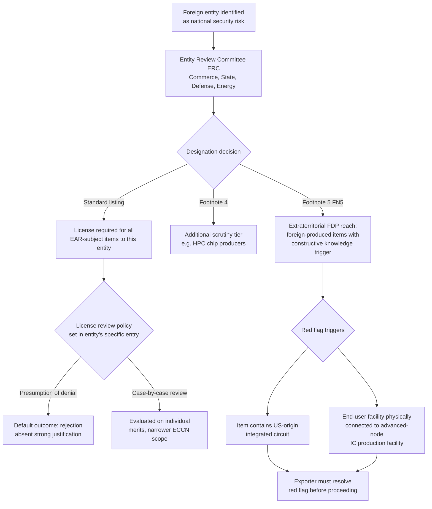

## The Entity List and Its Role in Restricting Technology Access

### Definition and Legal Placement

The Entity List (Supplement No. 4 to Part 744 of the Export Administration Regulations) is BIS's central repository of foreign entities that are subject to additional license requirements and restrictions when exporting, reexporting, or transferring (in-country) items covered by the EAR. It is distinct from other federal agencies' restricted-party lists (such as OFAC's Specially Designated Nationals List), and it functions as a *targeting mechanism* layered on top of the EAR's general classification and licensing framework — restricting technology access to specific named parties regardless of an item's inherent control level.

**Key Points**

- Listing decisions are made by the Entity Review Committee (ERC), composed mainly of the Departments of Commerce, State, Defense, and Energy.
- The default consequence of listing is a license requirement for all items subject to the EAR exported to that entity, reviewed under a "presumption of denial" — the most restrictive standard review policy available.
- Listed entities can receive graduated, entity-specific restriction levels (standard listing, footnote 4, footnote 5) that determine how far extraterritorial reach extends to foreign-produced items.
- As of 2026, the Entity List has become the primary operational instrument for restricting China's access to advanced semiconductor and AI-relevant technology, functioning alongside — but independently of — ECCN-based classification controls.

### Structural Mechanics of Listing

#### Grounds for Designation

Entities are added to the list for reasons including: acquiring or attempting to acquire US-origin items in support of a country's military modernization; participating in advanced computing or integrated-circuit manufacturing and distribution sectors in a manner presenting diversion risk; directly supplying a military, government, or security apparatus; or acting as procurement conduits for already-listed parties. A representative 2025 case illustrates this: several biotechnology-sector entities were added to the Entity List after acquiring US-origin semiconductor manufacturing equipment on behalf of two already-listed semiconductor manufacturers without required BIS authorization — the entities were found to pose an unacceptable risk of diverting US-origin items to a military research body, and were listed with a license requirement for all EAR-subject items reviewed under presumption of denial.

#### The License Review Policy Spectrum

Not all Entity List designations carry identical restriction levels. The license review policy for each entity is set out individually in that entity's specific list entry, meaning the Entity List is not a uniform blacklist but a graduated instrument:

- **Presumption of denial** — the default and most restrictive policy; license applications are reviewed with a starting assumption of rejection.
- **Case-by-case review** — a less restrictive policy applied to specific entities or specific item categories; for example, a review policy of presumption of approval can apply to entities neither headquartered in, nor whose ultimate parent is headquartered in, specified high-risk jurisdictions, while all other applications from that same entity remain subject to presumption of denial.
- Policy can shift over time for the same entity: a January 2026 Federal Register action revised BIS's license review policy for exports of certain semiconductors to China and Macau, changing it from a presumption of denial to a case-by-case review — demonstrating that Entity List restrictiveness is a dynamic policy lever, not a static designation.

#### Footnote Designations — Extending Reach to Foreign-Produced Items

The most significant recent structural innovation is the use of footnote designations to extend Entity List consequences beyond direct US-origin exports into foreign-produced items:

- **Footnote 4**: Applied to entities such as major Chinese IC design and equipment firms involved in high-performance computing chip production, subjecting them to specific additional scrutiny distinct from standard listing.
- **Footnote 5 (FN5)**: A more expansive designation introduced in December 2024 rulemaking. A company with a Footnote 5 designation is subject to restrictions beyond those generally applied to other Entity List designees: under the Footnote 5 FDP Rule, US export control jurisdiction applies to certain foreign-produced "direct products" if the exporter has constructive knowledge that the foreign-produced commodity will be incorporated into anything produced, purchased, or ordered by a Footnote 5 designee, or is part of a transaction to which a Footnote 5 designee is a party. Notably, there is generally no *de minimis* exemption threshold for certain foreign-produced semiconductor manufacturing equipment when the commodity contains a US-origin integrated circuit and is destined for an arms-embargoed destination, Macau, or a Footnote 5 designee.

In the December 2024 rulemaking, 140 entities were added to the Entity List (located in China, Japan, South Korea, and Singapore), with nine of the newly added entities and seven existing entries receiving the new Footnote 5 designation — targeting organizations involved in advanced-node IC development and production, semiconductor manufacturing equipment, and support for a foreign military-civil fusion development strategy. For the majority of these entities, a presumption-of-denial license review policy applies, except that certain Footnote 5 entities receive case-by-case review specifically for license applications involving items *not* falling within a defined set of highly sensitive ECCNs (including 3B001.a.4, .c, .d, f.1.b.2, .k–.p; 3B002.c; 3B993; 3B994).

### Mermaid Diagram: Entity List Designation and Consequence Structure

### Practical Example: Red-Flag Resolution Obligation

Under the Footnote 5 FDP Rule regime, if a foreign-produced item falls within a relevant Category 3B ECCN and contains at least one integrated circuit, this constitutes a "red flag" that the item meets the product scope of the applicable FDP rule — the exporter, reexporter, or transferor must resolve this red flag before proceeding, such as by investigating whether US software, technology, or production equipment was used in the item's design or manufacture. Separately, if an end-user's facility is physically connected to a facility where advanced-node integrated circuit production occurs, the two buildings are treated as a single "facility" for purposes of the relevant end-use control section, unless the red flag is resolved through a formal BIS Advisory Opinion — meaning corporate campus layout and shared infrastructure can itself trigger restricted-party consequences even without direct dealings with a listed entity.

### Restriction Escalation and Retaliation Dynamics

Entity List expansion has proceeded incrementally and cumulatively rather than as isolated events:

- September 2025: Additional entities added under the destinations of China, Singapore, and Taiwan for acquiring or attempting to acquire US-origin items supporting military modernization and participating in advanced computing and IC manufacturing/distribution sectors, with two named entities receiving footnote 4 designations for involvement in high-performance computing chip production.
- December 2024: The 140-entity Footnote 5 rulemaking described above.
- August 2026: Ongoing litigation reflects the list's contentiousness — a Chinese semiconductor firm added to the Entity List in 2023 for chip development with potential weapons applications pursued a Freedom of Information Act challenge seeking BIS's underlying designation records, with BIS defending withholding of certain documents as protected from disclosure. [Unverified — litigation outcome as of the cited reporting date was not resolved; status may have changed.]
- Retaliatory dynamics: Entity List expansion targeting a country's semiconductor sector has historically triggered reciprocal export restrictions from the targeted country on critical inputs (e.g., rare earth and processing-related materials), illustrating that Entity List actions function within a broader tit-for-tat escalation dynamic rather than as a unilateral, consequence-free lever. [Inference — general escalation pattern; specific reciprocal measures vary by rulemaking and were not exhaustively itemized in the cited sources for this response.]

### Strategic Function in the Broader Chip War

The Entity List serves several distinct technology-access-restriction functions simultaneously:

1. **Direct denial**: Preventing named entities from receiving controlled items outright via presumption-of-denial licensing.
2. **Supply chain mapping and deterrence**: Publicly identifying procurement conduits and shell/intermediary companies, raising compliance risk for any third party that might otherwise unknowingly transact with them.
3. **Extraterritorial closure of loopholes**: Footnote 5 and related FDP mechanisms close the "foreign fab" loophole, under which a listed entity's collaborators might otherwise obtain restricted-equivalent items manufactured entirely outside the US using non-US inputs, provided sufficient US-origin technology, software, or equipment was used anywhere in that item's production chain.
4. **Calibrated escalation/de-escalation tool**: Because review policy (not just listing status) can be adjusted — as seen in the January 2026 shift from presumption of denial to case-by-case review for certain China/Macau semiconductor exports — the Entity List functions as a continuously tunable policy instrument rather than a binary on/off restriction.

**Conclusion**

The Entity List's role in restricting technology access extends well beyond a simple denial roster: its layered structure — standard listing, footnote 4, and footnote 5 designations, each carrying distinct license review policies and extraterritorial reach — allows BIS to calibrate restriction intensity per entity and per item category. The Footnote 5 FDP mechanism in particular represents a structural expansion of US export control reach into foreign-produced items, closing supply-chain circumvention pathways that pure US-origin-content rules could not address, while ongoing policy adjustments (both tightening, as in the 140-entity/Footnote 5 rulemaking, and relaxing, as in the January 2026 case-by-case revision) demonstrate that the Entity List operates as a dynamic instrument of ongoing US-China technology competition rather than a fixed sanctions list. [Inference — synthesis characterization of the Entity List's overall strategic function, integrating multiple distinct rulemakings rather than restating a single source's framing.]

**Related Topics**

- Footnote 5 and the Foreign-Produced Direct Product (FDP) Rule mechanics
- Entity Review Committee (ERC) interagency designation process
- Presumption of denial vs. case-by-case review: comparative license outcomes
- Red flag resolution and Advisory Opinion procedures under Part 744.23
- Entity List litigation and FOIA disclosure disputes
- Chinese retaliatory export restrictions on critical minerals following Entity List actions
- Validated End-User (VEU) program removals as a complementary restriction tool
- Sanctions circumvention via procurement conduits and shell entities