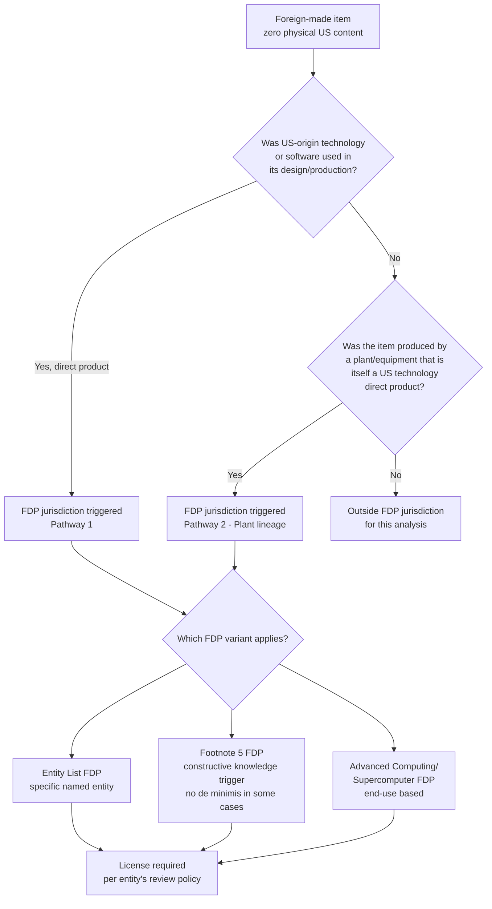

## The Foreign Direct Product Rule and Its Extraterritorial Reach

### Definition and Legal Basis

The Foreign Direct Product (FDP) Rule is a jurisdictional mechanism within the Export Administration Regulations (EAR) that extends US export control authority to items manufactured entirely outside the United States, by non-US persons, using no US-origin materials directly — provided the item is the "direct product" of specified US-origin technology, software, or production equipment, or is produced by a plant (or major component of a plant) that is itself a direct product of such US-origin inputs. It is the single most significant extraterritorial-reach mechanism in the EAR, converting what would otherwise be a purely domestic US export regulation into a instrument capable of controlling third-country-to-third-country transactions with no US nexus beyond an upstream technology lineage.

**Key Points**

- The FDP Rule operates independently of physical US content — an item can be 100% foreign-made and still fall under EAR jurisdiction.
- FDP rules exist in multiple variants, each with different triggering conditions, scope of covered items, and covered destinations/end-users.
- The December 2024 rulemaking cycle significantly expanded FDP scope specifically for the semiconductor and advanced-computing sector, introducing the Footnote 5 designation as a new, broader FDP variant.
- Compliance requires exporters to trace the technology and equipment lineage of items they did not themselves manufacture — a supply-chain due-diligence burden that extends well beyond traditional "country of origin" analysis.

### Core Mechanics — How Direct Product Status Is Triggered

An item becomes subject to the EAR under FDP logic when either:

1. It is the **direct product** of specified US-origin technology or software (i.e., the immediate output of a process that used controlled US technology/software), or
2. It is produced by a **plant or major component of a plant** that is itself the direct product of specified US-origin technology or software (i.e., the manufacturing equipment itself has US lineage, even if the specific production run used no further US inputs).

This second pathway is what gives the FDP Rule its power in the semiconductor context: a foreign fabrication facility built using US-origin lithography, deposition, or other semiconductor manufacturing equipment (SME) can render its *entire output* — chips containing zero physical US content — subject to US export jurisdiction.

### Named FDP Rule Variants

#### 1. Entity List FDP Rule (General)

Applies to specific entities individually designated on the Entity List for FDP treatment, restricting foreign-produced items destined for those named parties.

#### 2. Footnote 5 (FN5) FDP Rule — Semiconductor-Specific Expansion

Introduced in December 2024 rulemaking as a new, more expansive FDP variant layered onto the Entity List. Under the Footnote 5 FDP Rule, US export control jurisdiction applies to certain foreign-produced "direct products" if the exporter has constructive knowledge that the foreign-produced commodity will be incorporated into anything produced, purchased, or ordered by a Footnote 5 designee, or is part of a transaction to which a Footnote 5 designee is a party. Notably, there is generally no *de minimis* exemption threshold for certain foreign-produced semiconductor manufacturing equipment when the commodity contains a US-origin integrated circuit and the commodity is destined for a US arms-embargoed destination, Macau, or a Footnote 5 designee — meaning ordinary de minimis thresholds that would otherwise exempt low-US-content foreign products do not apply in these specific circumstances.

Footnote 5 jurisdiction is triggered under multiple independent conditions:

- Exports or reexports of commodities specified in a defined ECCN (3B993) by an entity whose ultimate parent is headquartered in Macau or a specified high-risk country group destination.
- Exports or reexports of items specified in that ECCN from countries in a defined allied country group that are *not* subject to equivalent controls by the relevant country.
- Exports or reexports of certain Category 3 commodities from any country not listed in the specified allied country group.
- Certain in-country transfers involving Category 3 commodities.

#### 3. Advanced Computing / Supercomputer FDP Rules

A separate set of FDP rules specifically targets advanced computing items and supercomputer end-uses, controlling foreign-produced items destined for supercomputer or specified advanced-AI-relevant end-uses in restricted destinations, independent of Entity List status.

### Mermaid Diagram: FDP Jurisdictional Logic

### The Red Flag and Constructive Knowledge Standard

A defining compliance feature of the Footnote 5 FDP Rule is its reliance on a "constructive knowledge" standard combined with defined "red flags" rather than requiring actual, provable knowledge of an EAR violation:

- If a foreign-produced item falls within a relevant Category 3B ECCN and contains at least one integrated circuit, this constitutes a red flag that the item meets the product scope of the applicable FDP rule.
- The exporter, reexporter, or transferor must resolve this red flag before proceeding — for example, by investigating whether US software, technology, or production equipment was used in the item's design or manufacture.
- Separately, if an end-user's facility is physically connected to a facility where advanced-node integrated circuit production occurs, the two buildings are treated as a single "facility" for purposes of the relevant end-use control section (744.23), unless the red flag is resolved through a formal BIS Advisory Opinion.
- BIS itself has noted that although these new red flags were introduced specifically for this rule's covered items and activities, because they are included in a generally applicable portion of the EAR, they may be considered to enhance the degree of end-use diligence expected of exporters more broadly — suggesting a possible spillover effect on compliance expectations beyond the rule's originally intended scope. [Inference — BIS's own framing describes this as a possible interpretive effect rather than a formally stated universal compliance obligation; treat as an emerging compliance expectation rather than settled law.]

### Practical Example: Tracing a Chip's US Technology Lineage

Consider a chip fabricated entirely in a non-US country, using a foreign-owned foundry, sold to a non-US customer, with no US company appearing anywhere in the sales contract:

1. **Step 1 — Equipment lineage check**: Was the lithography, deposition, or etching equipment used in the fab of US origin, or does it itself qualify as a "direct product" of US-origin technology (e.g., a Dutch-made EUV machine incorporating licensed US components)? If yes, Pathway 2 FDP jurisdiction may attach to the fab's entire output.
2. **Step 2 — End-user screening**: Is the ultimate customer, or any party to the transaction, a Footnote 5-designated entity, or physically co-located with one? If yes, Footnote 5 obligations attach regardless of the chip's physical content.
3. **Step 3 — De minimis analysis**: Under ordinary FDP rules, a foreign-made item might be exempt if US-origin content falls below a de minimis threshold. Under Footnote 5 conditions involving certain SME with an embedded US-origin integrated circuit destined for specified high-risk destinations or designees, this de minimis exemption does not apply.
4. **Step 4 — Licensing outcome**: If jurisdiction attaches, the applicable Entity List entry's specific license review policy (presumption of denial or case-by-case) governs the outcome — meaning the same physical chip could require a license in one transaction and not another, purely based on the counterparty's Entity List status and footnote designation.

### Extraterritorial Reach — Practical Consequences

The FDP Rule's extraterritorial character produces several distinctive supply-chain effects not present in ordinary trade-control regimes:

| Consequence | Mechanism |
| --- | --- |
| **Third-country manufacturers become EAR-obligated** | A fab in a US ally or partner country can become subject to US licensing requirements purely through its equipment lineage |
| **Compliance burden shifts upstream** | Exporters/reexporters must investigate their own supply chain's technology history, not just their own product's content |
| **Allied-country policy alignment pressure** | FDP rules differentiate treatment for countries in defined "equivalent control" allied groups versus others, creating diplomatic pressure on allies to adopt matching export control policies to avoid being treated as a control gap |
| **Corporate campus/facility interpretation risk** | Physically connected facilities can be treated as a single entity for control purposes, extending restriction beyond the named designee itself |
| **Dynamic policy targeting** | New footnote designations and FDP variants can be added to existing Entity List entries via subsequent rulemaking, retroactively changing the compliance posture for previously "safe" foreign-made products |

### Regulatory Evolution Context (2024–2026)

The December 2024 rulemaking that introduced Footnote 5 was accompanied by a broader interim final rule making multiple related EAR changes: additional Foreign-Produced Direct Product rules, new and modified ECCNs on the Commerce Control List, and new license exceptions — including License Exception HBM for a specific high-bandwidth-memory ECCN, providing limited exceptions for HBM exports under specific conditions such as to approved allied countries. Subsequent 2026 developments show the license *review policy* attached to FDP-covered entities continuing to shift — for example, a January 2026 revision changed the review policy for exports of certain semiconductors to China and Macau from presumption of denial to case-by-case review — indicating that while the FDP jurisdictional architecture itself has remained structurally stable, its practical restrictiveness continues to be actively recalibrated. [Inference — characterization of "structural stability" versus "practical recalibration" as a distinction; the underlying rulemakings are documented, but this framing is an analytical synthesis.]

**Conclusion**

The Foreign Direct Product Rule represents the structural mechanism by which the United States projects export control authority beyond its own borders and beyond its own-origin goods, using technology and equipment lineage — rather than physical content or transaction location — as the jurisdictional trigger. Its semiconductor-specific expansion through the Footnote 5 designation, combined with constructive-knowledge red flags and the removal of de minimis exemptions in defined high-risk scenarios, makes it the single most consequential legal instrument in the US-China chip war for restricting technology access at scale, because it can reach foreign fabrication capacity that no direct US sanction or Entity List designation alone could touch.

**Related Topics**

- Footnote 5 designation mechanics and the Entity List's graduated restriction tiers
- De minimis rules and their exceptions under semiconductor-specific FDP provisions
- Red flag resolution procedures and the BIS Advisory Opinion process
- License Exception HBM and other targeted exceptions for allied-country transactions
- Country Group classifications (D:5, A:5) and their role in FDP scope determination
- Allied country export control harmonization pressure from FDP extraterritorial design
- Comparative extraterritorial jurisdiction: FDP Rule versus OFAC secondary sanctions
- Compliance program design for multi-tier supply chain technology-lineage due diligence