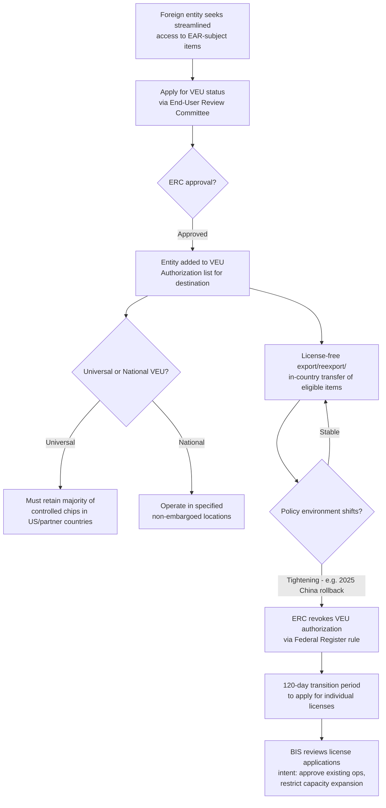

## Validated End User Status and Licensing Exceptions

<syllabot_broad_topic/>

### Definition and Legal Basis

Validated End-Users (VEUs) are designated entities located in eligible destinations to which eligible items subject to the Export Administration Regulations (EAR) may be exported, reexported, or transferred (in-country) under a general EAR authorization instead of a case-by-case license, governed under 15 CFR 748.15 (Authorization Validated End-User). The VEU program was created by BIS through a final rule published June 19, 2007, under authority that now derives from the Export Control Reform Act of 2018 (ECRA), which provides BIS's principal statutory authorities.

**Key Points**

- The VEU program is administered by the End-User Review Committee (ERC), composed of representatives from the Departments of State, Defense, Energy, Commerce, and other agencies as appropriate.
- VEU status functions as a *general authorization* substitute for individual licensing — a fundamentally different compliance mechanism than a License Exception, though both serve to streamline otherwise license-required transactions.
- The China-specific VEU program became a central flashpoint in the semiconductor chip war: expanded in 2023 to benefit foreign-owned fabs operating in China, then substantially rolled back in 2025 as US policy tightened.
- VEU authorizations remain active in other jurisdictions (e.g., India) even as the China-specific authorizations were revoked, illustrating that VEU is a destination-differentiated program, not a uniform global authorization.

### VEU Program Structure

#### Universal VEU vs. National VEU

- **Universal VEUs**: Must retain a majority of their controlled chips within the United States and partner countries — a structural condition designed to limit diversion risk even for otherwise-trusted global operators.
- **National VEUs**: Can operate in specified non-embargoed locations, subject to country-specific eligibility and ERC approval.

#### Volume and Consignee Limitations

Even where license exceptions or VEU-adjacent authorizations apply, quantitative caps can still constrain usage — for example, a Total Processing Power (TPP) volume limit restricting the total TPP volume of exports and reexports per calendar year by all exporters and reexporters to any individual ultimate consignee to a specified ceiling (reported at approximately 26,900,000 TPP), preventing any single consignee from aggregating unlimited authorized capacity even under a favorable licensing posture.

### The China VEU Rollback (2024–2025) — A Case Study in Policy Reversal

#### Background: The 2023 Expansion

In 2023, the VEU program was expanded to allow a select group of foreign semiconductor manufacturers to export most US-origin goods, software, and technology license-free to manufacture semiconductors in China — a policy subsequently characterized by BIS leadership as a "loophole," since no US-owned fab held equivalent license-free privileges in China.

#### December 2024: License Review Policy Tightening for SMIC Entities

Concurrent with the Entity List rulemaking that introduced Footnote 5 designations, the ERC also modified the license review policy for seven SMIC-affiliated entries on the Entity List under the destination of China (including Ningbo Semiconductor International Corporation, and SMIC's Shenzhen, Tianjin, Hong Kong, and Shanghai entities). The modified policy further restricts these parties' development or production of advanced-node integrated circuits at semiconductor fabrication facilities in China, applying license review standards under sections 744.11 and 744.23(d) of the EAR — with a general presumption of denial, except case-by-case review specifically where a defined exception provision (§744.23(d)(3)) applies.

#### August–September 2025: Formal Revocation of China VEU Authorizations

BIS published a Federal Register notice on August 29, 2025, effective December 31, 2025, revoking VEU authorizations for three major foreign-owned semiconductor fabrication facilities in China: Intel Semiconductor (Dalian) Ltd.; Samsung China Semiconductor Co. Ltd.; and SK hynix Semiconductor (China) Ltd. (SK hynix having acquired Intel's Dalian facility earlier in 2025). Although not named in the BIS announcement itself, TSMC separately confirmed that its Nanjing site would lose VEU designation on the same date, with the company stating it had received notification from the US government that its VEU authorization for TSMC Nanjing would be revoked effective December 31, 2025.

BIS's official framing characterized the action as closing a "Biden-era loophole" that allowed a handful of foreign companies to export semiconductor manufacturing equipment and technology to China license-free, stating that no US-owned fab had this privilege — and now no foreign-owned fab would have it either, putting all fabs "on par with their competitors" from a licensing-burden perspective.

#### Transition Mechanics

- Former VEU participants were given 120 days following Federal Register publication to apply for and obtain export licenses to continue operations.
- BIS estimated the revocation of the three named VEU authorizations would result in an increase of more than 1,000 export license applications annually — a figure that notably excludes additional applications that would be generated by TSMC's separate loss of VEU status.
- BIS stated its intent to grant export license applications allowing former VEU participants to operate their *existing* fabs in China, while separately indicating it does not intend to grant licenses that would allow *expansion* of capacity at those facilities. [Verified against source for the stated intent regarding existing operations; the capacity-expansion limitation is drawn from a source describing BIS's stated position but full official text of that specific limitation was not independently retrieved in this response.]
- Legal commentary flagged a practical execution risk: given existing licensing processing delays at BIS, it was unclear whether the agency would be able to issue approvals quickly enough to avoid manufacturing disruption for the affected fabs. [Unverified — a forward-looking risk assessment from legal commentary at the time of the rule's publication, not a confirmed outcome.]

#### Procedural Note

The Entity List and VEU revocation rule was issued as a final rule without notice-and-comment rulemaking, taken pursuant to Section 1762 of ECRA — reflecting the use of expedited rulemaking authority for national-security-driven export control changes rather than standard administrative procedure.

### Comparative Table: VEU Status vs. License Exceptions

| Feature | Validated End-User (VEU) | License Exception |
| --- | --- | --- |
| **Basis** | Entity-specific designation via ERC review (15 CFR 748.15) | Transaction/item-type-based general authorization under Part 740 |
| **Scope** | Broad — most US-origin goods, software, and technology for the designated entity | Narrower — specific ECCNs, specific conditions, often time-limited |
| **Review body** | End-User Review Committee (interagency) | Self-determined by exporter against published EAR criteria |
| **Revocability** | Can be revoked entity-by-entity via rulemaking (as with the 2025 China revocations) | Can be narrowed or expired via rulemaking (e.g., TGL validity date changes) |
| **Current China posture (as of 2026)** | Effectively closed for the major foreign-owned advanced fabs previously covered | Still available in limited forms (e.g., License Exception HBM for specified allied-country transactions) |
| **Still active elsewhere** | Yes — e.g., India-based VEUs remain license-free for eligible items, including subsidiaries of at least one major US equipment manufacturer, subject to ongoing ERC review and approval | Applies globally per ECCN/destination rules |

### Mermaid Diagram: VEU Authorization Lifecycle

### Practical Example: Post-Revocation Compliance Path

A foreign-owned fab that held China VEU status prior to the December 31, 2025 effective date faces the following compliance sequence:

1. **Immediate**: Identify every item category (equipment, software, technology) previously covered under the blanket VEU authorization that now requires individual licensing.
2. **Within 120 days**: File export license applications for each item/end-use combination needed to continue existing production operations, since BIS stated its intent to approve applications supporting *existing* fab operations.
3. **Ongoing**: Recognize that any request implying capacity expansion (new production lines, increased advanced-node output) is likely to face a different, more restrictive review posture than requests supporting existing operational continuity.
4. **Parallel monitoring**: Track whether the affected fab or its parent entity is also implicated by separate Entity List modifications (such as the concurrent SMIC entity restrictions), since license outcomes are entity- and context-specific rather than governed by a single blanket rule.

**Conclusion**

Validated End-User status and licensing exceptions represent two distinct but related mechanisms for reducing the individual-license burden under the EAR — VEU through entity-specific ERC-approved blanket authorization, and license exceptions through item/transaction-based general rules. The China semiconductor VEU program's trajectory — expansion in 2023, entity-specific license-policy tightening in December 2024, and formal revocation for major foreign-owned fabs in 2025 — illustrates how these streamlining mechanisms function as reversible policy instruments tightly coupled to the broader US-China technology rivalry, rather than as stable, permanent compliance pathways once granted.

**Related Topics**

- End-User Review Committee (ERC) composition and decision-making process
- License Exception HBM and other targeted semiconductor-specific exceptions
- Total Processing Power (TPP) volume limits in advanced computing export controls
- TSMC Nanjing and the broader impact of VEU revocation on allied-country-owned fabs in China
- Comparing India VEU authorizations to the revoked China authorizations
- Section 1762 ECRA rulemaking authority and expedited export control procedures
- License application processing delays and their operational impact on affected fabs
- SMIC entity-specific license review policy restrictions under sections 744.11 and 744.23(d)