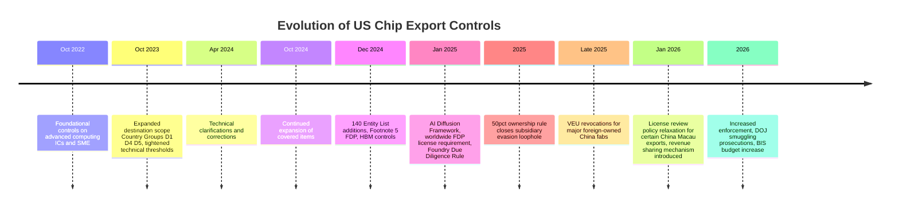

## The Evolution of Chip Export Controls from 2022 to the Present

### Overview and Strategic Framing

Since October 2022, the United States has devoted significant resources to restricting China's access to artificial intelligence (AI) and advanced semiconductor technologies, in what is commonly termed the "chip war." The initial October 7, 2022 controls aimed to limit China's access to high-end semiconductors for AI system training, and each successive rulemaking round has followed a consistent strategic pattern: identify a loophole or gap in prior controls, then issue new rules addressing technical parameters, destination scope, or evasion vectors. This evolution reflects a "Small Yard, High Fence" policy approach — a narrow set of chokepoint technologies subject to maximally strict control, balanced against maintaining broader global supply chain functioning.

**Key Points**

- Coordination with allied chokepoint-technology holders (Netherlands, Taiwan, South Korea, Japan) has been essential to control effectiveness, since unilateral US action alone cannot fully restrict access to items produced or designed by allied-country firms.
- Controls have progressively shifted from *item-classification-based* restriction (which ECCN a chip falls under) toward *structural/ownership-based* restriction (which entities, subsidiaries, and ownership chains are captured), reflecting adaptation to evasion patterns.
- Enforcement capacity and criminal prosecution have become an increasingly prominent complementary track alongside regulatory rulemaking.
- Independent empirical assessment suggests the controls provide meaningful but time-limited delay effects on Chinese AI development, alongside documented and persistent enforcement gaps. [Inference — this synthesis characterization draws on an independent analytical source's framing, not an official US government effectiveness assessment.]

### Chronological Evolution

#### October 2022 — Foundational Controls

BIS implemented controls that significantly expanded licensing requirements and compliance obligations for AI chips and related technologies, particularly concerning China and China-headquartered companies, marking the beginning of the chip war era. These controls applied technical specifications and end-use requirements to restrict advanced semiconductor and semiconductor manufacturing equipment sales to specified Chinese organizations.

#### October 2023 — Closing Loopholes, Expanding Scope

Building on the October 2022 controls, BIS broadened the scope of advanced computing controls to cover additional destinations of concern (Country Groups D:1, D:4, and D:5) not captured by the original 2022 rules, and updated technological parameters governing which chips qualified as controlled. This round specifically addressed the practice of chip designers supplying Chinese customers with slightly lower-performance chips calibrated just below the 2022 control thresholds — chips BIS itself noted provided "nearly comparable AI model training capability" to fully controlled parts. Following the effective date of a key controlling ECCN (3A904) in November 2023, Chinese imports of covered items reportedly dropped by approximately 31.8%, though analysts cautioned it was too early for full assessment given gaps in Harmonized System trade-code data. [Unverified — the specific percentage figure derives from a single aggregating source and was not independently cross-verified against primary trade data in this response.]

#### April 2024 — Clarifications

BIS issued further clarifications and corrections to the October 2023 controls, refining technical parameters without a fundamentally new architectural expansion.

#### October 2024 — Continued Expansion

Additional export control updates continued restricting advanced computing items and semiconductor manufacturing equipment, extending the pattern of incremental tightening established in prior years.

#### December 2, 2024 — Major Dual Rulemaking

BIS released two coordinated rules representing one of the most significant expansions to date: adding 140 companies to the Entity List (with new Footnote 5 designations introducing expanded Foreign Direct Product Rule reach), and restricting new technology areas including high-bandwidth memory (HBM) under ECCN 3A090.c. This rulemaking also modified license review policy for seven SMIC-affiliated Entity List entries, further restricting advanced-node IC development/production at their China-based fabrication facilities.

#### January 2025 — AI Diffusion Framework and Foundry Due Diligence Rule

In the second week of January 2025, Commerce issued two major rules:

- **AI Diffusion Framework** (effective January 13, 2025): Expanded the Advanced Computing Foreign Direct Product Rule to apply to *all* foreign-produced items meeting the rule's product scope, regardless of destination, and imposed a worldwide license requirement on export, reexport, and in-country transfer of covered advanced computing items — a significant scope expansion from destination-specific to globally applicable licensing triggers. Most compliance requirements were delayed until May 15, 2025, with certain VEU-related security requirements and model-weight license exception provisions delayed until January 15, 2026 (later referenced in some sources as January 25, 2026).
- **Foundry Due Diligence Rule**: Imposed new due-diligence obligations on foundries regarding the end-use and end-user status of their customers, addressing the risk that foundries might unknowingly (or knowingly) manufacture restricted chip designs for prohibited parties.

#### 2025 — The "50% Rule" — Structural Compliance Shift

BIS moved toward what enforcement observers term a "structural compliance" model, replacing simple entity-list-screening with rules targeting ownership structures directly: a 2025 rule extended Entity List obligations to unlisted subsidiaries with 50% or greater ownership holding by a listed entity. This closed a significant evasion vector whereby nominally independent front companies, technically unlisted themselves, sourced controlled goods on behalf of already-listed parent or affiliated entities. [Inference — "50% rule" terminology and mechanism as described in an aggregating analytical source; the precise regulatory citation for this specific rule was not independently retrieved in this response and should be verified against the Federal Register before being treated as authoritative.]

#### Late 2025 — VEU Revocation

BIS formally revoked Validated End-User authorizations for major foreign-owned semiconductor fabs operating in China (Intel Semiconductor Dalian, Samsung China Semiconductor, SK hynix Semiconductor China, and — separately confirmed by the company — TSMC Nanjing), effective December 31, 2025, closing what BIS characterized as a "Biden-era loophole." This is covered in full detail as a dedicated topic elsewhere in this syllabus.

#### January 2026 — License Review Policy Relaxation

A Federal Register notice revised BIS's license review policy for exports of certain semiconductors to China and Macau, changing it from a presumption of denial to a case-by-case review — marking a rare instance of policy relaxation within an otherwise near-continuous tightening trajectory, though core structural controls (Entity List presumption-of-denial defaults, FDP rules, VEU restrictions) remained intact.

#### 2026 — Revenue-Sharing Mechanism and Continued Enforcement

A January 2026 Federal Register notice (separately) established a revised license review policy for a specific advanced chip class exported to China, tied to a revenue-sharing mechanism under which approved exporters remit a percentage of China semiconductor revenues to the US government — described as a construct without precedent in EAR history and, as of relevant reporting, subject to legal challenge. Concurrently, enforcement activity intensified: BIS entered a $1.5 million settlement in January 2026 with a European company over unlawful in-country transfer of semiconductor manufacturing items to an Entity-List-designated foundry via its China-based subsidiary, and a December 2025 Department of Justice operation dismantled a smuggling network that had used straw purchasers and intermediary freight forwarders in Singapore and Malaysia (routed through a California-based company) to disguise the true destination of advanced chip shipments to mainland China and Hong Kong between October 2022 and July 2025.

### Mermaid Diagram: Evolution Timeline

*(Note: the above uses a `timeline` diagram type for date-ordered display; if your Mermaid renderer requires strict `flowchart` syntax, treat this as an ordered reference list — the structure is illustrative and the dates are load-bearing, not the diagram type.)*

### Enforcement Capacity Build-Out

Congress approved a 23% increase in BIS's Fiscal Year 2026 budget, with several members of Congress explicitly signaling intent to strengthen the agency's enforcement capacity — reflecting a broader institutional recognition that rulemaking alone, without proportional enforcement resources, leaves significant compliance and diversion gaps. [Unverified — the specific budget percentage and its full legislative context were not independently cross-verified beyond the single citing source in this response.] Separately, a US Government Accountability Office matter (B-337935, decided May 2026) involving BIS reflects ongoing procedural and oversight scrutiny of the agency's rulemaking and enforcement practices. [Unverified — the substantive content and outcome of this GAO matter were not retrieved in this response; only its existence and docket citation were found.]

### Key Structural Shift: From Classification-Based to Structural Compliance

| Era | Primary Control Logic | Representative Mechanism |
| --- | --- | --- |
| **2022–2023** | Item classification (ECCN thresholds) and destination-based licensing | ECCN 3A090 performance-density thresholds; Country Group destination expansion |
| **2024** | Entity-specific extraterritorial reach | Footnote 5 FDP Rule; 140-entity Entity List expansion |
| **Early 2025** | Universal destination-agnostic licensing | AI Diffusion Framework's worldwide FDP license requirement |
| **2025** | Ownership-structure-based reach | 50% subsidiary ownership rule closing front-company evasion |
| **Late 2025–2026** | Authorization-program rollback and calibrated relaxation | VEU revocations; case-by-case review policy shift; revenue-sharing licensing |

### Practical Example: Compounding Compliance Obligations Over Time

A foreign semiconductor equipment supplier attempting to serve a Chinese customer in 2026 must now clear a compliance stack that did not exist in a single form in 2022:

1. **ECCN classification** of the specific equipment (reflecting post-2022/2023/2024 technical parameter updates).
2. **Country Group and destination screening** (reflecting 2023 destination-scope expansion).
3. **Entity List and Footnote 5 screening** of the direct customer (reflecting December 2024 rules).
4. **Ownership-chain screening** to at least 50% holding depth, to catch unlisted subsidiaries of listed parents (reflecting the 2025 structural compliance shift).
5. **VEU status verification** — confirming the customer no longer benefits from a now-revoked blanket authorization it may have relied on previously (reflecting late-2025 VEU revocations).
6. **Worldwide FDP applicability check** regardless of the supplier's own location, since the AI Diffusion Framework's FDP expansion applies without regard to destination for items meeting its product scope.

### Independent Empirical Assessment

A comprehensive empirical analysis characterizes the overall multi-year control regime as "the most ambitious attempt in modern history to throttle a rival nation's access to the compute infrastructure underlying frontier AI development," while finding that the controls provide an estimated one-to-three-year delay on Chinese AI development, alongside severe enforcement gaps — citing an estimate of approximately 140,000 GPUs smuggled in 2024 against comparatively minimal dedicated BIS enforcement personnel. [Unverified — these are figures and conclusions from a single third-party analytical/wiki source rather than an official government assessment; the smuggling estimate and enforcement personnel figures should be treated as contested and unconfirmed pending independent verification.]

**Conclusion**

The evolution of chip export controls from 2022 to the present demonstrates a clear adaptive pattern: each rulemaking round has responded to a specific circumvention vector exposed by the prior round — near-threshold chip variants, third-country transshipment, unlisted subsidiary front companies, and license-free VEU-authorized foreign fabs — with the overall trajectory moving from narrow, item-specific, destination-bound restrictions toward broad, structurally-aware, and increasingly worldwide-applicable controls, tempered by occasional targeted relaxations (such as the January 2026 review-policy easing) that suggest the regime is being actively calibrated rather than uniformly tightened. The consistent throughline across all rounds is the stated goal of protecting control over chokepoint technologies in the global semiconductor supply chain, pursued alongside — but never displacing the need for — parallel investment in enforcement capacity to close the persistent gap between regulatory scope and actual compliance.

**Related Topics**

- ECCN 3A090 technical thresholds and performance-density calculations
- The 50% ownership rule and structural compliance in export control design
- DOJ-BIS joint enforcement operations and chip smuggling prosecution patterns
- The AI Diffusion Framework's worldwide FDP license requirement in depth
- Foundry Due Diligence Rule obligations and foundry-level compliance programs
- Revenue-sharing licensing mechanisms and their legal challenges in the Court of International Trade
- Comparative allied export control alignment (Netherlands, Japan, South Korea, Taiwan)
- BIS enforcement budget growth and institutional capacity constraints