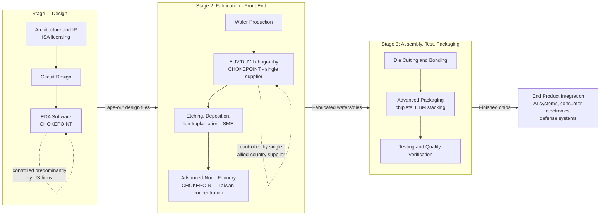

## The Semiconductor Supply Chain: Design, Fabrication, and Packaging

### Overview: A Globally Distributed, Chokepoint-Dense Industry

The semiconductor supply chain is among the most geographically specialized and interdependent industrial value chains in existence — no single country possesses end-to-end capability at the technological frontier. This extreme specialization is precisely what makes semiconductors central to supply chain geopolitics: control over a narrow set of chokepoint technologies at specific stages (design tools, lithography equipment, advanced fabrication, and select materials) confers outsized geopolitical leverage independent of overall manufacturing volume.

**Key Points**

- The chain divides into three broad stages — design, fabrication (front-end), and assembly/test/packaging (back-end) — each with distinct geographic concentration patterns and distinct chokepoints.
- The "fabless-foundry" business model, in which design and fabrication are performed by separate specialized firms, is the dominant industry structure for leading-edge logic chips and is itself a geopolitical vulnerability, since it decouples chip *design* (often US-based) from chip *fabrication* (concentrated in a small number of East Asian foundries).
- Export control regimes (covered elsewhere in this syllabus) target specific stages differently: design-stage controls focus on Electronic Design Automation (EDA) software; fabrication-stage controls focus on semiconductor manufacturing equipment (SME); packaging-stage controls are comparatively less mature but increasingly scrutinized as an evasion vector.

### Stage 1: Design

#### Core Activities

Chip design translates a functional specification into a physical layout (a "tape-out") ready for fabrication. This stage is itself layered:

- **Architecture/IP design**: Defining instruction set architectures (e.g., x86, ARM, RISC-V) and licensable intellectual property blocks.
- **Circuit design**: Translating architecture into transistor-level circuits.
- **Physical design and verification**: Using Electronic Design Automation (EDA) software to place, route, and verify the design against manufacturing rules for a specific fabrication process node.

#### Key Chokepoint: EDA Software

A small number of firms — dominated by US-headquartered companies — control the EDA tools required to design chips at advanced process nodes. Because virtually all globally competitive chip design activity depends on these tools, EDA software functions as one of the most effective chokepoints in the entire export control architecture: restricting EDA license access to a jurisdiction can constrain that jurisdiction's chip design capability even without restricting any physical hardware.

#### Fabless Model

Many of the world's most prominent chip companies (design-focused firms without their own fabrication facilities) design chips but outsource fabrication entirely to specialized foundries. This model allows design firms to focus capital on R&D rather than the enormous capital expenditure required for leading-edge fabs, but it means design-stage geographic concentration (heavily US-weighted for advanced logic) and fabrication-stage geographic concentration (heavily concentrated in East Asia) are structurally decoupled — a fact with direct implications for supply chain risk, since a single point of geopolitical disruption at the fabrication stage can halt output regardless of design-stage capability.

### Stage 2: Fabrication (Front-End)

#### Core Activities

Fabrication ("fab") is the capital- and technology-intensive process of physically manufacturing chips on silicon wafers through hundreds of sequential steps: photolithography, etching, deposition, ion implantation, and metrology, repeated across dozens of layers to build up transistor structures at nanometer-scale precision.

#### Key Chokepoint: Extreme Ultraviolet (EUV) Lithography

The most advanced process nodes (used for leading-edge logic chips, including AI accelerators) require EUV lithography machines, produced by a single company headquartered in the Netherlands. This represents perhaps the single most concentrated chokepoint in the entire semiconductor value chain — a monopoly on the equipment required to manufacture the most advanced chips in the world, making export licensing decisions by that country's government (often made in close coordination with US policy objectives) a direct determinant of which countries can access leading-edge fabrication capability.

#### Key Chokepoint: Advanced-Node Foundry Capacity

Leading-edge logic fabrication (the most advanced process nodes) is concentrated in a small number of foundries, with the single largest share of global advanced-node capacity located in Taiwan. This concentration is the structural basis for characterizing Taiwan's geopolitical status as inseparable from global semiconductor supply security — any disruption to Taiwan-based fabrication would have immediate, severe, and largely non-substitutable global effects on advanced chip supply, since alternative advanced-node capacity elsewhere (including in the US, under construction via CHIPS Act-supported investment) remains a smaller share of total global capacity and generally trails at the frontier process node.

#### Semiconductor Manufacturing Equipment (SME) Beyond Lithography

Fabrication also depends on deposition, etching, ion implantation, cleaning, and metrology equipment produced by a concentrated set of specialized equipment manufacturers (predominantly US, Japanese, and Dutch firms). This is precisely the equipment category targeted by ECCNs such as 3B001, 3B002, 3B993, and 3B994 in the export control regime, and it is the equipment lineage that triggers Foreign Direct Product Rule jurisdiction over foreign-built fabs (as covered in the FDP Rule topic).

### Stage 3: Assembly, Test, and Packaging (Back-End / OSAT)

#### Core Activities

After fabrication, individual chips ("dies") cut from a wafer must be assembled into a usable package, connected to external circuitry, and tested for functionality and performance. This stage — often performed by dedicated Outsourced Semiconductor Assembly and Test (OSAT) providers — has historically received less geopolitical attention than design or fabrication, but its strategic importance has grown substantially with the rise of advanced packaging techniques.

#### Rising Strategic Importance: Advanced Packaging

For cutting-edge AI accelerators, "advanced packaging" techniques (which integrate multiple chiplets, high-bandwidth memory stacks, and interposers into a single package) have become as performance-critical as the underlying process node itself. This has two direct geopolitical consequences:

- High-bandwidth memory (HBM), a key advanced-packaging input, has itself become a directly controlled item (ECCN 3A090.c), reflecting recognition that packaging-stage components can be as strategically significant as front-end fabrication.
- Packaging-stage geographic concentration (historically more diversified than front-end fabrication, with significant capacity in mainland China, Taiwan, and Southeast Asia) creates a potential evasion vector: a chip fabricated at a controlled advanced-node foundry could, in principle, be shipped for packaging in a jurisdiction with less stringent end-use controls, complicating end-to-end supply chain traceability. [Inference — this evasion-vector characterization is a structural/logical inference about packaging-stage risk rather than a documented, specific enforcement case cited in this response.]

### Mermaid Diagram: Semiconductor Supply Chain Stages and Chokepoints

### Export Control Mapping by Stage

| Supply Chain Stage | Primary Chokepoint | Control Mechanism | Geographic Concentration |
| --- | --- | --- | --- |
| **Design** | EDA software | Software export licensing, entity screening | Predominantly US-headquartered firms |
| **Design** | Chip architecture/IP | IP licensing terms, technology transfer restrictions | Mixed (US, UK-originated ISAs) |
| **Fabrication** | EUV lithography | Dutch export licensing (coordinated with US policy) | Single-country monopoly supplier |
| **Fabrication** | SME (etch, deposition, etc.) | ECCNs 3B001/3B002/3B993/3B994; FDP Rule reach | US, Japan, Netherlands concentration |
| **Fabrication** | Advanced-node foundry capacity | Entity List, VEU authorization/revocation, Footnote 5 FDP | Heavily concentrated in Taiwan |
| **Packaging** | High-bandwidth memory (HBM) | ECCN 3A090.c | Concentrated among a few memory manufacturers (South Korea-heavy) |
| **Packaging** | OSAT/advanced packaging capacity | Less mature control regime; growing scrutiny | More geographically diversified than fabrication |

### Practical Example: Tracing a Single AI Accelerator Chip

Consider the full supply chain journey of a single advanced AI accelerator chip, illustrating how control points stack across stages:

1. **Design**: A fabless design firm uses EDA software (licensed from a controlled-technology provider) to design the chip, incorporating licensed architectural IP.
2. **Fabrication**: The design is sent to an advanced-node foundry (predominantly Taiwan-concentrated for leading-edge nodes), which uses EUV lithography equipment (single-supplier chokepoint) and various SME (subject to ECCN classification and potential FDP Rule reach) to fabricate the wafer.
3. **Memory Integration**: High-bandwidth memory stacks (a separately controlled item under ECCN 3A090.c) are sourced from a specialized memory manufacturer for integration into the final package.
4. **Packaging**: The fabricated die and HBM stack are sent to an OSAT provider for advanced packaging (chiplet integration, interposer bonding) and final testing.
5. **End-use screening**: At each handoff point — from foundry to packaging house, from packaging house to system integrator — export control compliance obligations under the Entity List, FDP Rule, and end-use/end-user controls must be independently assessed, since a chip's controlled status travels with it through every stage rather than being determined once at initial fabrication.

### Why This Structure Drives Geopolitical Strategy

The extreme concentration of chokepoint technologies at specific stages (EDA software in design; EUV lithography and advanced-node foundry capacity in fabrication) explains why export control strategy has focused disproportionately on these narrow points rather than attempting comprehensive control over the entire, much more diversified packaging and assembly ecosystem. This is the practical expression of the "Small Yard, High Fence" doctrine: rather than attempting to control the sprawling global electronics supply chain in its entirety, policy focuses maximal restriction on a small number of stages where genuine chokepoints exist and effective control is achievable, while leaving more diversified stages (like standard packaging and assembly) comparatively less restricted. [Inference — this is an analytical synthesis connecting the supply chain's technical structure to the "Small Yard, High Fence" policy doctrine described in export control literature; it is not a direct quotation of official policy reasoning.]

**Conclusion**

The semiconductor supply chain's division into design, fabrication, and packaging stages is not merely a technical or organizational distinction — it is the structural map on which the entire US-China chip war has been fought. Because genuine chokepoints (EDA software, EUV lithography, advanced-node foundry capacity) are concentrated at only a few points in this otherwise globally distributed chain, export control policy has been able to achieve outsized geopolitical leverage by targeting those specific nodes rather than attempting comprehensive supply chain control. At the same time, the rising strategic importance of advanced packaging — evidenced by HBM's elevation to a directly controlled item — suggests the boundaries of what counts as a "chokepoint stage" continue to expand as the technology and the surrounding control regime co-evolve.

**Related Topics**

- EUV lithography technology and single-supplier market structure
- The fabless-foundry business model and its geopolitical risk implications
- Advanced packaging techniques (chiplets, interposers, 3D stacking) and emerging control scrutiny
- Taiwan's advanced-node foundry concentration and Taiwan Strait contingency risk
- High-bandwidth memory (HBM) as a newly controlled strategic item
- EDA software export licensing and design-stage chokepoint dynamics
- OSAT industry geography and packaging-stage supply chain traceability challenges
- CHIPS Act-supported domestic fabrication capacity and its position relative to frontier nodes