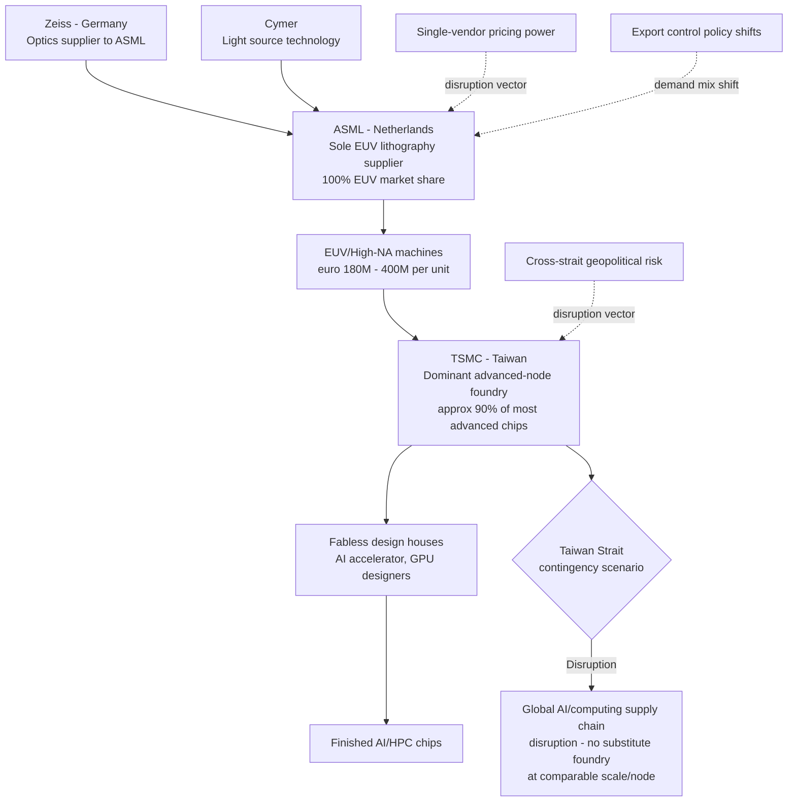

## TSMC, ASML, and Single Points of Failure in Chip Production

### Overview: The Two Chokepoints of the AI Era

Taiwan Semiconductor Manufacturing Company (TSMC) and ASML Holding represent the two most concentrated, least substitutable chokepoints in the global semiconductor supply chain. Their relationship — TSMC as ASML's largest customer, ASML as TSMC's sole viable supplier of the equipment needed for advanced-node production — creates a mutually reinforcing duopoly-of-necessity that most of the modern computing and AI industry depends on. Analysts describe these as "the widest monopolistic plays in the semi space," noting that most of the industry's value chain effectively routes through these two firms: the industry needs ASML's EUV lithography machines or manufacturing comes to a standstill, and it separately needs TSMC's manufacturing expertise to produce the most advanced chips at the bleeding edge.

**Key Points**

- ASML is the world's sole supplier of Extreme Ultraviolet (EUV) lithography machines and holds an estimated 100% share of EUV and roughly 94% share of overall lithography equipment — the machines required to print every advanced semiconductor.
- TSMC is not technically classified as a monopoly but functions as a "pseudo-monopoly" due to its scale, position, and influence: it is the only company in the world with the foundry capacity to produce the chips needed to power the AI build-out, reportedly producing around 90% of the world's most advanced chips.
- These two firms exist in a mutual dependency: TSMC alone accounts for an estimated 40% of ASML's EUV deliveries (with some sources citing figures as high as ~80% of EUV sales specifically), while TSMC simultaneously cannot produce leading-edge chips without ASML's tools.
- Both companies are geographically singular in ways that create acute geopolitical risk: TSMC's advanced-node production is concentrated in Taiwan; ASML's most critical manufacturing and R&D is concentrated in the Netherlands.

### ASML: The EUV Single Point of Failure

#### Technical Basis of the Monopoly

EUV lithography is not a competitive market — it is a single-vendor market, and ASML is that vendor. The technology requires a 13.5-nanometer light source, mirrors polished to atomic flatness, and a supply chain ASML spent two decades and over $9 billion building in partnership with optics manufacturer Zeiss and light-source specialist Cymer. Rival lithography manufacturers Nikon and Canon publicly abandoned EUV development years ago, leaving no credible competitor at the leading edge. Customers pay ASML's prices because there is no substitute below the 7nm process node.

#### Pricing Power and Its Recent Assertion

ASML's monopoly position has translated into increasingly overt pricing power. Each Low-NA EUV system sells for roughly €180 million, while new High-NA (High Numerical Aperture) tools — the next generation, enabling 2nm and smaller process nodes — clear approximately €350–400 million each. Notably, even TSMC — ASML's largest customer — has publicly complained about ASML's EUV pricing, an unusual public airing of commercial friction between two firms that normally avoid public disputes; commentary on this dynamic suggests ASML only "fully realized" the extent of its absolute monopoly power relatively recently and is now learning to wield the pricing leverage that comes with it. Crucially, ASML's monopoly extends beyond the newest High-NA tools: it is also the sole-source supplier of Low-NA EUV and the dominant supplier of advanced DUV (Deep Ultraviolet) immersion lithography, meaning Nikon and Canon's continued presence in the broader DUV market is largely irrelevant at the leading edge of immersion lithography specifically.

#### Financial Scale and Customer Concentration

ASML's 2024 revenue was approximately $30 billion, with EUV machines accounting for 60–70% of revenue despite representing only about 10% of unit sales — reflecting the machines' extraordinary per-unit price. By 2026, ASML's year-end 2025 backlog stood at €38.8 billion, with Q4 2025 net bookings of €13.2 billion including €7.4 billion specifically in EUV orders; Q1 2026 net sales reached €8.8 billion at a 53% gross margin, and the company has guided toward €44–60 billion in 2030 revenue. ASML's customer base is narrow: its top two customers reportedly account for approximately 38% of revenue, and only three companies worldwide currently manufacture cutting-edge chips requiring EUV — TSMC, Samsung, and Intel — with TSMC representing the largest share of EUV purchases among them.

#### China Exposure and Export Control Interaction

ASML's exposure to export-control-driven demand shifts is direct and quantifiable: China represented approximately 33% of ASML's 2025 sales, a share export restrictions are projected to cut to roughly 20% in 2026. Lost DUV revenue to China is reportedly being replaced by higher-margin EUV demand from AI customers in Taiwan, Korea, and the US, meaning the unit economics of the export-control-driven customer mix shift may actually improve ASML's margins even as absolute China revenue declines. [Unverified — this net-margin-benefit characterization is a market analyst's forward interpretation, not a confirmed financial outcome.]

#### Alternative Technology Assessment

Several potential EUV-competing technologies exist but are not considered near-term threats to ASML's position:

- **Directed Self-Assembly (DSA)**: Uses chemical processes for nanoscale patterning; promising for certain applications but cannot replace EUV for complex chip designs.
- **Nanoimprint Lithography**: Stamps patterns onto wafers; works for some applications but lacks flexibility for frequent design changes.
- **Multi-Beam E-Beam Lithography**: Uses electron beams to avoid wavelength limitations; currently too slow for mass production, though improving.

  None of these technologies is expected to challenge EUV within the next five to ten years for high-volume advanced chip manufacturing. [Unverified — a forward-looking technology forecast from a single analytical source, inherently uncertain.]

### TSMC: The Foundry Single Point of Failure

#### Market Position

TSMC operates as the world's largest contract chipmaker and, on the high end of the market for the most advanced process nodes, dominates absolutely. TSMC anticipates its revenue from AI data center chip sales will grow at a mid-to-high 50% compound annual growth rate through 2029, and the company plans to allocate 70–80% of its 2026 capital expenditure toward advanced process technologies — reflecting both extraordinary demand and TSMC's own concentration of investment at the leading edge rather than diversification across process generations.

#### Geographic Singularity

TSMC's advanced-node manufacturing capability is overwhelmingly concentrated within Taiwan, a fact widely discussed in the semiconductor risk literature as the single highest-impact potential supply chain disruption scenario given cross-strait tensions. Odds are that the latest and most capable AI chips have come from a TSMC manufacturing facility fully equipped with ASML's lithography machines — illustrating how the TSMC and ASML chokepoints are not independent risks but a compounded, serially-dependent single point of failure: a disruption to either firm's operations propagates directly to the other's output and, from there, to the entire downstream AI and computing industry.

#### Financial Performance Context

Both TSMC and ASML have performed strongly through 2026, with TSMC shares rising around 35% and ASML rising nearly 60% over the period. This valuation divergence reflects differing market interpretations: TSMC trades at a more moderate valuation (reported around 25 times forward earnings) reflecting steady, high growth, while ASML trades at a substantially higher premium (reported around 40 times forward earnings) reflecting the market's pricing of its technological monopoly position specifically, even though TSMC has grown revenue faster than ASML in nearly every recent quarter.

### Mermaid Diagram: The Compounded Single-Point-of-Failure Chain

### The Illusion of Geographic Diversification — ASML's Own Global Dependency

A critical nuance often overlooked in "Netherlands controls EUV" framing is that ASML's own manufacturing is itself globally distributed and dependent on further chokepoints: ASML draws on a network of thousands of suppliers across dozens of countries, with its optics sourced from Germany's Zeiss and critical precision components sourced from suppliers in the United States, Japan, and Taiwan. This means European "strategic control" over EUV technology is more limited than headline market-share figures suggest — ASML's CEO has publicly noted that less than one percent of the company's more than €32 billion in 2025 revenue came from the European region itself, with sales concentrated almost entirely in Asia and the United States, Taiwan's TSMC being ASML's largest customer. This has led analysts to argue explicitly that ASML's semiconductor monopoly does not translate into genuine European strategic control over the technology or its deployment, since the commercial and strategic center of gravity sits with the Asian and US customer base rather than with the nominal country of headquarters. [Inference — the specific policy conclusion "doesn't give Europe strategic control" reflects one analytical source's argument, presented here as that source's thesis rather than an uncontested consensus.]

### Comparative Table: TSMC vs. ASML as Single Points of Failure

| Dimension | TSMC | ASML |
| --- | --- | --- |
| **Nature of chokepoint** | Manufacturing capacity and process know-how | Equipment technology and IP |
| **Substitutability** | Effectively none at leading-edge nodes within the medium term | None below 7nm; alternative lithography technologies 5-10+ years from viability |
| **Geographic concentration risk** | Taiwan (cross-strait geopolitical exposure) | Netherlands (headquarters/core R&D), though supply chain itself globally distributed |
| **Customer/supplier concentration** | Serves essentially all major fabless AI chip designers | Top 2 customers ~38% of revenue; ~3 companies worldwide can use EUV at all |
| **Pricing power trend** | Growing, but historically more customer-accommodating | Increasingly asserted; public friction with even its largest customer (TSMC) |
| **Policy exposure** | US CHIPS Act incentives for overseas fab construction; export control target as end-producer | Direct export control subject (Netherlands government restrictions on China sales) |
| **China revenue exposure (2025-2026)** | Lower direct exposure at advanced nodes due to existing controls | ~33% of 2025 sales from China, falling to ~20% in 2026 due to export restrictions |

### Practical Example: Cascading Disruption Scenario

Consider a hypothetical disruption to Taiwan's semiconductor manufacturing capacity (whether from natural disaster, infrastructure failure, or geopolitical contingency):

1. **Immediate effect**: TSMC's advanced-node output — representing the large majority of the world's most advanced chip production — would be interrupted or destroyed.
2. **Compounding effect on ASML**: Even if ASML's Netherlands-based operations remained fully intact, its largest customer relationship (accounting for a substantial share of EUV deliveries) would be disrupted, affecting ASML's revenue and utilization of its own installed base.
3. **No adequate substitute foundry**: Samsung and Intel, the only other EUV-capable foundries, lack sufficient combined capacity to absorb TSMC's lost advanced-node output in the near term, given the multi-year lead times required to build and qualify new advanced fabrication capacity.
4. **Downstream effect**: Every fabless AI chip designer dependent on TSMC's advanced nodes would face supply disruption with no comparable-scale alternative, illustrating why this compounded TSMC-ASML dependency is treated as the most severe single point of failure in the global technology supply chain. [Inference — this is an illustrative disruption-propagation scenario constructed from the concentration facts above, not a report of an actual disruption event.]

**Conclusion**

TSMC and ASML together represent a compounded, serially-linked single point of failure for the global advanced semiconductor supply chain: ASML's essentially unchallenged EUV monopoly determines who *can* manufacture leading-edge chips at all, while TSMC's dominant advanced-node foundry capacity determines who actually *does*. Because these two chokepoints are mutually dependent rather than independent — TSMC needs ASML's machines, and ASML's most significant customer relationship and revenue mix depend heavily on TSMC's continued capacity expansion — a disruption to either firm propagates directly through the other and into the downstream global AI and computing industry, with no credible alternative technology or comparable-scale foundry capacity available within the current decade to absorb such a shock.

**Related Topics**

- High-NA EUV adoption timeline and its implications for 2nm-and-below production
- Taiwan Strait contingency planning and semiconductor supply chain risk modeling
- ASML's global supplier network (Zeiss, Cymer) and distributed dependency risk
- CHIPS Act-incentivized fab diversification (TSMC Arizona, Samsung Texas, Intel Ohio)
- Alternative lithography technologies: DSA, nanoimprint, and multi-beam e-beam
- Dutch and Japanese export control alignment on lithography equipment sales to China
- SMIC and China's indigenous EUV development efforts and their limitations
- Customer concentration risk in semiconductor equipment supply chains