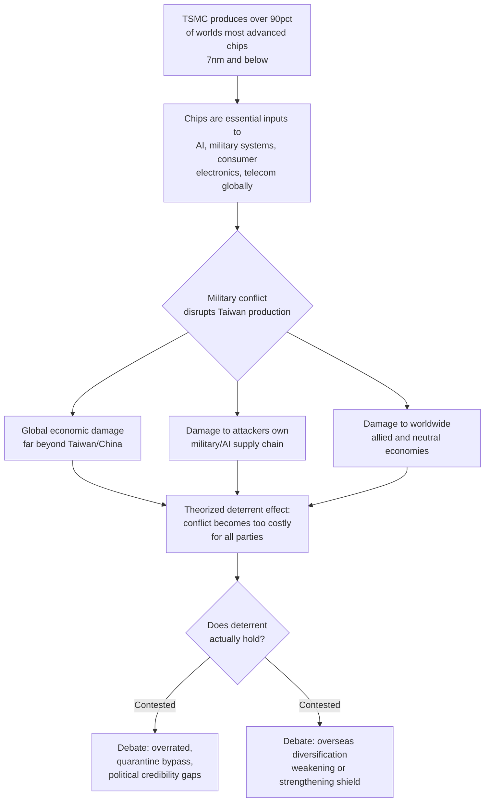

## The Taiwan Factor and the Silicon Shield Concept

### Definition and Origin

The "Silicon Shield" is the principle in geopolitical relations regarding Chinese unification holding that Taiwan's semiconductor industry is important enough to global economic prosperity that it would deter an attempt by China to seize Taiwan by force — and, if not, would induce foreign powers, particularly the United States, to defend Taiwan in order to preserve the stability of the semiconductor supply chain. The term dates to 2000, when American technology commentator Craig Addison published an op-ed in the International Herald Tribune titled "A 'Silicon Shield' Protects Taiwan from China," a framing that later became a prominent shorthand for explaining Taiwan's strategic importance to the global semiconductor industry.

**Key Points**

- The core logic: over 90% of the world's most advanced chips (7nm and below) are produced by TSMC, meaning any military action against Taiwan would devastate the global semiconductor supply chain, inflicting unacceptable damage on the attacker's own economy and military capabilities as well as the wider world's.
- The concept is a form of *structural deterrence* created by technological concentration, distinct from traditional military deterrence — it relies on economic interdependence rather than force posture.
- The Silicon Shield is widely debated as a double-edged sword: its deterrent value depends entirely on Taiwan's manufacturing capability remaining genuinely irreplaceable, and that premise is increasingly contested from multiple directions simultaneously.
- Significant disagreement exists over whether the Silicon Shield is a Taiwanese-originated strategic narrative, an actual driver of US policy, or an overrated concept whose real deterrent power is far more limited than popularly assumed.

### Core Mechanics of the Shield Logic

The Silicon Shield concept rests on a chain of reasoning:

1. Taiwan (specifically TSMC) possesses effectively irreplaceable capacity for producing the world's most advanced logic chips.
2. These chips are essential inputs for artificial intelligence accelerators, smartphones, cloud servers, telecommunications equipment, vehicles, and advanced weapons systems — including, per Center for Strategic and International Studies research, chips used in F-35 fighter aircraft, secure communications networks, and other military systems via field-programmable gate arrays and related components.
3. A conflict that disabled Taiwan's semiconductor production would therefore inflict catastrophic, near-universal economic and military-supply damage — not just on Taiwan and China, but on the global economy broadly, including the attacking party's own economy and military capability.
4. This shared catastrophic-cost exposure is theorized to raise the cost of conflict for all parties, functioning as a deterrent independent of, and additional to, conventional military deterrence.

### Mermaid Diagram: The Silicon Shield Causal Logic

### The Contested Effectiveness Debate

#### Argument: The Shield Is Overrated

A prominent critique holds that the Silicon Shield is overrated for two structural reasons. First, China could "quarantine" Taiwan using coast guard assets and customs inspections of every ship leaving Taiwanese ports, choking the island's economy without ever physically touching a fabrication facility — the chips would still be manufactured, they simply could not leave unless China permitted it, sidestepping the "destroy the shield" framing entirely. Second, the US plan to weaponize the Silicon Shield defensively in a crisis — using export controls or the Foreign Direct Product Rule to deny China access to TSMC chips — faces serious enforcement problems, since chips are small, valuable, and routinely transshipped through third countries such as Malaysia, and the whole strategy requires sustained buy-in from European and Japanese firms whose balance sheets depend on continued China sales. This analysis concludes the Silicon Shield is part of the deterrent equation but not a substitute for one, with the honest assessment being that nobody actually knows how it would play out in a real crisis.

#### Argument: The Shield Has Never Been Stronger

A contrasting technical assessment argues the deterrent remains robust precisely because advanced semiconductor capacity cannot be reproduced quickly: a leading-edge fab costs tens of billions of dollars and requires highly specialized extreme-ultraviolet lithography, ultrapure chemicals, stable electricity and water supply, precision metrology, and a dense network of engineers and suppliers — physical equipment alone is insufficient. This framing points to continued technological racing at the frontier (e.g., competing process node development timelines targeting tape-out in Q1 2027 with high-volume manufacturing in 2028) as evidence that the underlying technical moat remains intact and difficult to replicate even with sustained investment from rival firms and nations.

#### Argument: The Shield's Premise Is a Double-Edged Sword

A more structurally cautious framing observes that the Silicon Shield's strategic value rests on a single premise — that Taiwan's semiconductor manufacturing capability is irreplaceable — and that the moment that premise is shaken, whether because other countries establish alternative capacity, a fundamental technological paradigm shift occurs, or Taiwan's own technological edge erodes, the deterrent effect will be severely diminished. This has led to calls for Taiwan to redefine the concept from "irreplaceable capacity" (a purely defensive, manufacturing-concentration-based framing) toward "irreplaceable ecosystem" — encompassing not just wafer foundry services but a complete system including advanced packaging, IC design services, silicon IP licensing, and semiconductor equipment maintenance, since TSMC's competitive advantage stems not only from its EUV tools but from a cluster of hundreds of suppliers, specialty chemical producers, and precision engineering firms that would be far harder for any rival to replicate wholesale.

#### Argument: The Concept Was Always a Taiwanese, Not American, Framing

A distinct critique argues the Silicon Shield concept was largely a Taiwanese interpretation of risk rather than an American one: for Taiwan, the logic was intuitive — if the world depends on Taiwan's chips, the world will protect Taiwan, making semiconductor manufacturing a high-tech insurance policy. From the US perspective, by contrast, the core issue has never been how to protect Taiwan *because of* chips, but how to ensure US access to chips *regardless of* what happens to Taiwan — a fundamentally different risk calculation in which semiconductors are treated as a strategic dependency to be managed, diversified, and partially localized, not as a magical deterrent capable of preventing conflict. Under this reading, US encouragement of TSMC capacity expansion within the United States is not about reinforcing a shield around Taiwan at all, but about reducing American vulnerability independent of Taiwan's fate — and if conflict were ever to disrupt East Asian production, Washington's goal would be ensuring at least some advanced manufacturing capacity already exists domestically. This framing further argues that turning TSMC into a symbolic geopolitical shield conflicts with the company's natural commercial orientation as a trusted, neutral manufacturing partner — described as a kind of "Switzerland of advanced logic fabrication" — a role no enterprise would voluntarily choose for itself.

#### Argument: Destruction as the Ultimate Deterrent

A more extreme variant of the debate considers whether, if leaders conclude the semiconductor system cannot survive a Chinese seizure attempt intact, deterrence may increasingly depend not on protection but on denial through total destruction — under which Taiwan's semiconductor industry would be rendered permanently non-functional rather than captured intact, removing any incentive for invasion premised on acquiring the technology. This framing notes that the traditional Silicon Shield assumption increasingly depends on political credibility that may no longer exist, given evolving indications about the depth of US commitment. [Unverified — this "destruction as deterrent" framing is one commentator's strategic analysis and does not reflect confirmed government policy in either Taiwan or the United States.]

### The Overseas Diversification Question

A central live tension in the 2026 discourse concerns whether TSMC's overseas expansion — particularly its US investments — weakens or strengthens the Silicon Shield:

**The "weakening" concern**: If more advanced chips can eventually be produced elsewhere (notably in Arizona), the world would become less dependent on Taiwan specifically, theoretically eroding the deterrent value of Taiwan's concentration. This concern intensified following convergence of a US-Taiwan trade arrangement lowering tariffs to 15 percent alongside TSMC's headline pledge to invest up to $165 billion in the United States.

**The "strengthening" counter-argument**: Rather than weakening the shield, deepening integration of Taiwanese production into US production lines and the broader US economy may give the United States *more* reasons to avoid any disruption to that integrated system — reframing the shield not as "Taiwan alone matters" but as "the integrated US-Taiwan production system matters," which arguably broadens rather than narrows the coalition with a stake in Taiwan's stability.

**The structural limits on relocation**: Overseas expansion does not automatically reproduce the dense semiconductor ecosystem Taiwan has developed over decades — it may reduce some dependence on production physically located in Taiwan, but advanced chipmaking depends on dense clusters of engineers, suppliers, equipment specialists, power infrastructure, water access, and years of accumulated manufacturing knowledge that cannot be quickly relocated. Notably, TSMC has explicitly stated that its main research, development, and manufacturing capabilities will remain concentrated in Taiwan even as overseas fabs expand — meaning the "brain" of the operation, as distinct from incremental manufacturing capacity, is not part of the diversification. Academic global-value-chain analysis frames this as a duality: Taiwan's structural centrality in semiconductor GVCs confers both leverage and vulnerability simultaneously — strengthening Taiwan's bargaining position with dependent major powers, while also exposing the island to systemic shocks (export controls, tariffs, natural disasters, military crises) that can ripple through global production networks, which is precisely what underpins the contemporary debate over whether the Silicon Shield enhances deterrence or instead heightens incentives for a rival power to act before the shield potentially erodes further. [Inference — the specific framing of "heightens incentives to act before erosion" reflects the academic source's characterization of the debate's structure, not a definitive prediction of any actor's behavior.]

### Practical Example: The Quarantine Scenario as Shield Bypass

A frequently cited scenario illustrating the Silicon Shield's practical limits: rather than a full invasion or destructive strike (which would trigger the shield's core deterrent logic), a blockade or "quarantine" using coast guard vessels and customs inspection authority could interrupt Taiwan's chip *exports* without damaging any fabrication facility. Under this scenario:

1. TSMC's fabs remain physically intact and continue producing chips.
2. Global buyers cannot receive those chips because outbound shipping is interdicted at the point of departure.
3. The Silicon Shield's core premise — that destroying manufacturing capacity would be mutually catastrophic — is never actually tested, since no manufacturing capacity is destroyed.
4. This creates a strategic gray zone in which economic pressure can be applied to Taiwan without triggering the specific catastrophic-damage scenario the Silicon Shield concept is designed to deter.

**Conclusion**

The Silicon Shield remains one of the most contested concepts in contemporary supply chain geopolitics precisely because it sits at the intersection of economics, deterrence theory, and unresolved strategic ambiguity. Its core empirical premise — that Taiwan's semiconductor dominance is genuinely irreplaceable in any meaningful timeframe — appears to remain robust on purely technical grounds given the extraordinary capital, expertise, and ecosystem requirements of leading-edge fabrication. However, whether that technical irreplaceability actually translates into effective deterrence against the full spectrum of coercive options available to a determined adversary (ranging from full invasion to blockade/quarantine strategies that bypass the shield's core logic entirely) remains genuinely disputed among serious analysts, with reasonable arguments supporting readings ranging from "the shield has never been stronger" to "the shield is overrated and nobody actually knows if it would hold." The overseas-diversification debate adds a further layer of strategic uncertainty, since it is contested whether TSMC's expansion into the United States dilutes Taiwan's unique leverage or instead deepens a broader coalition of stakeholders with a vested interest in the island's stability. [Inference — this concluding synthesis integrates multiple distinct and partially conflicting analytical positions found in the source material; it does not represent a single authoritative resolution of the debate, which remains genuinely open among cited experts.]

**Related Topics**

- TSMC's Arizona expansion and its strategic rationale from a US risk-reduction perspective
- Cross-strait quarantine and blockade scenarios as alternatives to full invasion
- The "irreplaceable ecosystem" reframing: advanced packaging, IP licensing, and equipment maintenance as shield components
- Weaponized interdependence theory and its application to semiconductor supply chains
- CSIS research on Taiwan's integration into US defense supply chains
- Chip transshipment and third-country evasion of export controls (Malaysia case)
- Process node competition timelines (TSMC A14, Intel 14A) and technological leadership races
- US-Taiwan trade arrangements and their interaction with semiconductor supply chain policy