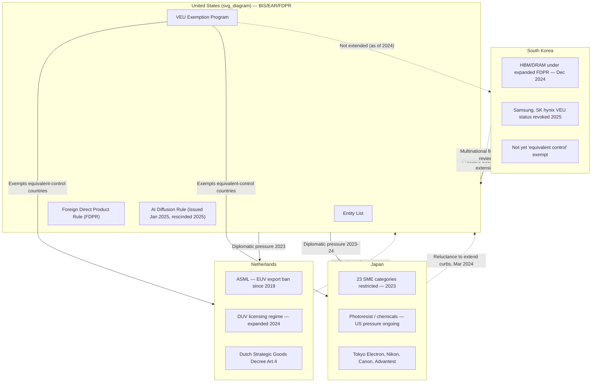

## Allied coordination among the Netherlands, Japan, and South Korea

### Strategic Rationale

Coordination with allies such as the Netherlands, South Korea, and Japan is treated by the United States as critical to ensuring a comprehensive blockade on Chinese access to advanced semiconductor technology. Unilateral U.S. controls alone are structurally insufficient because critical nodes of the semiconductor supply chain sit outside U.S. jurisdiction: Dutch lithography, Japanese lithography/materials/equipment, and Korean advanced memory. Without allied alignment, China could simply source restricted capabilities from non-U.S. suppliers — the "leakage" problem that has shaped U.S. diplomacy on this issue since 2022. [Effective Altruism Forum](https://forum.effectivealtruism.org/posts/C9fGQBGZmdTS3Gik6/explaining-all-the-us-semiconductor-export-controls)

**Key Points**

- Allied coordination exists because U.S. export control authority under the Export Administration Regulations (EAR) is jurisdictional, not global — it directly binds only items of U.S. origin, U.S. persons, or items with sufficient U.S.-content/FDPR (Foreign Direct Product Rule) nexus.
- The Netherlands (ASML), Japan (Tokyo Electron, Nikon, Canon, JSR, Shin-Etsu), and South Korea (Samsung, SK hynix) each control a segment of the supply chain the U.S. cannot replicate domestically in the near term.
- The willingness of the U.S. to accept diplomatic costs — including business losses for allied firms — reflects a policy view that AI/advanced-compute competition is a central axis of great-power rivalry. [Effective Altruism Forum](https://forum.effectivealtruism.org/posts/C9fGQBGZmdTS3Gik6/explaining-all-the-us-semiconductor-export-controls)

### Historical Timeline

**October 2022** — U.S. Commerce Department's Bureau of Industry and Security (BIS) issues unilateral controls on advanced computing chips and semiconductor manufacturing equipment (SME) to China, explicitly designed as a placeholder pending allied buy-in.

**January 2023** — The Netherlands and Japan agree with the United States to impose controls on the export of certain semiconductors and related products to China, following a diplomatic push by the Biden administration to ensure the effectiveness of the October 2022 U.S. controls. [A&O Shearman](https://www.aoshearman.com/en/insights/the-netherlands-joins-the-us-in-restricting-semiconductor-exports-to-china)

**March 2023** — The Dutch government publishes implementation details of the new restrictions; Trade Minister Liesje Schreinemacher outlines the measures to the Dutch Parliament on 8 March 2023, requiring Dutch companies to obtain licenses to export certain technologies and products outside the EU. By March 2023, both the Dutch and Japanese governments had announced new SME controls. [A&O Shearman](https://www.aoshearman.com/en/insights/the-netherlands-joins-the-us-in-restricting-semiconductor-exports-to-china)[Law as Science](https://www.lawasscience.org/ai-and-infrastructure/ai-chips-under-siege)

**2023 (Japan)** — After pressure from Washington, Japan restricted exports of 23 types of chip-making equipment in 2023, without explicitly naming China as the target. [Pamir Consulting](https://pamirllc.com/blog/us-government-pushes-to-extend-chip-making-export-bans)

**Early 2024** — The U.S. presses South Korea to adopt restrictions on semiconductor technology exports to China similar to those Washington had implemented, targeting equipment and technologies for high-end logic (sub-14nm) and DRAM (sub-18nm) production, discussed in depth with the Yoon Suk Yeol government. South Korea's trade minister indicates the country intends to route the review through a multinational framework rather than act unilaterally, a process expected to take months. [Fortune](https://dc.fortune.com/asia/2024/04/02/us-pushes-south-korea-tighten-export-controls-chips-china)[Fortune](https://dc.fortune.com/asia/2024/04/02/us-pushes-south-korea-tighten-export-controls-chips-china)

**October 2023 / 2024 (Japan)** — Updates to U.S. restrictions in October 2023 and December 2024 address loopholes and expand the scope of restricted components; coordination with the Netherlands and Japan on DUV lithography equipment sales to Chinese firms is strengthened. [Effective Altruism Forum](https://forum.effectivealtruism.org/posts/C9fGQBGZmdTS3Gik6/explaining-all-the-us-semiconductor-export-controls)

**September 2024** — The U.S. and Japan move near a deal to curb chip technology exports to China (Financial Times, Sept. 17, 2024). [Law as Science](https://www.lawasscience.org/ai-and-infrastructure/ai-chips-under-siege)

**December 2024** — The December 2024 controls adopt, for the first time, country-wide restrictions on the export of advanced HBM to China, plus end-use and end-user controls on less advanced HBM, targeting Chinese AI-chip designers such as Huawei (Ascend 910B/910C) and manufacturers such as SMIC. BIS also expands the Foreign Direct Product Rule (FDPR) to apply to SME, chips, HBM, and DRAM, extending controls to South Korean firms operating in China. [Center for Strategic and International Studies](https://www.csis.org/analysis/understanding-biden-administrations-updated-export-controls)[Congress.gov](https://www.congress.gov/crs-product/R48642)

**January 2025** — BIS issues the global AI Diffusion Rule (January 15, 2025) to curtail PRC access to advanced chips and AI computing power through third countries. This rule includes explicit U.S. coordination mechanisms. [Congress.gov](https://www.congress.gov/crs-product/R48642)[Law as Science](https://www.lawasscience.org/ai-and-infrastructure/ai-chips-under-siege)

**2025 (Netherlands)** — The Netherlands progressively tightens controls since 2023, expanding restrictions on DUV lithography equipment in 2024 and adding certain measuring and inspection technologies to its national licensing regime in April 2025. Reuters reports the Netherlands moving to expand export controls on semiconductor equipment (Jan 15, 2025). [IIPA](https://www.indopac.nz/post/beyond-compliance-rethinking-allied-semiconductor-export-controls)[Law as Science](https://www.lawasscience.org/ai-and-infrastructure/ai-chips-under-siege)

**2025 (U.S. policy shift)** — The AI Diffusion Rule is rescinded; guidance is issued that any use of Huawei's Ascend AI chips violates U.S. export controls; named PRC facilities of Samsung and SK hynix are removed from the Validated End-User (VEU) program; and in August 2025 BIS approves Nvidia H20 and AMD MI308 GPU sales to China under a revenue-share arrangement (15% of proceeds to the U.S. government). [Congress.gov](https://www.congress.gov/crs_external_products/R/PDF/R48642/R48642.4.pdf)

### The "Equivalent Controls" / VEU Exemption Mechanism

A central coordination instrument is the **Validated End-User (VEU) exemption**, which determines whether allied-country firms need individual U.S. licenses to ship U.S.-origin or FDPR-captured items to China.

- The Department of Commerce established that companies from countries with export control systems deemed equivalent to the U.S. system are exempt from seeking Department permission when exporting semiconductor equipment to China. [DIGITIMES](https://www.digitimes.com/news/a20241204PD217/hbm-samsung-hbm3e-sk-hynix-exports.html)
- As of late 2024, this equivalence status included the Netherlands, Japan, and 31 other countries, but not South Korea; the South Korean government continued discussions with the U.S. regarding participation and improving control systems, suggesting future exemption eligibility was contingent on meeting U.S. standards. [DIGITIMES](https://www.digitimes.com/news/a20241204PD217/hbm-samsung-hbm3e-sk-hynix-exports.html)
- South Korean officials at the time assessed the direct impact of HBM export restrictions as limited, noting most SK hynix HBM supply went to Nvidia and Samsung's China-bound HBM exports were a small share of its overall HBM revenue; the regulation was also understood to apply to direct HBM exports rather than HBM packaged with logic chips. [DIGITIMES](https://www.digitimes.com/news/a20241204PD217/hbm-samsung-hbm3e-sk-hynix-exports.html)
- By 2025, however, the U.S. reversed course and removed named PRC facilities of Samsung and SK hynix from the VEU program entirely, illustrating that VEU status is a lever the U.S. can withdraw, not a permanent grant — a key asymmetry in the coordination relationship. [Inference: this withdrawal likely reflects the broader 2025 hardening of U.S. policy toward entity-based and facility-based restrictions rather than blanket country exemptions, though the specific enforcement rationale for the Samsung/SK hynix removal was not detailed in available reporting.] [Congress.gov](https://www.congress.gov/crs_external_products/R/PDF/R48642/R48642.4.pdf)

### Country-Specific Leverage Points

**Netherlands — Lithography Chokepoint**

ASML occupies an extraordinary position in the global semiconductor industry: its extreme ultraviolet (EUV) lithography systems are essential to manufacturing the world's most advanced chips, while its deep ultraviolet (DUV) systems remain important across a much wider range of semiconductor production. ASML has been restricted from selling EUV systems to Chinese customers since 2019. [IIPA](https://www.indopac.nz/post/beyond-compliance-rethinking-allied-semiconductor-export-controls)[IIPA](https://www.indopac.nz/post/beyond-compliance-rethinking-allied-semiconductor-export-controls)

- Chinese customers accounted for 29.1 percent of ASML's total net sales in 2025, down from 36.1 percent in 2024, with ASML itself noting deliveries to China have been increasingly affected by export restrictions. [IIPA](https://www.indopac.nz/post/beyond-compliance-rethinking-allied-semiconductor-export-controls)
- Dutch authorities have expanded export control measures since June 2023 to cover advanced SME, quantum computing, and additive manufacturing items, with legal basis in Article 9(1) of the EU Dual-Use Regulation and Article 4 of the Dutch Strategic Goods Decree; a further decree was published on 18 October 2024. [Global Investigations Review](https://globalinvestigationsreview.com/review/the-european-middle-eastern-and-african-investigations-review/2025/article/netherlands-unilateral-export-controls-tool-safeguard-national-security-and-foreign-policy-objectives)
- Tension point: the proposed U.S. MATCH Act seeks greater alignment between U.S. restrictions and those of allied technology-producing countries and would create a mechanism for Washington to extend controls to foreign-produced items when alignment is judged insufficient — a move the Dutch government has formally raised concerns about. [IIPA](https://www.indopac.nz/post/beyond-compliance-rethinking-allied-semiconductor-export-controls)

**Japan — Equipment and Materials Chokepoint**

Japan was ranked by the United Nations as the largest supplier of semiconductor equipment to China in 2022, accounting for roughly one-third of Chinese chip-making equipment imports since 2015, and is home to major equipment makers Tokyo Electron, Advantest, Nikon, and Canon. [Pamir Consulting](https://pamirllc.com/blog/us-government-pushes-to-extend-chip-making-export-bans)

- Beyond the 2023 equipment controls, the U.S. has pushed Japan to also limit exports of specialized chemicals such as photoresist materials (light-sensitive compounds used in photolithography/photoengraving). [Pamir Consulting](https://pamirllc.com/blog/us-government-pushes-to-extend-chip-making-export-bans)
- Japan has shown reluctance to extend curbs further: in a March 2024 Nikkei Asia interview, then–Economy, Trade and Industry Minister Ken Saito stated Japan had no plans to extend existing curbs and was "taken aback" by U.S. pressure, reflecting domestic industry concern over the lack of a significant domestic semiconductor end-market. [Pamir Consulting](https://pamirllc.com/blog/us-government-pushes-to-extend-chip-making-export-bans)
- Japan simultaneously pursues industrial-policy hedging — announcing in November 2023 a $13 billion investment to rebuild its chip sector, and in January 2024 Canon announced plans to ship nanoimprint lithography machines (an alternative patterning technology cutting energy use by roughly 90%) by end-2024, a potential long-term rival to ASML's EUV approach. [Pamir Consulting](https://pamirllc.com/blog/us-government-pushes-to-extend-chip-making-export-bans)

**South Korea — Memory Chokepoint**

Semiconductors, especially advanced memory chips like HBM and DDR5, are a central pillar of South Korea's export economy; in 2024, semiconductor exports reached $141.9 billion, a 43.9 percent year-on-year increase. [ITIF](https://itif.org/publications/2025/08/04/south-korea-should-choose-friends-over-foes-for-semiconductor-production/)

- South Korea faces a structural vulnerability: as it deepens alignment with U.S. semiconductor strategy, it becomes increasingly exposed to China's strict export-licensing regime for rare earths and other critical materials, under which Beijing requires government approval disclosing transaction volumes and customer identities for each shipment — giving Chinese authorities visibility into, and potential leverage over, downstream supply chains. [ITIF](https://itif.org/publications/2025/08/04/south-korea-should-choose-friends-over-foes-for-semiconductor-production/)
- Seoul aims to reduce reliance on Chinese imports of key industrial materials from 70 percent to 50 percent by 2030, with government investment pledged to support the transition. [ITIF](https://itif.org/publications/2025/08/04/south-korea-should-choose-friends-over-foes-for-semiconductor-production/)
- Despite controls, Chinese memory maker CXMT is assessed to be only 3–4 years behind global HBM leaders, aiming to produce HBM3 in 2026 and HBM3E in 2027, though it still faces roadblocks from U.S. export controls on lithography and other equipment, geopolitical volatility, and limited market access. [ChinaTalk](https://www.chinatalk.media/p/mapping-chinas-hbm-advancement)
- Enforcement concern: analysts have called for BIS to issue "red flag" warnings to chipmakers, outsourced assembly/test firms, and third-party vendors regarding orders of advanced HBM packaged in ways that allow easy removal after export, and to investigate whether Taiwanese or South Korean companies knowingly supplied Chinese firms with HBM via lightly assembled products. [AI Frontiers](https://ai-frontiers.org/articles/high-bandwidth-memory-critical-gaps-us-export-controls)

### Diagram — Allied Coordination Architecture (svg_diagram)

### Legal and Structural Constraints on Coordination

Coordination is not a treaty-based bloc; it operates through a patchwork of national instruments:

| Country | Legal Basis | Multilateral Anchor |
| --- | --- | --- |
| Netherlands | Dutch Strategic Goods Decree; EU Dual-Use Regulation Art. 9(1) | EU coordination push (per EU White Paper emphasizing greater coordination of national control lists and uniform controls on items not adopted multilaterally) |
| Japan | Foreign Exchange and Foreign Trade Act (METI licensing) | Bilateral U.S.-Japan understanding (2023) |
| South Korea | Foreign Trade Act (MOTIE licensing) | Multinational framework review referenced by Trade Minister Cheong Inkyo rather than unilateral national action |

Other allied jurisdictions have moved in parallel — France, Spain, and the Netherlands adopted national export controls coinciding with the EU's five initiatives to strengthen economic and national security (24 January 2024), and the UK expanded its export control regime on 11 March 2024 to cover quantum computing, semiconductor technologies, and additive manufacturing, effective 1 April 2024. This reflects a broader trend: coordination increasingly occurs at overlapping bilateral (U.S.–Japan, U.S.–Netherlands, U.S.–Korea), plurilateral (Wassenaar-adjacent informal groupings), and regional (EU) layers rather than a single unified regime. [Lexology](https://www.lexology.com/library/detail.aspx?g=671e10f8-9bb2-4ed4-a325-7c2261ec97aa)

### Points of Friction

**Diplomatic cost asymmetry** — Allied cooperation imposes a high diplomatic cost, including significant business losses for firms in the coordinating countries, a cost the U.S. has signaled it is willing to have allies bear given the framing of AI progress as central to international competition. [Effective Altruism Forum](https://forum.effectivealtruism.org/posts/C9fGQBGZmdTS3Gik6/explaining-all-the-us-semiconductor-export-controls)

**Sovereignty concerns over extraterritorial extension** — The Netherlands has formally raised concerns about proposed U.S. legislation (MATCH Act) that would let Washington extend controls to foreign-produced items when allied alignment is judged insufficient, effectively subordinating Dutch licensing sovereignty to a U.S. alignment standard. [IIPA](https://www.indopac.nz/post/beyond-compliance-rethinking-allied-semiconductor-export-controls)

**Industrial self-interest vs. alliance pressure** — Japan's reluctance to extend curbs stems partly from concern over its own chip industry's lack of a large domestic market, creating tension between security alignment and commercial interest. [Inference: A similar dynamic plausibly applies to South Korea given the scale of its China-bound semiconductor materials trade, though this was not explicitly stated in the sources reviewed.] [Pamir Consulting](https://pamirllc.com/blog/us-government-pushes-to-extend-chip-making-export-bans)

**China's leverage over inputs** — South Korea's exposure to Chinese rare-earth and critical-material export licensing creates a retaliatory channel that complicates full alignment, since license denials could disrupt Korean chipmaking and cascade to U.S. firms like Nvidia that depend on Korean HBM. [ITIF](https://itif.org/publications/2025/08/04/south-korea-should-choose-friends-over-foes-for-semiconductor-production/)

**Retaliation risk cited by China** — Chinese officials have signaled that China "won't just swallow" the Netherlands' increasing alignment with U.S. export controls, without specifying particular countermeasures. [Unverified: the specific form any Chinese retaliation against the Netherlands would take was not detailed in the source; this is an attributed statement of intent rather than a documented action.] [Center for Strategic and International Studies](https://www.csis.org/analysis/understanding-us-allies-current-legal-authority-implement-ai-and-semiconductor-export)

### Illustrative Example — HBM Export Chain Under FDPR

A simplified walk-through of how coordination mechanics apply to a single product category:

1. SK hynix (Korea) manufactures HBM3E using processes/tools with U.S.-origin technology content.
2. Because BIS expanded the FDPR to cover HBM and DRAM in the December 2024 update, this HBM becomes subject to U.S. licensing requirements even though it is manufactured entirely in South Korea, since the FDPR's "extended" scope captures foreign-made items produced using controlled U.S. technology, software, or equipment. [Congress.gov](https://www.congress.gov/crs-product/R48642)
3. Absent a VEU-style exemption, SK hynix would need a case-by-case export license to ship this HBM to a Chinese customer.
4. Because South Korea was not on the list of countries with equivalent control systems as of late 2024, Korean firms lacked the streamlined exemption available to Dutch and Japanese counterparts, and instead relied on the product's limited direct China exposure to minimize practical impact. [DIGITIMES](https://www.digitimes.com/news/a20241204PD217/hbm-samsung-hbm3e-sk-hynix-exports.html)
5. By 2025, the situation tightened further as named Samsung and SK hynix China facilities were removed from VEU status altogether, converting what had been a case-by-case licensing question into a more categorical restriction for those facilities. [Congress.gov](https://www.congress.gov/crs_external_products/R/PDF/R48642/R48642.4.pdf)

### Related Topics

- Foreign Direct Product Rule (FDPR) mechanics and extraterritorial jurisdiction theory
- ASML EUV/DUV technology stack and China market dependency
- BIS Entity List design and the "actor-based" control gap (CXMT case study)
- Validated End-User (VEU) program: criteria, history, and revocation precedents
- China's rare-earth and critical-minerals export licensing as counter-leverage
- The MATCH Act and proposals for extraterritorial allied-alignment mechanisms
- Wassenaar Arrangement and its limitations as a multilateral export-control forum
- HBM smuggling and transshipment enforcement (Taiwan, Southeast Asia routes)
- Japan's nanoimprint lithography as an alternative to EUV
- EU economic security strategy and national vs. supranational export control authority